<div align="center">
    <a href="https://di-engine-docs.readthedocs.io/en/latest/"></a>
</div>

---

[](https://twitter.com/opendilab)
[](https://pypi.org/project/DI-engine/)


[](https://di-engine-docs.readthedocs.io/en/latest)
[](https://di-engine-docs.readthedocs.io/zh_CN/latest)


[](https://codecov.io/gh/opendilab/DI-engine)


[](https://github.com/opendilab/DI-engine/stargazers)
[](https://github.com/opendilab/DI-engine/network)

[](https://github.com/opendilab/DI-engine/issues)
[](https://github.com/opendilab/DI-engine/pulls)
[](https://github.com/opendilab/DI-engine/graphs/contributors)
[](https://github.com/opendilab/DI-engine/blob/master/LICENSE)
[](https://huggingface.co/OpenDILabCommunity)
[](https://openxlab.org.cn/models?search=opendilab)

Updated on 2023.08.23 DI-engine-v0.4.9


## Introduction to DI-engine
[Documentation](https://di-engine-docs.readthedocs.io/en/latest/) | [中文文档](https://di-engine-docs.readthedocs.io/zh_CN/latest/) | [Tutorials](https://di-engine-docs.readthedocs.io/en/latest/01_quickstart/index.html) | [Feature](#feature) | [Task & Middleware](https://di-engine-docs.readthedocs.io/en/latest/03_system/index.html) | [TreeTensor](#general-data-container-treetensor) | [Roadmap](https://github.com/opendilab/DI-engine/issues/548)

**DI-engine** is a generalized decision intelligence engine for PyTorch and JAX. 

It provides **python-first** and **asynchronous-native** task and middleware abstractions, and modularly integrates several of the most important decision-making concepts: Env, Policy and Model. Based on the above mechanisms, DI-engine supports **various [deep reinforcement learning](https://di-engine-docs.readthedocs.io/en/latest/10_concepts/index.html) algorithms** with superior performance, high efficiency, well-organized [documentation](https://di-engine-docs.readthedocs.io/en/latest/) and [unittest](https://github.com/opendilab/DI-engine/actions):

- Most basic DRL algorithms: such as DQN, Rainbow, PPO, TD3, SAC, R2D2, IMPALA
- Multi-agent RL algorithms: such as QMIX, WQMIX, MAPPO, HAPPO, ACE
- Imitation learning algorithms (BC/IRL/GAIL): such as GAIL, SQIL, Guided Cost Learning, Implicit BC
- Offline RL algorithms: BCQ, CQL, TD3BC, Decision Transformer, EDAC
- Model-based RL algorithms: SVG, STEVE, MBPO, DDPPO, DreamerV3, MuZero
- Exploration algorithms: HER, RND, ICM, NGU
- Other algorithims: such as PER, PLR, PCGrad

**DI-engine** aims to **standardize different Decision Intelligence environments and applications**, supporting both academic research and prototype applications. Various training pipelines and customized decision AI applications are also supported:

<details open>
<summary>(Click to Collapse)</summary>

- Traditional academic environments
  - [DI-zoo](https://github.com/opendilab/DI-engine#environment-versatility): various decision intelligence demonstrations and benchmark environments with DI-engine.
- Tutorial courses
  - [PPOxFamily](https://github.com/opendilab/PPOxFamily): PPO x Family DRL Tutorial Course
- Real world decision AI applications
  - [DI-star](https://github.com/opendilab/DI-star): Decision AI in StarCraftII
  - [DI-drive](https://github.com/opendilab/DI-drive): Auto-driving platform
  - [DI-sheep](https://github.com/opendilab/DI-sheep): Decision AI in 3 Tiles Game
  - [DI-smartcross](https://github.com/opendilab/DI-smartcross): Decision AI in Traffic Light Control
  - [DI-bioseq](https://github.com/opendilab/DI-bioseq): Decision AI in Biological Sequence Prediction and Searching
  - [DI-1024](https://github.com/opendilab/DI-1024): Deep Reinforcement Learning + 1024 Game
- Research paper
  - [InterFuser](https://github.com/opendilab/InterFuser): [CoRL 2022] Safety-Enhanced Autonomous Driving Using Interpretable Sensor Fusion Transformer
  - [ACE](https://github.com/opendilab/ACE): [AAAI 2023] ACE: Cooperative Multi-agent Q-learning with Bidirectional Action-Dependency
  - [GoBigger](https://github.com/opendilab/GoBigger): [ICLR 2023] Multi-Agent Decision Intelligence Environment
  - [DOS](https://github.com/opendilab/DOS): [CVPR 2023] ReasonNet: End-to-End Driving with Temporal and Global Reasoning
  - [LightZero](https://github.com/opendilab/LightZero): A lightweight and efficient MCTS/AlphaZero/MuZero algorithm toolkit
- Docs and Tutorials
  - [DI-engine-docs](https://github.com/opendilab/DI-engine-docs): Tutorials, best practice and the API reference.
  - [awesome-model-based-RL](https://github.com/opendilab/awesome-model-based-RL): A curated list of awesome Model-Based RL resources
  - [awesome-exploration-RL](https://github.com/opendilab/awesome-exploration-rl): A curated list of awesome exploration RL resources
  - [awesome-decision-transformer](https://github.com/opendilab/awesome-decision-transformer): A curated list of Decision Transformer resources
  - [awesome-RLHF](https://github.com/opendilab/awesome-RLHF): A curated list of reinforcement learning with human feedback resources
  - [awesome-multi-modal-reinforcement-learning](https://github.com/opendilab/awesome-multi-modal-reinforcement-learning): A curated list of Multi-Modal Reinforcement Learning resources
  - [awesome-AI-based-protein-design](https://github.com/opendilab/awesome-AI-based-protein-design): a collection of research papers for AI-based protein design
  - [awesome-diffusion-model-in-rl](https://github.com/opendilab/awesome-diffusion-model-in-rl): A curated list of Diffusion Model in RL resources
  - [awesome-end-to-end-autonomous-driving](https://github.com/opendilab/awesome-end-to-end-autonomous-driving): A curated list of awesome End-to-End Autonomous Driving resources
  - [awesome-driving-behavior-prediction](https://github.com/opendilab/awesome-driving-behavior-prediction): A collection of research papers for Driving Behavior Prediction
  </details>

On the low-level end, DI-engine comes with a set of highly re-usable modules, including [RL optimization functions](https://github.com/opendilab/DI-engine/tree/main/ding/rl_utils), [PyTorch utilities](https://github.com/opendilab/DI-engine/tree/main/ding/torch_utils) and [auxiliary tools](https://github.com/opendilab/DI-engine/tree/main/ding/utils).

BTW, **DI-engine** also has some special **system optimization and design** for efficient and robust large-scale RL training:

<details close>
<summary>(Click for Details)</summary>

- [treevalue](https://github.com/opendilab/treevalue): Tree-nested data structure
- [DI-treetensor](https://github.com/opendilab/DI-treetensor): Tree-nested PyTorch tensor Lib
- [DI-orchestrator](https://github.com/opendilab/DI-orchestrator): RL Kubernetes Custom Resource and Operator Lib
- [DI-hpc](https://github.com/opendilab/DI-hpc): RL HPC OP Lib
- [DI-store](https://github.com/opendilab/DI-store): RL Object Store
</details>

Have fun with exploration and exploitation.

## Outline

- [Introduction to DI-engine](#introduction-to-di-engine)
- [Outline](#outline)
- [Installation](#installation)
- [Quick Start](#quick-start)
- [Feature](#feature)
  - [Algorithm Versatility](#algorithm-versatility)
  - [Environment Versatility](#environment-versatility)
  - [General Data Container: TreeTensor](#general-data-container-treetensor)
- [Feedback and Contribution](#feedback-and-contribution)
- [Supporters](#supporters)
  - [↳ Stargazers](#-stargazers)
  - [↳ Forkers](#-forkers)
- [Citation](#citation)
- [License](#license)

## Installation

You can simply install DI-engine from PyPI with the following command:
```bash
pip install DI-engine
```

If you use Anaconda or Miniconda, you can install DI-engine from conda-forge through the following command:
```bash
conda install -c opendilab di-engine
```

For more information about installation, you can refer to [installation](https://di-engine-docs.readthedocs.io/en/latest/01_quickstart/installation.html).

And our dockerhub repo can be found [here](https://hub.docker.com/repository/docker/opendilab/ding)，we prepare `base image` and `env image` with common RL environments.

<details close>
<summary>(Click for Details)</summary>

- base: opendilab/ding:nightly
- rpc: opendilab/ding:nightly-rpc
- atari: opendilab/ding:nightly-atari
- mujoco: opendilab/ding:nightly-mujoco
- dmc: opendilab/ding:nightly-dmc2gym
- metaworld: opendilab/ding:nightly-metaworld
- smac: opendilab/ding:nightly-smac
- grf: opendilab/ding:nightly-grf
- cityflow: opendilab/ding:nightly-cityflow
- evogym: opendilab/ding:nightly-evogym
- d4rl: opendilab/ding:nightly-d4rl
</details>

The detailed documentation are hosted on [doc](https://di-engine-docs.readthedocs.io/en/latest/) | [中文文档](https://di-engine-docs.readthedocs.io/zh_CN/latest/).

## Quick Start

[3 Minutes Kickoff](https://di-engine-docs.readthedocs.io/en/latest/01_quickstart/first_rl_program.html)

[3 Minutes Kickoff (colab)](https://colab.research.google.com/drive/1K3DGi3dOT9fhFqa6bBtinwCDdWkOM3zE?usp=sharing)

[How to migrate a new **RL Env**](https://di-engine-docs.readthedocs.io/en/latest/11_dizoo/index.html) | [如何迁移一个新的**强化学习环境**](https://di-engine-docs.readthedocs.io/zh_CN/latest/11_dizoo/index_zh.html)

[How to customize the neural network model](https://di-engine-docs.readthedocs.io/en/latest/04_best_practice/custom_model.html) | [如何定制策略使用的**神经网络模型**](https://di-engine-docs.readthedocs.io/zh_CN/latest/04_best_practice/custom_model_zh.html)

[测试/部署 **强化学习策略** 的样例](https://github.com/opendilab/DI-engine/blob/main/dizoo/classic_control/cartpole/entry/cartpole_c51_deploy.py)

[新老 pipeline 的异同对比](https://di-engine-docs.readthedocs.io/zh_CN/latest/04_best_practice/diff_in_new_pipeline_zh.html)


## Feature
### Algorithm Versatility

<details open>
<summary>(Click to Collapse)</summary>

 &nbsp;discrete means discrete action space, which is only label in normal DRL algorithms (1-23)

 &nbsp;means continuous action space, which is only label in normal DRL algorithms (1-23)

 &nbsp;means hybrid (discrete + continuous) action space (1-23)

 &nbsp;[Distributed Reinforcement Learning](https://di-engine-docs.readthedocs.io/en/latest/02_algo/distributed_rl.html)｜[分布式强化学习](https://di-engine-docs.readthedocs.io/zh_CN/latest/02_algo/distributed_rl_zh.html)

 &nbsp;[Multi-Agent Reinforcement Learning](https://di-engine-docs.readthedocs.io/en/latest/02_algo/multi_agent_cooperation_rl.html)｜[多智能体强化学习](https://di-engine-docs.readthedocs.io/zh_CN/latest/02_algo/multi_agent_cooperation_rl_zh.html)

 &nbsp;[Exploration Mechanisms in Reinforcement Learning](https://di-engine-docs.readthedocs.io/en/latest/02_algo/exploration_rl.html)｜[强化学习中的探索机制](https://di-engine-docs.readthedocs.io/zh_CN/latest/02_algo/exploration_rl_zh.html)

 &nbsp;[Imitation Learning](https://di-engine-docs.readthedocs.io/en/latest/02_algo/imitation_learning.html)｜[模仿学习](https://di-engine-docs.readthedocs.io/zh_CN/latest/02_algo/imitation_learning_zh.html)

 &nbsp;[Offiline Reinforcement Learning](https://di-engine-docs.readthedocs.io/en/latest/02_algo/offline_rl.html)｜[离线强化学习](https://di-engine-docs.readthedocs.io/zh_CN/latest/02_algo/offline_rl_zh.html)


 &nbsp;[Model-Based Reinforcement Learning](https://di-engine-docs.readthedocs.io/en/latest/02_algo/model_based_rl.html)｜[基于模型的强化学习](https://di-engine-docs.readthedocs.io/zh_CN/latest/02_algo/model_based_rl_zh.html)

 &nbsp;means other sub-direction algorithms, usually as plugin-in in the whole pipeline

P.S: The `.py` file in `Runnable Demo` can be found in `dizoo`


|  No.  |                          Algorithm                           |                            Label                             |                        Doc and Implementation                        |                        Runnable Demo                         |
| :--: | :----------------------------------------------------------: | :----------------------------------------------------------: | :----------------------------------------------------------: | :----------------------------------------------------------: |
|  1   |         [DQN](https://storage.googleapis.com/deepmind-media/dqn/DQNNaturePaper.pdf) |  | [DQN doc](https://di-engine-docs.readthedocs.io/en/latest/12_policies/dqn.html)<br>[DQN中文文档](https://di-engine-docs.readthedocs.io/zh_CN/latest/12_policies/dqn_zh.html)<br>[policy/dqn](https://github.com/opendilab/DI-engine/blob/main/ding/policy/dqn.py) | python3 -u cartpole_dqn_main.py / ding -m serial -c cartpole_dqn_config.py -s 0 |
|  2   |         [C51](https://arxiv.org/pdf/1707.06887.pdf)          |  | [C51 doc](https://di-engine-docs.readthedocs.io/en/latest/12_policies/c51.html)<br>[policy/c51](https://github.com/opendilab/DI-engine/blob/main/ding/policy/c51.py) |        ding -m serial -c cartpole_c51_config.py -s 0         |
|  3   |         [QRDQN](https://arxiv.org/pdf/1710.10044.pdf)        |  | [QRDQN doc](https://di-engine-docs.readthedocs.io/en/latest/12_policies/qrdqn.html)<br>[policy/qrdqn](https://github.com/opendilab/DI-engine/blob/main/ding/policy/qrdqn.py) |       ding -m serial -c cartpole_qrdqn_config.py -s 0        |
|  4   |         [IQN](https://arxiv.org/pdf/1806.06923.pdf)          |  | [IQN doc](https://di-engine-docs.readthedocs.io/en/latest/12_policies/iqn.html)<br>[policy/iqn](https://github.com/opendilab/DI-engine/blob/main/ding/policy/iqn.py) |        ding -m serial -c cartpole_iqn_config.py -s 0         |
|  5   |         [FQF](https://arxiv.org/pdf/1911.02140.pdf)          |  | [FQF doc](https://di-engine-docs.readthedocs.io/en/latest/12_policies/fqf.html)<br>[policy/fqf](https://github.com/opendilab/DI-engine/blob/main/ding/policy/fqf.py) |        ding -m serial -c cartpole_fqf_config.py -s 0         |
|  6   |         [Rainbow](https://arxiv.org/pdf/1710.02298.pdf)          |  | [Rainbow doc](https://di-engine-docs.readthedocs.io/en/latest/12_policies/rainbow.html)<br>[policy/rainbow](https://github.com/opendilab/DI-engine/blob/main/ding/policy/rainbow.py) |      ding -m serial -c cartpole_rainbow_config.py -s 0       |
|  7   |         [SQL](https://arxiv.org/pdf/1702.08165.pdf)          |  | [SQL doc](https://di-engine-docs.readthedocs.io/en/latest/12_policies/sql.html)<br>[policy/sql](https://github.com/opendilab/DI-engine/blob/main/ding/policy/sql.py) |        ding -m serial -c cartpole_sql_config.py -s 0         |
|  8   |         [R2D2](https://openreview.net/forum?id=r1lyTjAqYX)      |  | [R2D2 doc](https://di-engine-docs.readthedocs.io/en/latest/12_policies/r2d2.html)<br>[policy/r2d2](https://github.com/opendilab/DI-engine/blob/main/ding/policy/r2d2.py) |        ding -m serial -c cartpole_r2d2_config.py -s 0        |
|  9   |         [PG](https://proceedings.neurips.cc/paper/1999/file/464d828b85b0bed98e80ade0a5c43b0f-Paper.pdf)            |  | [PG doc](https://di-engine-docs.readthedocs.io/en/latest/12_policies/a2c.html)<br>[policy/pg](https://github.com/opendilab/DI-engine/blob/main/ding/policy/pg.py) |        ding -m serial -c cartpole_pg_config.py -s 0         |
| 10 | [PromptPG](https://arxiv.org/abs/2209.14610) |  | [policy/prompt_pg](https://github.com/opendilab/DI-engine/blob/main/ding/policy/prompt_pg.py) | ding -m serial_onpolicy -c tabmwp_pg_config.py -s 0 |
|  11  |         [A2C](https://arxiv.org/pdf/1602.01783.pdf)            |  | [A2C doc](https://di-engine-docs.readthedocs.io/en/latest/12_policies/a2c.html)<br>[policy/a2c](https://github.com/opendilab/DI-engine/blob/main/ding/policy/a2c.py) |        ding -m serial -c cartpole_a2c_config.py -s 0         |
|  12  |         [PPO](https://arxiv.org/abs/1707.06347)/[MAPPO](https://arxiv.org/pdf/2103.01955.pdf)         |  | [PPO doc](https://di-engine-docs.readthedocs.io/en/latest/12_policies/ppo.html)<br>[policy/ppo](https://github.com/opendilab/DI-engine/blob/main/ding/policy/ppo.py) | python3 -u cartpole_ppo_main.py / ding -m serial_onpolicy -c cartpole_ppo_config.py -s 0 |
|  13  |         [PPG](https://arxiv.org/pdf/2009.04416.pdf)          |  | [PPG doc](https://di-engine-docs.readthedocs.io/en/latest/12_policies/ppg.html)<br>[policy/ppg](https://github.com/opendilab/DI-engine/blob/main/ding/policy/ppg.py) |               python3 -u cartpole_ppg_main.py                |
|  14  |         [ACER](https://arxiv.org/pdf/1611.01224.pdf)         |  | [ACER doc](https://di-engine-docs.readthedocs.io/en/latest/12_policies/acer.html)<br>[policy/acer](https://github.com/opendilab/DI-engine/blob/main/ding/policy/acer.py) |        ding -m serial -c cartpole_acer_config.py -s 0        |
|  15  |          [IMPALA](https://arxiv.org/abs/1802.01561)          |  | [IMPALA doc](https://di-engine-docs.readthedocs.io/en/latest/12_policies/impala.html)<br>[policy/impala](https://github.com/opendilab/DI-engine/blob/main/ding/policy/impala.py) |       ding -m serial -c cartpole_impala_config.py -s 0       |
|  16  |         [DDPG](https://arxiv.org/pdf/1509.02971.pdf)/[PADDPG](https://arxiv.org/pdf/1511.04143.pdf)         |  | [DDPG doc](https://di-engine-docs.readthedocs.io/en/latest/12_policies/ddpg.html)<br>[policy/ddpg](https://github.com/opendilab/DI-engine/blob/main/ding/policy/ddpg.py) |        ding -m serial -c pendulum_ddpg_config.py -s 0        |
|  17  |         [TD3](https://arxiv.org/pdf/1802.09477.pdf)          |  | [TD3 doc](https://di-engine-docs.readthedocs.io/en/latest/12_policies/td3.html)<br>[policy/td3](https://github.com/opendilab/DI-engine/blob/main/ding/policy/td3.py) | python3 -u pendulum_td3_main.py / ding -m serial -c pendulum_td3_config.py -s 0 |
|  18  | [D4PG](https://arxiv.org/pdf/1804.08617.pdf) |  | [D4PG doc](https://di-engine-docs.readthedocs.io/en/latest/12_policies/d4pg.html)<br>[policy/d4pg](https://github.com/opendilab/DI-engine/blob/main/ding/policy/d4pg.py) | python3 -u pendulum_d4pg_config.py |
|  19  |           [SAC](https://arxiv.org/abs/1801.01290)/[MASAC]            |  | [SAC doc](https://di-engine-docs.readthedocs.io/en/latest/12_policies/sac.html)<br>[policy/sac](https://github.com/opendilab/DI-engine/blob/main/ding/policy/sac.py) |        ding -m serial -c pendulum_sac_config.py -s 0         |
|  20  | [PDQN](https://arxiv.org/pdf/1810.06394.pdf) |  | [policy/pdqn](https://github.com/opendilab/DI-engine/blob/main/ding/policy/pdqn.py) | ding -m serial -c gym_hybrid_pdqn_config.py -s 0 |
|  21  | [MPDQN](https://arxiv.org/pdf/1905.04388.pdf) |  | [policy/pdqn](https://github.com/opendilab/DI-engine/blob/main/ding/policy/pdqn.py) | ding -m serial -c gym_hybrid_mpdqn_config.py -s 0 |
|  22  | [HPPO](https://arxiv.org/pdf/1903.01344.pdf) |  | [policy/ppo](https://github.com/opendilab/DI-engine/blob/main/ding/policy/ppo.py) | ding -m serial_onpolicy -c gym_hybrid_hppo_config.py -s 0 |
|  23  |         [BDQ](https://arxiv.org/pdf/1711.08946.pdf)          |       | [policy/bdq](https://github.com/opendilab/DI-engine/blob/main/ding/policy/dqn.py) |        python3 -u hopper_bdq_config.py       |
|  24  |         [MDQN](https://arxiv.org/abs/2007.14430)          |       | [policy/mdqn](https://github.com/opendilab/DI-engine/blob/main/ding/policy/mdqn.py) |        python3 -u asterix_mdqn_config.py       |
|  25  |           [QMIX](https://arxiv.org/pdf/1803.11485.pdf)           |            | [QMIX doc](https://di-engine-docs.readthedocs.io/en/latest/12_policies/qmix.html)<br>[policy/qmix](https://github.com/opendilab/DI-engine/blob/main/ding/policy/qmix.py) |       ding -m serial -c smac_3s5z_qmix_config.py -s 0        |
|  26  |         [COMA](https://arxiv.org/pdf/1705.08926.pdf)         |            | [COMA doc](https://di-engine-docs.readthedocs.io/en/latest/12_policies/coma.html)<br>[policy/coma](https://github.com/opendilab/DI-engine/blob/main/ding/policy/coma.py) |       ding -m serial -c smac_3s5z_coma_config.py -s 0        |
|  27  |          [QTran](https://arxiv.org/abs/1905.05408)           |            | [policy/qtran](https://github.com/opendilab/DI-engine/blob/main/ding/policy/qtran.py) |       ding -m serial -c smac_3s5z_qtran_config.py -s 0       |
|  28  |          [WQMIX](https://arxiv.org/abs/2006.10800)           |            | [WQMIX doc](https://di-engine-docs.readthedocs.io/en/latest/12_policies/wqmix.html)<br>[policy/wqmix](https://github.com/opendilab/DI-engine/blob/main/ding/policy/wqmix.py) |       ding -m serial -c smac_3s5z_wqmix_config.py -s 0       |
|  29  |        [CollaQ](https://arxiv.org/pdf/2010.08531.pdf)        |            | [CollaQ doc](https://di-engine-docs.readthedocs.io/en/latest/12_policies/collaq.html)<br>[policy/collaq](https://github.com/opendilab/DI-engine/blob/main/ding/policy/collaq.py) |      ding -m serial -c smac_3s5z_collaq_config.py -s 0       |
|  30  |        [MADDPG](https://arxiv.org/pdf/1706.02275.pdf)        |            | [MADDPG doc](https://di-engine-docs.readthedocs.io/en/latest/12_policies/ddpg.html)<br>[policy/ddpg](https://github.com/opendilab/DI-engine/blob/main/ding/policy/ddpg.py) |      ding -m serial -c ant_maddpg_config.py -s 0       |
|  31  |           [GAIL](https://arxiv.org/pdf/1606.03476.pdf)           |                | [GAIL doc](https://di-engine-docs.readthedocs.io/en/latest/12_policies/gail.html)<br>[reward_model/gail](https://github.com/opendilab/DI-engine/blob/main/ding/reward_model/gail_irl_model.py) |  ding -m serial_gail -c cartpole_dqn_gail_config.py -s 0  |
|  32  |         [SQIL](https://arxiv.org/pdf/1905.11108.pdf)         |                | [SQIL doc](https://di-engine-docs.readthedocs.io/en/latest/12_policies/sqil.html)<br>[entry/sqil](https://github.com/opendilab/DI-engine/blob/main/ding/entry/serial_entry_sqil.py) |     ding -m serial_sqil -c cartpole_sqil_config.py -s 0      |
|  33  | [DQFD](https://arxiv.org/pdf/1704.03732.pdf) |  | [DQFD doc](https://di-engine-docs.readthedocs.io/en/latest/12_policies/dqfd.html)<br>[policy/dqfd](https://github.com/opendilab/DI-engine/blob/main/ding/policy/dqfd.py) | ding -m serial_dqfd -c cartpole_dqfd_config.py -s 0 |
|  34  | [R2D3](https://arxiv.org/pdf/1909.01387.pdf) |  | [R2D3 doc](https://di-engine-docs.readthedocs.io/en/latest/12_policies/r2d3.html)<br>[R2D3中文文档](https://di-engine-docs.readthedocs.io/zh_CN/latest/12_policies/r2d3_zh.html)<br>[policy/r2d3](https://di-engine-docs.readthedocs.io/zh_CN/latest/12_policies/r2d3_zh.html) | python3 -u pong_r2d3_r2d2expert_config.py |
|  35  |     [Guided Cost Learning](https://arxiv.org/pdf/1603.00448.pdf)     |                | [Guided Cost Learning中文文档](https://di-engine-docs.readthedocs.io/zh_CN/latest/12_policies/guided_cost_zh.html)<br>[reward_model/guided_cost](https://github.com/opendilab/DI-engine/blob/main/ding/reward_model/guided_cost_reward_model.py) |                          python3 lunarlander_gcl_config.py   |
|  36  |         [TREX](https://arxiv.org/abs/1904.06387)          |                | [TREX doc](https://di-engine-docs.readthedocs.io/en/latest/12_policies/trex.html)<br>[reward_model/trex](https://github.com/opendilab/DI-engine/blob/main/ding/reward_model/trex_reward_model.py) |                          python3 mujoco_trex_main.py   |
|  37  |         [Implicit Behavorial Cloning](https://implicitbc.github.io/) (DFO+MCMC)          |       | [policy/ibc](https://github.com/opendilab/DI-engine/blob/main/ding/policy/ibc.py) <br> [model/template/ebm](https://github.com/opendilab/DI-engine/blob/main/ding/model/template/ebm.py) |        python3 d4rl_ibc_main.py -s 0 -c pen_human_ibc_mcmc_config.py  |
|  38  |         [BCO](https://arxiv.org/pdf/1805.01954.pdf)          |  | [entry/bco](https://github.com/opendilab/DI-engine/blob/main/ding/entry/serial_entry_bco.py) |                python3 -u cartpole_bco_config.py                 |
|  39  |           [HER](https://arxiv.org/pdf/1707.01495.pdf)            |      | [HER doc](https://di-engine-docs.readthedocs.io/en/latest/12_policies/her.html)<br>[reward_model/her](https://github.com/opendilab/DI-engine/blob/main/ding/reward_model/her_reward_model.py) |                python3 -u bitflip_her_dqn.py                 |
|  40  |           [RND](https://arxiv.org/abs/1810.12894)            |      | [RND doc](https://di-engine-docs.readthedocs.io/en/latest/12_policies/rnd.html)<br>[reward_model/rnd](https://github.com/opendilab/DI-engine/blob/main/ding/reward_model/rnd_reward_model.py) |             python3 -u cartpole_rnd_onppo_config.py           |
|  41  |           [ICM](https://arxiv.org/pdf/1705.05363.pdf)            |      | [ICM doc](https://di-engine-docs.readthedocs.io/en/latest/12_policies/icm.html)<br>[ICM中文文档](https://di-engine-docs.readthedocs.io/zh_CN/latest/12_policies/icm_zh.html)<br>[reward_model/icm](https://github.com/opendilab/DI-engine/blob/main/ding/reward_model/icm_reward_model.py) |             python3 -u cartpole_ppo_icm_config.py              |
|  42  |         [CQL](https://arxiv.org/pdf/2006.04779.pdf)          |  | [CQL doc](https://di-engine-docs.readthedocs.io/en/latest/12_policies/cql.html)<br>[policy/cql](https://github.com/opendilab/DI-engine/blob/main/ding/policy/cql.py) |                 python3 -u d4rl_cql_main.py                  |
|  43  |         [TD3BC](https://arxiv.org/pdf/2106.06860.pdf)          |  | [TD3BC doc](https://di-engine-docs.readthedocs.io/en/latest/12_policies/td3_bc.html)<br>[policy/td3_bc](https://github.com/opendilab/DI-engine/blob/main/ding/policy/td3_bc.py) |                 python3 -u d4rl_td3_bc_main.py                  |
|  44  |         [Decision Transformer](https://arxiv.org/pdf/2106.01345.pdf)          |  | [policy/dt](https://github.com/opendilab/DI-engine/blob/main/ding/policy/decision_transformer.py) |                 python3 -u d4rl_dt_main.py                  |
|  45  |         [EDAC](https://arxiv.org/pdf/2110.01548.pdf)          |  | [EDAC doc](https://di-engine-docs.readthedocs.io/en/latest/12_policies/edac.html)<br>[policy/edac](https://github.com/opendilab/DI-engine/blob/main/ding/policy/edac.py) |                 python3 -u d4rl_edac_main.py                  |
|  46  |         MBSAC([SAC](https://arxiv.org/abs/1801.01290)+[MVE](https://arxiv.org/abs/1803.00101)+[SVG](https://arxiv.org/abs/1510.09142))         |  | [policy/mbpolicy/mbsac](https://github.com/opendilab/DI-engine/blob/main/ding/policy/mbpolicy/mbsac.py) |        python3 -u pendulum_mbsac_mbpo_config.py \ python3 -u pendulum_mbsac_ddppo_config.py    |
|  47  |         STEVESAC([SAC](https://arxiv.org/abs/1801.01290)+[STEVE](https://arxiv.org/abs/1807.01675)+[SVG](https://arxiv.org/abs/1510.09142))         |  | [policy/mbpolicy/mbsac](https://github.com/opendilab/DI-engine/blob/main/ding/policy/mbpolicy/mbsac.py) |        python3 -u pendulum_stevesac_mbpo_config.py    |
|  48  |         [MBPO](https://arxiv.org/pdf/1906.08253.pdf)         |  | [MBPO doc](https://di-engine-docs.readthedocs.io/en/latest/12_policies/mbpo.html)<br>[world_model/mbpo](https://github.com/opendilab/DI-engine/blob/main/ding/world_model/mbpo.py) |        python3 -u pendulum_sac_mbpo_config.py    |
|  49  |         [DDPPO](https://openreview.net/forum?id=rzvOQrnclO0)         |  | [world_model/ddppo](https://github.com/opendilab/DI-engine/blob/main/ding/world_model/ddppo.py) |        python3 -u pendulum_mbsac_ddppo_config.py    |
|  50  |         [DreamerV3](https://arxiv.org/pdf/2301.04104.pdf)         |  | [world_model/dreamerv3](https://github.com/opendilab/DI-engine/blob/main/ding/world_model/dreamerv3.py) |        python3 -u cartpole_balance_dreamer_config.py    |
|  51  |         [PER](https://arxiv.org/pdf/1511.05952.pdf)          |       | [worker/replay_buffer](https://github.com/opendilab/DI-engine/blob/main/ding/worker/replay_buffer/advanced_buffer.py) |                        `rainbow demo`                        |
|  52  |         [GAE](https://arxiv.org/pdf/1506.02438.pdf)          |       | [rl_utils/gae](https://github.com/opendilab/DI-engine/blob/main/ding/rl_utils/gae.py) |                          `ppo demo`                          |
|  53  |         [ST-DIM](https://arxiv.org/pdf/1906.08226.pdf)          |       | [torch_utils/loss/contrastive_loss](https://github.com/opendilab/DI-engine/blob/main/ding/torch_utils/loss/contrastive_loss.py) |        ding -m serial -c cartpole_dqn_stdim_config.py -s 0       |
|  54  |         [PLR](https://arxiv.org/pdf/2010.03934.pdf)          |       | [PLR doc](https://di-engine-docs.readthedocs.io/en/latest/12_policies/plr.html)<br>[data/level_replay/level_sampler](https://github.com/opendilab/DI-engine/blob/main/ding/data/level_replay/level_sampler.py) |        python3 -u bigfish_plr_config.py -s 0       |
|  55  |         [PCGrad](https://arxiv.org/pdf/2001.06782.pdf)          |       | [torch_utils/optimizer_helper/PCGrad](https://github.com/opendilab/DI-engine/blob/main/ding/data/torch_utils/optimizer_helper.py) |        python3 -u multi_mnist_pcgrad_main.py -s 0       |
</details>


### Environment Versatility
<details open>
<summary>(Click to Collapse)</summary>

|  No  |                Environment               |                 Label               |         Visualization            |                   Code and Doc Links                   |
| :--: | :--------------------------------------: | :---------------------------------: | :--------------------------------:|:---------------------------------------------------------: |
|  1   |       [Atari](https://github.com/openai/gym/tree/master/gym/envs/atari)    |    |      |        [dizoo link](https://github.com/opendilab/DI-engine/tree/main/dizoo/atari/envs) <br>[env tutorial](https://di-engine-docs.readthedocs.io/en/latest/13_envs/atari.html)<br>[环境指南](https://di-engine-docs.readthedocs.io/zh_CN/latest/13_envs/atari_zh.html)        |
|  2   |       [box2d/bipedalwalker](https://github.com/openai/gym/tree/master/gym/envs/box2d)    |  | 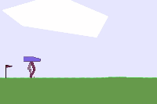        | [dizoo link](https://github.com/opendilab/DI-engine/tree/main/dizoo/box2d/bipedalwalker/envs)<br>[env tutorial](https://di-engine-docs.readthedocs.io/en/latest/13_envs/bipedalwalker.html)<br>[环境指南](https://di-engine-docs.readthedocs.io/zh_CN/latest/13_envs/bipedalwalker_zh.html) |
|  3   |       [box2d/lunarlander](https://github.com/openai/gym/tree/master/gym/envs/box2d)      |    | 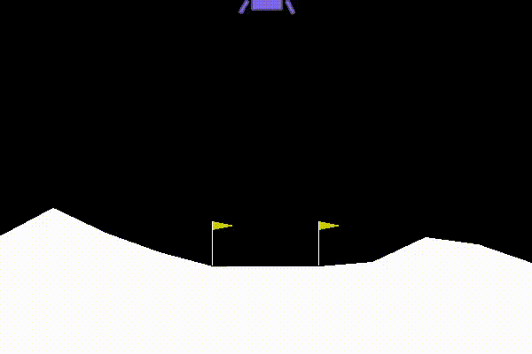   |  [dizoo link](https://github.com/opendilab/DI-engine/tree/main/dizoo/box2d/lunarlander/envs)<br>[env tutorial](https://di-engine-docs.readthedocs.io/en/latest/13_envs/lunarlander.html)<br>[环境指南](https://di-engine-docs.readthedocs.io/zh_CN/latest/13_envs/lunarlander_zh.html)  |
|  4   |       [classic_control/cartpole](https://github.com/openai/gym/tree/master/gym/envs/classic_control)       |    | 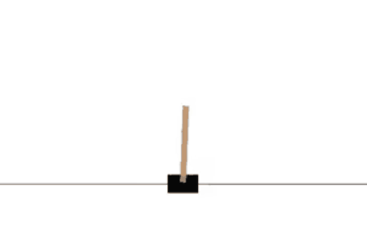    | [dizoo link](https://github.com/opendilab/DI-engine/tree/main/dizoo/classic_control/cartpole/envs)<br>[env tutorial](https://di-engine-docs.readthedocs.io/en/latest/13_envs/cartpole.html)<br>[环境指南](https://di-engine-docs.readthedocs.io/zh_CN/latest/13_envs/cartpole_zh.html) |
|  5   |       [classic_control/pendulum](https://github.com/openai/gym/tree/master/gym/envs/classic_control)       |  | 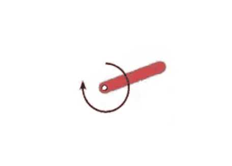    | [dizoo link](https://github.com/opendilab/DI-engine/tree/main/dizoo/classic_control/pendulum/envs)<br>[env tutorial](https://di-engine-docs.readthedocs.io/en/latest/13_envs/pendulum.html)<br>[环境指南](https://di-engine-docs.readthedocs.io/zh_CN/latest/13_envs/pendulum_zh.html) |
|  6   |       [competitive_rl](https://github.com/cuhkrlcourse/competitive-rl)       |   | 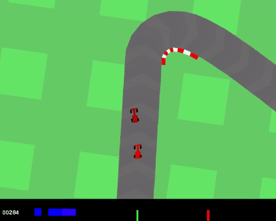   |  [dizoo link](https://github.com/opendilab/DI-engine/tree/main/dizoo.classic_control)<br>[环境指南](https://di-engine-docs.readthedocs.io/en/latest/13_envs/competitive_rl_zh.html)  |
|  7   |       [gfootball](https://github.com/google-research/football)                        |  | 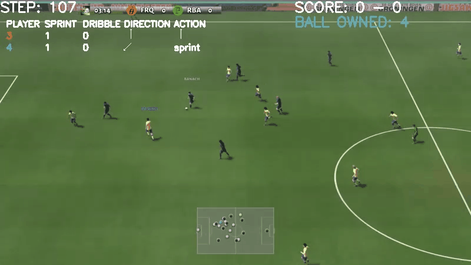      | [dizoo link](https://github.com/opendilab/DI-engine/tree/main/dizoo.gfootball/envs)<br>[env tutorial](https://di-engine-docs.readthedocs.io/en/latest/13_envs/gfootball.html)<br>[环境指南](https://di-engine-docs.readthedocs.io/en/latest/13_envs/gfootball_zh.html) |
|  8   |       [minigrid](https://github.com/maximecb/gym-minigrid)                         |  |          | [dizoo link](https://github.com/opendilab/DI-engine/tree/main/dizoo/minigrid/envs)<br>[env tutorial](https://di-engine-docs.readthedocs.io/en/latest/13_envs/minigrid.html)<br>[环境指南](https://di-engine-docs.readthedocs.io/en/latest/13_envs/minigrid_zh.html) |
|  9   |       [MuJoCo](https://github.com/openai/gym/tree/master/gym/envs/mujoco)       |    |                     | [dizoo link](https://github.com/opendilab/DI-engine/tree/main/dizoo/majoco/envs)<br>[env tutorial](https://di-engine-docs.readthedocs.io/en/latest/13_envs/mujoco.html)<br>[环境指南](https://di-engine-docs.readthedocs.io/en/latest/13_envs/mujoco_zh.html) |
|  10  |       [PettingZoo](https://github.com/Farama-Foundation/PettingZoo)         |     |      |  [dizoo link](https://github.com/opendilab/DI-engine/tree/main/dizoo/petting_zoo/envs)<br>[env tutorial](https://di-engine-docs.readthedocs.io/en/latest/13_envs/pettingzoo.html)<br>[环境指南](https://di-engine-docs.readthedocs.io/zh_CN/latest/13_envs/pettingzoo_zh.html)  |
|  11  |       [overcooked](https://github.com/HumanCompatibleAI/overcooked-demo)     |    | 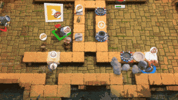       |   [dizoo link](https://github.com/opendilab/DI-engine/tree/main/dizoo/overcooded/envs)<br>[env tutorial](https://di-engine-docs.readthedocs.io/en/latest/13_envs/overcooked.html)   |
|  12  |       [procgen](https://github.com/openai/procgen)                          |    |  | [dizoo link](https://github.com/opendilab/DI-engine/tree/main/dizoo/procgen)<br>[env tutorial](https://di-engine-docs.readthedocs.io/en/latest/13_envs/procgen.html)<br>[环境指南](https://di-engine-docs.readthedocs.io/zh_CN/latest/13_envs/procgen_zh.html) |
|  13  |       [pybullet](https://github.com/benelot/pybullet-gym)    |   | 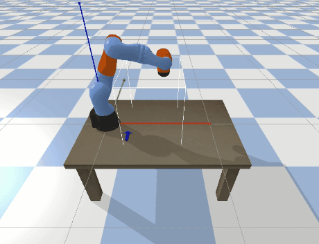       | [dizoo link](https://github.com/opendilab/DI-engine/tree/main/dizoo/pybullet/envs)<br>[环境指南](https://di-engine-docs.readthedocs.io/zh_CN/latest/13_envs/pybullet_zh.html) |
|  14  |       [smac](https://github.com/oxwhirl/smac)     |   | 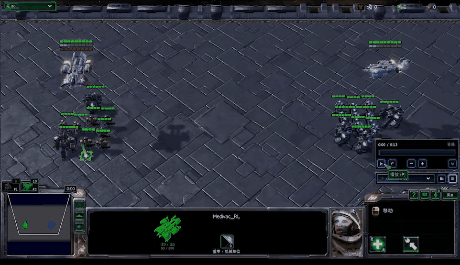       | [dizoo link](https://github.com/opendilab/DI-engine/tree/main/dizoo/smac/envs)<br>[env tutorial](https://di-engine-docs.readthedocs.io/en/latest/13_envs/smac.html)<br>[环境指南](https://di-engine-docs.readthedocs.io/zh_CN/latest/13_envs/smac_zh.html) |
| 15 | [d4rl](https://github.com/rail-berkeley/d4rl) |  | 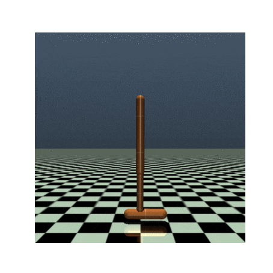 | [dizoo link](https://github.com/opendilab/DI-engine/tree/main/dizoo/d4rl)<br>[环境指南](https://di-engine-docs.readthedocs.io/zh_CN/latest/13_envs/d4rl_zh.html) |
|  16  |       league_demo                      |   | 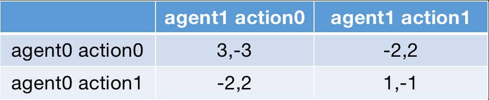 | [dizoo link](https://github.com/opendilab/DI-engine/tree/main/dizoo/league_demo/envs)                |
|  17  |       pomdp atari                    |    |  | [dizoo link](https://github.com/opendilab/DI-engine/tree/main/dizoo/pomdp/envs) |
|  18  |       [bsuite](https://github.com/deepmind/bsuite)                         |  | 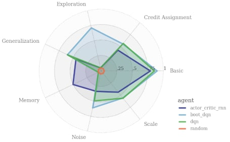 | [dizoo link](https://github.com/opendilab/DI-engine/tree/main/dizoo/bsuite/envs)<br>[env tutorial](https://di-engine-docs.readthedocs.io/en/latest/13_envs//bsuite.html) <br> [环境指南](https://di-engine-docs.readthedocs.io/zh_CN/latest/13_envs/bsuite_zh.html) |
|  19  | [ImageNet](https://www.image-net.org/) |  | 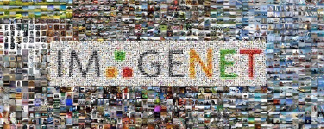 | [dizoo link](https://github.com/opendilab/DI-engine/tree/main/dizoo/image_classification)<br>[环境指南](https://di-engine-docs.readthedocs.io/zh_CN/latest/13_envs/image_cls_zh.html) |
|  20  | [slime_volleyball](https://github.com/hardmaru/slimevolleygym) |  | 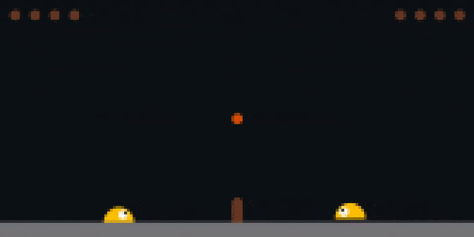 | [dizoo link](https://github.com/opendilab/DI-engine/tree/main/dizoo/slime_volley)<br>[env tutorial](https://di-engine-docs.readthedocs.io/en/latest/13_envs/slime_volleyball.html)<br>[环境指南](https://di-engine-docs.readthedocs.io/zh_CN/latest/13_envs/slime_volleyball_zh.html) |
|  21  | [gym_hybrid](https://github.com/thomashirtz/gym-hybrid) |  | 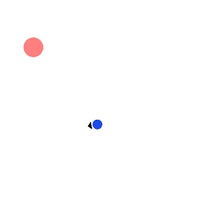 | [dizoo link](https://github.com/opendilab/DI-engine/tree/main/dizoo/gym_hybrid)<br>[env tutorial](https://di-engine-docs.readthedocs.io/en/latest/13_envs/gym_hybrid.html)<br>[环境指南](https://di-engine-docs.readthedocs.io/zh_CN/latest/13_envs/gym_hybrid_zh.html) |
|  22  | [GoBigger](https://github.com/opendilab/GoBigger) |  | 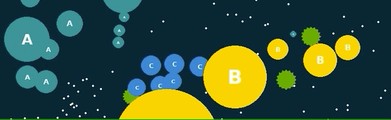 | [dizoo link](https://github.com/opendilab/GoBigger-Challenge-2021/tree/main/di_baseline)<br>[env tutorial](https://gobigger.readthedocs.io/en/latest/index.html)<br>[环境指南](https://gobigger.readthedocs.io/zh_CN/latest/) |
|  23  | [gym_soccer](https://github.com/openai/gym-soccer) |  | 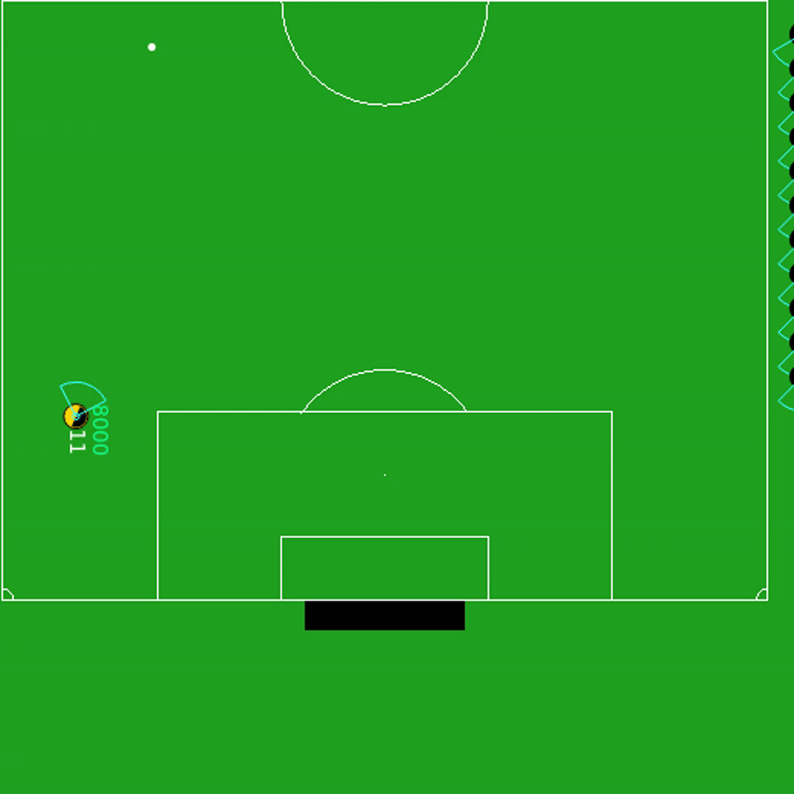 | [dizoo link](https://github.com/opendilab/DI-engine/tree/main/dizoo/gym_soccer)<br>[环境指南](https://di-engine-docs.readthedocs.io/zh_CN/latest/13_envs/gym_soccer_zh.html) |
|  24  |[multiagent_mujoco](https://github.com/schroederdewitt/multiagent_mujoco)       |    |                     | [dizoo link](https://github.com/opendilab/DI-engine/tree/main/dizoo/multiagent_mujoco/envs)<br>[环境指南](https://di-engine-docs.readthedocs.io/zh_CN/latest/13_envs/mujoco_zh.html) |
|  25  |bitflip                                |    | 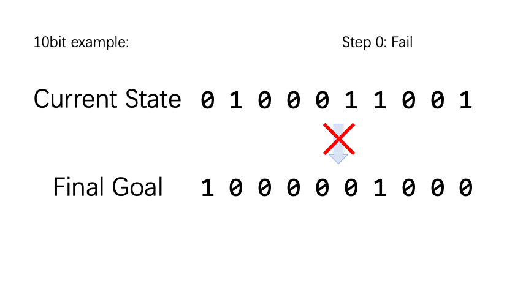    | [dizoo link](https://github.com/opendilab/DI-engine/tree/main/dizoo/bitflip/envs)<br>[环境指南](https://di-engine-docs.readthedocs.io/zh_CN/latest/13_envs/bitflip_zh.html) |
|  26  |[sokoban](https://github.com/mpSchrader/gym-sokoban) |  |  | [dizoo link](https://github.com/opendilab/DI-engine/tree/main/dizoo/sokoban/envs)<br>[env tutorial](https://di-engine-docs.readthedocs.io/en/latest/13_envs/sokoban.html)<br>[环境指南](https://di-engine-docs.readthedocs.io/zh_CN/latest/13_envs/sokoban_zh.html) |
|  27  |[gym_anytrading](https://github.com/AminHP/gym-anytrading) |  | 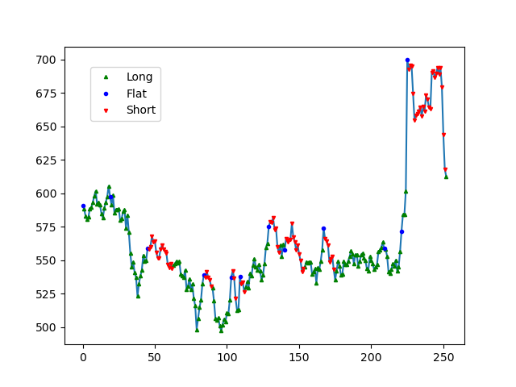 | [dizoo link](https://github.com/opendilab/DI-engine/tree/main/dizoo/gym_anytrading) <br> [env tutorial](https://github.com/opendilab/DI-engine/blob/main/dizoo/gym_anytrading/envs/README.md) |
|  28  |[mario](https://github.com/Kautenja/gym-super-mario-bros) |  |  | [dizoo link](https://github.com/opendilab/DI-engine/tree/main/dizoo/mario) <br> [env tutorial](https://di-engine-docs.readthedocs.io/en/latest/13_envs/gym_super_mario_bros.html) <br>[环境指南](https://di-engine-docs.readthedocs.io/zh_CN/latest/13_envs/gym_super_mario_bros_zh.html) |
|  29  |[dmc2gym](https://github.com/denisyarats/dmc2gym) |  | 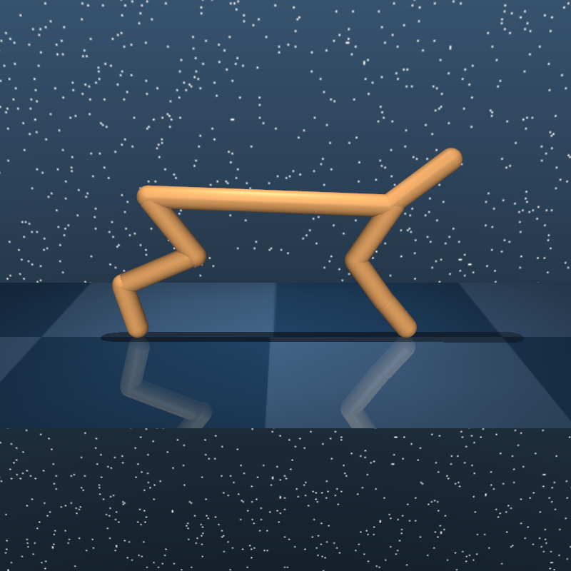 | [dizoo link](https://github.com/opendilab/DI-engine/tree/main/dizoo/dmc2gym)<br>[env tutorial](https://di-engine-docs.readthedocs.io/en/latest/13_envs/dmc2gym.html)<br>[环境指南](https://di-engine-docs.readthedocs.io/zh_CN/latest/13_envs/dmc2gym_zh.html) |
|  30  |[evogym](https://github.com/EvolutionGym/evogym) |  | 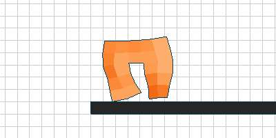 | [dizoo link](https://github.com/opendilab/DI-engine/tree/main/dizoo/evogym/envs) <br> [env tutorial](https://di-engine-docs.readthedocs.io/en/latest/13_envs/evogym.html) <br> [环境指南](https://di-engine-docs.readthedocs.io/zh_CN/latest/13_envs/Evogym_zh.html) |
|  31  |[gym-pybullet-drones](https://github.com/utiasDSL/gym-pybullet-drones) |  | 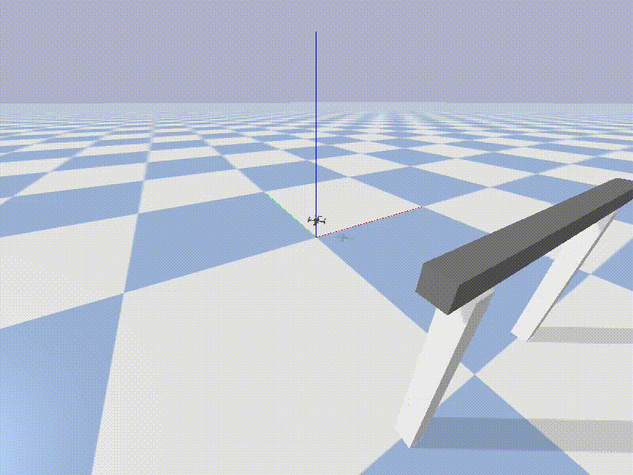 | [dizoo link](https://github.com/opendilab/DI-engine/tree/main/dizoo/gym_pybullet_drones/envs)<br>环境指南 |
|  32  |[beergame](https://github.com/OptMLGroup/DeepBeerInventory-RL) |  | 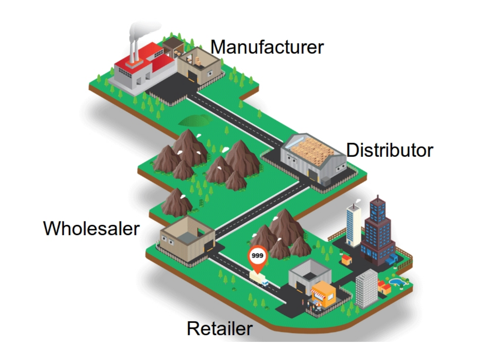 | [dizoo link](https://github.com/opendilab/DI-engine/tree/main/dizoo/beergame/envs)<br>环境指南 |
|  33  |[classic_control/acrobot](https://github.com/openai/gym/tree/master/gym/envs/classic_control) |  | 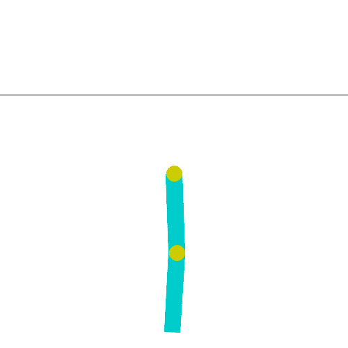 | [dizoo link](https://github.com/opendilab/DI-engine/tree/main/dizoo/classic_control/acrobot/envs)<br> [环境指南](https://di-engine-docs.readthedocs.io/zh_CN/latest/13_envs/acrobot_zh.html) |
|  34  |[box2d/car_racing](https://github.com/openai/gym/blob/master/gym/envs/box2d/car_racing.py) |  <br>  |  | [dizoo link](https://github.com/opendilab/DI-engine/tree/main/dizoo/box2d/carracing/envs)<br>环境指南 |
|  35  |[metadrive](https://github.com/metadriverse/metadrive) |  | 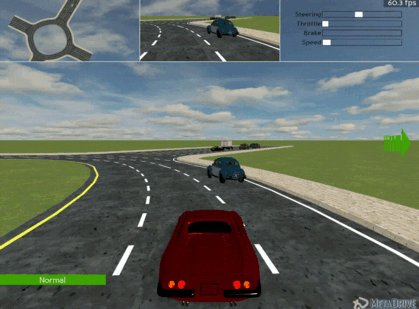 | [dizoo link](https://github.com/opendilab/DI-engine/tree/main/dizoo/metadrive/env)<br> [环境指南](https://di-engine-docs.readthedocs.io/zh_CN/latest/13_envs/metadrive_zh.html) |
|  36  |[cliffwalking](https://github.com/openai/gym/blob/master/gym/envs/toy_text/cliffwalking.py) |  |  | [dizoo link](https://github.com/opendilab/DI-engine/tree/main/dizoo/cliffwalking/envs)<br> 环境指南 |
|  37  | [tabmwp](https://promptpg.github.io/explore.html) |  | 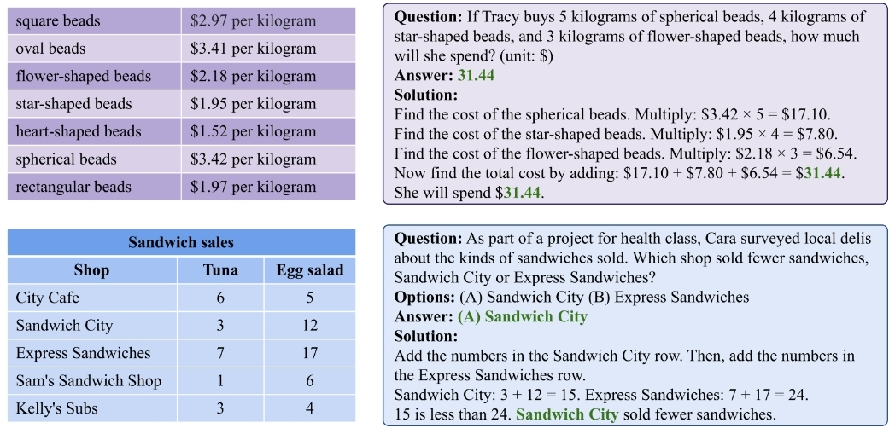 | [dizoo link](https://github.com/opendilab/DI-engine/tree/main/dizoo/tabmwp) |

 means discrete action space

 means continuous action space

 means hybrid (discrete + continuous) action space

 means multi-agent RL environment

 means environment which is related to exploration and sparse reward

 means offline RL environment

 means Imitation Learning or Supervised Learning Dataset

 means environment that allows agent VS agent battle

P.S. some enviroments in Atari, such as **MontezumaRevenge**, are also sparse reward type
</details>


### General Data Container: TreeTensor

DI-engine utilizes [TreeTensor](https://github.com/opendilab/DI-treetensor) as the basic data container in various components, which is ease of use and consistent across different code modules such as environment definition, data processing and DRL optimization. Here are some concrete code examples:

- TreeTensor can easily extend all the operations of `torch.Tensor` to nested data:
  <details close>
  <summary>(Click for Details)</summary>

    ```python
    import treetensor.torch as ttorch


    # create random tensor
    data = ttorch.randn({'a': (3, 2), 'b': {'c': (3, )}})
    # clone+detach tensor
    data_clone = data.clone().detach()
    # access tree structure like attribute
    a = data.a
    c = data.b.c
    # stack/cat/split
    stacked_data = ttorch.stack([data, data_clone], 0)
    cat_data = ttorch.cat([data, data_clone], 0)
    data, data_clone = ttorch.split(stacked_data, 1)
    # reshape
    data = data.unsqueeze(-1)
    data = data.squeeze(-1)
    flatten_data = data.view(-1)
    # indexing
    data_0 = data[0]
    data_1to2 = data[1:2]
    # execute math calculations
    data = data.sin()
    data.b.c.cos_().clamp_(-1, 1)
    data += data ** 2
    # backward
    data.requires_grad_(True)
    loss = data.arctan().mean()
    loss.backward()
    # print shape
    print(data.shape)
    # result
    # <Size 0x7fbd3346ddc0>
    # ├── 'a' --> torch.Size([1, 3, 2])
    # └── 'b' --> <Size 0x7fbd3346dd00>
    #     └── 'c' --> torch.Size([1, 3])
    ```

  </details>

- TreeTensor can make it simple yet effective to implement classic deep reinforcement learning pipeline
  <details close>
  <summary>(Click for Details)</summary>

    ```diff
    import torch
    import treetensor.torch as ttorch
  
    B = 4


    def get_item():
        return {
            'obs': {
                'scalar': torch.randn(12),
                'image': torch.randn(3, 32, 32),
            },
            'action': torch.randint(0, 10, size=(1,)),
            'reward': torch.rand(1),
            'done': False,
        }


    data = [get_item() for _ in range(B)]


    # execute `stack` op
    - def stack(data, dim):
    -     elem = data[0]
    -     if isinstance(elem, torch.Tensor):
    -         return torch.stack(data, dim)
    -     elif isinstance(elem, dict):
    -         return {k: stack([item[k] for item in data], dim) for k in elem.keys()}
    -     elif isinstance(elem, bool):
    -         return torch.BoolTensor(data)
    -     else:
    -         raise TypeError("not support elem type: {}".format(type(elem)))
    - stacked_data = stack(data, dim=0)
    + data = [ttorch.tensor(d) for d in data]
    + stacked_data = ttorch.stack(data, dim=0)
    
    # validate
    - assert stacked_data['obs']['image'].shape == (B, 3, 32, 32)
    - assert stacked_data['action'].shape == (B, 1)
    - assert stacked_data['reward'].shape == (B, 1)
    - assert stacked_data['done'].shape == (B,)
    - assert stacked_data['done'].dtype == torch.bool
    + assert stacked_data.obs.image.shape == (B, 3, 32, 32)
    + assert stacked_data.action.shape == (B, 1)
    + assert stacked_data.reward.shape == (B, 1)
    + assert stacked_data.done.shape == (B,)
    + assert stacked_data.done.dtype == torch.bool
    ```

  </details>

## Feedback and Contribution

- [File an issue](https://github.com/opendilab/DI-engine/issues/new/choose) on Github
- Open or participate in our [forum](https://github.com/opendilab/DI-engine/discussions)
- Discuss on DI-engine [slack communication channel](https://join.slack.com/t/opendilab/shared_invite/zt-v9tmv4fp-nUBAQEH1_Kuyu_q4plBssQ)
- Discuss on DI-engine's WeChat group (i.e. add us on WeChat: ding314assist) 
  
  
- Contact our email (opendilab@pjlab.org.cn)
- Contributes to our future plan [Roadmap](https://github.com/opendilab/DI-engine/issues/548)

We appreciate all the feedbacks and contributions to improve DI-engine, both algorithms and system designs. And `CONTRIBUTING.md` offers some necessary information.

## Supporters

### &#8627; Stargazers

[](https://github.com/opendilab/DI-engine/stargazers)

### &#8627; Forkers

[](https://github.com/opendilab/DI-engine/network/members)


## Citation
```latex
@misc{ding,
    title={{DI-engine: OpenDILab} Decision Intelligence Engine},
    author={DI-engine Contributors},
    publisher = {GitHub},
    howpublished = {\url{https://github.com/opendilab/DI-engine}},
    year={2021},
}
```

## License
DI-engine released under the Apache 2.0 license.
