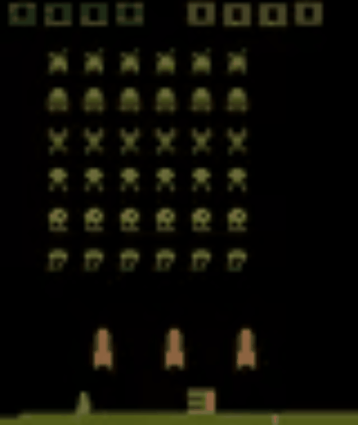
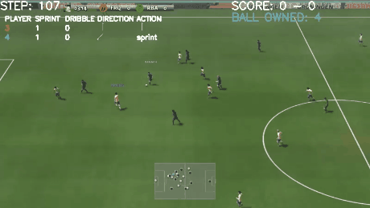
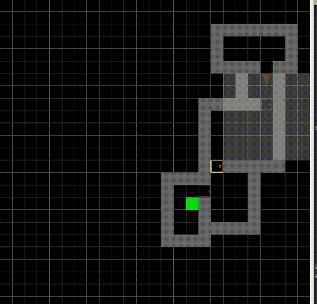
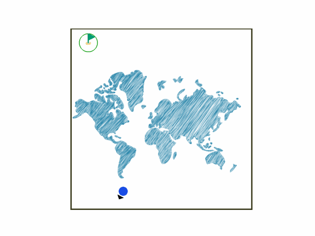

<div align="center">
    <a href="https://di-engine-docs.readthedocs.io/en/latest/"></a>
</div>

---

[](https://twitter.com/opendilab)
[](https://pypi.org/project/DI-engine/)


[](https://codecov.io/gh/opendilab/DI-engine)


[](https://github.com/opendilab/DI-engine/stargazers)
[](https://github.com/opendilab/DI-engine/network)

[](https://github.com/opendilab/DI-engine/issues)
[](https://github.com/opendilab/DI-engine/pulls)
[](https://github.com/opendilab/DI-engine/graphs/contributors)
[](https://github.com/opendilab/DI-engine/blob/master/LICENSE)

Updated on 2022.09.23 DI-engine-v0.4.3


## Introduction to DI-engine
[DI-engine doc](https://di-engine-docs.readthedocs.io/en/latest/) | [中文文档](https://di-engine-docs.readthedocs.io/zh_CN/latest/)

**DI-engine** is a generalized decision intelligence engine. It supports **various [deep reinforcement learning](https://di-engine-docs.readthedocs.io/en/latest/10_concepts/index.html) algorithms** ([link](https://di-engine-docs.readthedocs.io/en/latest/12_policies/index.html)):

- Most basic DRL algorithms, such as DQN, PPO, SAC, R2D2, IMPALA
- Multi-agent RL algorithms like QMIX, MAPPO
- Imitation learning algorithms (BC/IRL/GAIL) , such as GAIL, SQIL, Guided Cost Learning, Implicit Behavioral Cloning
- Exploration algorithms like HER, RND, ICM, NGU
- Offline RL algorithms: CQL, TD3BC, Decision Transformer
- Model-based RL algorithms: SVG, MVE, STEVE / MBPO, DDPPO

**DI-engine** aims to **standardize different Decision Intelligence enviroments and applications**. Various training pipelines and customized decision AI applications are also supported.

- Traditional academic environments
  - [DI-zoo](https://github.com/opendilab/DI-engine#environment-versatility)
- Real world decision AI applications
  - [DI-star](https://github.com/opendilab/DI-star): Decision AI in StarCraftII
  - [DI-drive](https://github.com/opendilab/DI-drive): Auto-driving platform
  - [GoBigger](https://github.com/opendilab/GoBigger): Multi-Agent Decision Intelligence Environment
  - [DI-sheep](https://github.com/opendilab/DI-sheep): Decision AI in 3 Tiles Game
  - [DI-smartcross](https://github.com/opendilab/DI-smartcross): Decision AI in Traffic Light Control
  - [DI-bioseq](https://github.com/opendilab/DI-bioseq): Decision AI in Biological Sequence Prediction and Searching
- Research paper
  - [InterFuser](https://github.com/opendilab/InterFuser): (CoRL 2022) Safety-Enhanced Autonomous Driving Using Interpretable Sensor Fusion Transformer
- General nested data lib
  - [treevalue](https://github.com/opendilab/treevalue): Tree-nested data structure
  - [DI-treetensor](https://github.com/opendilab/DI-treetensor): Tree-nested PyTorch tensor Lib
- Docs and Tutorials
  - [DI-engine-docs](https://github.com/opendilab/DI-engine-docs)
  - [awesome-model-based-RL](https://github.com/opendilab/awesome-model-based-RL): A curated list of awesome Model-Based RL resources
  - [awesome-exploration-RL](https://github.com/opendilab/awesome-exploration-rl): A curated list of awesome exploration RL resources
  - [awesome-decision-transformer](https://github.com/opendilab/awesome-decision-transformer): A curated list of Decision Transformer resources

**DI-engine** also has some **system optimization and design** for efficient and robust large-scale RL training:

- [DI-orchestrator](https://github.com/opendilab/DI-orchestrator): RL Kubernetes Custom Resource and Operator Lib
- [DI-hpc](https://github.com/opendilab/DI-hpc): RL HPC OP Lib
- [DI-store](https://github.com/opendilab/DI-store): RL Object Store

Have fun with exploration and exploitation.

## Outline

- [Introduction to DI-engine](#introduction-to-di-engine)
- [Outline](#outline)
- [Installation](#installation)
- [Quick Start](#quick-start)
- [Feature](#feature)
  - [&#8627; Algorithm Versatility](#algorithm-versatility)
  - [&#8627; Environment Versatility](#environment-versatility)
- [Feedback and Contribution](#feedback-and-contribution)
- [Supporters](#supporters)
  - [&#8627; Stargazers](#-stargazers)
  - [&#8627; Forkers](#-forkers)
- [Citation](#citation)
- [License](#license)

## Installation

You can simply install DI-engine from PyPI with the following command:
```bash
pip install DI-engine
```

If you use Anaconda or Miniconda, you can install DI-engine from conda-forge through the following command:
```bash
conda install -c opendilab di-engine
```

For more information about installation, you can refer to [installation](https://di-engine-docs.readthedocs.io/en/latest/01_quickstart/installation.html).

And our dockerhub repo can be found [here](https://hub.docker.com/repository/docker/opendilab/ding)，we prepare `base image` and `env image` with common RL environments.

- base: opendilab/ding:nightly
- atari: opendilab/ding:nightly-atari
- mujoco: opendilab/ding:nightly-mujoco
- dmc: opendilab/ding:nightly-dmc2gym
- metaworld: opendilab/ding:nightly-metaworld
- smac: opendilab/ding:nightly-smac
- grf: opendilab/ding:nightly-grf

The detailed documentation are hosted on [doc](https://di-engine-docs.readthedocs.io/en/latest/) | [中文文档](https://di-engine-docs.readthedocs.io/zh_CN/latest/).

## Quick Start

[3 Minutes Kickoff](https://di-engine-docs.readthedocs.io/en/latest/01_quickstart/first_rl_program.html)

[3 Minutes Kickoff (colab)](https://colab.research.google.com/drive/1K3DGi3dOT9fhFqa6bBtinwCDdWkOM3zE?usp=sharing)

[How to migrate a new **RL Env**](https://di-engine-docs.readthedocs.io/en/latest/11_dizoo/index.html) | [如何迁移一个新的**强化学习环境**](https://di-engine-docs.readthedocs.io/zh_CN/latest/11_dizoo/index_zh.html)

**Bonus: Train RL agent in one line code:**

```bash
ding -m serial -e cartpole -p dqn -s 0
```

## Feature
### Algorithm Versatility
 &nbsp;discrete means discrete action space, which is only label in normal DRL algorithms (1-18)

 &nbsp;means continuous action space, which is only label in normal DRL algorithms (1-18)

 &nbsp;means hybrid (discrete + continuous) action space (1-18)

 &nbsp;[Distributed Reinforcement Learning](https://di-engine-docs.readthedocs.io/en/latest/02_algo/distributed_rl.html)｜[分布式强化学习](https://di-engine-docs.readthedocs.io/zh_CN/latest/02_algo/distributed_rl_zh.html)

 &nbsp;[Multi-Agent Reinforcement Learning](https://di-engine-docs.readthedocs.io/en/latest/02_algo/multi_agent_cooperation_rl.html)｜[多智能体强化学习](https://di-engine-docs.readthedocs.io/zh_CN/latest/02_algo/multi_agent_cooperation_rl_zh.html)

 &nbsp;[Exploration Mechanisms in Reinforcement Learning](https://di-engine-docs.readthedocs.io/en/latest/02_algo/exploration_rl.html)｜[强化学习中的探索机制](https://di-engine-docs.readthedocs.io/zh_CN/latest/02_algo/exploration_rl_zh.html)

 &nbsp;[Imitation Learning](https://di-engine-docs.readthedocs.io/en/latest/02_algo/imitation_learning.html)｜[模仿学习](https://di-engine-docs.readthedocs.io/zh_CN/latest/02_algo/imitation_learning_zh.html)

 &nbsp;[Offiline Reinforcement Learning](https://di-engine-docs.readthedocs.io/en/latest/02_algo/offline_rl.html)｜[离线强化学习](https://di-engine-docs.readthedocs.io/zh_CN/latest/02_algo/offline_rl_zh.html)


 &nbsp;[Model-Based Reinforcement Learning](https://di-engine-docs.readthedocs.io/en/latest/02_algo/model_based_rl.html)｜[基于模型的强化学习](https://di-engine-docs.readthedocs.io/zh_CN/latest/02_algo/model_based_rl_zh.html)

 &nbsp;means other sub-direction algorithm, usually as plugin-in in the whole pipeline

P.S: The `.py` file in `Runnable Demo` can be found in `dizoo`


|  No.  |                          Algorithm                           |                            Label                             |                        Doc and Implementation                        |                        Runnable Demo                         |
| :--: | :----------------------------------------------------------: | :----------------------------------------------------------: | :----------------------------------------------------------: | :----------------------------------------------------------: |
|  1   |         [DQN](https://storage.googleapis.com/deepmind-media/dqn/DQNNaturePaper.pdf) |  | [DQN doc](https://di-engine-docs.readthedocs.io/en/latest/12_policies/dqn.html)<br>[DQN中文文档](https://di-engine-docs.readthedocs.io/zh_CN/latest/12_policies/dqn_zh.html)<br>[policy/dqn](https://github.com/opendilab/DI-engine/blob/main/ding/policy/dqn.py) | python3 -u cartpole_dqn_main.py / ding -m serial -c cartpole_dqn_config.py -s 0 |
|  2   |         [C51](https://arxiv.org/pdf/1707.06887.pdf)          |  | [C51 doc](https://di-engine-docs.readthedocs.io/en/latest/12_policies/c51.html)<br>[policy/c51](https://github.com/opendilab/DI-engine/blob/main/ding/policy/c51.py) |        ding -m serial -c cartpole_c51_config.py -s 0         |
|  3   |         [QRDQN](https://arxiv.org/pdf/1710.10044.pdf)        |  | [QRDQN doc](https://di-engine-docs.readthedocs.io/en/latest/12_policies/qrdqn.html)<br>[policy/qrdqn](https://github.com/opendilab/DI-engine/blob/main/ding/policy/qrdqn.py) |       ding -m serial -c cartpole_qrdqn_config.py -s 0        |
|  4   |         [IQN](https://arxiv.org/pdf/1806.06923.pdf)          |  | [IQN doc](https://di-engine-docs.readthedocs.io/en/latest/12_policies/iqn.html)<br>[policy/iqn](https://github.com/opendilab/DI-engine/blob/main/ding/policy/iqn.py) |        ding -m serial -c cartpole_iqn_config.py -s 0         |
|  5   |         [FQF](https://arxiv.org/pdf/1911.02140.pdf)          |  | [FQF doc](https://di-engine-docs.readthedocs.io/en/latest/12_policies/fqf.html)<br>[policy/fqf](https://github.com/opendilab/DI-engine/blob/main/ding/policy/fqf.py) |        ding -m serial -c cartpole_fqf_config.py -s 0         |
|  6   |         [Rainbow](https://arxiv.org/pdf/1710.02298.pdf)          |  | [Rainbow doc](https://di-engine-docs.readthedocs.io/en/latest/12_policies/rainbow.html)<br>[policy/rainbow](https://github.com/opendilab/DI-engine/blob/main/ding/policy/rainbow.py) |      ding -m serial -c cartpole_rainbow_config.py -s 0       |
|  7   |         [SQL](https://arxiv.org/pdf/1702.08165.pdf)          |  | [SQL doc](https://di-engine-docs.readthedocs.io/en/latest/12_policies/sql.html)<br>[policy/sql](https://github.com/opendilab/DI-engine/blob/main/ding/policy/sql.py) |        ding -m serial -c cartpole_sql_config.py -s 0         |
|  8   |         [R2D2](https://openreview.net/forum?id=r1lyTjAqYX)      |  | [R2D2 doc](https://di-engine-docs.readthedocs.io/en/latest/12_policies/r2d2.html)<br>[policy/r2d2](https://github.com/opendilab/DI-engine/blob/main/ding/policy/r2d2.py) |        ding -m serial -c cartpole_r2d2_config.py -s 0        |
|  9   |         [A2C](https://arxiv.org/pdf/1602.01783.pdf)            |  | [A2C doc](https://di-engine-docs.readthedocs.io/en/latest/12_policies/a2c.html)<br>[policy/a2c](https://github.com/opendilab/DI-engine/blob/main/ding/policy/a2c.py) |        ding -m serial -c cartpole_a2c_config.py -s 0         |
|  10   |         [PPO](https://arxiv.org/abs/1707.06347)/[MAPPO](https://arxiv.org/pdf/2103.01955.pdf)         |  | [PPO doc](https://di-engine-docs.readthedocs.io/en/latest/12_policies/ppo.html)<br>[policy/ppo](https://github.com/opendilab/DI-engine/blob/main/ding/policy/ppo.py) | python3 -u cartpole_ppo_main.py / ding -m serial_onpolicy -c cartpole_ppo_config.py -s 0 |
|  11  |         [PPG](https://arxiv.org/pdf/2009.04416.pdf)          |  | [PPG doc](https://di-engine-docs.readthedocs.io/en/latest/12_policies/ppg.html)<br>[policy/ppg](https://github.com/opendilab/DI-engine/blob/main/ding/policy/ppg.py) |               python3 -u cartpole_ppg_main.py                |
|  12  |         [ACER](https://arxiv.org/pdf/1611.01224.pdf)         |  | [ACER doc](https://di-engine-docs.readthedocs.io/en/latest/12_policies/acer.html)<br>[policy/acer](https://github.com/opendilab/DI-engine/blob/main/ding/policy/acer.py) |        ding -m serial -c cartpole_acer_config.py -s 0        |
|  13  |          [IMPALA](https://arxiv.org/abs/1802.01561)          |  | [IMPALA doc](https://di-engine-docs.readthedocs.io/en/latest/12_policies/impala.html)<br>[policy/impala](https://github.com/opendilab/DI-engine/blob/main/ding/policy/impala.py) |       ding -m serial -c cartpole_impala_config.py -s 0       |
|  14  |         [DDPG](https://arxiv.org/pdf/1509.02971.pdf)/[PADDPG](https://arxiv.org/pdf/1511.04143.pdf)         |  | [DDPG doc](https://di-engine-docs.readthedocs.io/en/latest/12_policies/ddpg.html)<br>[policy/ddpg](https://github.com/opendilab/DI-engine/blob/main/ding/policy/ddpg.py) |        ding -m serial -c pendulum_ddpg_config.py -s 0        |
|  15  |         [TD3](https://arxiv.org/pdf/1802.09477.pdf)          |  | [TD3 doc](https://di-engine-docs.readthedocs.io/en/latest/12_policies/td3.html)<br>[policy/td3](https://github.com/opendilab/DI-engine/blob/main/ding/policy/td3.py) | python3 -u pendulum_td3_main.py / ding -m serial -c pendulum_td3_config.py -s 0 |
| 16 | [D4PG](https://arxiv.org/pdf/1804.08617.pdf) |  | [D4PG doc](https://di-engine-docs.readthedocs.io/en/latest/12_policies/d4pg.html)<br>[policy/d4pg](https://github.com/opendilab/DI-engine/blob/main/ding/policy/d4pg.py) | python3 -u pendulum_d4pg_config.py |
|  17  |           [SAC](https://arxiv.org/abs/1801.01290)/[MASAC]            |  | [SAC doc](https://di-engine-docs.readthedocs.io/en/latest/12_policies/sac.html)<br>[policy/sac](https://github.com/opendilab/DI-engine/blob/main/ding/policy/sac.py) |        ding -m serial -c pendulum_sac_config.py -s 0         |
| 18 | [PDQN](https://arxiv.org/pdf/1810.06394.pdf) |  | [policy/pdqn](https://github.com/opendilab/DI-engine/blob/main/ding/policy/pdqn.py) | ding -m serial -c gym_hybrid_pdqn_config.py -s 0 |
| 19 | [MPDQN](https://arxiv.org/pdf/1905.04388.pdf) |  | [policy/pdqn](https://github.com/opendilab/DI-engine/blob/main/ding/policy/pdqn.py) | ding -m serial -c gym_hybrid_mpdqn_config.py -s 0 |
| 20 | [HPPO](https://arxiv.org/pdf/1903.01344.pdf) |  | [policy/ppo](https://github.com/opendilab/DI-engine/blob/main/ding/policy/ppo.py) | ding -m serial_onpolicy -c gym_hybrid_hppo_config.py -s 0 |
|  21  |           [QMIX](https://arxiv.org/pdf/1803.11485.pdf)           |            | [QMIX doc](https://di-engine-docs.readthedocs.io/en/latest/12_policies/qmix.html)<br>[policy/qmix](https://github.com/opendilab/DI-engine/blob/main/ding/policy/qmix.py) |       ding -m serial -c smac_3s5z_qmix_config.py -s 0        |
|  22  |         [COMA](https://arxiv.org/pdf/1705.08926.pdf)         |            | [COMA doc](https://di-engine-docs.readthedocs.io/en/latest/12_policies/coma.html)<br>[policy/coma](https://github.com/opendilab/DI-engine/blob/main/ding/policy/coma.py) |       ding -m serial -c smac_3s5z_coma_config.py -s 0        |
|  23  |          [QTran](https://arxiv.org/abs/1905.05408)           |            | [policy/qtran](https://github.com/opendilab/DI-engine/blob/main/ding/policy/qtran.py) |       ding -m serial -c smac_3s5z_qtran_config.py -s 0       |
|  24  |          [WQMIX](https://arxiv.org/abs/2006.10800)           |            | [WQMIX doc](https://di-engine-docs.readthedocs.io/en/latest/12_policies/wqmix.html)<br>[policy/wqmix](https://github.com/opendilab/DI-engine/blob/main/ding/policy/wqmix.py) |       ding -m serial -c smac_3s5z_wqmix_config.py -s 0       |
|  25  |        [CollaQ](https://arxiv.org/pdf/2010.08531.pdf)        |            | [CollaQ doc](https://di-engine-docs.readthedocs.io/en/latest/12_policies/collaq.html)<br>[policy/collaq](https://github.com/opendilab/DI-engine/blob/main/ding/policy/collaq.py) |      ding -m serial -c smac_3s5z_collaq_config.py -s 0       |
|  26  |           [GAIL](https://arxiv.org/pdf/1606.03476.pdf)           |                | [GAIL doc](https://di-engine-docs.readthedocs.io/en/latest/12_policies/gail.html)<br>[reward_model/gail](https://github.com/opendilab/DI-engine/blob/main/ding/reward_model/gail_irl_model.py) |  ding -m serial_gail -c cartpole_dqn_gail_config.py -s 0  |
|  27  |         [SQIL](https://arxiv.org/pdf/1905.11108.pdf)         |                | [SQIL doc](https://di-engine-docs.readthedocs.io/en/latest/12_policies/sqil.html)<br>[entry/sqil](https://github.com/opendilab/DI-engine/blob/main/ding/entry/serial_entry_sqil.py) |     ding -m serial_sqil -c cartpole_sqil_config.py -s 0      |
|  28  | [DQFD](https://arxiv.org/pdf/1704.03732.pdf) |  | [DQFD doc](https://di-engine-docs.readthedocs.io/en/latest/12_policies/dqfd.html)<br>[policy/dqfd](https://github.com/opendilab/DI-engine/blob/main/ding/policy/dqfd.py) | ding -m serial_dqfd -c cartpole_dqfd_config.py -s 0 |
|  29  | [R2D3](https://arxiv.org/pdf/1909.01387.pdf) |  | [R2D3 doc](https://di-engine-docs.readthedocs.io/en/latest/12_policies/r2d3.html)<br>[R2D3中文文档](https://di-engine-docs.readthedocs.io/zh_CN/latest/12_policies/r2d3_zh.html)<br>[policy/r2d3](https://di-engine-docs.readthedocs.io/zh_CN/latest/12_policies/r2d3_zh.html) | python3 -u pong_r2d3_r2d2expert_config.py |
|  30  |     [Guided Cost Learning](https://arxiv.org/pdf/1603.00448.pdf)     |                | [Guided Cost Learning中文文档](https://di-engine-docs.readthedocs.io/zh_CN/latest/12_policies/guided_cost_zh.html)<br>[reward_model/guided_cost](https://github.com/opendilab/DI-engine/blob/main/ding/reward_model/guided_cost_reward_model.py) |                          python3 lunarlander_gcl_config.py   |
|  31  |         [TREX](https://arxiv.org/abs/1904.06387)          |                | [TREX doc](https://di-engine-docs.readthedocs.io/en/latest/12_policies/trex.html)<br>[reward_model/trex](https://github.com/opendilab/DI-engine/blob/main/ding/reward_model/trex_reward_model.py) |                          python3 mujoco_trex_main.py   |
|  32  |         [Implicit Behavorial Cloning](https://implicitbc.github.io/) (DFO+MCMC)          |       | [policy/ibc](https://github.com/opendilab/DI-engine/blob/main/ding/policy/ibc.py) & [model/template/ebm](https://github.com/opendilab/DI-engine/blob/main/ding/model/template/ebm.py) |        python3 d4rl_ibc_main.py -s 0 -c pen_human_ibc_mcmc_config.py  |
|  33  |         [BCO](https://arxiv.org/pdf/1805.01954.pdf)          |  | [entry/bco](https://github.com/opendilab/DI-engine/blob/main/ding/entry/serial_entry_bco.py) |                python3 -u cartpole_bco_config.py                 |
|  34  |           [HER](https://arxiv.org/pdf/1707.01495.pdf)            |      | [HER doc](https://di-engine-docs.readthedocs.io/en/latest/12_policies/her.html)<br>[reward_model/her](https://github.com/opendilab/DI-engine/blob/main/ding/reward_model/her_reward_model.py) |                python3 -u bitflip_her_dqn.py                 |
|  35  |           [RND](https://arxiv.org/abs/1810.12894)            |      | [RND doc](https://di-engine-docs.readthedocs.io/en/latest/12_policies/rnd.html)<br>[reward_model/rnd](https://github.com/opendilab/DI-engine/blob/main/ding/reward_model/rnd_reward_model.py) |             python3 -u cartpole_rnd_onppo_config.py           |
|  36  |           [ICM](https://arxiv.org/pdf/1705.05363.pdf)            |      | [ICM doc](https://di-engine-docs.readthedocs.io/en/latest/12_policies/icm.html)<br>[ICM中文文档](https://di-engine-docs.readthedocs.io/zh_CN/latest/12_policies/icm_zh.html)<br>[reward_model/icm](https://github.com/opendilab/DI-engine/blob/main/ding/reward_model/icm_reward_model.py) |             python3 -u cartpole_ppo_icm_config.py              |
|  37  |         [CQL](https://arxiv.org/pdf/2006.04779.pdf)          |  | [CQL doc](https://di-engine-docs.readthedocs.io/en/latest/12_policies/cql.html)<br>[policy/cql](https://github.com/opendilab/DI-engine/blob/main/ding/policy/cql.py) |                 python3 -u d4rl_cql_main.py                  |
|  38  |         [TD3BC](https://arxiv.org/pdf/2106.06860.pdf)          |  | [TD3BC doc](https://di-engine-docs.readthedocs.io/en/latest/12_policies/td3_bc.html)<br>[policy/td3_bc](https://github.com/opendilab/DI-engine/blob/main/ding/policy/td3_bc.py) |                 python3 -u mujoco_td3_bc_main.py                  |
|  39  |         MBSAC([SAC](https://arxiv.org/abs/1801.01290)+[MVE](https://arxiv.org/abs/1803.00101)+[SVG](https://arxiv.org/abs/1510.09142))         |  | [policy/mbpolicy/mbsac](https://github.com/opendilab/DI-engine/blob/main/ding/policy/mbpolicy/mbsac.py) |        python3 -u pendulum_mbsac_mbpo_config.py \ python3 -u pendulum_mbsac_ddppo_config.py    |
|  40  |         STEVESAC([SAC](https://arxiv.org/abs/1801.01290)+[STEVE](https://arxiv.org/abs/1807.01675)+[SVG](https://arxiv.org/abs/1510.09142))         |  | [policy/mbpolicy/mbsac](https://github.com/opendilab/DI-engine/blob/main/ding/policy/mbpolicy/mbsac.py) |        python3 -u pendulum_stevesac_mbpo_config.py    |
|  41  |         [MBPO](https://arxiv.org/pdf/1906.08253.pdf)         |  | [MBPO doc](https://di-engine-docs.readthedocs.io/en/latest/12_policies/mbpo.html)<br>[world_model/mbpo](https://github.com/opendilab/DI-engine/blob/main/ding/world_model/mbpo.py) |        python3 -u pendulum_sac_mbpo_config.py    |
|  42  |         [DDPPO](https://openreview.net/forum?id=rzvOQrnclO0)         |  | [world_model/ddppo](https://github.com/opendilab/DI-engine/blob/main/ding/world_model/ddppo.py) |        python3 -u pendulum_mbsac_ddppo_config.py    |
|  43  |         [PER](https://arxiv.org/pdf/1511.05952.pdf)          |       | [worker/replay_buffer](https://github.com/opendilab/DI-engine/blob/main/ding/worker/replay_buffer/advanced_buffer.py) |                        `rainbow demo`                        |
|  44  |         [GAE](https://arxiv.org/pdf/1506.02438.pdf)          |       | [rl_utils/gae](https://github.com/opendilab/DI-engine/blob/main/ding/rl_utils/gae.py) |                          `ppo demo`                          |
|  45  |         [ST-DIM](https://arxiv.org/pdf/1906.08226.pdf)          |       | [torch_utils/loss/contrastive_loss](https://github.com/opendilab/DI-engine/blob/main/ding/torch_utils/loss/contrastive_loss.py) |        ding -m serial -c cartpole_dqn_stdim_config.py -s 0       |
|  46  |         [PLR](https://arxiv.org/pdf/2010.03934.pdf)          |       | [PLR doc](https://di-engine-docs.readthedocs.io/en/latest/12_policies/plr.html)<br>[data/level_replay/level_sampler](https://github.com/opendilab/DI-engine/blob/main/ding/data/level_replay/level_sampler.py) |        python3 -u bigfish_plr_config.py -s 0       |


### Environment Versatility
|  No  |                Environment               |                 Label               |         Visualization            |                   Code and Doc Links                   |
| :--: | :--------------------------------------: | :---------------------------------: | :--------------------------------:|:---------------------------------------------------------: |
|  1   |       [atari](https://github.com/openai/gym/tree/master/gym/envs/atari)    |    |      |        [dizoo link](https://github.com/opendilab/DI-engine/tree/main/dizoo/atari/envs) <br>[env tutorial](https://di-engine-docs.readthedocs.io/en/latest/13_envs/atari.html)<br>[环境指南](https://di-engine-docs.readthedocs.io/zh_CN/latest/13_envs/atari_zh.html)        |
|  2   |       [box2d/bipedalwalker](https://github.com/openai/gym/tree/master/gym/envs/box2d)    |  |         | [dizoo link](https://github.com/opendilab/DI-engine/tree/main/dizoo/box2d/bipedalwalker/envs)<br>[env tutorial](https://di-engine-docs.readthedocs.io/en/latest/13_envs/bipedalwalker.html)<br>[环境指南](https://di-engine-docs.readthedocs.io/zh_CN/latest/13_envs/bipedalwalker_zh.html) |
|  3   |       [box2d/lunarlander](https://github.com/openai/gym/tree/master/gym/envs/box2d)      |    |    |  [dizoo link](https://github.com/opendilab/DI-engine/tree/main/dizoo/box2d/lunarlander/envs)<br>[env tutorial](https://di-engine-docs.readthedocs.io/en/latest/13_envs/lunarlander.html)<br>[环境指南](https://di-engine-docs.readthedocs.io/zh_CN/latest/13_envs/lunarlander_zh.html)  |
|  4   |       [classic_control/cartpole](https://github.com/openai/gym/tree/master/gym/envs/classic_control)       |    |     | [dizoo link](https://github.com/opendilab/DI-engine/tree/main/dizoo/classic_control/cartpole/envs)<br>[env tutorial](https://di-engine-docs.readthedocs.io/en/latest/13_envs/cartpole.html)<br>[环境指南](https://di-engine-docs.readthedocs.io/zh_CN/latest/13_envs/cartpole_zh.html) |
|  5   |       [classic_control/pendulum](https://github.com/openai/gym/tree/master/gym/envs/classic_control)       |  |     | [dizoo link](https://github.com/opendilab/DI-engine/tree/main/dizoo/classic_control/pendulum/envs)<br>[env tutorial](https://di-engine-docs.readthedocs.io/en/latest/13_envs/pendulum.html)<br>[环境指南](https://di-engine-docs.readthedocs.io/zh_CN/latest/13_envs/pendulum_zh.html) |
|  6   |       [competitive_rl](https://github.com/cuhkrlcourse/competitive-rl)       |   |    |  [dizoo link](https://github.com/opendilab/DI-engine/tree/main/dizoo.classic_control)<br>[环境指南](https://di-engine-docs.readthedocs.io/en/latest/13_envs/competitive_rl_zh.html)  |
|  7   |       [gfootball](https://github.com/google-research/football)                        |  |       | [dizoo link](https://github.com/opendilab/DI-engine/tree/main/dizoo.gfootball/envs)<br>[环境指南](https://di-engine-docs.readthedocs.io/en/latest/13_envs/gfootball_zh.html) |
|  8   |       [minigrid](https://github.com/maximecb/gym-minigrid)                         |  |          | [dizoo link](https://github.com/opendilab/DI-engine/tree/main/dizoo/minigrid/envs)<br>[env tutorial](https://di-engine-docs.readthedocs.io/en/latest/13_envs/minigrid.html)<br>[环境指南](https://di-engine-docs.readthedocs.io/en/latest/13_envs/minigrid_zh.html) |
|  9   |       [mujoco](https://github.com/openai/gym/tree/master/gym/envs/mujoco)       |    |                     | [dizoo link](https://github.com/opendilab/DI-engine/tree/main/dizoo/majoco/envs)<br>[env tutorial](https://di-engine-docs.readthedocs.io/en/latest/13_envs/mujoco.html)<br>[环境指南](https://di-engine-docs.readthedocs.io/en/latest/13_envs/mujoco_zh.html) |
|  10   |       [PettingZoo](https://github.com/Farama-Foundation/PettingZoo)         |     |      |  [dizoo link](https://github.com/opendilab/DI-engine/tree/main/dizoo/petting_zoo/envs)<br>[环境指南](https://di-engine-docs.readthedocs.io/zh_CN/latest/13_envs/pettingzoo_zh.html)  |
|  11   |       [overcooked](https://github.com/HumanCompatibleAI/overcooked-demo)     |    |        |   [dizoo link](https://github.com/opendilab/DI-engine/tree/main/dizoo/overcooded/envs)<br>[env tutorial](https://di-engine-docs.readthedocs.io/en/latest/13_envs/overcooked.html)   |
|  12  |       [procgen](https://github.com/openai/procgen)                          |    |  | [dizoo link](https://github.com/opendilab/DI-engine/tree/main/dizoo/procgen)<br>[env tutorial](https://di-engine-docs.readthedocs.io/en/latest/13_envs/procgen.html)<br>[环境指南](https://di-engine-docs.readthedocs.io/zh_CN/latest/13_envs/procgen_zh.html) |
|  13  |       [pybullet](https://github.com/benelot/pybullet-gym)    |   |        | [dizoo link](https://github.com/opendilab/DI-engine/tree/main/dizoo/pybullet/envs)<br>[环境指南](https://di-engine-docs.readthedocs.io/zh_CN/latest/13_envs/pybullet_zh.html) |
|  14  |       [smac](https://github.com/oxwhirl/smac)     |   |        | [dizoo link](https://github.com/opendilab/DI-engine/tree/main/dizoo/smac/envs)<br>[env tutorial](https://di-engine-docs.readthedocs.io/en/latest/13_envs/smac.html)<br>[环境指南](https://di-engine-docs.readthedocs.io/zh_CN/latest/13_envs/smac_zh.html) |
| 15 | [d4rl](https://github.com/rail-berkeley/d4rl) |  |  | [dizoo link](https://github.com/opendilab/DI-engine/tree/main/dizoo/d4rl)<br>[环境指南](https://di-engine-docs.readthedocs.io/zh_CN/latest/13_envs/d4rl_zh.html) |
|  16  |       league_demo                      |   |  | [dizoo link](https://github.com/opendilab/DI-engine/tree/main/dizoo/league_demo/envs)                |
|  17  |       pomdp atari                    |    |  | [dizoo link](https://github.com/opendilab/DI-engine/tree/main/dizoo/pomdp/envs) |
|  18  |       [bsuite](https://github.com/deepmind/bsuite)                         |  |  | [dizoo link](https://github.com/opendilab/DI-engine/tree/main/dizoo/bsuite/envs)<br>[env tutorial](https://di-engine-docs.readthedocs.io/en/latest/13_envs//bsuite.html) |
| 19 | [ImageNet](https://www.image-net.org/) |  |  | [dizoo link](https://github.com/opendilab/DI-engine/tree/main/dizoo/image_classification)<br>[环境指南](https://di-engine-docs.readthedocs.io/zh_CN/latest/13_envs/image_cls_zh.html) |
| 20 | [slime_volleyball](https://github.com/hardmaru/slimevolleygym) |  |  | [dizoo link](https://github.com/opendilab/DI-engine/tree/main/dizoo/slime_volley)<br>[env tutorial](https://di-engine-docs.readthedocs.io/en/latest/13_envs/slime_volleyball.html)<br>[环境指南](https://di-engine-docs.readthedocs.io/zh_CN/latest/13_envs/slime_volleyball_zh.html) |
| 21 | [gym_hybrid](https://github.com/thomashirtz/gym-hybrid) |  |  | [dizoo link](https://github.com/opendilab/DI-engine/tree/main/dizoo/gym_hybrid)<br>[env tutorial](https://di-engine-docs.readthedocs.io/en/latest/13_envs/gym_hybrid.html)<br>[环境指南](https://di-engine-docs.readthedocs.io/zh_CN/latest/13_envs/gym_hybrid_zh.html) |
| 22 | [GoBigger](https://github.com/opendilab/GoBigger) |  |  | [dizoo link](https://github.com/opendilab/GoBigger-Challenge-2021/tree/main/di_baseline)<br>[env tutorial](https://gobigger.readthedocs.io/en/latest/index.html)<br>[环境指南](https://gobigger.readthedocs.io/zh_CN/latest/) |
| 23 | [gym_soccer](https://github.com/openai/gym-soccer) |  |  | [dizoo link](https://github.com/opendilab/DI-engine/tree/main/dizoo/gym_soccer)<br>[环境指南](https://di-engine-docs.readthedocs.io/zh_CN/latest/13_envs/gym_soccer_zh.html) |
| 24 |[multiagent_mujoco](https://github.com/schroederdewitt/multiagent_mujoco)       |    |                     | [dizoo link](https://github.com/opendilab/DI-engine/tree/main/dizoo/multiagent_mujoco/envs)<br>[环境指南](https://di-engine-docs.readthedocs.io/zh_CN/latest/13_envs/mujoco_zh.html) |
| 25 |bitflip                                |    |     | [dizoo link](https://github.com/opendilab/DI-engine/tree/main/dizoo/bitflip/envs)<br>[环境指南](https://di-engine-docs.readthedocs.io/zh_CN/latest/13_envs/bitflip_zh.html) |
| 26 |[sokoban](https://github.com/mpSchrader/gym-sokoban) |  |  | [dizoo link](https://github.com/opendilab/DI-engine/tree/main/dizoo/sokoban/envs)<br>[环境指南](https://di-engine-docs.readthedocs.io/zh_CN/latest/13_envs/sokoban_zh.html) |
| 27 |[gym_anytrading](https://github.com/AminHP/gym-anytrading) |  |  | dizoo link <br>环境指南 |
| 28 |[mario](https://github.com/Kautenja/gym-super-mario-bros) |  |  | dizoo link <br>环境指南 |

 means discrete action space

 means continuous action space

 means hybrid (discrete + continuous) action space

 means multi-agent RL environment

 means environment which is related to exploration and sparse reward

 means offline RL environment

 means Imitation Learning or Supervised Learning Dataset

 means environment that allows agent VS agent battle

P.S. some enviroments in Atari, such as **MontezumaRevenge**, are also sparse reward type


## Feedback and Contribution

- [File an issue](https://github.com/opendilab/DI-engine/issues/new/choose) on Github
- Open or participate in our [forum](https://github.com/opendilab/DI-engine/discussions)
- Discuss on DI-engine [slack communication channel](https://join.slack.com/t/opendilab/shared_invite/zt-v9tmv4fp-nUBAQEH1_Kuyu_q4plBssQ)
- Discuss on DI-engine's QQ group (700157520) or add us on WeChat 
  
  
- Contact our email (opendilab.contact@gmail.com)
- Contributes to our future plan [Roadmap](https://github.com/opendilab/DI-engine/projects)

We appreciate all the feedbacks and contributions to improve DI-engine, both algorithms and system designs. And `CONTRIBUTING.md` offers some necessary information.

## Supporters

### &#8627; Stargazers

[](https://github.com/opendilab/DI-engine/stargazers)

### &#8627; Forkers

[](https://github.com/opendilab/DI-engine/network/members)


## Citation
```latex
@misc{ding,
    title={{DI-engine: OpenDILab} Decision Intelligence Engine},
    author={DI-engine Contributors},
    publisher = {GitHub},
    howpublished = {\url{https://github.com/opendilab/DI-engine}},
    year={2021},
}
```

## License
DI-engine released under the Apache 2.0 license.
