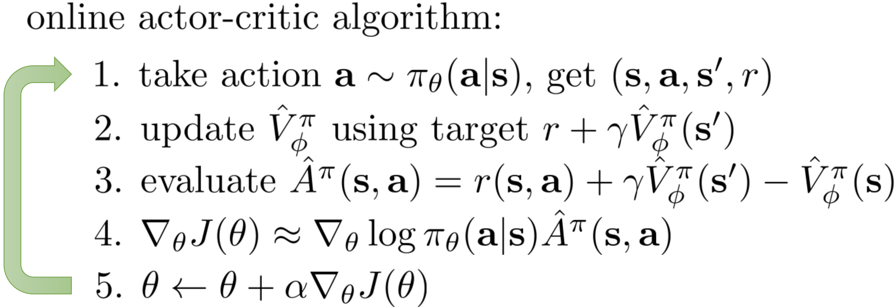

A2C
^^^^^^^

Overview
---------
A2C(advantage actor critic) is a actor-critic RL algorithm, where the policy gradient is combined with advantage function to reduce the variance.

Quick Facts
-----------
1. A2C is a **model-free** and **policy-based** RL algorithm.

2. A2C supports both **discrete** and **continuous action spaces**.

3. A2C supports **off-policy** mode and **on-policy** mode.

4. A2C can be equipped with RNN.

Key Equations or Key Graphs
----------------------------
A2C use advantage estimation in the policy gradient:

.. math::

   \nabla_{\theta^{\prime}} \log \pi\left(a_{t} \mid {s}_{t} ; \theta^{\prime}\right) A\left(s_{t}, {a}_{t} ; \theta, \theta_{v}\right)

where the n-step advantage function is defined:

.. math::

   \sum_{i=0}^{k-1} \gamma^{i} r_{t+i}+\gamma^{k} V\left(s_{t+k} ; \theta_{v}\right)-V\left(s_{t} ; \theta_{v}\right)

Pseudo-code
-----------

.. note::
   Different from Q-learning, A2C(and other actor critic methods) alternates between policy estimation and policy improvement.

Extensions
-----------
A2C can be combined with:
    - Multi-step learning
    - RNN
    - GAE
      GAE is proposed in `High-Dimensional Continuous Control Using Generalized Advantage Estimation <https://arxiv.org/abs/1506.02438>`_, it uses exponentially-weighted average of different steps of advantage estimators, to make trade-off between the variance and bias of the estimation of the advantage:

      .. math::

          \hat{A}_{t}^{\mathrm{GAE}(\gamma, \lambda)}:=(1-\lambda)\left(\hat{A}_{t}^{(1)}+\lambda \hat{A}_{t}^{(2)}+\lambda^{2} \hat{A}_{t}^{(3)}+\ldots\right)

      where the k-steps advantage estimator :math:`\hat{A}_t^{(k)}` is defined as :

      .. math::

          \hat{A}_{t}^{(k)}:=\sum_{l=0}^{k-1} \gamma^{l} \delta_{t+l}^{V}=-V\left(s_{t}\right)+r_{t}+\gamma r_{t+1}+\cdots+\gamma^{k-1} r_{t+k-1}+\gamma^{k} V\left(s_{t+k}\right)

      When k=1, the estimator :math:`\hat{A}_t^{(1)}` is the naive advantage estimator:

      .. math::

          \hat{A}_{t}^{(1)}:=\delta_{t}^{V} \quad=-V\left(s_{t}\right)+r_{t}+\gamma V\left(s_{t+1}\right)

      When GAE is used, the common value of :math:`\lambda` is usually [0.8, 1.0].

Implementation
------------------
The default config is defined as follows:

    .. autoclass:: ding.policy.a2c.A2CPolicy
        :noindex:

The network interface A2C used is defined as follows: 

    .. autoclass:: ding.model.template.vac.VAC
        :members: __init__, forward, compute_actor, compute_critic, compute_actor_critic
        :noindex:

The policy gradient and value update of A2C is implemented as follows:

.. code:: python

    def a2c_error(data: namedtuple) -> namedtuple:
        logit, action, value, adv, return_, weight = data
        if weight is None:
            weight = torch.ones_like(value)
        dist = torch.distributions.categorical.Categorical(logits=logit)
        logp = dist.log_prob(action)
        entropy_loss = (dist.entropy() * weight).mean()
        policy_loss = -(logp * adv * weight).mean()
        value_loss = (F.mse_loss(return_, value, reduction='none') * weight).mean()
        return a2c_loss(policy_loss, value_loss, entropy_loss)

The Benchmark result of A2C implemented in DI-engine is shown in `Benchmark <../feature/algorithm_overview_en.html>`_.

References
-----------

Volodymyr Mnih, Adrià Puigdomènech Badia, Mehdi Mirza, Alex Graves, Timothy P. Lillicrap, Tim Harley, David Silver, Koray Kavukcuoglu: “Asynchronous Methods for Deep Reinforcement Learning”, 2016, ICML 2016; arXiv:1602.01783. https://arxiv.org/abs/1602.01783
