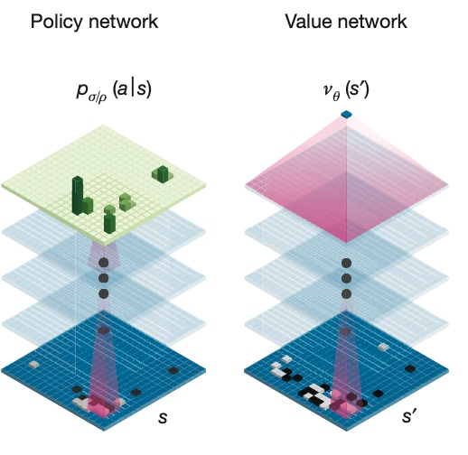
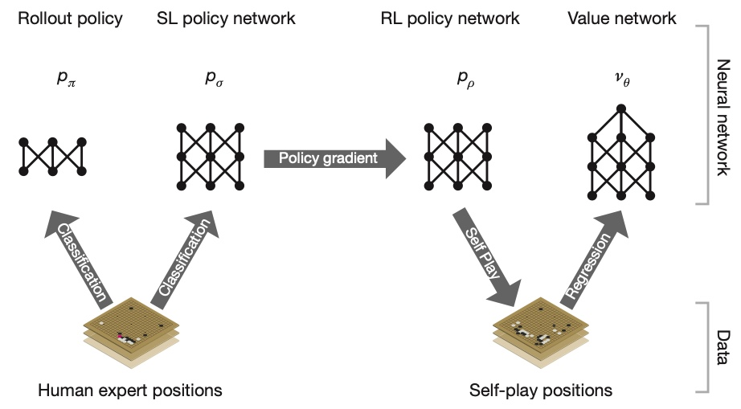
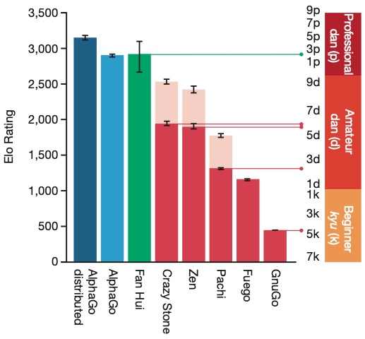
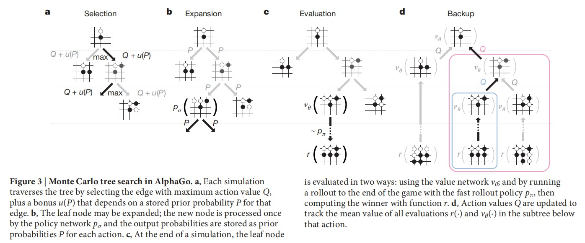
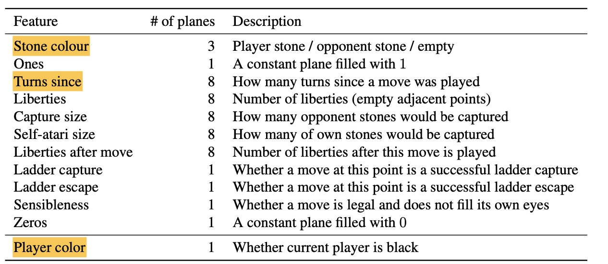
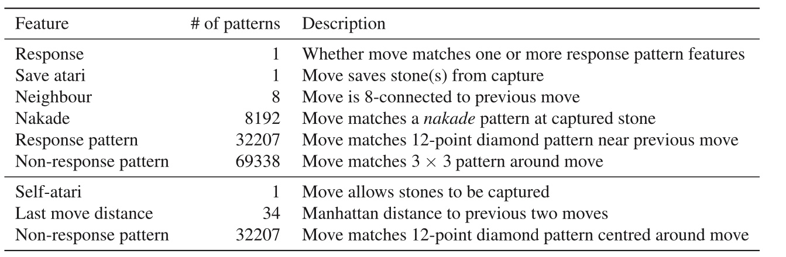
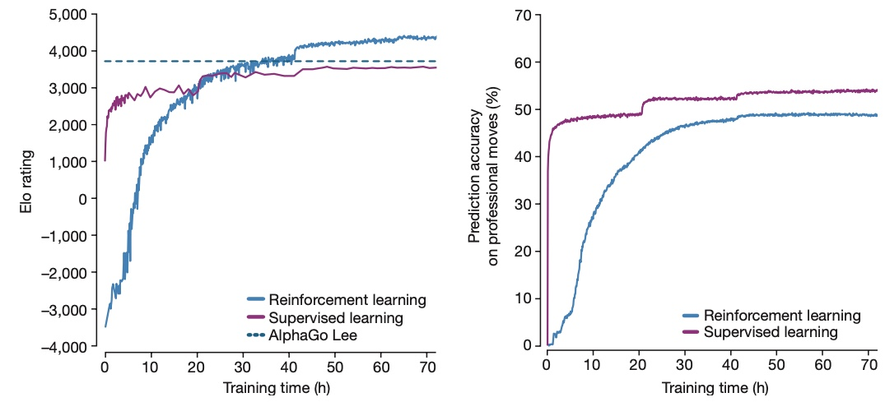

AlphaGo
^^^^^^^^^^^^^

Overview
--------------

AlphaGo and its variation AlphaGoZero can be said to be some of the most eye-catching achievements in the field of deep reinforcement learning in recent years. 
Google Deepmind's AlphaGo defeated world champion Lee Sedol in 2016 and defeated Ke Jie in 2017.
Its improved version, AlphaGoZero, has become an unattainable peak for all Go players, completely changing the game and training methods of the Go world.

AlphaGo's paper `Mastering the game of Go with deep neural networks and tree search <https://www.nature.com/articles/nature16961>`_ 
was published by Google DeepMind on nature in 2016.

As the title says, the implementation of the AlphaGo is a combination of deep neural networks (Conv-net) and tree search (MCTS).
Based on MCTS, some improvements have been made, 
including the PUCT algorithm proposed by `Multi-armed bandits with episode context <http://gauss.ececs.uc.edu/Workshops/isaim2010/papers/rosin.pdf>`_ ,
AlphaGo trained value network to evaluate board positions, 
trained policy network to select actions, modified the algorithm to combine value and policy networks with MCTS,
and continuously train neural networks through self-play.

Quick-Facts
-------------

1. AlphaGo can also be viewed as a combination of MCTS and VPN algorithm (which we introduced in `VPN <./vpn.html>`_ ).

2. In compare to basic MCTS algorithm, AlphaGo used **deep neural network** as the **default policy**, used improved bandit algorithm **PUCT** as the **tree policy**. 

3. AlphaGo contains two separated neural networks, policy network and value network.

4. To solve the problem of low sample efficiency due to large search space, AlphaGo used supervised learning to learn from human expert games in the first stage of the pineline.

Key Equations or Key Graphs
---------------------------

AlphaGo's neural network structure:

AlphaGo's supervised learning and reinforcement learning process:

After passing offline-RL and self-play online-RL training, AlphaGo's level has reached and surpassed the level of top professional Go players:

The PUCT algorithm:

:math:`u(s, a)=c_{\mathrm{puct}} P(s, a) \frac{\sqrt{\sum_{b} N_{r}(s, b)}}{1+N_{r}(s, a)}`

The Monte Carlo Tree Search process of AlphaGo:

The fly in the ointment is that AlphaGo used a lot of Human prior knowledge. In addition to using replays of professional Go players,
The input features include the remaining "qi" of the chess game, some a priori feasible moves, some a priori patterns of the chess game, etc.

The input features of neural network:

Rollout and tree policy's input-features:

Although AlphaGo is performing well, there are still many problems to be improved. 
These problems were solved in 2017, as AlphaGoZero was born.

Pseudo-code
--------------
* TBD

Extensions
-----------
- AlphaGoZero

Implementations
----------------
* TBD

AlphaGoZero
^^^^^^^^^^^^^

Overview
--------------

AlphaGoZero's paper `Mastering the game of Go without human knowledge <https://www.nature.com/articles/nature24270.>`_ 
was published by Google DeepMind on nature in 2016.

As the title says, the most significant improvement in AlphaGoZero is that throughout the training process of AlphaGoZero, no Human prior knowledge is needed.

The network input of AlphaGoZero has no other features, apart from the position information of the board. 

AlphaGoZero no longer relies on replays of professional players to do supervised learning 
but trains a purely self-play deep learning algorithm starting from zero.

The modification of AlphaGoZero is rather simple, that it modified the neural network structures in two aspects:

   1.No longer separate value network and policy network, but a dueling network with dueling head (sep/dual).

   2.Improve the basic structure of neural network，from basic convolution network "ConvNet" updated to residual network "ResNet" (conv/res).

Quick-Facts
-------------

   1. AlphaGoZero no longer need to learn from human expert games to reduce the exploration space. The algorithm based solely on reinforcement learning, without human data, guidance or domain knowledge beyond game rules.
   
   2. AlphaGoZero used a dueling network with dueling head to jointly train value network and policy network, which results in a huge performance gain.
   
   3. AlphaGoZero improved the basic structure of neural network，from convolution network to residual network, which results in a huge performance gain.

Key Equations or Key Graphs
---------------------------

The ablation study comparing AlphaGo and AlphaGoZero in two aspects(sep/dual and conv/res):

.. image:: images/Zero-rating.jpg
   :align: center

The training process of AlphaGoZero:

.. image:: images/Zero-training.jpg

The compare between reinforcement learning and supervised learning using AlphaGoZero's network structure:

We can see that AlphaGoZero based on reinforcement learning not only achieves better results than supervised learning, but the policy is also more different from the current experts.

Pseudo-code
--------------
* TBD

Extensions
-----------
* TBD

Implementations
----------------
* TBD

References
-----------
Silver, D., Schrittwieser, J., Simonyan, K. et al. Mastering the game of Go without human knowledge. Nature 550, 354–359 (2017). https://doi.org/10.1038/nature24270

Rosin, Christopher D. “Multi-Armed Bandits with Episode Context.” Annals of Mathematics and Artificial Intelligence, vol. 61, no. 3, 2011, pp. 203–230., doi:10.1007/s10472-011-9258-6. http://gauss.ececs.uc.edu/Workshops/isaim2010/papers/rosin.pdf