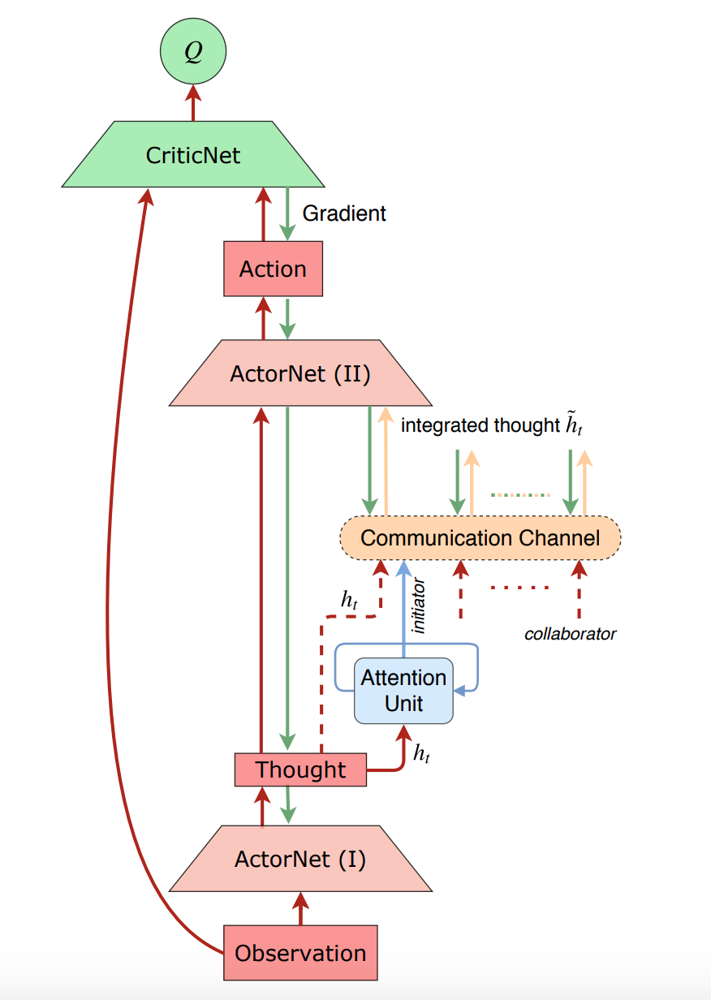

ATOC
^^^^^^^

Overview
---------
ATOC (Jiang et al. 2018) is a communication model proposed to exploit inter-agent communication in execution for multi-agent tasks. ATOC operates operates in the paradigm of learning a communication protocol and uses an attentional communication mechanism to decide when communication is needed and how to cooperatively integrate shared information, which makes it possible for agents to learn coordinated strategies in dynamic communication environments.

Quick Facts
-------------
1. ATOC uses the paradigm of **decentralized execution without centralized training**. Each agent receives local observations.

2. ATOC is a **model-free** and based on **actor critic** method.

3. ATOC is an **off-policy** algorithm.

4. ATOC is trained end-to-end by back propagation. All agents share the parameters of the policy network, Q-network, attention unit, and communication channel.

5. ATOC can be used in partially observable distributed environments for large-scale multi-agent RL.

6. ATOC use an attention unit that receives encoded local observation and action intention of an agent, which determines whether communication is helpful in terms of cooperation.

7. A bidirectional LSTM unit in ATOC is set as the communication channel to connect each agent within a communication group.

Key Equations or Key Graphs
---------------------------
ATOC overall architecture for one single agent:

The communication architecture for each agent consists of:

- Attention Unit: determining communication when necessary

- Communication Channel: integrating internal states of agents within a group and guiding the agents towards coordinated decision making. The LSTM unit can selectively output information that promotes cooperation and forget information that impedes cooperation through gates.

The overall training of ATOC is an extension of DDPG, including parameter updates of the critic, actor, communication channel, and attention unit.

Select experiences where the action is determined by an agent independently (i.e., without communication) and experiences with communication, respectively, to update the action-value function :math:`Q^{\mu}`:

.. math::
   \mathcal{L}(\theta^{Q}) = 
   \mathbb{E}_{o,a,r,o^{'}}[(Q^{\mu}(o,a) - 
   y)^{2}], y = r + \gamma Q^{\mu{'}} 
   (o^{'},a^{'})|_{a^{'}=\mu^{'}(o^{'})} 

The gradients are backpropagated to the policy network and communication channel to update the
parameters. 

.. math::
   \nabla_{\theta^{\mu}}\mathcal{J}(\theta^{\mu}) = \mathbb{E}_{o,a\sim \mathcal{R}}[\nabla_{\theta^{\mu}}\mu(a|o)\nabla_{a}Q^{\mu}(o,a)|_{a=\mu (o)}]

The gradient of integrated thought in the communication channel:

.. math::
   \nabla_{\theta^{g}}\mathcal{J}(\theta^{g}) = 
   \mathbb{E}_{o,a\sim \mathcal{R}} 
   [\nabla_{\theta^{g}}g(\tilde{h}|H)\nabla_{\tilde{h}}\mu(a|\hat{h})\nabla_{\hat{a}}Q^{\mu}(o,a)|_{a=\mu (o)}]

The attention unit is trained as a binary classifier for communication. The log loss to update attention unit of ATOC:

.. math::
   \mathcal{L}(\theta^{p}) = -\nabla \hat{Q}_{i} 
   \log(p(h^{i}|\theta^{p}))- (1-\Delta 
   \hat{Q}_{i}) \log(1 - p(h^{i}|\theta^{p}))
   
Extensions
-----------
- Different from ATOC, TarMAC (Das et al. 2019) uses attention in communication to decide who to communicate with. TarMAC is interpretable through predicted attention probabilities that allow for inspection of which agent is communicating what message and to whom. Additionally, TarMAC proposes multi-round communication where agents coordinate via multiple rounds of communication before taking actions in the environment. 

- Emergent communication protocols are various in solving multi-agent collaboration tasks. If you want to know more about this direction, you can find in Zhang et al. (2019).

Implementations
----------------
The default config is defined as follows:

    .. autoclass:: ding.policy.atoc.ATOCPolicy
        :noindex:

The network interface ATOC used is defined as follows:

    TBD

References
----------------
Jiechuan Jiang, Zongqing Lu. Learning attentional communication for multi-agent cooperation. arXiv preprint arXiv:1805.07733, 2018.

Abhishek Das, Théophile Gervet, Joshua Romoff, Dhruv Batra, Devi Parikh, Mike Rabbat, Joelle Pineau. Tarmac: Targeted multi-agent communication. International Conference on Machine Learning. PMLR, 2019.

Mikayel Samvelyan, Tabish Rashid, Christian Schroeder de Witt, Gregory Farquhar, Nantas Nardelli, Tim G. J. Rudner, Chia-Man Hung, Philip H. S. Torr, Jakob Foerster, Shimon Whiteson. The StarCraft Multi-Agent Challenge. arXiv preprint arXiv:1902.04043, 2019.

Kaiqing Zhang, Zhuoran Yang, Tamer Başar. Multi-Agent Reinforcement Learning: A Selective Overview of Theories and Algorithms. arXiv preprint arXiv:1911.10635, 2019.
