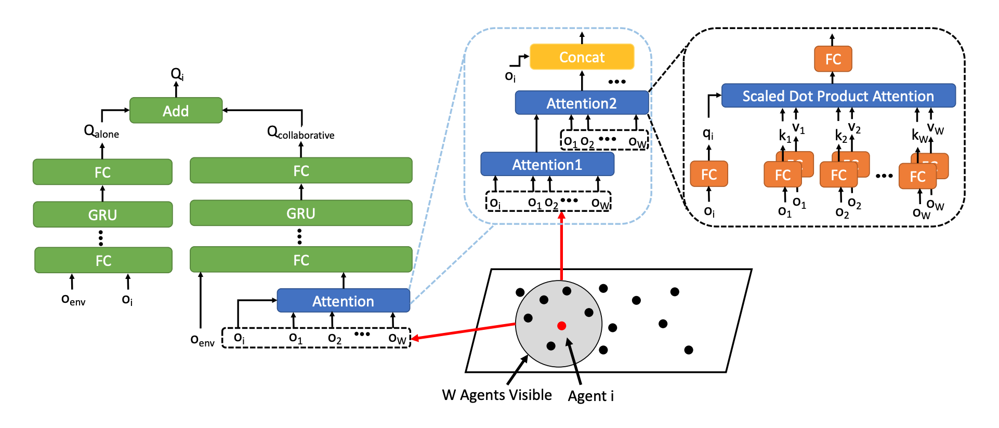

CollaQ
^^^^^^^

Overview
---------
CollaQ (Zhang et al. 2020), Collaborative Q-learning, is a multi-agent collaboration approach based on Q-learning, which formulates multi-agent collaboration as a joint optimization problem on reward assignment. CollaQ decomposes decentralized Q value functions of individual agents into two terms, the self-term that only relies on the agent’s own state, and the interactive term that is related to states of nearby agents. CollaQ jointly trains using regular DQN, regulated with a Multi-Agent Reward Attribution (MARA) loss.

Quick Facts
-------------
1. CollaQ is a **model-free** and **value-based** multi-agent RL approach.

2. CollaQ only supports **discrete** action spaces.

3. CollaQ is an **off-policy** algorithm.

4. CollaQ considers a **partially observable** scenario in which each agent only obtains individual observations.

5. CollaQ uses **DRQN** architecture for individual Q learning.

6. Compared to QMIX and VDN, CollaQ doesn't need a centralized Q function, which expands the individual Q-function for each agent with reward assignment depending on the joint state.

Key Equations or Key Graphs
---------------------------
The overall architecture of the Q-function with attention-based model in CollaQ:

The Q-function for agent i:

.. math::
   Q_{i}(s_{i},a_{i};\hat{\textbf{r}}_{i}) = \underbrace{Q_{1}(s{i}, a_{i},\hat{\textbf{r}_{0i}})}_{Q^{alone}(s_{i},a_{i})}  + \underbrace{\nabla_{\textbf{r}}Q_{i}(s_{i},a_{i};\textbf{r}_{0i})\cdot(\hat{\textbf{r}_{i}} - \textbf{r}_{0i}) + \mathcal{O}(||\hat{\textbf{r}_{i}} - \textbf{r}_{0i}||^{2})}_{Q^{collab}(s^{local}_{i}, a_{i})}

The overall training objective of standard DQN training with MARA loss:

.. math::
   L = \mathbb{E}_{s_{i},a{i}\sim\rho(\cdot)}[\underbrace{(y-Q_{i}(o_{i},a_{i}))^{2}}_{\text{DQN Object}} +\underbrace{\alpha(Q_{i}^{collab}(o_{i}^{alone}, a_{i}))^{2}}_{\text{MARA Object}}]

 
Extensions
-----------
- CollaQ can choose to use an attention-based architecture or not. Because the observation can be spatially large and covers agents whose states do not contribute much to a certain agent policy. In details, CollaQ uses a transformer architecture (stacking multiple layers of attention modules), which empirically helps improve the performance in multi-agent tasks.

Implementations
----------------
The default config is defined as follows:

    .. autoclass:: ding.policy.collaq.CollaQPolicy
        :noindex:

The network interface CollaQ used is defined as follows:

    .. autoclass:: ding.model.template.qmix.CollaQ
        :members: __init__, forward
        :noindex:

The Benchmark result of CollaQ in SMAC (Samvelyan et al. 2019), for StarCraft micromanagement problems, implemented in DI-engine is shown.

References
----------------
Tianjun Zhang, Huazhe Xu, Xiaolong Wang, Yi Wu, Kurt Keutzer, Joseph E. Gonzalez, Yuandong Tian. Multi-Agent Collaboration via Reward Attribution Decomposition. arXiv preprint arXiv:2010.08531, 2020.

Mikayel Samvelyan, Tabish Rashid, Christian Schroeder de Witt, Gregory Farquhar, Nantas Nardelli, Tim G. J. Rudner, Chia-Man Hung, Philip H. S. Torr, Jakob Foerster, Shimon Whiteson. The StarCraft Multi-Agent Challenge. arXiv preprint arXiv:1902.04043, 2019.
