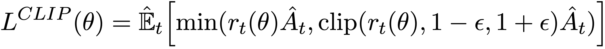
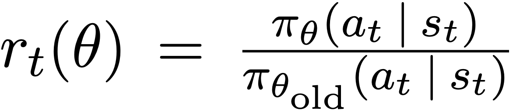
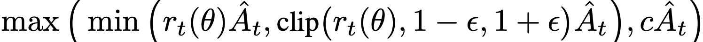
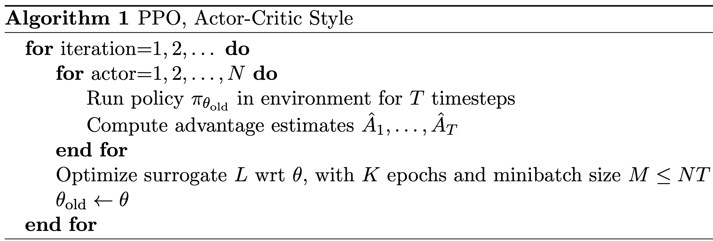

PPO
^^^^^^^

Overview
---------
PPO(Proximal Policy Optimization) was proposed in `Proximal Policy Optimization Algorithms <https://arxiv.org/pdf/1707.06347.pdf>`_. PPO follows the idea of TRPO, which restricts the step of policy update by KL-divergence, and uses clipped probability ratios of the new and old policies to replace the direct KL-divergence restriction. This adaptation is simpler to implement and avoid the calculation of the Hessian matrix in TRPO.

Quick Facts
-----------
1. PPO is a **model-free** and **policy-based** RL algorithm.

2. PPO supports both **discrete** and **continuous action spaces**.

3. PPO supports **off-policy** mode and **on-policy** mode.

4. PPO can be equipped with RNN.

Key Equations or Key Graphs
------------------------------
PPO use clipped probability ratios in the policy gradient to prevent the policy from too rapid changes:

with the probability ratio :math:`r_t(\theta)` defined as:

When :math:`\hat{A}_t > 0`, :math:`r_t(\theta) > 1 + \epsilon` will be clipped. While when :math:`\hat{A}_t < 0`, :math:`r_t(\theta) < 1 - \epsilon` will be clipped. However, in the paper `Mastering Complex Control in MOBA Games with Deep Reinforcement Learning <https://arxiv.org/abs/1912.09729>`_, the authors claim that when :math:`\hat{A}_t < 0`, a too large :math:`r_t(\theta)` should also be clipped, which introduces dual clip:

Pseudo-code
-----------

.. note::
   This is the on-policy version of PPO.

Extensions
-----------
PPO can be combined with:
    - multi-step learning
    - RNN
    - GAE

    .. note::
      Indeed, the standard implementation of PPO contains the many additional optimizations which are not described in the paper. Further details can be found in `IMPLEMENTATION MATTERS IN DEEP POLICY GRADIENTS: A CASE STUDY ON PPO AND TRPO <https://arxiv.org/abs/2005.12729>`_.

Implementation
-----------------
The default config is defined as follows:

    .. autoclass:: ding.policy.ppo.PPOPolicy

    The policy gradient and value update of PPO is implemented as follows:

    .. code:: python

        def ppo_error(
                data: namedtuple,
                clip_ratio: float = 0.2,
                use_value_clip: bool = True,
                dual_clip: Optional[float] = None
        ) -> Tuple[namedtuple, namedtuple]:

            assert dual_clip is None or dual_clip > 1.0, "dual_clip value must be greater than 1.0, but get value: {}".format(
                dual_clip
            )
            logit_new, logit_old, action, value_new, value_old, adv, return_, weight = data
            policy_data = ppo_policy_data(logit_new, logit_old, action, adv, weight)
            policy_output, policy_info = ppo_policy_error(policy_data, clip_ratio, dual_clip)
            value_data = ppo_value_data(value_new, value_old, return_, weight)
            value_loss = ppo_value_error(value_data, clip_ratio, use_value_clip)

            return ppo_loss(policy_output.policy_loss, value_loss, policy_output.entropy_loss), policy_info

The Benchmark result of PPO implemented in DI-engine is shown in `Benchmark <../feature/algorithm_overview.html>`_
