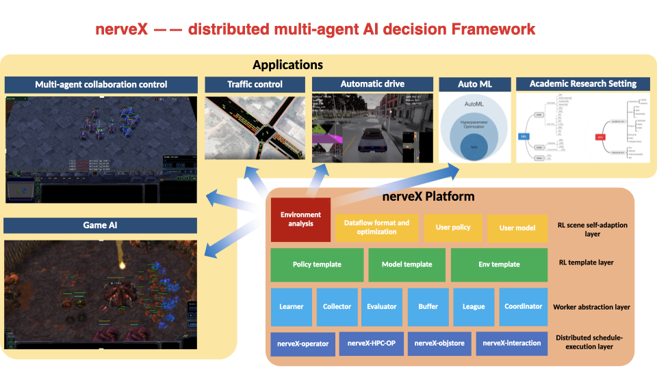

Welcome to DI-engine's documentation!
=====================================

Overview
------------
DI-engine is a generalized Decision Intellegence engine. It supports most basic deep reinforcement learning (DRL) algorithms,
such as DQN, PPO, SAC, and domain-specific algorithms like QMIX in multi-agent RL, GAIL in inverse RL, and RND in exploration problems.
The whole supported algorithms introduction can be found in `Algorithm <./feature/algorithm_overview.html>`_.

For scalability, DI-engine supports three different training pipeline:

  - ``serial``

    - feature: single-machine, learner-collector loop executes sequencially
    - usage: academic research
  - ``parallel``

    - feature: single-machine, learner and collector execute in parallel
    - usage: speed up serial pipeline and introduction to the whole distributed training
  - ``dist``

    - feature: for GPU and CPU mixed computing clusters, learner-collector distributed execution
    - usage: large scale AI decision application, such as AlphaStar league training

Main Features
--------------
.. 
 TODO(niuyazhe): add hyperlinks for DI-zoo, applications, and code links of some features
..

  * DI-zoo: High performance DRL algorithm zoo, algorithm support list (TODO(): link)
  * Generalized decision intelligence algorithms: IRL family, MARL family, searching family (MCTS, xxx, etc.), .. TODO(niuyazhe)
  * Customized DRL demand implementation, such as Inverse RL/RL hybrid training; Multi-buffer training; League self-play training
  * Large scale DRL training demonstration and application
  * Various efficiency optimization module: HPC_RL, ObjStore, EnvManager, DataLoader
  * k8s support, DI-engine-operator k8s lustre scheduler for dynamic collectors and other services

   

To get started, take a look over the `quick start <./quick_start/index.html>`_ and `API documentation <./api_doc/index.html>`_.
For RL beginners, DI-engine advises you to refer to `hands-on RL <hands_on/index.html>`_ for more discussion.
If you want to deeply customize your algorithm and application with DI-engine, also checkout `key concept <./key_concept/index.html>`_ and `Feature <./feature/index.html>`_. 

.. toctree::
   :maxdepth: 2
   :caption: User Guide

   installation/index
   quick_start/index
   key_concept/index
   intro_rl/index
   hands_on/index
   best_practice/index
   api_doc/index

   faq/index_en
   feature/index
   supplementary_rl/index

.. toctree::
   :maxdepth: 2
   :caption: Developer Guide

   guide/index
   tutorial_dev/index
