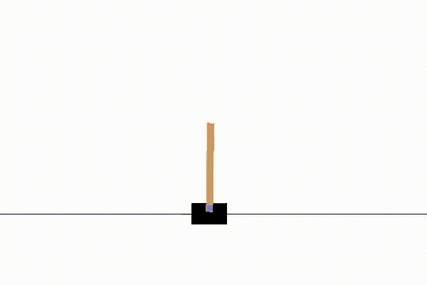

Quick Start
===============================
(Based on commit 0c3529)

.. toctree::
   :maxdepth: 3

Here we show how to easily deploy a Reinforcement Learning experiment on a simple ``CartPole`` 
environment using DI-engine.

DI-engine provides config-wise and code-wise specifications to build RL experiments. 
Both are commonly used by existing RL platforms. In this section we use the code-level
entry to clarify the training procedure and defined modules, with the hyperparameters
for training details and NN models pre-defined in a config file. 

Config and entry
------------------

DI-engine recommends using a config `dict` defined in a python file as input.

.. code-block:: python

    cartpole_dqn_default_config = dict(
        env=dict(
            manager=dict(...),
            ...
        ),
        policy=dict(
            model=dict(...),
            collect=dict(...),
            learn=dict(...),
            eval=dict(...),
            other=dict(
                replay_buffer=dict(),
                ...
            ),
            ...
        ),
    )

A config file contains two main namespaces, ``env`` and ``policy``. Some sub-namespace belong to certain modules in DI-engine. 
The module can be specialized defined by users or just use our pre-defined modules. Here is a example:

.. code-block:: python

    from ding.config import compile_config
    from ding.envs import BaseEnvManager, DingEnvWrapper
    from ding.model import DQN, VAC
    from ding.policy import DQNPolicy, PPOPolicy
    from ding.worker import BaseLearner, SampleCollector, BaseSerialEvaluator, AdvancedReplayBuffer
    from app_zoo.classic_control.cartpole.config.cartpole_dqn_config import cartpole_dqn_config
    # from app_zoo.classic_control.cartpole.config.cartpole_ppo_config import cartpole_ppo_config  # ppo config

    # compile config
    cfg = compile_config(
        cartpole_dqn_config,
        BaseEnvManager,
        DQNPolicy,
        BaseLearner,
        SampleCollector,
        BaseSerialEvaluator,
        AdvancedReplayBuffer,
        save_cfg=True
    )

.. note::
   For the specific config example and how to construct config, you can refer to ``app_zoo/classic_control/cartpole/config/cartpole_dqn_config.py`` and ``app_zoo/classic_control/cartpole/entry/cartpole_dqn_main.py``

For more design details, please refer to the `Config <../key_concept/index.html#config>`_.

When you are ready with config, you can you construct your RL training/evaluation entry program referring to the following guides step by step.

Set up Environments
---------------------

DI-engine redefines RL environment interfaces derived from the widely used `OpenAI Gym <https://github.com/openai/gym>`_. 
For junior users, an environment wrapper (by default :class:`DingEnvWrapper <ding.env.DingEnvWrapper>`) is provided 
to simply wrap the gym env into DI-engine form env.
For advanced users, it is suggested to check our `Environment <../key_concept/index.html#env>`_ doc for details

The :class:`Env Manager <ding.envs.BaseEnvManager>` is used to manage multiple environments, single-process serially 
or multi-process parallelly. The interfaces of `env manager` are similar to those of a simple gym env. Here we show a case
of using :class:`BaseEnvManager <ding.envs.BaseEnvManager>` to build environments for collection and evaluation.

.. code-block:: python

    import gym

    def wrapped_cartpole_env():
        return DingEnvWrapper(gym.make('CartPole-v0'))

    collector_env_num, evaluator_env_num = cfg.env.collector_env_num, cfg.env.evaluator_env_num
    collector_env = BaseEnvManager(env_fn=[wrapped_cartpole_env for _ in range(collector_env_num)], cfg=cfg.env.manager)
    evaluator_env = BaseEnvManager(env_fn=[wrapped_cartpole_env for _ in range(evaluator_env_num)], cfg=cfg.env.manager)

Set up Policy and NN model
----------------------------

DI-engine supports most of the common policies used in RL training. Each is defined as a :class:`Policy <ding.policy.CommonPolicy>`
class. The details of optimiaztion algorithm, data pre-processing and post-processing, control of multiple networks 
are encapsulated inside. Users only need to build a PyTorch network structure and pass into the policy. 
DI-engine also provides default networks to simply apply to the environment. For some complex RL methods, it is required to set some
properties (such as `Actor` and `Critic`) in your defined model.

For example, a `DQN` policy and `PPO` policy for CartPole can be defined as follow.

.. code-block:: python

    model = DQN(**cfg.policy.model)
    policy = DQNPolicy(cfg.policy, model=model)

.. code-block:: python

    model = VAC(**cfg.policy.model)
    policy = PPOPolicy(cfg.policy, model=model)

Set up execution modules
--------------------------

DI-engine needs to build some execution components to manage an RL training procedure. 
A :class:`Collector <ding.worker.BaseSerialCollector>` is used to sample and provide data for training.
A :class:`Learner <ding.worker.BaseLearner>` is used to receive training data and conduct 
the training (including updating networks, strategy and experience pool, etc.).
An :class:`Evaluator <ding.worker.BaseSerialEvaluator>` is build to perform the evaluation when needed.
And other components like :class:`Replay Buffer <ding.worker.replay_buffer.IBuffer>` may be required for the
training process. All these module can be customized by config or rewritten by the user.

An example of setting up all the above is showed as follow.

.. code-block:: python

    import os
    from tensorboardX import SummaryWriter    

    tb_logger = SummaryWriter(os.path.join('./log/', 'your_experiment_name'))
    learner = BaseLearner(cfg.policy.learn.learner, policy.learn_mode, tb_logger)
    collector = SampleCollector(cfg.policy.collect.collector, collector_env, policy.collect_mode, tb_logger)
    evaluator = BaseSerialEvaluator(cfg.policy.eval.evaluator, evaluator_env, policy.eval_mode, tb_logger)
    replay_buffer = AdvancedReplayBuffer(cfg.policy.other.replay_buffer, tb_logger)

Train and evaluate the policy
---------------------------------

The training loop in DI-engine can be customized arbitrarily. Usually the training process may consist of
collecting data, updating policy, updating related modules and evaluation.

Here we provide examples of off-policy training (`DQN`) and on-policy training (`PPO`) for a `CartPole`
environment.

.. code-block:: python

    from ding.rl_utils import get_epsilon_greedy_fn
    
    # DQN training loop
    eps_cfg = cfg.policy.other.eps
    epsilon_greedy = get_epsilon_greedy_fn(eps_cfg.start, eps_cfg.end, eps_cfg.decay, eps_cfg.type)
    max_iterations = int(1e8)
    for _ in range(max_iterations):
        if evaluator.should_eval(learner.train_iter):
            stop, reward = evaluator.eval(learner.save_checkpoint, learner.train_iter, collector.envstep)
            if stop:
                break
        eps = epsilon_greedy(collector.envstep)
        new_data = collector.collect(train_iter=learner.train_iter, policy_kwargs={'eps': eps})
        replay_buffer.push(new_data, cur_collector_envstep=collector.envstep)
        for i in range(cfg.policy.learn.update_per_collect):
            train_data = replay_buffer.sample(learner.policy.get_attribute('batch_size'), learner.train_iter)
            if train_data is not None:
                learner.train(train_data, collector.envstep)

.. code-block:: python

    # PPO training loop
    max_iterations = int(1e8)
    for _ in range(max_iterations):
        if evaluator.should_eval(learner.train_iter):
            stop, reward = evaluator.eval(learner.save_checkpoint, learner.train_iter, collector.envstep)
            if stop:
                break
        new_data = collector.collect(train_iter=learner.train_iter)
        replay_buffer.push(new_data, cur_collector_envstep=collector.envstep)
        for i in range(cfg.policy.learn.update_per_collect):
            train_data = replay_buffer.sample(learner.policy.get_attribute('batch_size'), learner.train_iter)
            if train_data is not None:
                learner.train(train_data, collector.envstep)
        replay_buffer.clear()

.. note::
   The users can refer to the complete demo in ``app_zoo/classic_control/cartpole/entry/cartpole_dqn_main.py`` and ``app_zoo/classic_control/cartpole/entry/cartpole_ppo_main.py`` .

Advanced features
------------------

Some advanced features in RL training which well supported by DI-engine are listed below.

Epsilon Greedy
~~~~~~~~~~~~~~~~~~~~~~~~~~~~~~~~~~~~~~~~~~~~~~~~~~

An easy way of deploying epsilon greedy exploration when sampling data has already been shown above. It is
called by the ``epsilon_greedy`` function each step. And you can select your own decay strategy, such as envstep and train_iter.

.. code-block:: python

    from ding.rl_utils import get_epsilon_greedy_fn
    
    eps_cfg = cfg.policy.other.eps
    epsilon_greedy = get_epsilon_greedy_fn(eps_cfg.start, eps_cfg.end, eps_cfg.decay, eps_cfg.type)
    while True:
        eps = epsilon_greedy(learner.train_iter)
        ...

Visualization & Logging
~~~~~~~~~~~~~~~~~~~~~~~~~

Some environments have a renderd surface or visualization. DI-engine adds a switch to save these replays.
After training, the users need to indicate ``env.replay_path`` in config and add the next two lines after creating environments.

.. code-block:: python

    evaluator_env = BaseEnvManager(env_fn=[wrapped_cartpole_env for _ in range(evaluator_env_num)], cfg=cfg.env.manager)
    cfg.env.replay_path = './video'
    evaluator_env.enable_save_replay(cfg.env.replay_path)
    evaluator = BaseSerialEvaluator(cfg.policy.eval.evaluator, evaluator_env, policy.eval_mode, tb_logger)
    evaluator.eval(learner.save_checkpoint, learner.train_iter, collector.envstep)

.. tip::

    If users encounter some errors in recording videos by gym wrapper, you should install ``ffmpeg`` first.

A simple demo for replaying CartPole Env evaluation is shown follow.

Similar with other Deep Learning platforms, DI-engine uses tensorboard to record key parameters and results during
training. In addition to the default logging parameters, users can add their own logging parameters as follow.

.. code-block:: python

    tb_logger.add_scalar('epsilon_greedy', eps, learner.train_iter)

If you want to know more details about default information recorded in tensorboard, see our 
`tensorboard and logging demo <./tb_demo.html>`_ for a
DQN experiment.

Loading & Saving checkpoints
~~~~~~~~~~~~~~~~~~~~~~~~~~~~~~

It is usually needed to save and resume an experiments with model checkpoints. DI-engine saves and loads checkpoints
in the same way as PyTorch.

.. code-block:: python

    ckpt_path = 'path/to/your/ckpt'
    state_dict = torch.load(ckpt_path, map_location='cpu')
    if 'last_iter' in state_dict:
        last_iter = state_dict.pop('last_iter')
        learner.last_iter.update(last_iter)
    learner.policy.load_state_dict(state_dict)
    learner.info('{} load ckpt in {}'.format(learner.name, ckpt_path))
    
    ...

    dirname = './ckpt_{}'.format(learner.name)
    os.mkdir(dirname, exsit_ok=True)
    ckpt_name = 'iteration_{}.pth.tar'.format(learner.last_iter.val)
    path = os.path.join(dirname, ckpt_name)
    state_dict = learner.policy.state_dict()
    state_dict.update({'last_iter': learner.last_iter.val})
    torch.save(state_dict, path)
    learner.info('{} save ckpt in {}'.format(learner.name, path))

To deploy this in a more elegant way, DI-engine is configured to use 
:class:`Learner Hooks <ding.worker.learner.learner_hook.LearnerHook>` to handle these cases. The saving hook is 
automatically frequently called after training iterations. And to load & save checkpoints at the beginning and 
in the end, users can simply add one line code before & after training as follow.

.. code-block:: python
    
    learner.call_hook('before_run')

    # training loop
    while True:
        ...
    
    learner.call_hook('after_run')

For more information, please take a look to `Wrapper & Hook Overview <../feature/wrapper_hook_overview.html>`_ doc.
