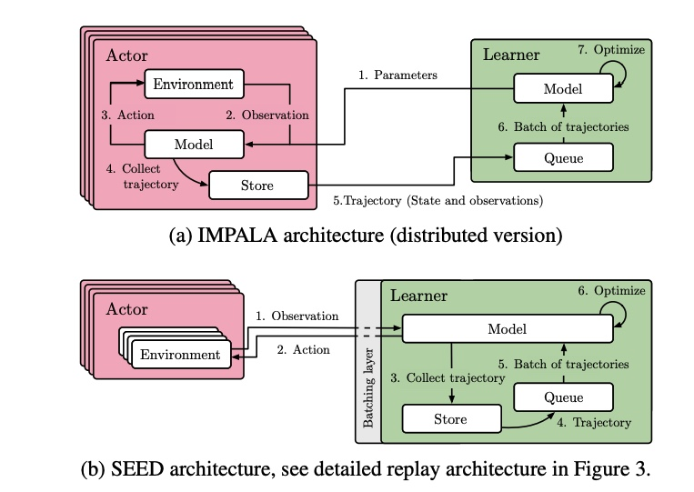
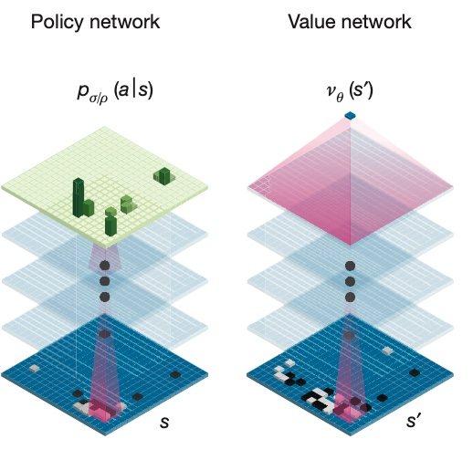
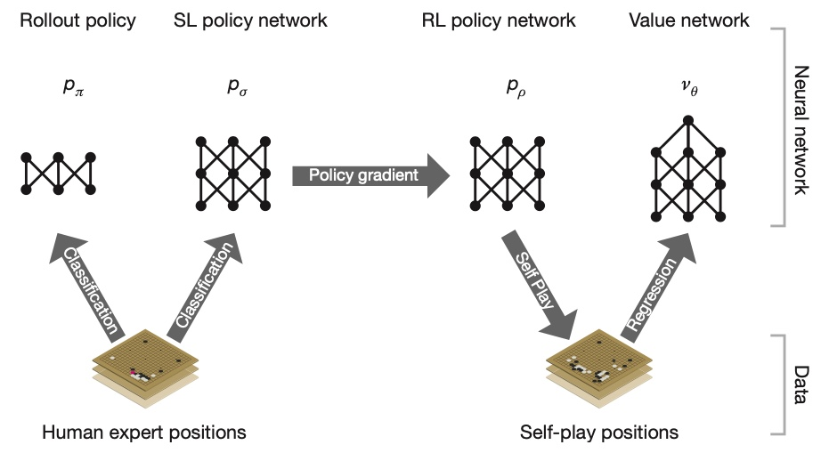
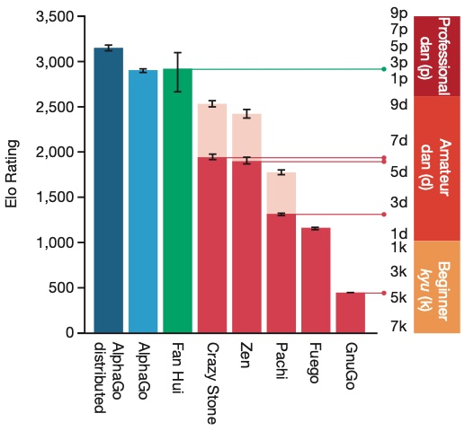
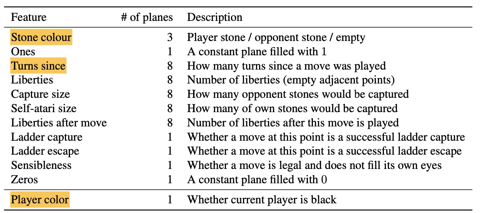
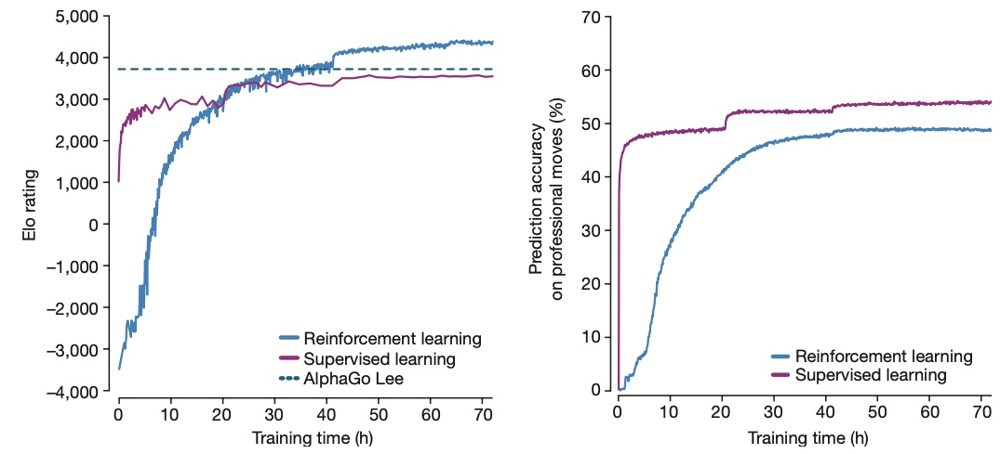

Large Scale RL Training
~~~~~~~~~~~~~~~~~~~~~~~~~

A3C
^^^^^^^^^^
研究人员发现，简单的在线强化学习和深度神经网络的结合并不稳定，主要是由于agent观测到的数据序列之间具有强烈的相关性，影响了强化学习算法的更新过程。

于是提出了经验回放池（Experience Replay）存储agent采样的数据，从中采样出相关性较低的一个batch的样本，送给learner进行学习，但这也限制了这个方法只能用于off-policy的强化学习算法。
经验回放池会消耗更高多内存和计算资源，还会使off-policy算法不得不从更古老的策略产生的数据中进行学习。

和经验回放池思路不同，A3C是对A2C算法异步版本改进，它可以构建多个环境和多个collector同时产生数据（不同的actor可以采用不同的探索参数，也可以选择探索一个环境的不同部分，增加数据的多样性），每个环境中积累一定数量的数据量之后再一并更新主网络参数。

这样在任意一个时间段，并行的agent都会经历不同的状态，这样actor之间的样本相关性就降低了，解决了前文提到的“不稳定”的问题，且这个方法可以用于on-policy的强化学习算法。
A3C可以在单机上使用CPU来执行，并取得了比以前的基于GPU的算法更好的效果。

A3C有一个主网络，开启n个线程，每个线程里有和主网络一样的网络（即A2C），每个线程会独立地和环境进行交互并更新主网络。单个线程的伪代码如下：

1. 每个线程的网络都从主网络复制参数；

2. 每个线程的actor都与环境交互产生样本，利用环境反馈的reward和网络预测的 V 值计算子网络（actor网络 + critic网络）的梯度

3. 利用计算得到的梯度更新主网络，并返回步骤1进入下一个循环。

Ape-X
^^^^^^^^^^^

Ape-X出自谷歌在ICLR2018上发表的论文：`Distributed Prioritized Experience Replay <https://arxiv.org/pdf/1803.00933.pdf>`_ 。
原先的分布式方法主要致力于加速神经网络的训练，比如并行化计算梯度，更快地更新梯度等。但这篇文章更加关注分布式场景下经验数据的产生和选择。
主要针对传统DQN/DDPG等算法，使用分布式actor获取replay memory数据并进行优先经验回放，从而使强化学习网络训练得更有效率。

整体架构
''''''''''

Ape-X是对优先经验回放进行了分布式场景下的扩展，它的一些关键的调整使得分布式有限经验回放在深度强化学习中有很强的扩展性。

.. image:: images/APEX-architecture.png

Ape-X的整体架构如上图所示，它将整个学习过程分为actor和learner两部分，actor向一个中心化的共享的的replay memory中存储数据，
learner从replay memory中带优先级地采样更加“有用”的数据，即更“有用”的数据的采样频率会更高。
这里的优先级可以根据算法的不同而有不同的定义，概括来讲是根据tderror-惊奇度（估计值和实际值的区别）来决定数据的优先级大小：
惊奇度越大，优先级越高。后文会详细介绍其中的两种：Ape-X DQN 和 Ape-X DPG。

在Prioritized DQN中，样本被送入replay memory时会设置一个当前最高的优先级，以保证会快速被learner采样到，
其真实的优先级会在learner处计算得到，但这样做会使得learner一定会采样到最新的数据，这可能会浪费一些计算资源。
在Ape-X中，优先级会在actor处随着评估策略时顺便计算得到，这样可以在不增加计算开销的情况下直接得到更加准确的优先级。

共享梯度时，梯度可能会迅速过时；但共享经验时，由于算法对off-policy数据有较强的的鲁棒性，所以可以以增加一点延迟为代价，
极大地提升数据利用效率和吞吐率，甚至actor和learner都可以打破地理限制，运行在不同的数据中心，也不会限制训练效果。
同时，我们还可以让不同的actor使用不同的探索策略，这样再将所有actor的数据聚合，就可以极大地提升数据多样性。

Ape-X DQN
'''''''''''

DQN添加了Rainbow中的部分组件，使用target network和multi-step td error作为目标函数，
还采用了dueling network网络模型 :math:`q(\cdot, \cdot, \theta)` 。

通过 :math:`l_t(\theta)=\frac12(G_t-q(S_t,A_t,\theta))^2` 计算梯度，其中：

在这里， :math:`\theta^-` 表示target network的参数。

Ape-X DPG
'''''''''''

为了检验框架的泛化性能，也在连续动作空间上基于DDPG算法进行了测试。

在Ape-X DPG中，actor产生的动作直接由policy network得到，而不是像Q-learning中一样对Q值求argmax得到动作。
policy network和Q-network两个网络的参数分别是 :math:`\phi, \psi`，也会分别进行优化。
在这里，我们更关注Q-network的loss： :math:`l_t(\psi)=\frac12(G_t-q(S_t,A_t,\psi))^2` ，其中：

.. image:: images/APEX-DPG.png
   :scale: 60 %

作者运用这个框架在Atari上进行了测试，实验结果如下：

  - Ape-X DQN和Ape-X DPG表现效果和baseline(Rainbow, Gorila, DQN等)相比，有较大的提升。

  - 随着增加探索参数不同的actor数量，训练速度会稳定地加快，训练结果会稳定地更优。作者认为数量更多的多样化的探索会防止网络收敛到局部最优。

  - replay memory越大，最终效果更好，但影响并不大。作者认为更大的replay memory可以将高优先级的数据存储得更久。

IMPALA
^^^^^^^^^^^
IMPALA是DeepMind在2018年2月发布的分布式深度学习框架，全称是IMPortance weighted Actor-Learner Architecture， `IMPALA: Scalable Distributed Deep-RL with Importance Weighted Actor-Learner Architectures <https://deepmind.com/research/publications/impala-scalable-distributed-deep-rl-importance-weighted-actor-learner-architectures>`_ ， `代码 <github.com/deepmind/scalable agent>`_。
IMPALA主要解决了两个方面的问题：一是如何在多台机器上进行大规模训练时，依然较高的性能(high throughput)、较好的扩展性(scalability)和较高的数据效率(data efficiency)；二是如何在深度增强学习(DeepRL)技术已经在单任务中大获成功的情况下，在多任务中也能展现良好的性能。
由于多任务的强化学习天生就需要大量的数据、计算资源和时间进行学习，所以IMPALA需要在不损失训练能力和数据利用率的情况下扩展到上千台机器上进行分布式训练。
同为分布式强化学习框架，下图展示了  `A3C <https://arxiv.org/abs/1602.01783>`_ 和IMPALA的一些不同。

A3C中会有一个parameter server和很多worker actor，server中包含global network，而每个worker中包含一个副本sub network。
worker们和server交换梯度，使得global network可以被所有worker更新，sub network也要尽量和最新的global network保持同步。

而IMPALA将actor和learner做了进一步解耦，让很多个actor产生，并将它们传递给一个或多个learner，然后learner整理为mini-batch的形式并进行学习
learner通过获取actor采样的轨迹来用SGD来更新网络参数，神经网络训练可并行，故learner使用的是GPU。
每个actor都初始化一个模拟环境，来使用自己能从learner获得的最新的策略去采样，
并把获取到的经验轨迹(trajectory of experience)传回供learner去更新各个神经网络参数。由于模拟环境的运行通常不方便做并行，actor一般使用CPU。
下图动态地展示了这一过程：

.. image:: images/IMPALA-actor_learner.gif
   :scale: 40 %

当训练规模较小时，可以设置多个actor和一个learner。当训练规模扩大的时候，可以考虑使用多个learner（多块GPU）并且每块GPU配套多个actor（CPU）。
每个learner只从自己的actor们中获取样本进行更新，learner之间定期交换gradient并且更新网络参数。

IMPALA中actor和learner相互异步，极大提高了时间利用率。文章与batched A2C做了对比，如下图所示：

a图中，正向传播和反向传播都凑一批来做，因此每一步都需要同步，而模拟环境各步所需时间方差很大，就浪费了大量时间用于等待；
b图中，只把耗时较长的反向传播凑一批来做，正向传播就由各个actor异步完成；
c图所示即为IMPALA，完全把actor和learner分开异步进行，这样actor之间不用互相等待，可以以自己的步调尽可能多地做采样。

但相应地，此时便会产生一个问题：actor采样数据的policy可能会落后于当前learner已经更新好的policy，
采样得到的样本便是off-policy的，称之为“policy-lag”。于是IMPALA提出了V-trace技术来对这种不一致进行了修正(correction)。

**V-trace**

首先我们定义learner上的策略为 :math:`\mu` ，这是要更新的策略，也是当前最新的策略；并定义某个actor上的策略为 :math:`\pi` ，这是用于采样的策略，它可能落后于 :math:`\mu`。
算法中需要根据采样到的样本来学习一个状态价值函数 :math:`V(x)` ，V-trace的目的是根据采样得到的 :math:`\{x_t, a_t, r_t, \mu(a_t|x_t)\}`
和当前的 :math:`V(x)` 来为当前状态价值给出一个修正后的估计 :math:`v_s` ，它定义为：

:math:`v_s \overset{def}{=} V(x_s) + \sum_{t=s}^{s+n-1}\gamma^{t-s}(\prod_{i=s}^{t-1}c_i)\delta_tV` ，
 
:math:`\delta_tV \overset{def}{=} \rho_t(r_t+\gamma V(x_{t+1})-V(x_t))` ，
 
:math:`\rho_t \overset{def}{=} min(\bar{\rho}, \frac{\pi(a_i|x_i)}{\mu(a_i|x_i)})` ,
 
:math:`c_i \overset{def}{=} min(\bar{c}, \frac{\pi(a_i|x_i)}{\mu(a_i|x_i)}), \prod_{i=s}^{t-1}ci=1 \space for \space s=t` ，

并且我们假定 :math:`\bar{\rho}>\bar{c}` 。

在 `Safe and Efficient Off-Policy Reinforcement Learning <https://arxiv.org/abs/1606.02647>`_ 中提出的
Retrace方法是针对off-policy Q-learning进行修正，IMPALA将其扩展到了off-policy actor-critic算法中。Retrace中提出的return-based off-policy算法的通用表达式为： 

:math:`\mathcal{R}Q(x,a) \overset{def}{=} Q(x,a) + \mathbb{E}_\mu[\sum_{t\geq0}\gamma^t(\prod_{s=1}^tc_s)(r_t+\gamma \mathbb{E}_\pi Q(x_{t+1, \cdot})-Q(x_t,a_t))]` ，

可以看出来，二者十分相似。
当 :math:`\pi = \mu` 时，这个问题便回归到了on-policy，如果我们假定 :math:`\bar{c} \geq 1`，那么我们可以重写

:math:`v_s = V(x_s) + \sum_{t=s}^{s+n-1}\gamma^{t-s}(r_t+\gamma V(x_{t+1})-V(x_t)) = \sum_{t=s}^{s+n-1}\gamma^{t-s}r_t + \gamma^nV(x_{s+n})` ，

这就是on-policy n-step的Bellman target。这个特性是Retrace所不具备的。

我们的目标是让当前的状态价值函数 :math:`V(x)` 能尽可能地接近 :math:`v_s` ，最终它会收敛到介于 :math:`V^{\pi}` 和 :math:`V^{\mu}` 之间的某个价值函数，
我们记该价值函数为 :math:`V^{\pi_{\bar{\rho}}}` ，该价值函数对应的策略如下：

:math:`\pi_{\bar{\rho}}  \overset{def}{=} \frac{min(\bar{\rho}\mu(a|x), \pi(a|x))}{\sum_{b \in A}min(\bar{\rho}\mu(b|x), \pi(b|x)) }` ，

该结论可由计算V-trace算子的不动点证明得到。
当 :math:`\bar{\rho}` 是正无穷（即不对 :math:`\rho_t` 进行截断）时，我们可以得到 :math:`V^{\pi}` ；
当 :math:`\bar{\rho}` 是0（即 :math:`\rho_t` 恒为最大值0）时，我们可以得到 :math:`V^{\mu}` 。
即，:math:`\bar{\rho}` 可以控制我们最终会收敛到哪个value function。

而另一个重要性采样(Importance Sampling)权重 :math:`c_i` 可以类比Retrace中的 :math:`c_s` 。 :math:`\prod_{i=s}^{t-1}ci` 可以衡量
在 t 时刻观测到的td :math:`\delta_tV` 会多大程度上影响之前时刻 s 的状态函数。 :math:`\pi` 和 :math:`\mu` 之间相差越大，这个乘积的方差就会越大，
利用 :math:`\bar{c}` 截断限定最大值便是用于减小方差的一个trick。
和 :math:`\bar{\rho}` 会影响value function收敛到的不动点不同， :math:`c_i` 会影响value function收敛的速度。

**Actor-Critic算法**

IMPALA中需要维护两个网络，一个是策略神经网络（actor），一个是状态价值函数网络（critic）。

前面讲到的V-trace技术就是根据采样到的 :math:`\{x_t, a_t, r_t, \mu(a_t|x_t)\}`
和原始的 :math:`V_\theta (x)` 状态价值函数来对当前的状态给出一个更好的估计 :math:`v_s` 。
Critic的更新方式为最小化 :math:`V_\theta (x)` 相对于 :math:`v_s` 的均方误差，即为
 
:math:`(v_s-V_\theta (x))\nabla_\theta V_\theta (x)`

Actor的参数 :math:`\omega` 需要朝着off-policy policy gradient给出的梯度方向更新，即
:math:`\mathbb{E}[\frac{\pi(a_i|x_i)}{\mu(a_i|x_i)} \nabla log \pi Q^\pi(x_s,a_s)]` ，其中：

 - 用 :math:`\frac{\pi_\bar{\rho}(a_i|x_i)}{\mu(a_i|x_i)} \propto min(\bar{\rho}, \frac{\pi(a_i|x_i)}{\mu(a_i|x_i)}) = \rho_s` 代替容易发散的 :math:`\frac{\pi(a_i|x_i)}{\mu(a_i|x_i)}` 。
 - 用 :math:`Q^{\pi_{\bar{\rho}}} = r_s + \gamma v_{s+1}` 代替无法估计的 :math:`Q^\pi` ，并减去一个baseline :math:`V_\theta (x_s)` 来减小误差。

最终，actor的更新方向是：
 
:math:`\rho_s \nabla_\omega log\pi_\omega(a_s|x_s)(r_s+\gamma v_{s+1}-V_\theta(x_s))`

除了前两项之外，为了防止网络的过早收敛，需要再加上一项对于熵的激励：
 
:math:`-\nabla_\omega \sum_a \pi_\omega(a|x_s)log\pi_\omega(a|x_s)`

将这三项以合适的比例（超参数）加和，就得到了整体的更新方向。

SEED RL
^^^^^^^^^
SEED RL是Google Research 在2020年发布的分布式深度学习框架。此前在2018年中提出的IMPALA架构虽然在强化学习领域取得很多突破，但是依然存在一系列的缺点，如资源利用率相对低下、无法进行大规模扩展等等。
针对这些问题，Google Research 在ICML2020的 `SEED RL: Scalable and Efficient Deep-RL with Accelerated Central Inference <https://arxiv.org/pdf/1910.06591.pdf>`_ 中提出了SEED RL框架。

SEED RL支持扩展到数千台机器，该架构能以 **每秒百万帧的速度进行训练** ，且相比于其他方法可以 **降低训练的开销** ，使得计算效率大幅度提高。 Google Research 也已经在github放出了对应的 `seed rl code <https://github.com/google-research/seed_rl>`_ ，支持单机训练和基于google AI cloud Platform的多机训练。

框架结构改进
'''''''''''''''
SEED和IMPALA框架有很多相似处，但是在整体架构上SEED RL作出了一些关键的改进，使得SEED RL框架能兼顾单机训练和大规模框架训练的好处。

IMPALA与SEED RL训练框架的对比如下图：

IMPALA将model的Training过程放到Learner，将inference过程放在Actor中，即将模型分开存放。
而SEED RL则是将training和inference统一放在了Learner框架中，这就使得SEED RL获得了一些优势且规避了一些IMPALA框架中的问题：
 
 1. IMPALA和其类似框架中，将模型的inference过程放在了Actor中，而Actor由于是需要跟环境进行互动，因此大部分Actor的机器是CPU base的。这就导致IMPALA框架和其他类似的模型框架 **使用了CPU去运行了神经网络的inference过程** ，而CPU去跑神经网络是相对低效的。
 因此，SEED RL通过将inference过程放回到使用GPU的Learner中，Actor不需要进行任何神经网络模型的计算，使得总体上神经网络的使用速度效率提升。
 
 2. IMPALA和其类似框架中的Actor需要处理两个任务：环境过程和神经网络inference的过程。而这两个过程所调用的资源是不相关的, 这 **两个不相关过程的反复调用导致Actor的资源调度和效率下降** 。
 SEED RL将inference过程放到Learner中则很好的规避了这个问题，Learner能更好的利用TPU的加速而Actor也能分配更多的CPU资源给对应的环境，使得总体的训练开销下降。

 3. IMPALA和其类似框架中，需要Learner将其神经网络的参数发送给Actor。而在神经网络规模变大后，神经网络的参数数据量会远超于相应的环境reward、trajectory等。这说明由于神经网络分别分布在Actor和Learner中，对分布式系统各个模块之间的带宽产生了很大的要求，起到了瓶颈作用。
 SEED RK的框架则能很好的规避这一点。在SEED RL框架下，Actor与Learner的交互之需要传递action和observation，大大降低了带宽需求。

 4.SEED RL统一将training和inference统一放在了Learner框架中, 并且使用了 `gRPC <grpc.io>`_ 解决了Latentcy的问题，减少了batching之间的消耗。与IMPALA不同的是，SEED RL在Learner中的Optimization step会更多的影响到inference的过程.
   
   .. image:: images/latency.jpg

SEED RL将training和inference统一放在了Learner框架中，并且调整了Learner的架构使其高效，其Learner的具体框架如下图：

.. image:: images/SEEDRL_learner.jpg
   :scale: 80 %

可以看出SEED RL将所有与模型相关的内容都放在了Learner中。

Q&A
''''''''''''''''''''
Q0：请问在什么情况下，模型的inference过程有必要放在actor处而不能放在learner处？

 - A：当要求每个Actor之间有较大区别时，模型的inference则不能放在learner处。

Q1：将模型的inference过程放在learner处后，用于inference的模型能更快的得到更新。如果我们加快inference模型的更新有什么好处和坏处呢？

 - A： 加快inference模型的更新会使得算法更加接近on-policy，越接近on policy优化时存在的偏差越小。但当用于inference的模型和用于训练的模型越接近的时候，就越容易产生overestimation bias。 seed RL 一个相对的缺点就是会使得多个actor的模型都十分相近，在需要充分探索的环境中可能表现不佳。

SEED RL已实现算法
''''''''''''''''''''

- IMPALA: Scalable Distributed Deep-RL with Importance Weighted Actor-Learner Architectures

- R2D2 (Recurrent Experience Replay in Distributed Reinforcement Learning)

- SAC: Soft Actor-Critic

实验以及结果
''''''''''''''''''''''
SEED RL在 DeepMind Lab 上相比与IMPALA的时间消耗有11x倍的耗时减少，在Google Research Football上获得了state of the art的分数，且在 Atari-57 上快了3.1x倍。

ACME
^^^^^^^^
ACME是DeepMind在2020年6月份发布的分布式深度学习框架:`Acme: A new framework for distributed reinforcement learning <https://deepmind.com/research/publications/Acme>`_ 。

随着深度学习和强化学习的相互结合，强化学习算法程序的复杂度和规模都在急剧增加，这使得大规模的强化学习算法程序变得难以复现、改进和拓展。
Deepmind构造ACME框架的目的，主要有三点：

1. 使得RL算法方法和结果变得可复现（To enable the reproducibility of our methods and results）
2. 使得新RL算法的设计方式变得更加简单（To simplify the way we design new algorithms）
3. 使得RL算法变得更有可读性（To enhance the readability of RL agents）

为了说明ACME框架是如何实现这些目的，我们将讲述ACME框架的设计结构和其背后的设计思路。

RL算法结构
'''''''''''''''

之前在RL的基本介绍中，我们提及了强化学习的定义：
 - 强化学习是智能体（Agent）以“试错”的方式在与环境(Environment)的过程中进行学习

与环境的互动过程如图，此处的“Actor”用更准确的称呼应是agent：

.. image:: images/ACME_high.jpg
   :scale: 60 %
   :align: center

而在具体的算法实现过程中，可以发现“Actor”即Agent的实际作用可以分为两部分：
我们将其与环境直接互动的部分称为actor component，而其中与之相对的概念即是learner component。
actor根据agent所持有的policy去选择相应的动作并且收集数据，learner则是根据收集到的去对策略进行一个改进（对于使用神经网络的模型来说通常是使用梯度更新方式）。

在很多程序中的实现当中，actor和learner是直接聚合在一起的，在同一个循环中实现。
但是，如果我们把actor和learner的实现进行分离，我们就可以设计agent持有一个或者多个分布式的actor，把数据去传输到一个或多个learner过程中。

比如我们可以通过将actor和learner分离后，可以对actor进行一个复制，并且采用分布式的结构，这样就能组成一个现代的分布式强化学习框架。
而我们将actor的acting部分分离，而变为直接向learner传送固定的数据集，则是组成了一个offline-RL框架，即batch-RL。

ACME架构
'''''''''''''''''''
ACME是一个轻量级的深度学习框架及软件库，其核心是构造能够在不同的规模执行的agent程序。
ACME的一个核心feature即是agent既可以单进程运行，也可以通过调整模块结构在高分布的情况下运行。
为了明白ACME的架构是如何降低耦合的，我们将介绍先ACME的单进程运行模式，之后再拓展到分布式结构。

下图很好的体现了环境是如何与learning agent交互的：

.. image:: images/ACME_general.jpg
   :scale: 80 %

Environments and Actor
"""""""""""""""""""""""""
actor是与环境做最紧密交互的模块，
在RL算法和ACME框架的定义中，actor根据当前持有的policy和之前环境返回的observation :math:`O_t` ，选择某个action :math:`a_t` ; 
而环境根据actor所选择的action，返回下一个阶段的observation :math:`O_{t+1}` 和对应的reward :math:`r_t`。

actor与环境的互动过程如图所示：

Learner and Agents
"""""""""""""""""""""""
Learner接收数据，通过消耗数据来获得更好的策略，对agent持有的policy进行更新。 

尽管我们可以将learner和环境完全分离（offline RL），RL中更多的是关心整个智能体与环境交互学习的过程，因此我们将既包含acting又包含learning部分的“actor”称为agent，以作为区分。

Dataset and Adders
"""""""""""""""""""""""
Dataset在actor和learner component之间。 Dataset可以有多种不同设置，包括on-policy和off-policy、experience replay是否带priority、数据进出的先后顺序等等。 
比如我们在DQN中使用的 buffer 就是起到了dataset的作用。

除了dataset接口之外，ACME框架还提供了在actor与dataset之间的 `adder <https://github.com/deepmind/acme/tree/master/acme/adders>`_ 接口：

.. image:: images/adder.jpg
   :scale: 50 %
   :align: center

通过实现adder，我们可以在将数据从actor取出加入dataset之前进行一些预处理和聚合。我们所使用的 ``collate_fn`` 从某种意义上就是在干adder的活。 ACME框架中Adder将数据聚合送入replay buffer中，并且对数据进行一定程度的reduction/transformation。

Adder根据agent需要什么样的数据进行相应操作，可能的数据要求包括：

 - sampling transitions
 - n-step transitions（有时agent需要n-步的转换数据）
 - sequences（有时agent需要序列形式的数据）
 - entire episodes（有时agent一次需要整个episodes的数据）

通过adder，我们可以方便的实现不同种类的数据预处理和聚合，比如在ACME中的actor可大致分为feed-forward和recurrent两种，对应的adder可能是简单的sampled或者是n-step transition。

Reverb and Rate limitation
""""""""""""""""""""""""""""
`Reverb <https://github.com/deepmind/reverb>`_ 是dataset的接口，通过reverb接口我们能简洁明了的实现灵活的数据插入、删除和采样过程。同时，reverb接口也使得dataset可以支持不同的数据格式，并且保证了数据操作的效率。

reverb的结构如下图，此处以DQN中为例：

.. image:: images/reverb.jpg

reverb中实现的功能大致分为：

 - Tables（存放items，每个item是一个或多个数据元素的reference），有以下实现：

  - Uniform Experience Replay
  - Prioritized Experience Replay
  - Queue
  - ...

 - Item selection strategies（sample时选择数据的方式），有以下实现：
  
  - Uniform 
  - Prioritized
  - FIFO/LIFO
  - MinHeap/MaxHeap

 - Checkpointing（自动存储当前reverb）
 - Rate Limiting

  - rate limitation在当actor和learner运行的比率超出了一定范围时，rate limitation会通过暂停/降速的方式控制actor或learner，以保证训练的效果。（比如当某种愿意导致actor与环境的交互变慢时，rate limit会限定learner的速度；而当learner因资源不足或某些原因导致策略更新速度变慢时，rate limit会降低actor产生数据的速度）
  - 通过rate limitation的限定，能够保证actor与learner运行的同步。

具体还请参考 `DeepMind/Reverb文档 <https://github.com/deepmind/reverb/blob/master/README.md>`_

Distributed agents
"""""""""""""""""""""""
RL中，很多算法都是持有一个actor和一个learner，但是也有很多算法是需要多个actor和环境共同产生数据的，比如A3C（Asynchronous Advantage Actor-critic）就是A2C的（Advantage Actor-critic）持有多个actor和environment的优化，多个actor和environment非同步（Asynchronous）的产生数据，再将各个actor计算的梯度进行聚合。

在ACME框架中，框架通过将acting、learning和data storage各个功能分为多个不同的进程/线程，来通过并行的方式加速训练过程、使得算法learning的速度和data产生的速度相匹配，从而实现更好的效果。

.. image:: images/ACME_distribute.jpg
   :scale: 70 %

在ACME的分布式框架中，框架使用 **launchpad** 来控制总的训练过程。 Launchpad创建了一个由节点和边构成的图结构，其中各个节点即表示了各个模块（比如actor/learner/dataset/environment等），而各个边则是表示了两个模块之间的通信（通过client/server channel实现）。整个图的结构由launchpad维护，由launchpad控制两个模块之间合适创建channel。

通过launchpad的抽象，ACME框架中的各个模块并不需要对模块之间的通信进行处理。在launchpad维护下，一个模块接收或调用其他模块的数据或功能就像是在程序中调用一个方法(method call)一样。

Deepmind ACME框架实现的算法baseline
""""""""""""""""""""""""""""""""""""
 - DQN
 - Recurrent DQN
 - Actor Critic
 - IMPALA ( `Importance Weighted Actor-Learner Architecture <https://arxiv.org/abs/1802.01561>`_)
 - DDPG
 - MPO( `Maximum a Posteriori Policy Optimisation <https://arxiv.org/abs/1806.06920>`_)
 - Distibutional critic, D4PG, DMPO
 - MCTS(Monte Carlo Tree Search)

 - Behaviour Cloning

AlphaGo
^^^^^^^^^^^^^
AlphaGo和AlphaGoZero可谓是近年来深度强化学习领域最受瞩目的成果之一。Google Deepmind的AlphaGo在2016年打败了世界冠军级选手李世石，2017年打败了柯洁。
其经过了改进后的版本AlphaGoZero则更是成为了目前所有围棋选手难以企及的高峰，彻底改变了围棋棋坛的比赛和训练的方式。

AlphaGo发表在nature 2016上的论文 `Mastering the game of Go with deep neural networks and tree search <https://www.nature.com/articles/nature16961>`_ 上。 

AlphaGo的实现基于MCTS算法，在MCTS的基础上，还做出了一些改进，
包括选用了 `Multi-armed bandits with episode context <http://gauss.ececs.uc.edu/Workshops/isaim2010/papers/rosin.pdf>`_ 提出的puct算法；
训练了“value network”去估计棋盘各个状态对应的value，“policy network”去选择动作，并且修改了算法，使value and policy networks与MCTS实现结合，
通过self play的方式不断改进训练神经网络。

puct算法:

换言之，AlphaGo使用了深度神经网络作为其可训练的Default Policy，改进了Tree Policy对应的Bandit算法为PUCT，并且以其强大的算力将MCTS算法效果提上了一个台阶。

policy_network 和 value_network示意图:

从其神经网络的示意图中也可看出，其policy_network输出的action space为（19, 19）的logits， 
而其observation space也是通过（channel, 19, 19）的形式输入的，其中channel数量与其设定的feature数目有关。

AlphaGo为了解决Default Policy搜索空间过大导致的效率低的问题，先 **使用了围棋职业选手的比赛录像进行模仿学习** ，之后才开始使用MCTS进行self-play训练。

alphaGo监督学习和强化学习过程: 

通过offline-RL和self play的online-RL训练后，AlphaGo的水平已经达到、超越了围棋顶尖职业选手的水平。

美中不足的是，AlphaGo使用了很多的Human prior knowledge。 除了使用围棋职业选手的比赛录像之外，
输入的feature中了包括棋局剩余“气”、一些先验的可行动作、棋局的一些先验的模式规律等等。

神经网络input-features:

.. note::
    先前提过这里的神经网络input是（channel, 19, 19）的格式，channel是各个feature的拼接，大小为各个feature num of planes之和。
    其实将可用单个channel表示的输入用多个channel表示是一种很好的增加表示维度的手段，可以有效的提升网络训练效果和质量。
    
    比如对于相同的input，我们可以有很多表示方法：
        
      -  1.可以将白棋、黑棋用一个维度上的1和2来表示，即channel = 1
      -  2.可以将白棋、黑棋分为两个维度表示， 即channel = 2
      -  3.可以在将白棋、黑棋分为两个维度表示之外，另开一个维度表示没有被落子的点， 即channel = 3
      -  4.可以将白棋、黑棋、没有落子的点分为三个维度，并且另输入一个全0的维度表示棋盘本身， 即channel = 4

    在实际实验中，4的效果最好。聪明的读者可以思考一下为什么。

rollout和tree—policy的input-features:

可以说AlphaGo虽然在有很好的表现，但是依然有很多可以改进的问题。这些问题在2017年的得到了改善，AlphaGoZero也就此诞生。

AlphaGoZero
^^^^^^^^^^^^^^^^
AlphaGoZero有Google DeepMind 在nature 2017上的 `Mastering the game of Go without human knowledge <https://www.nature.com/articles/nature24270.>`_ 发表。

从论文的题目看出，AlphaGoZero最大的改进点就是其整个算法的训练过程中，不在需要围棋方面的Human prior knowledge。 
AlphaGoZero的网络输入没有其余的feature，只有棋盘中黑白棋的位置信息。AlphaGoZero不再依靠职业选手比赛数据的去监督学习，而是纯粹的从0开始self-play的深度学习算法。

AlphaGoZero是如何做到这一点的呢？

AlphaGoZero相对于AlphaGo的改进其实很简单，即 **从两个方面修改了网络结构**

   1.不再分开“value network”和“policy network”， 而是使用了带有dueling head的“dueling network” （sep/dual）。

   2.网络结构升级，从一般的卷积网络“ConvNet”升级到“ResNet” (conv/res)。

很明显从下图可以看出，两个方面的网络结构升级都很大程度上提高了AlphaGoZero的效果:

下图是AlphaGoZero的训练过程，从中可以看出其self-play的方式和对应的网络结构：

之前的AlphaGo可以说是通过结合监督学习和强化学习，达到了人类顶尖水平；而AlphaGoZero可以说是通过深度学习完全超越了人类的顶尖水平。
AlphaGoZero的网络进行深度学习和强化学习的效果曲线如下：

我们可以看出基于强化学习的AlphaGoZero网络结构不但取得了比监督学习更好的效果，而且也跟当前职业选手的下法更为不同。

AlphaStar
^^^^^^^^^^^^^

`AlphaStar <https://alphastar.academy/>`_ 是Deepmind基于星际争霸II的一个尝试项目。

我们也有基于星际争霸II的项目 `SenseStar <http://gitlab.bj.sensetime.com/xialiqiao/SenseStar>`_ , 其中部分参考了AlphaStar的一些结构，还在不断调整中。

OpenAI Five
^^^^^^^^^^^^^
暂略。

.. note::
    一个部分论文的链接: `传送门 <https://zhuanlan.zhihu.com/p/23600620>`_
..

Q&A
^^^^^
