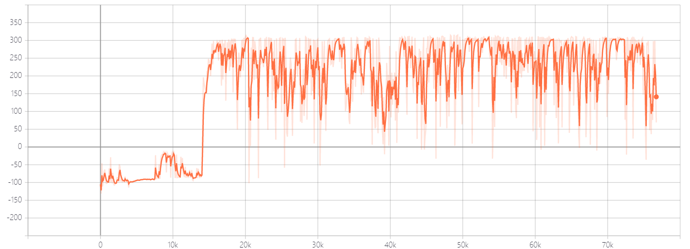

## BipedalWalker Environment

Bipedalwalker is a continuous action space environment in openAI gym. With 24 dim input and 4 dim action space.Reward is given for moving forward, total 300+ points up to the far end. If the robot falls, it gets -100. Applying motor torque costs a small amount of points, more optimal agent will get better score. State consists of hull angle speed, angular velocity, horizontal speed, vertical speed, position of joints and joints angular speed, legs contact with ground, and 10 lidar rangefinder measurements.

## Train BipedalWalker with DI-engine

DI-engine can achive 300+ return on average within 2000 episodes by TD3. The tuned example can be found in `dizoo/box2d/bipedalwalker/config/bipedalwalker_td3_config.py`. The training episode return is as follows.

