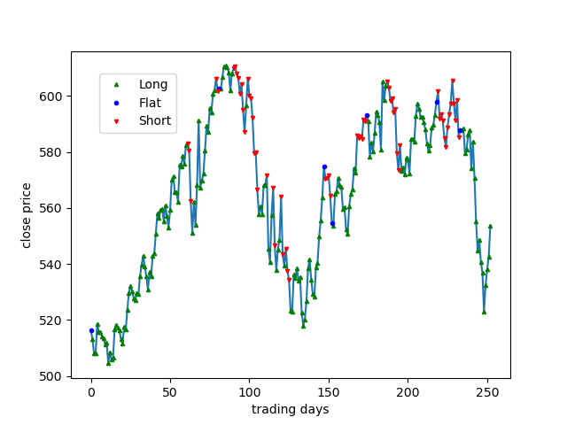
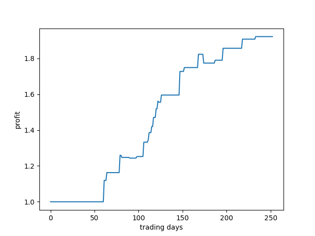

# DI-engine AnyTrading

AnyTrading is a collection of OpenAI Gym environments for reinforcement learning-based trading algorithms. 

Based on original gym-anytrading environment (you can see that at https://github.com/AminHP/gym-anytrading), there are lots of modifications done to improve the original environment.

In our environment, TradingEnv is an abstract environment which is defined to support all kinds of trading environments. StocksEnv, inheriting and extending TradingEnv, backtests the trading data of Google stock from 2009 to 2018.

## Environment Properties

The original design of gym-anytrading is quite simple, which aims at making the agent learn in a faster and more efficient way. However, we find that 
many defects of the original environment make it difficult to train agents, and the incomplete original environment is difficult to describe the real trading environment. Therefore, lots of modifications have been done. In the several following subsections, I will explain why these modifications are meaningful.

### State Machine
We use a state machine to describe how the TradingEnv interact with agent as well as how an agent make profits.

As shown below, the state machine use three kinds of trading positions and five (action "Hold" does not shown) kinds of trading actions to describe how the transaction goes over time.

### Trading Positions

Short:
    If the current env is in Short state, it means that the agent borrowed stocks from the securities companies.

Flat:
    If the current env is in Flat state, it means that the agent does not hold shares.

Long:
    If the current env is in Long state, it means that the agent has changed all the funds into stocks.

### Trading Actions

Double_Sell:
    means agent want sell all the stocks it holds as well as the stocks it borrows from securities companies.

Sell:
    means sell the stocks agent holds.

Hold:
    maintain current status.

Buy:
    means buy the stocks at current close price.

Double_Buy:
    means return shares to securities companies and exchange all the funds on hand for stocks at current close price.

### How did the profit and loss happen

If profit or loss occurs, it means that one of the following two cycles in state machine has occurred.

- buying long
  - Flat -> Long -> Flat
- short selling
  - Flat -> Short -> Flat

### Current Profit Calculation

According to the above definition, we can easily know that the formula of accumulative profit is: 

$\prod_{buying\ long}(r_{curr}/r_{pre}\ *\ cost) * \prod_{short\ selling}((2-r_{curr}/r_{pre})\ *\ cost)$

### Reward Function

Comparing the objective function ($\mathbb{E}_{\tau}\sum\ r$) in reinforcement learning and the formula of profit, we can get that the reward function is:

- buying long:
  - $log(close_{curr} / close_{pre})+log(cost)$
- short selling:
  - $log(2 - close_{curr} / close_{pre})+log(cost)$
- otherwise:
  - 0
  
so that maximize $\mathbb{E}_{\tau} \sum r$ 
is equivalent to maximize $\mathbb{E}_{\tau}[\prod_{buying\ long}(r_{curr}/r_{pre}\ *\ cost) + \prod_{short\ selling}((2-r_{curr}/r_{pre})\ *\ cost)]$

The experimental results show that such a definition is better than the original gym-anytrading accumulated reward function :$\sum(r_{curr} - r_{pre})$.
### Render Function

  As you see, you can use `render` method to plot the position and profit at one episode.
  
    
  - The position figure:
    - The x-axis of the position figure is trading days. In this case, it is 252 trading days.
    - The y-axis of the position figure is the closing price of each day.
    - Besides, the red inverted triangle, the green positive triangle and the blue circle represent the position of the agent every trading day respectively.
  

  - The profit figure:
    - Similarly, The x-axis of the profit figure is trading days. In this case, it is 252 trading days. (a pair of pictures keep the same time interval)
    - The y-axis of the profit figure is the profit of each day. 1.5 means the rate of return is 150%.
  

