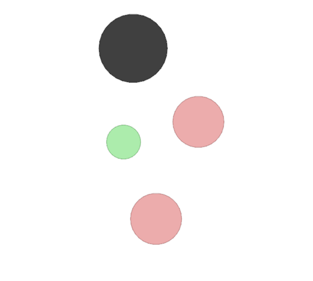
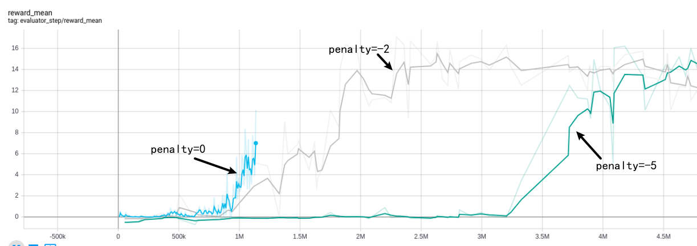
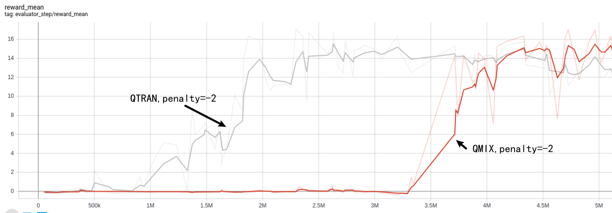
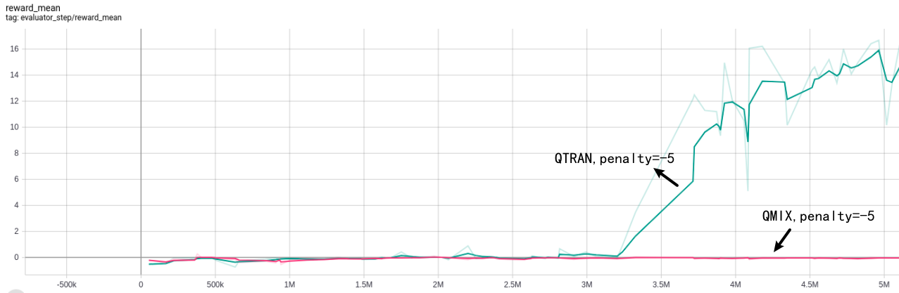

# Multi-Agent Particle

This environment is based on the openAI's work <https://github.com/openai/multiagent-particle-envs>, transplanted to DI-engine.

## QTRAN experiment

We also support a modified predator-prey environment as in [QTRAN](https://arxiv.org/abs/1905.05408) paper to evaluate the superiority of QTRAN than QMIX. The predators get a team reward of `10`, if two or more catch a prey at the same time, but they are given negative reward `−P`, when only one predator catches the prey. This setting requires a higher degree of cooperation.

             
Figure 1.  The modified predator-prey environment. Good agents (green) are faster and want to avoid being hit by adversaries (red). Adversaries are slower and want to hit good agents. Obstacles (large black circles) block the way. Positive reward is given only if multiple predators catch a prey simultaneously.
 

### Penalty

Figure 2 show that as the penalty term `P` increases gradually (from 0 to 2, 5), the reward obtained under the same environment step becomes smaller and smaller. We use QTRAN in this experiment.  The penalty=`-P`.

             
Figure 2. As the penalty term `P` increases gradually, the reward decreases. 
 

### QTRAN vs. QMIX

Qtran achieves better performance than QMIX at the same env step.

