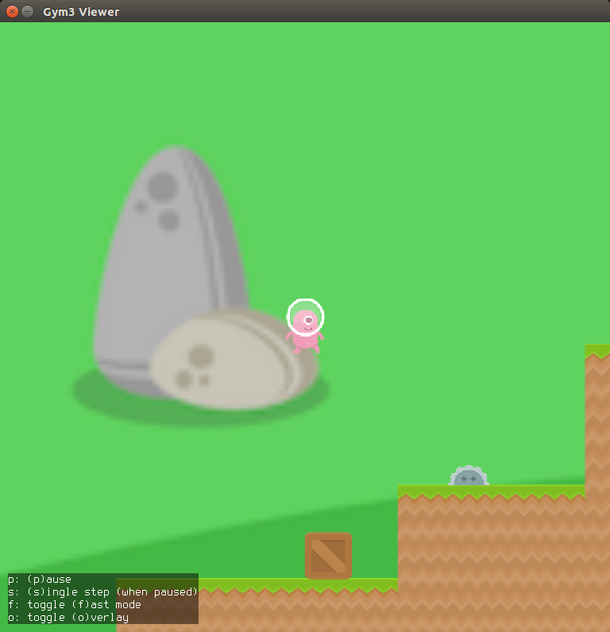
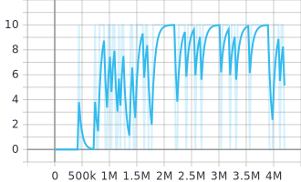
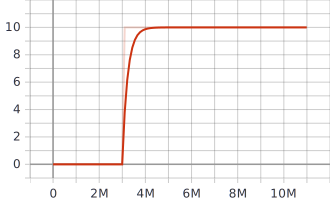
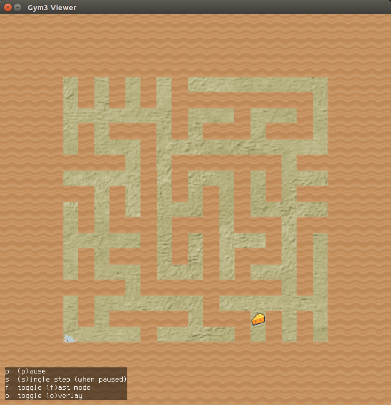
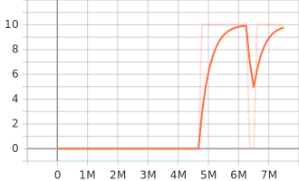

## Coinrun Environment

Coinrun is a simple platformer. The goal is to collect the coin at the far right of the level, and the player spawns on the far left. 
The player must dodge stationary saw obstacles, enemies that pace back and forth, and chasms that lead to death.
If coins are collected, 10 points will be awarded. If the player dies, or the game time exceeds the maximum allowable time, the game will end
Note that while the previously released version of CoinRun painted velocity information directly onto observations, the current version does not. This makes the environment significantly more difficult.
Procedural generation controls the number of platform sections, their corresponding types, the location of crates, and the location and types of obstacles.

## Train Coinrun with DI-engine

DI-engine can achive 10 return on average within 2M episodes by DQN. The tuned example can be found in `dizoo/procgen/entry/coinrun_dqn_config.py`. The training episode return is as follows.

DI-engine can achive 10 return on average within 2M episodes by PPO. The tuned example can be found in `dizoo/procgen/entry/coinrun_ppo_config.py`. The training episode return is as follows.

## Maze Environment

The player, a mouse, must navigate a maze to find the sole piece of cheese and earn a reward. The player may move up, down, left or right to navigate the maze.
If cheese are collected, 10 points will be awarded. If the game time exceeds the maximum allowable time, the game will end.
Procedural generation controls the level layout by generating mazes using Kruskal’s algorithm (Kruskal, 1956), uniformly ranging in size from 3x3 to 25x25.

## Train Maze with DI-engine

DI-engine can achive 10 return on average within 7M episodes by DQN. The tuned example can be found in `dizoo/procgen/entry/maze_dqn_config.py`. The training episode return is as follows.

