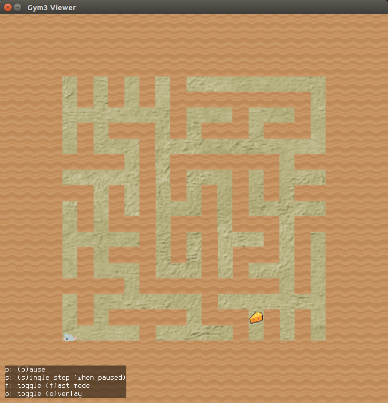
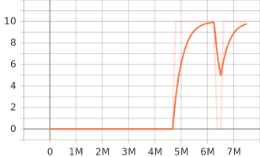

## Maze Environment

The player, a mouse, must navigate a maze to find the sole piece of cheese and earn a reward. The player may move up, down, left or right to navigate the maze.
If cheese are collected, 10 points will be awarded. If the game time exceeds the maximum allowable time, the game will end.
Procedural generation controls the level layout by generating mazes using Kruskal’s algorithm (Kruskal, 1956), uniformly ranging in size from 3x3 to 25x25.

## Train Maze with DI-engine

DI-engine can achive 10 return on average within 7M episodes by DQN. The tuned example can be found in `dizoo/procgen/maze/entry/maze_dqn_config.py`. The training episode reward is as follows.

