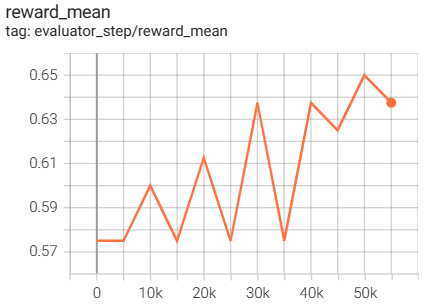

## TabMWP Env

## Dataset

The **TabMWP** dataset contains 38,431 tabular math word problems. Each question in **TabMWP** is aligned with a tabular context, which is presented as an image, semi-structured text, and a structured table. There are two types of questions: *free-text* and *multi-choice*, and each problem is annotated with gold solutions to reveal the multi-step reasoning process.

The environment is described in the paper [Dynamic Prompt Learning via Policy Gradient for Semi-structured Mathematical Reasoning](https://arxiv.org/abs/2209.14610) by Pan Lu, Liang Qiu, Kai-Wei Chang, Ying Nian Wu, Song-Chun Zhu, Tanmay Rajpurohit, Peter Clark, Ashwin Kalyan, 2023.

You can find more details in [Prompt PG](https://github.com/lupantech/PromptPG)

## Benchmark

- We collect the responses of GPT-3 using a reduced dataset with 80 training samples and 16 candidates. In this way, there is no need for users to interact with GPT-3 using the API-key of openai.
- You can directly reproduce the benchmark by running ``python dizoo/tabmwp/configs/tabmwp_pg_config.py``

