# 强化学习常用的游戏环境

对强化学习中游戏环境常规setting的一些调研，对于在科研论文中常用的小型环境（Atari等）只做简单介绍，主要调研一些中型的游戏环境。

## 科研论文中常用的基础环境

### OpenAI gym

**简介**

强化学习论文实验最常见的环境，包含**Atari游戏、Classic Control、Mujuco控制等**。

**接口**

安装：

```
pip3 install gym
pip3 install atari-py
```

使用：

```python
env = gym.make('envname')
ob, _ = env.reset()
ob, r, d, _ = env.step(action)
```

Mujuco环境需要在官网license认证。

### [OpenAI gym retro](https://github.com/openai/retro)

**简介**

OpenAI在gym的基础上加入了更多的游戏接入。在Atari之外，还支持任天堂和世嘉的一些游戏。一个经典的案例是OpenAI在2018年举办的[Sonic游戏迁移学习比赛](https://openai.com/blog/retro-contest/)，便是建立在Retro环境上。支持的游戏列表如下：

- Atari
  - Atari2600 (via Stella)
- NEC
  - TurboGrafx-16/PC Engine (via Mednafen/Beetle PCE Fast)
- Nintendo
  - Game Boy/Game Boy Color (via gambatte)
  - Game Boy Advance (via mGBA)
  - Nintendo Entertainment System (via FCEUmm)
  - Super Nintendo Entertainment System (via Snes9x)
- Sega
  - GameGear (via Genesis Plus GX)
  - Genesis/Mega Drive (via Genesis Plus GX)
  - Master System (via Genesis Plus GX)

由于涉及到游戏版权问题，retro只提供了无需商业授权的ROM用于游戏测试和智能体训练。列表如下：

- [the 128 sine-dot](http://www.pouet.net/prod.php?which=2762) by Anthrox
- [Sega Tween](https://pdroms.de/files/gamegear/sega-tween) by Ben Ryves
- [Happy 10!](http://www.pouet.net/prod.php?which=52716) by Blind IO
- [512-Colour Test Demo](https://pdroms.de/files/pcengine/512-colour-test-demo) by Chris Covell
- [Dekadrive](http://www.pouet.net/prod.php?which=67142) by Dekadence
- [Automaton](https://pdroms.de/files/atari2600/automaton-minigame-compo-2003) by Derek Ledbetter
- [Fire](http://privat.bahnhof.se/wb800787/gb/demo/64/) by dox
- [FamiCON intro](http://www.pouet.net/prod.php?which=53497) by dr88
- [Airstriker](https://pdroms.de/genesis/airstriker-v1-50-genesis-game) by Electrokinesis
- [Lost Marbles](https://pdroms.de/files/gameboyadvance/lost-marbles) by Vantage

其余游戏均需要自行下载ROM使用，可在[Archive.org](https://archive.org/details/No-Intro-Collection_2016-01-03_Fixed)下载，导入方式如下：

```python
python3 -m retro.import /path/to/your/ROMs/directory/
```

**接口**

安装：

```
pip3 install gym-retro
```

使用：

与openAI gym的接口保持一致。

### [Gridworld](https://github.com/Bigpig4396/Multi-Agent-Reinforcement-Learning-Environment)、[MiniGrid](https://github.com/maximecb/gym-minigrid)

**简介**

两个都是强化学习中讨论探索利用问题和多智能体问题常用的环境，即二维走迷宫探索环境，实现简单，且容易修改定制地图本身和目标任务。其中，Gridworld的部分环境支持多智能体环境，MiniGrid只有单智能体相关的环境。

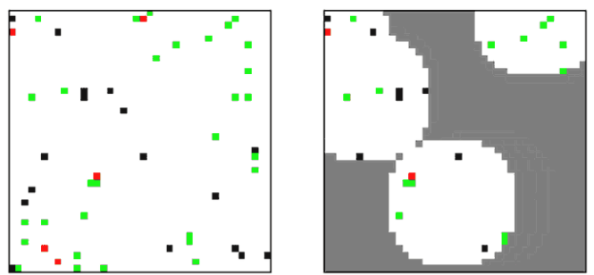

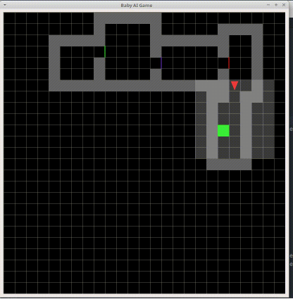

**接口**

安装：

GridWorld未提交pip包管理服务器，需要git到本地目录导入。

MiniGrid直接通过`pip3 install gym-minigrid`安装。

使用：

与openAI gym保持一致。

### [Multiagent Particle](https://github.com/openai/multiagent-particle-envs)

**简介**

在nerveX中已有实现。Particle为OpenAI为研究多智能体之间的合作、竞争、通讯开发的强化学习环境，智能体的数量和目标任务都可以自定义设置，可以创建超大量级的协作粒子数，本身为MADDPG论文使用的环境。与之类似的还有UCL汪军团队开发的[MAgent](https://github.com/geek-ai/MAgent)环境。


**接口**

安装：

均需要到连接中git源码，对于Particle：

```shell
pip install -e .
```

对于MAgent：

```shell
bash build.sh
```

使用：

与openAI gym保持一致。

### [ProcGen](https://openai.com/blog/procgen-benchmark/)

**简介**

在nerveX中已有实现。OpenAI开发的用于验证强化学习模型迁移和泛化能力的环境。包含16个不同类型的小游戏，每款游戏都有相似类型的不同地图，用于验证模型的知识迁移能力。（官方有PPO算法下200M的训练，有收敛保证）

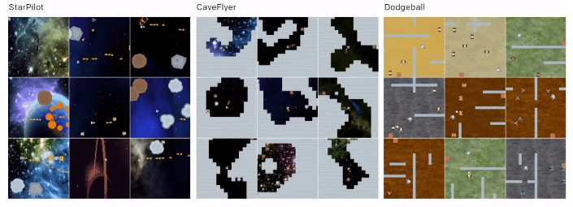

**接口**

安装：

```shell
pip3 install procgen
```

使用：

与openAI gym保持一致。

## 已有训练相关python接口的中型游戏环境

### [Malmo](https://github.com/Microsoft/malmo)（尚未跑通）

**简介**

Malmo是微软基于Minecraft开发的AI研究环境，本质上还是一个开放世界的环境，本身不涉及特定的任务。但可以在其上建立相对应的环境来实现任务设计，例如微软在17年在Malmo环境上做过合作抓猪的比赛，20年做了挖矿比赛。环境本身有和Java的Minecraft客户端直接通讯实现的版本，和python based的版本。与java通讯的版本可以使用较大量的原生Minecraft实例，但与gym API的不匹配情况也比较严重，纯python的版本可用的实例较少，但对于强化学习算法兼容性更好，且不需要编译java端的代码。

**接口**

安装：

在win10，Linux和MacOS均可以安装。按照[此链接](https://github.com/Microsoft/malmo/blob/master/scripts/python-wheel/README.md)在各个平台上安装。几个重要的依赖项：

- Java8 JDK（需将JAVA_HOME加入环境变量）
- git
- ffmpeg

也可以通过docker直接构建

### [Obstacle Tower](https://github.com/Unity-Technologies/obstacle-tower-env)

**简介**

基于Unity实现的一个类似三维魔塔的爬楼+解谜游戏。在AAAI 2020上被推出，并附有gym interface。控制的状态空间为图像，动作空间为离散，包括WSAD方向，KL左右转视角和Space跳跃七维。（官方有使用Rainbow的训练实现）


**接口**

安装：

- 下载[游戏渲染程序](https://github.com/Unity-Technologies/obstacle-tower-env#download-the-environment-optional)；
- git python工程源码并安装依赖项；

```shell
git clone git@github.com:Unity-Technologies/obstacle-tower-env.git
cd obstacle-tower-env
pip install -e .
```

- 将游戏程序的ObstacleTower文件夹复制到python工程目录下即可。

**使用**

```python
from obstacle_tower_env import ObstacleTowerEnv, ObstacleTowerEvaluation
env = ObstacleTowerEnv("./ObstacleTower/obstacletower")
env = ObstacleTowerEvaluation(env, seeds)
```

其余部分使用方式与openAI gym保持一致。

### [Torcs](https://link.zhihu.com/?target=https%3A//github.com/ugo-nama-kun/gym_torcs)

一个RL领域比较出名的赛车环境，应该在自动驾驶部门的同事都有尝试过。环境的输入为与现实情况比较接近的路侧距离等传感器信息或者图像信息，车辆本身的各项指标也都可定义，也提供了不同的地图供训练尝试。（官方有DDPG实现）

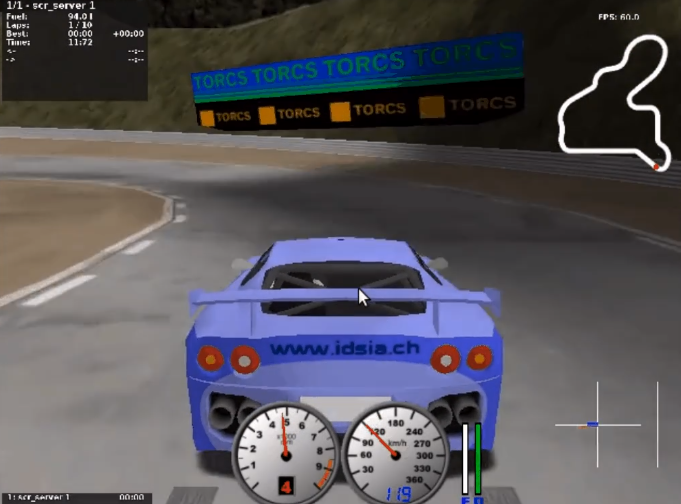

**接口**

安装：

仅在ubuntu环境下适用，需要安装依赖：

- [xautomation](http://linux.die.net/man/7/xautomation)
- gym
- [vtorcs-RL-color](https://github.com/giuse/vtorcs/tree/nosegfault)

特别的，如果不需要处理RGB，在ubuntu上只需要：

```shell
sudo apt-get install xautomation
```

然后安装：

```shell
pip3 install gym_torcs
```

需要渲染时，在不同平台需要安装对应的torcs软件。

使用：

```python
from gym_torcs import TorcsEnv
env = TorcsEnv(vision=True, throttle=False)
ob = env.reset(relaunch=True)  # with torcs relaunch (avoid memory leak bug in torcs)
from sample_agent import Agent
agent = Agent(1)  # steering only
action = agent.act(ob, reward, done, vision=True)
ob, reward, done, _ = env.step(action)
env.end()
```

基本与OpenAI gym保持一致。

### [DeepMind Lab](https://github.com/deepmind/lab) & [Hard Eight]()

**简介**

分别是DeepMind在IMPALA和R2D3论文中使用的环境，均为3D导航探索任务。

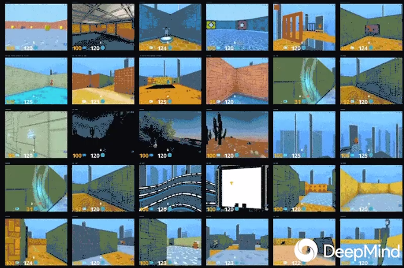

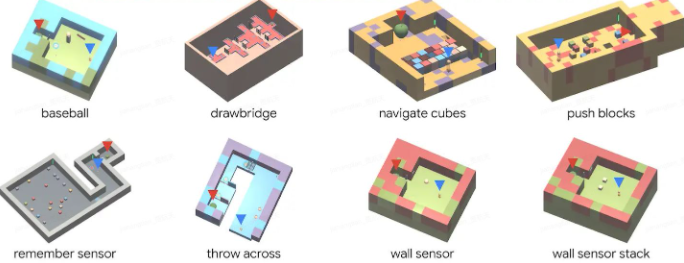

二者在官方github上都提供了简单的python接口安装方式。

### [VizDoom](https://github.com/mwydmuch/ViZDoom)

**简介**

VizDoom是一个经典的FPS游戏，也是在RL里做过比赛的游戏环境。仿真速度很快，对Win、Ubuntu和MacOS都可以支持，并支持自定义场景。

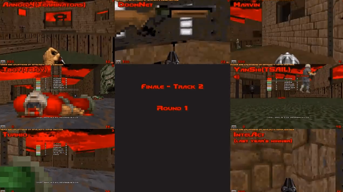

**接口**

安装：

```shell
sudo apt install cmake libboost-all-dev libsdl2-dev libfreetype6-dev libgl1-mesa-dev libglu1-mesa-dev libpng-dev libjpeg-dev libbz2-dev libfluidsynth-dev libgme-dev libopenal-dev zlib1g-dev timidity tar nasm
pip install vizdoom
```

使用：

与openAI gym形式上相近，但细节稍有不同：

```python
from vizdoom import *
import random
import time

game = DoomGame()
game.load_config("vizdoom/scenarios/basic.cfg")
game.init()

shoot = [0, 0, 1]
left = [1, 0, 0]
right = [0, 1, 0]
actions = [shoot, left, right]

episodes = 10
for i in range(episodes):
    game.new_episode()
    while not game.is_episode_finished():
        state = game.get_state()
        img = state.screen_buffer
        misc = state.game_variables
        reward = game.make_action(random.choice(actions))
        print "\treward:", reward
        time.sleep(0.02)
    print "Result:", game.get_total_reward()
    time.sleep(2)
```

由于举办过VizDoom的比赛，因此相关的实例和一些算法的参考实现相对充足，可以参见[tutorial](http://vizdoom.cs.put.edu.pl/tutorial)。

### [Pommerman](https://www.pommerman.com/)

**简介**

经典炸弹人小游戏，也是Nips2018竞赛的环境。涉及到了强化学习可能面对的探索利用、部分可观、多智能体和资源利用等多方面的问题。通常的版本为四个智能体，可以分别指定各个智能体使用的策略已进行自搏等训练。除了官方实现外，还有很多可以参考的a2c、ppo实现。

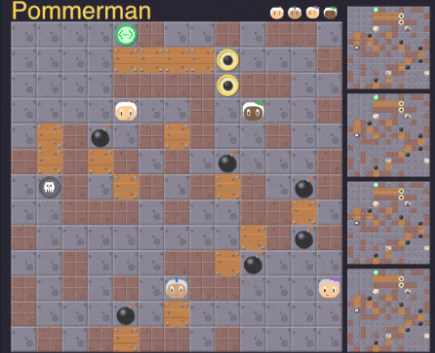

**接口**

安装：

```shell
git clone https://github.com/MultiAgentLearning/playground ~/playground
cd ~/playground
pip install -U .
```

使用：

```python
import pommerman
from pommerman import agents
def main():
    agent_list = [
        agents.SimpleAgent(),
        agents.RandomAgent(),
        agents.SimpleAgent(),
        agents.RandomAgent(),
        # agents.DockerAgent("pommerman/simple-agent", port=12345),
    ]
    # Make the "Free-For-All" environment using the agent list
    env = pommerman.make('PommeFFACompetition-v0', agent_list)
    # Run the episodes just like OpenAI Gym
    for i_episode in range(1):
        state = env.reset()
        done = False
        while not done:
            env.render()
            actions = env.act(state)
            state, reward, done, info = env.step(actions)
        print('Episode {} finished'.format(i_episode))
    env.close()
```

与openAI gym类似，但由于是多智能体环境，需要指定每个智能体的策略。

### [Quake III Arena Capture the Flag](https://github.com/deepmind/lab)

**简介**

经典游戏雷神之锤夺旗竞技场地图，本身也是集成在DeepMind Lab下的环境。游戏分为两队，每队有两个智能体，在不同的地图中以第一人称视角进行夺旗游戏。因为DeepMind在这个环境上做训练的成果发在了[Science](https://deepmind.com/blog/article/capture-the-flag-science)上，因此比较出名。DeepMind在这里用了population based的训练方法，在延迟0.26秒的反应时间前提下获得了超越人类玩家的智能体。训练框架仅在linux下可用。

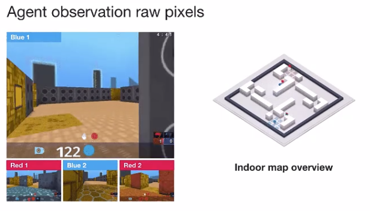

**接口**

安装：

- 安装[bazel](https://docs.bazel.build/versions/master/install.html)
- git Deepmind提供的python框架源码`git clone https://github.com/deepmind/lab`
- 在`/lab/python/pip_package`中`pip install -e .`安装相关依赖包

使用：

提供了直接作为玩家接入的模式和智能体训练模式。对于后者，可以参考[官方实例](https://github.com/deepmind/lab/blob/master/python/random_agent.py)。用法与上面的pommerman接近，需选定agent和env类型。

### [Google Research Football](https://github.com/google-research/football)

**简介**

这个环境是 google 基于之前某个足球小游戏的环境进行改动和封装出来的，主要可以分为 11v11 single-agent 场景（控制一个 active player 在 11 名球员中切换）和 5v5 multi-agent 场景（控制 4 名球员 + 1 个守门员）。该环境支持 self-play，有三种难度内置 AI 可以打。游戏状态基于 vector 的主要是球员的坐标 / 速度 / 角色 / 朝向 / 红黄牌等，也可以用图像输入，动作输出有二十多维，包括不同方向 / 长短传 / 加速等。是Google在Kaggle上举办过比赛的环境，实际会面对RL中的多智能体、稀疏奖励等多种问题。环境训练本身支持Linux和MacOS。

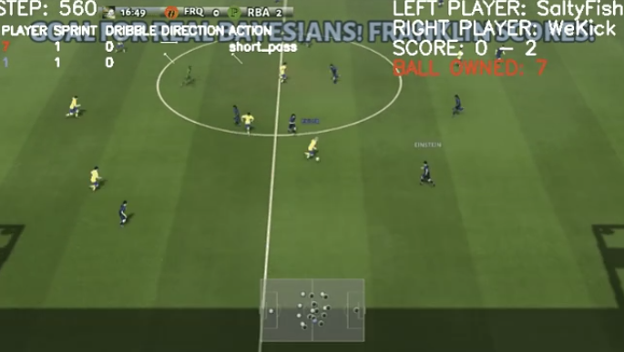

**接口**

安装：

```shell
sudo apt-get install git cmake build-essential libgl1-mesa-dev libsdl2-dev \
libsdl2-image-dev libsdl2-ttf-dev libsdl2-gfx-dev libboost-all-dev \
libdirectfb-dev libst-dev mesa-utils xvfb x11vnc libsdl-sge-dev python3-pip
python3 -m pip install --upgrade pip setuptools psutil
python3 -m pip install gfootball
```

使用：

官方有内建的tensorflow实例，并使用openAI baseline来训练。因此整个交互框架与openAI gym相同。

```python
import gfootball.env as football_env
env = football_env.create_environment(env_name="academy_empty_goal_close", stacked=False, logdir='/tmp/football', write_goal_dumps=False, write_full_episode_dumps=False, render=False)
env.reset()
steps = 0
while True:
  obs, rew, done, info = env.step(env.action_space.sample())
  steps += 1
  if steps % 100 == 0:
    print("Step %d Reward: %f" % (steps, rew))
  if done:
    break
print("Steps: %d Reward: %.2f" % (steps, rew))
```

### [Neural MMOs](https://github.com/openai/neural-mmo)

**简介**

OpenAI开源的大型MultiAgent环境，在非常大的地图中设定有限资源。也因为地图非常大，对IO开销非常大。

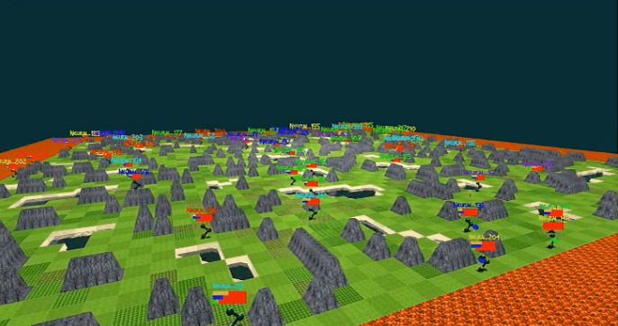

**接口**

安装：

```shell
git clone https://github.com/jsuarez5341/neural-mmo-client
cd neural-mmo-client
bash setup.sh
cd ..

git clone https://github.com/openai/neural-mmo
cd neural-mmo
bash scripts/setup/setup.s
```

使用：

```shell
python Forge.py --render #Run the environment with rendering on
```

```python
from forge.trinity import smith
envs = smith.VecEnv(config, args, self.step)

#The environment is persistent: call reset only upon initialization
obs = envs.reset()

#Observations contain entity and stimulus
#for each agent in each environment.
actions = your_algorithm_here(obs)

#The environment is persistent: "dones" is always None
#If an observation is missing, that agent has died
obs, rewards, dones, infos = envs.step(actions)
```

### [Fever Basketball](https://github.com/FuxiRL/FeverBasketball)

**简介**

网易伏羲开源的潮人篮球游戏，支持1v1，2v2，3v3环境，提供内置不同难度的AI，支持self-play。

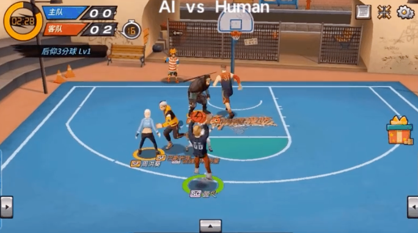

**接口**

安装：

- 安装python工程文件。

```shell
git clone https://github.com/FuxiRL/FeverBasketball.git
pip3 install -r requirements.txt
```

- 下载[游戏客户端](https://pan.baidu.com/share/init?surl=visZLh5QEXqQakdVOlPqhg)

使用：

环境并未用gym的形式进行封装，而是以socket通信的方式与windows客户端程序进行交互来实现step和observe。网易伏羲官方提供了几种RL算法包括PPO、QMIX等的实现（未调）。