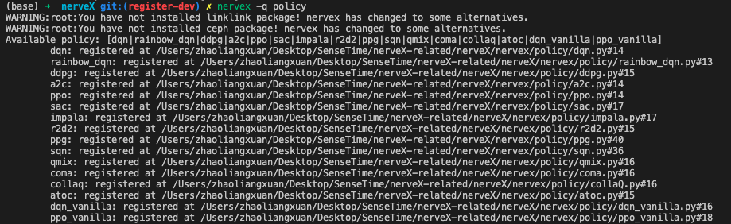

Best Practice
~~~~~~~~~~~~~~~

1. 如何给算法添加priority
=========================

1. config设置\ ``use_priority``

   .. code:: python

      policy=dict(
          ...,
          use_priority=True,
          ...,
      )

2. 使用priority

   -  replay
      buffer会默认根据priority进行采样（\ ``use_priority=False``\ ，replay
      buffer内部\ ``priority=1.0``\ ）

   -  replay
      buffer会给数据dict添加一项数据\ ``IS``\ ，需要将其乘在loss计算的最后（每个样本一个值）

      .. code:: python

         import torch.nn.functional as F

         # output: (B, ), target: (B, )
         # not use IS
         loss = F.mse_loss(output, target)
         # use IS
         loss = (F.mse_loss(output, target, reduction='none') * data['IS']).mean()
         # nervex td error(data['weight'] = data['IS'], assigned in policy._data_preprocess_learn method)
         data_n = q_nstep_td_data(
           q_value, target_q_value, data['action'], target_q_action, reward, data['done'], data['weight']
         )
         loss, td_error_per_sample = q_nstep_td_error(data_n, self._gamma, nstep=self._nstep)

3. 更新priority

   将要更新的\ ``priority``\ 值作为\ ``_forward_learn``\ 方法返回值的一个键值对，键必须是\ ``priority``\ ，值必须是\ ``list``\ ，且长度等于batch_size

   .. code:: python

      loss, td_error_per_sample = q_nstep_td_error(data_n, self._gamma, nstep=self._nstep)
      return {
          'total_loss': loss.item(),
          'priority': td_error_per_sample.abs().tolist(),
      }

4. A-pex相关

   -  ``policy``\ 的\ ``_forward_collect``\ 方法中也计算priority，并作为键值对返回出去

   -  ``policy``\ 的\ ``_process_transition``\ 方法中将\ ``armor_output``\ 中的\ ``priority``\ 放入返回数据中，加入buffer后会自动作为初始值

      .. code:: python

         def _process_transition(self, obs: Any, armor_output: dict, timestep: namedtuple) -> dict:
            transition = {
               'obs': obs,
               'next_obs': timestep.obs,
               'action': armor_output['action'],
               'priority': armor_output['priority'],
               'reward': timestep.reward，
               'done': timestep.done,
            }
            return EasyDict(transition)

   
   -  对于A-pex中的多个Actor使用不同的探索策略，目前仅支持在nervex
      parallel入口实现，需要给每一个actor task设定相关参数

5. 更改priority采样的相关参数

   .. code:: python

      replay_buffer=dict(
          buffer_name=['agent'],
          agent=dict(
              meta_maxlen=4096,
              max_reuse=16,
              alpha=0.6,
              beta=0.4,
              # sample step count
              anneal_step=0,
          )
      )

.. _header-n21:

2. 使用 multi discrete action space
=======================================

1. 环境空间定义

   .. code:: python

      # 3 crossing
      # action dim: {'htxdj_wjj': 2, 'haxl_wjj': 2, 'haxl_htxdj': 3}
      logit_shape = [torch.Size([4, 2]), torch.Size([4, 2]), torch.Size([4, 3])]
      action_shape = [torch.Size([4]), torch.Size([4]), torch.Size([4])]

2. 中间数据处理操作

   -  多个环境的数据合成batch来inference

   -  合成batch inference之后拆分对应每个环境，组装成一个个transition

   -  训练前多个样本组装成一个batch

      .. code:: python

         from nervex.data import default_collate, default_decollate

         # list, dict, tuple, scalar, np.ndarray, torch.Tensor
         split_data = [torch.randn(4) for _ in range(8)]
         batch = default_collate(split_data)
         assert batch.shape == (8, 4)
         split_data = default_decollate(batch)

3. forward_learn（多次调用，每次是一个标准的计算过程）

   .. code:: python

      tl_num = len(q_value)
      loss = []
      for i in range(tl_num):
          td_data = q_1step_td_data(
              q_value[i], target_q_value[i], data['action'][i], next_act[i], data['reward'], data['done'],
              data['weight']
          )
          loss.append(q_1step_td_error(td_data, self._gamma))
          loss = sum(loss) / (len(loss) + 1e-8)

.. _header-n32:

3. RNN适配
==========

1. 隐状态维护

   使用\ ``HiddenStatePlugin``\ 来进行维护

   .. code:: python

      from typing import Any
      from nervex.armor import Armor

      # create plugin
      model: torch.nn.Module
      batch_size = 8
      armor = Armor(model)
      armor.add_model('target', update_type='assign', update_kwargs={'freq': 500})
      armor.add_plugin('main', 'hidden_state', state_num=batch_size)
      armor.add_plugin('target', 'hidden_state', state_num=batch_size)

      # reset state
      init_state: Any
      armor.reset(data_id=None, state=init_state)
      output1 = armor.forward(inputs1)
      output2 = armor.forward(inputs2)
      # reset the state of sample0 with init_state[1]
      armor.reset(data_id=[0], state=init_state[1])
      output3 = armor.forward(inputs3)

2. actor->learner传递数据

   注册能够返回当前帧输入state的plugin

   .. code:: python

      from nervex.armor import Armor

      armor = Armor(model)
      # indicate save_prev_state=True
      armor.add_plugin('main', 'hidden_state', state_num=env_num, save_prev_state=True)
      init_state: Any
      armor.reset(data_id=None, state=init_state)
      output = armor.forward(inputs)
      prev_state = output['prev_state']
      assert isinstance(list, prev_state) and len(prev_state) == env_num

   同样在policy的\ ``_process_transition``\ 方法中添加prev_state即可

3. learner数据组装

   使用timestep_collate

   .. code:: python

      from nervex.data import timestep_collate

      timestep_batch = timestep_collate(data)
      # timestep_batch: (T, B, *)

4. burnin

   参考policy/r2d2.py的learn部分

.. _header-n318:

4. learner日志中添加变量
=========================

1. 傻瓜用法

   ``Policy`` 抽象基类中会默认包含两个变量 ``['cur_lr', 'total_loss']``，若有其他需要打印的变量，只需要修改两处：
   
   1. 在 ``Policy`` 的 ``_monitor_vars_learn`` 方法的返回值中额外加入 **变量名** 。如 PPO ：

      .. code:: python

         def _monitor_vars_learn(self) -> List[str]:
            return super()._monitor_vars_learn() + [
                  'policy_loss', 'value_loss', 'entropy_loss', 'adv_abs_max', 'approx_kl', 'clipfrac'
            ]
      
   2. 在 ``Policy`` 的 ``_forward_learn`` 方法的返回值中，以 dict 的形式返回 {变量名: 变量值} **键值对** 。如 PPO ：

      .. code:: python
         
         def _forward_learn(self, data: dict) -> Dict[str, Any]:

            # ...
            # ====================
            # PPO update
            # ====================
            # ...
            return {
                  'cur_lr': self._optimizer.defaults['lr'],
                  'total_loss': total_loss.item(),
                  'policy_loss': ppo_loss.policy_loss.item(),
                  'value_loss': ppo_loss.value_loss.item(),
                  'entropy_loss': ppo_loss.entropy_loss.item(),
                  'adv_abs_max': adv.abs().max().item(),
                  'approx_kl': ppo_info.approx_kl,
                  'clipfrac': ppo_info.clipfrac,
            }
      
   .. note::

      在 nerveX 中，使用 ``LoggedModel`` 模块对变量进行追踪，保存一定时间滑动窗口内的值，
      并在窗口内进行一定操作（主要为各种统计量，如取平均值做平滑操作，取最大最小值等）。
      （有兴趣的可以具体查看其 `文档 <../feature/autolog_overview.html>`_ 了解更多内容）

      这些操作中，最常见、常用的就是 **取平均** ，我们也对所有 scalar 类型的变量（指 int, float 等标量）
      默认进行了取平均的操作，并打印在 tensorboard logger 中。
      （为了保持终端与 log 文件的简洁性，在 text logger 中，我们没有打印平均值，而只打印了瞬时值。）

2. 不定期出现的变量

   不定期出现的变量，指并非 policy 的每次 forward 都会返回的变量，它们可能每隔 n 个 iteration 才会计算并返回一次。
   其在使用上和傻瓜用法 **没有任何区别** ，都需要在 ``_monitor_vars_learn`` 中声明，并在需要的时候在 ``_forward_learn`` 中返回。

   但由于 nerveX 中 ``LoggedModel`` 是固定步长的滑动窗口，就会导致不定期出现的变量的窗口内操作，和其他定期出现的变量间存在 **微小的差异** 。
   例如 PPG：

      .. code:: python

         def _forward_learn(self, data: dict) -> Dict[str, Any]:

            # ...
            # =============
            # PPG update
            # =============
            # ...
            if self._train_step % self._cfg.learn.algo.aux_freq == 0:
               aux_loss, bc_loss, aux_value_loss = self.learn_aux()
               return {
                  # ...
                  'aux_value_loss': aux_value_loss,
                  'auxiliary_loss': aux_loss,
                  'behavioral_cloning_loss': bc_loss,
               }
            else:
               return {
                  # ...
               }
      
      PPG 中 ``['aux_value_loss', 'auxiliary_loss', 'behavioral_cloning_loss']`` 这三个变量，
      每 ``self._cfg.learn.algo.aux_freq`` 次 forward 才会返回一次（为了方便，假定为每 5 次吧）。
      其他变量，如 ``'total_loss'`` 每次 forward 都会返回。
      
      ``LoggedModel`` 会在每次 forward 后递进一个时间步，但其时间窗口是固定长度的，假设为 10 次时间步。
      这就导致 ``'total_loss'`` 的取平均，是对 10 次 forward 的返回值取平均；
      而 ``'aux_value_loss'`` 的取平均，仅对 10 / 5 = 2 次 forward 的返回值取平均。

3. 深度定制化用法

   1. ``LoggedModel`` 统计量定制

      上文讲到 ``LoggedModel`` 默认对 scalar 类型的变量进行取平均的操作，如果需要进行其他类型的操作，
      可以参考 `buffer <../api_doc/data/structure.html#buffer>`_  中的 ``OutTickMonitor``，
      修改 `base learner <../api_doc/worker/learner/learner.html#base-learner>`_ 中的 ``TickMonitor``。
      主要注意 ``__register`` 方法中 ``__max_func`` 这类函数的实现，并记得注册 attribute（如 ``priority``） 的 property（如 ``max`` ``min``）。

      .. code:: python

         class OutTickMonitor(LoggedModel):
            out_time = LoggedValue(float)
            priority = LoggedValue(float)
            # ...

            def __init__(self, time_: 'BaseTime', expire: Union[int, float]):  # noqa
               LoggedModel.__init__(self, time_, expire)
               self.__register()

            def __register(self):

               def __avg_func(prop_name: str) -> float:
                     records = self.range_values[prop_name]()
                     _list = [_value for (_begin_time, _end_time), _value in records]
                     return sum(_list) / len(_list)

               def __max_func(prop_name: str) -> Union[float, int]:
                     records = self.range_values[prop_name]()
                     _list = [_value for (_begin_time, _end_time), _value in records]
                     return max(_list)

               def __min_func(prop_name: str) -> Union[float, int]:
                     records = self.range_values[prop_name]()
                     _list = [_value for (_begin_time, _end_time), _value in records]
                     return min(_list)

               self.register_attribute_value('avg', 'out_time', partial(__avg_func, prop_name='out_time'))
               self.register_attribute_value('avg', 'priority', partial(__avg_func, prop_name='priority'))
               self.register_attribute_value('max', 'priority', partial(__max_func, prop_name='priority'))
               self.register_attribute_value('min', 'priority', partial(__min_func, prop_name='priority'))
               # ...

   2. Scalar类型之外的变量（如Histogram）

      对于要在 tensorboard logger 中打印的变量，我们都默认为 Scalar 类型，若有其他类型的打印需求，
      需要在 ``Policy`` 的 ``_forward_learn`` 方法的返回值中特别标明。
      
      例如，针对离散的动作，我想打印一个 batch 中的分布情况，需要修改的地方为：

      .. code:: python

         def _forward_learn(self, data: dict) -> Dict[str, Any]:

            # ...
            # =============
            # after update
            # =============
            # ...
            return {
                  # ...
                  '[histogram]action_distribution': data['action'],
            }

      dict 中键的命名方式为 ``'[VAR-TYPE]VAR-NAME'``，用 ``'[]'`` 来标示变量类型。

      .. note::

         由于 learner 部分代码使用中括号来分割变量类型与变量名，所以除了标示变量类型这一目的之外，变量名字中 **不要含有** ``]`` **符号！！**

.. _header-n74:

5. 定制化优化器
===============

1. 更换优化器

   ``nerveX`` 框架中 ，由 ``policy`` 类中的 ``_init_learn`` 方法进行优化器的初始化：
   
   .. code:: python

      def _init_learn(self) -> None:
         r"""
         Overview:
            Learn mode init method. Called by ``self.__init__``.
            Init optimizers, algorithm config, main and target armors.
         """
         # init optimizer
         self._optimizer = Adam(
            self._model.parameters(),
            lr=self._cfg.learn.learning_rate_actor,
            weight_decay=self._cfg.learn.weight_decay
         )
   
   如需对优化器进行更换，只需修改对应算法 ``policy`` 类 ``_init_learn`` 方法中的对应代码即可。

   此外，``nerveX`` 框架中对优化器进行了重写，在继承了 ``torch.optim`` 类的前提下实现了一些特定的梯度操作。
   具体代码可以参考 ``nervex\torch_utils\optimizer_helper.py`` 。 在实际使用时，可以根据需要直接使用 ``torch`` 自带优化器或重写后的优化器。

2. 多个优化器 or hook

   某些算法的神经网络可能由多个部分组成，如 ``DDPG`` 算法的网络就由 ``actor`` 和 ``critic`` 两部分构成。 
   
   在更新某一部分神经网络的参数时，可能需要另一部分网络的对应输出，但不希望另一部分的网络参数因此更新；如 ``DDPG`` 算法在更新 ``actor`` 部分的网络时loss需要根据 ``critic`` 进行计算，但不希望 ``cirtic`` 的梯度更新。

   此时，我们可以使用多个优化器，分别对神经网络的不同组成部分进行更新，以 ``DDPG`` 算法为例，在 ``_init_learn``  方法中初始化了多个优化器：

   .. code:: python

      def _init_learn(self) -> None:
         r"""
         Overview:
            Learn mode init method. Called by ``self.__init__``.
            Init actor and critic optimizers, algorithm config, main and target armors.
         """
         # actor and critic optimizer
         self._optimizer_actor = Adam(
            self._model.actor.parameters(),
            lr=self._cfg.learn.learning_rate_actor,
            weight_decay=self._cfg.learn.weight_decay
         )
         self._optimizer_critic = Adam(
            self._model.critic.parameters(),
            lr=self._cfg.learn.learning_rate_critic,
            weight_decay=self._cfg.learn.weight_decay
         )
         # ...

   
   在 ``_forward_learn`` 时 ``actor`` 和 ``critic`` 分别根据对应loss和优化器进行更新:

   .. code:: python

      def _forward_learn(self, data: dict) -> Dict[str, Any]:
         # ...
         # cirtic_forward get the critic_loss
         # compute critic_loss

         # critic update
         # ================
         self._optimizer_critic.zero_grad()
         cirtic_loss.backward()
         self._optimizer_critic.step()

         # actor_forward get the actor_loss
         # compute actor_loss

         # actor update
         # ================
         self._optimizer_actor.zero_grad()
         actor_loss.backward()
         self._optimizer_actor.step()
         # ...

   此外，对 ``torch`` 机制更熟悉的使用者可以使用在神经网络中设定梯度相关的 ``backward_hook`` 的方式对神经网络的不同组成部分进行更新，但此种方式的实现逻辑相对复杂，对使用者的要求更高。

3. grad clip/ignore
   
   许多算法/论文中，都对某些情况下的梯度进行了裁剪或忽略操作，即 ``grad_clip`` 和 ``grad_ignore`` 操作。
   这些操作自然可以在 ``_forward_learn`` 方法中调用对应函数完成，如：

   .. code:: python

      from torch.nn.utils import clip_grad_norm

      # ...

      optimizer.zero_grad()
      loss.backward()
      clip_grad_norm(model.parameters(), clip_value)
      optimizer.step()
   
   但有些相对复杂的梯度操作需要用到优化器中的梯度相关信息，因此较为方便的实现方式即为在优化器内实现对应的梯度操作。
   为此，我们在 ``nervex\torch_utils\optimizer_helper.py`` 中根据梯度操作对优化器进行了重写，方便使用。
   如需在 ``Adam`` 优化器中使用最简单的梯度裁剪时，只需在初始化时对grad_clip操作进行定义：

   .. code:: python

      from nervex.torch_utils.optimizer_helper import Adam

      # ...
      self._optimizer = Adam(
         self._model.parameters(),
         lr=self._cfg.learn.learning_rate_actor,
         weight_decay=self._cfg.learn.weight_decay,
         grad_clip_type='clip_value',
         clip_value=clip_value,
      )
   
   之后在进行 optimizer.step() 操作时会自动对梯度进行裁剪。

   除了简单的按数值进行梯度裁剪/忽略外，重写后的优化器还支持其他梯度操作。
   支持的操作包括:
      
   1. ``clip_value`` and ``ignore_value`` ：根据梯度值进行简单的clip/ignore操作
      
   2. ``clip_momentum`` and ``ignore_momentum`` ：根据历史动量进行clip/ignore操作，源自openAI dota2论文附录部分

      .. image:: grad_momentum.png
         :scale: 100 %

   3. ``clip_norm`` and ``ignore_norm`` : 根据梯度值范数进行clip/ignore操作

   4. ``clip_momentum_norm`` and ``ignore_momentum_norm`` : 根据历史动量的范数进行clip/ignore操作

   具体实现可以查看源码 ``nervex/torch_utils/optimizer_helper.py`` 或参考 ``nervex/torch_utils/tests/test_optimizer.py`` 测试文件中的使用方式。

6. 模块的Registry机制
=======================

在 nerveX 中，为了可以方便地使用 config 文件启动训练任务，我们 **建议** 对于自己实现的一些模块，利用 ``Registry`` 机制进行注册。

目前支持的模块包括：
   - policy
   - env
   - learner
   - comm_learner
   - actor
   - comm_actor
   - commander
   - league
   - player

下面以 ``Policy`` 为例，讲解 ``Registry`` 的使用方法。

   1.  自定义 ``Policy`` 类，然后添加注册器

   .. code:: python
      
      from nervex.utils import POLICY_REGISTRY

      @POLICY_REGISTRY.register('dqn')
      class DQNPolicy(CommonPolicy):
         pass

   2.  在 config 里指明所需要创建的 ``Policy`` 的名字及文件路径

   .. code:: python

      policy=dict(
         policy_type='dqn',
         import_names=['app_zoo.sumo.policy.sumo_dqn'],
         # ...
      )

   若用户仔细阅读源码，会发现若使用在 nerveX 核心代码（指 ``nervex/`` 路径下）中实现的 ``Policy``（例如DQN PPO等），
   在 config 中没有指明 ``import_names``。但若是用户自行实现的 ``Policy``，则 **必须指明** ``import_names``。

   3. 使用时通过系统函数创建

   经过上述过程，自行实现的 ``Policy`` 已经被注册到了系统之中。使用 nerveX 提供的函数就可以进行创建了。

   .. code:: python
      
      from nervex.policy import create_policy

      cfg: dict
      dqn_policy = create_policy(cfg.policy)

此外，可以通过nervex -q <registry name> 来查看在 nerveX 核心代码中已经注册的模块，例如：

