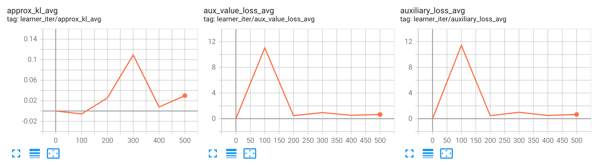

How to correctly print irregular log?
================================================

Each policy's ``_forward_learn`` method will return some related dict type info to learner in every iteration, then learner will print the info afterwards.
However, the return info dict does not always have the same keys: `Phasic Policy Gradient <https://arxiv.org/pdf/2009.04416.pdf>`_'s auxiliary loss and `TD3 <https://arxiv.org/pdf/1802.09477.pdf>`_'s actor loss will be calculated at some intervals. For example, in `PPG`, auxiliary losses will be calculated every ten iterations. So in continuous ten iteration, nine will only have basic info, and the left one will have extra auxiliary loss info.

How to print them in nerveX? (User view)
^^^^^^^^^^^^^^^^^^^^^^^^^^^^^^^^^^^^^^^^^

In nerveX, it is permitted to only return some keys in some iterations' info dict. And you can print them just as basic info.

But you must make sure that, in policy's method ``_monitor_vars_learn``, you must list **all** keys that may appear in info dict, no matter they appear in every iteration, or appear periodically. Then learner can utilize sliding window average to print variable's correct value.

Here is an example from PPG.

Auxiliary losses be calculated every `self._cfg.learn.aux_freq` iterations.

.. code:: python

    def _forward_learn(self, data: dict) -> Dict[str, Any]:
        if self._train_iteration % self._cfg.learn.aux_freq == 0:
            aux_loss, bc_loss, aux_value_loss = self.learn_aux()
            return {
                # ...
                'aux_value_loss': aux_value_loss,
                'auxiliary_loss': aux_loss,
                'behavioral_cloning_loss': bc_loss,
            }
        else:
            return {
                # ...
            }

You should list those three losses' names in method ``_monitor_vars_learn``.

.. code:: python

    def _monitor_vars_learn(self) -> List[str]:
        return [
            # ...
            'aux_value_loss',
            'auxiliary_loss',
            'behavioral_cloning_loss',
        ]

Here is a tensorboard example:

``approx_kl`` is a basic info that appears in every iteration; ``aux_value_loss`` and ``auxiliary_loss`` is a periodic info, its frequency is 10 iterations.
In nerveX learner, every variable is averaged in a sliding window, so we can notice that in tensorboard, these three variables are ``approx_kl_avg``, ``aux_value_loss_avg`` and ``auxiliary_loss_avg``.

.. note::

    The sliding window has a fixed length, for example, 20 iterations. Basic variable like ``approx_kl_avg`` is averaged over 20 values, while periodic variable like ``aux_value_loss_avg`` is averaged over only 2 values.

.. tip::

    Since ``aux_value_loss`` is calculated every 10 iterations. You should make sure that your sliding window size is larger than 10; Otherwise ``aux_value_loss`` might always be 0 in tensorboard.

How does nerveX do that? (Developer view)
^^^^^^^^^^^^^^^^^^^^^^^^^^^^^^^^^^^^^^^^^^^
In this section, we will introduce how nerveX record variables to the sliding window, and how nerveX print averaged variables to logger.
You can skip it if not interested.

In nerveX, learner get info dict from policy's ``_forward_learn`` method. Then, learner will call ``LogShowHook``(``nerveX/nervex/worker/learner/learner_hook.py``) to record those variables in a ``TickMonitor``(``nerveX/nervex/worker/learner/base_learner.py``).

.. code:: python

    class LogShowHook(LearnerHook):

        # ...

        def __call__(self, engine: 'BaseLearner') -> None:  # noqa
            # ...
            for k, v in engine.log_buffer['scalar'].items():
                setattr(engine.monitor, k, v)
            engine.monitor.time.step()

After that, ``LogShowHook`` will print variables. ``LogShowHook`` will call policy's ``_monitor_vars_learn`` method to get all variables' names, then get averaged value from ``TickMonitor`` and print them in text logger and tensorboard logger.

.. code:: python

    class LogShowHook(LearnerHook):

        # ...

        def __call__(self, engine: 'BaseLearner') -> None:  # noqa
            # ...
            iters = engine.last_iter.val
            if iters % self._freq == 0:
                var_dict = {}
                log_vars = engine.policy.monitor_vars()
                attr = 'avg'
                for k in log_vars:
                    k_attr = k + '_' + attr
                    var_dict[k_attr] = getattr(engine.monitor, attr)[k]()
                engine.logger.print_vars_hor(var_dict)
                for k, v in var_dict.items():
                    engine.tb_logger.add_scalar('learner_iter/' + k, v, iters)
                    engine.tb_logger.add_scalar('learner_step/' + k, v, engine._collector_envstep)