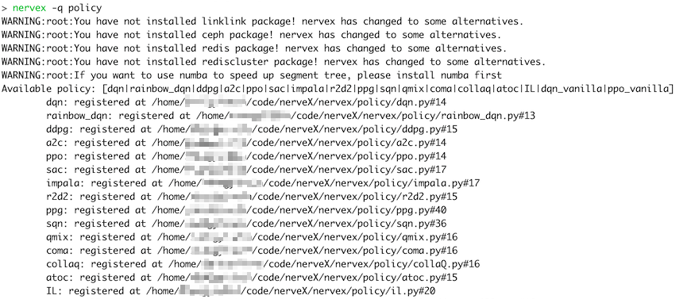

Registry
============

In nerveX, in order to start a training task through config file convenientely, we **recommend** that you should utilize ``Registry`` mechanism to register those modules that are implemented by yourself.

For now, ``Registry`` supports these modules:

   - policy
   - env
   - learner
   - serial_collector
   - parallel_collector
   - comm_learner
   - comm_collector
   - commander
   - league
   - player

Then we will take ``Policy`` to exemplify how to use ``Registry`` when you implement a new policy.

1.  Add the ``Registry`` decorator for the new policy.

   .. code:: python
      
      from nervex.utils import POLICY_REGISTRY

      @POLICY_REGISTRY.register('dqn')
      class DQNPolicy(Policy):
         pass

2.  In config file, list the name and file path of the new policy

   In key ``type``，write the name of the policy。

   In key ``import_names``，write the file path. ``import_names`` is asked to be a ``list``, and each of its element is a python import abstract path(i.e. We can run ``import name1.name2`` in Python Idle), such as:

      - ``nervex.policy.dqn``
      - ``app_zoo.atari.envs.atari_env``

   The config file example is as follows:
   
   .. code:: python

      policy=dict(
         type='dqn',
         import_names=['app_zoo.sumo.policy.sumo_dqn'],
         # ...
      )

   If you carefully read the source code, you will find out that for polices implemented in nerveX core code(in path `nerveX/nervex/`), the ``import_names`` is not listed in config file. However, if you implement a new policy, it is a **must** to list ``import_names``.

3. Create the module through system functions

   If you want to start the training task through nerveX ``serial_pipeline``, for example, use CLI ``nervex -m XXX -c XXXX_config.py -s XX``, or call ``serial_pipeline`` function. Step 3 can be ignored, because ``serial_pipeline`` has already been done in ``serial_pipeline`` function.
   However, if you want to write your own pipeline, you can call ``create_policy`` function to create your policy.

   .. code:: python
      
      from nervex.policy import create_policy

      cfg: dict
      dqn_policy = create_policy(cfg.policy)

Besides, you can use CLI ``nervex -q <registry name>`` to look up the modules that are already registered in nerveX core code. For example：

