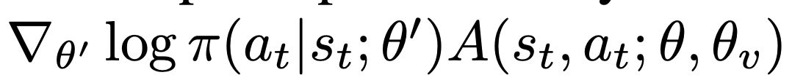
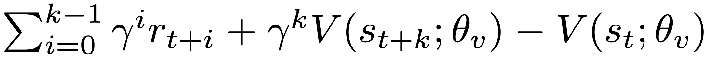
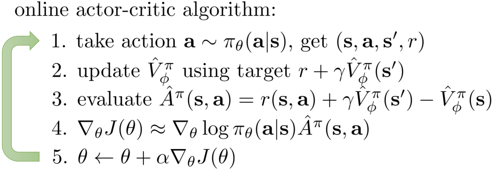

A2C
^^^^^^^

Overview
---------
A2C(advantage actor critic) is a actor-critic RL algorithm, where the policy gradient is combined with advantage function to reduce the variance.

Quick Facts
-----------
1. A2C is a **model-free** and **policy-based** RL algorithm.

2. A2C supports both **discrete** and **continuous action spaces**.

3. A2C supports **off-policy** mode and **on-policy** mode.

4. A2C can be equipped with RNN.

Key Equations or Key Graphs
-------------
A2C use advantage estimation in the policy gradient:

where the n-step advantage function is defined:

Pseudo-code
-----------

.. note::
   Different from Q-learning, A2C(and other actor critic methods) alternates between policy estimation and policy improvement.

Extensions
-----------
A2C can be combined with:
    - multi-step learning
    - RNN
    - GAE
        GAE is proposed in `High-Dimensional Continuous Control Using Generalized Advantage Estimation <https://arxiv.org/abs/1506.02438>`, it uses exponentially-weighted average of different steps of advantage estimators, to make trade-off between the variance and bias of the estimation of the advantage:

        .. image:: images/gae.png
           :align: center
           :height: 60

        where the k-steps advantage estimator :math:`\hat{A}_t^{(k)}` is defined as :

        .. image:: images/adv_k.png
           :align: center
           :height: 80

        When k=1, the estimator :math:`\hat{A}_t^{(1)}` is the naive advantage estimator:

        .. image:: images/adv_1.png
           :align: center
           :height: 40

        When GAE is used, the common value of :math:`\lambda` is usually [0.8, 1.0].

Implementation
------------
The default config is defined as follows:

    .. autoclass:: nervex.policy.a2c.A2CPolicy

The policy gradient and value update of A2C is implemented as follows:

.. code:: python

    def a2c_error(data: namedtuple) -> namedtuple:
        logit, action, value, adv, return_, weight = data
        if weight is None:
            weight = torch.ones_like(value)
        dist = torch.distributions.categorical.Categorical(logits=logit)
        logp = dist.log_prob(action)
        entropy_loss = (dist.entropy() * weight).mean()
        policy_loss = -(logp * adv * weight).mean()
        value_loss = (F.mse_loss(return_, value, reduction='none') * weight).mean()
        return a2c_loss(policy_loss, value_loss, entropy_loss)

The Benchmark result of A2C implemented in nerveX is shown in `Benchmark <../feature/algorithm_overview.html>`_
