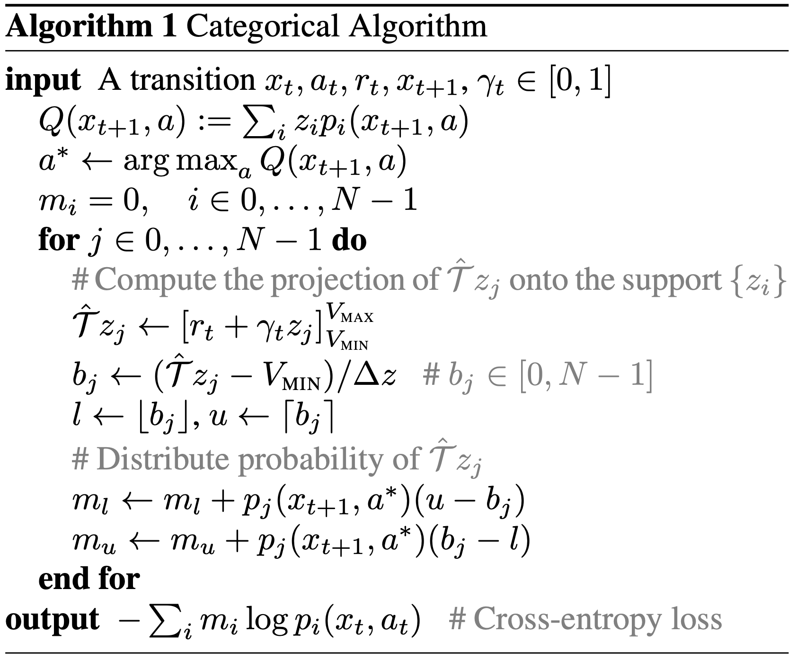
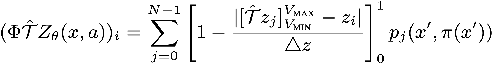
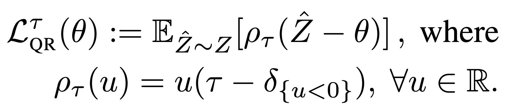
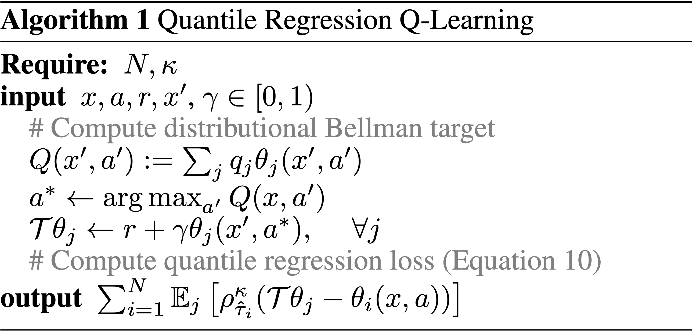
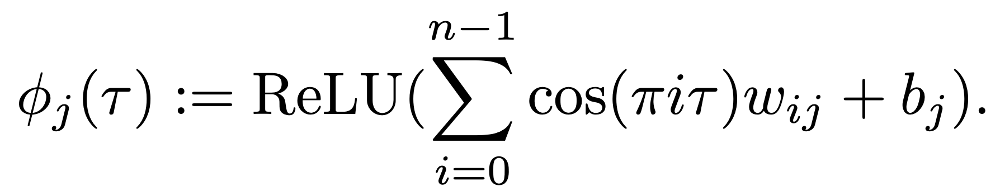
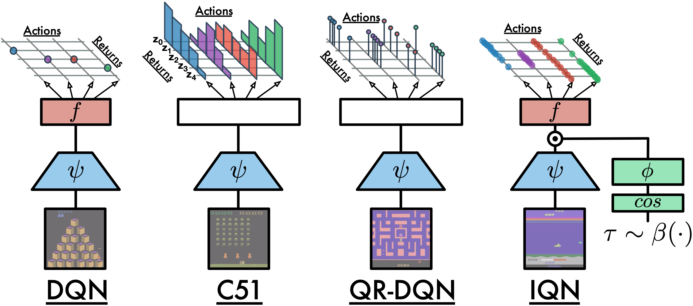

C51
^^^^^^^

Overview
---------
C51 was first proposed in `A Distributional Perspective on Reinforcement Learning <https://arxiv.org/abs/1707.06887>`_, different from previous works, C51 evaluates the complete distribution of a q-value rather than only the expectation. The authors designed a distributional Bellman operator, which preserves multimodality in value distributions and is believed to achieve more stable learning and mitigates the negative effects of learning from a non-stationary policy.

Quick Facts
-----------
1. C51 is a **model-free** and **value-based** RL algorithm.

2. C51 only **support discrete action spaces**.

3. C51 is an **off-policy** algorithm.

4. Usually, C51 use **eps-greedy** or **multinomial sample** for exploration.

5. C51 can be equipped with RNN.

Pseudo-code
------------

.. note::
   C51 models the value distribution using a discrete distribution, whose support set are N atoms: :math:`z_i = V_min + i * delta, i = 0,1,...,N-1` and :math:`delta = (V_\max - V_\min) / N`. Each atom :math:`z_i` has a parameterized probability :math:`p_i`. The Bellman update of C51 projects the distribution of :math:`r + \gamma * z_j^(t+1)` onto the distribution :math:`z_i^t`.

Key Equations or Key Graphs
----------------------------
The Bellman target of C51 is derived by projecting the returned distribution :math:`r + \gamma * z_j` onto the current distribution :math:`z_i`. Given a sample transition :math:`(x, a, r, x')`, we compute the Bellman update :math:`Tˆz_j := r + \gamma z_j` for each atom :math:`z_j`, then distribute its probability :math:`p_{j}(x', \pi(x'))` to the immediate neighbors :math:`p_{i}(x, \pi(x))`:

Extensions
-----------
- C51s can be combined with:
   - PER(Prioritized Experience Replay)
   - multi-step TD-loss
   - double(target) network
   - dueling head
   - RNN

Implementation
-----------------

.. tip::
      Our benchmark result of C51 uses the same hyper-parameters as DQN except the exclusive `n_atom` of C51, which is empirically set as 51.

The default config is defined as follows:

.. autoclass:: nervex.policy.c51.C51Policy

The bellman updates of C51 is implemented as:

.. code:: python

    def dist_nstep_td_error(
            data: namedtuple,
            gamma: float,
            v_min: float,
            v_max: float,
            n_atom: int,
            nstep: int = 1,
            value_gamma: Optional[torch.Tensor] = None,
    ) -> torch.Tensor:

        dist, next_n_dist, act, next_n_act, reward, done, weight = data
        device = reward.device
        assert len(act.shape) == 1, act.shape

        #calculate the discounted reward sum.
        reward_factor = torch.ones(nstep).to(device)
        for i in range(1, nstep):
            reward_factor[i] = gamma * reward_factor[i - 1]
        reward = torch.matmul(reward_factor, reward)
        reward = reward.unsqueeze(-1)

        #preprocess necessary variables
        done = done.unsqueeze(-1)
        support = torch.linspace(v_min, v_max, n_atom).to(device)
        delta_z = (v_max - v_min) / (n_atom - 1)
        batch_size = act.shape[0]
        batch_range = torch.arange(batch_size)
        if weight is None:
            weight = torch.ones_like(reward)

        #calculate the distributions of the returns
        next_n_dist = next_n_dist[batch_range, next_n_act].detach()
        if value_gamma is None:
            target_z = reward + (1 - done) * (gamma ** nstep) * support
        else:
            value_gamma = value_gamma.unsqueeze(-1)
            target_z = reward + (1 - done) * value_gamma * support
        target_z = target_z.clamp(min=v_min, max=v_max)
        b = (target_z - v_min) / delta_z
        l = b.floor().long()
        u = b.ceil().long()
        l[(u > 0) * (l == u)] -= 1
        u[(l < (n_atom - 1)) * (l == u)] += 1

        #project the distributions of the returns into n atoms
        proj_dist = torch.zeros_like(next_n_dist)
        offset = torch.linspace(0, (batch_size - 1) * n_atom, batch_size).unsqueeze(1).expand(batch_size,
                                                                                              n_atom).long().to(device)
        proj_dist.view(-1).index_add_(0, (l + offset).view(-1), (next_n_dist * (u.float() - b)).view(-1))
        proj_dist.view(-1).index_add_(0, (u + offset).view(-1), (next_n_dist * (b - l.float())).view(-1))

        #calculate the loss for distribution
        assert (dist[batch_range, act] > 0.0).all(), ("dist act", dist[batch_range, act], "dist:", dist)
        log_p = torch.log(dist[batch_range, act])
        if len(weight.shape) == 1:
            weight = weight.unsqueeze(-1)
        td_error_per_sample = -(log_p * proj_dist).sum(-1)
        loss = -(log_p * proj_dist * weight).sum(-1).mean()

        return loss, td_error_per_sample

The Benchmark result of C51 implemented in nerveX is shown in `Benchmark <../feature/algorithm_overview.html>`_

QRDQN
^^^^^^^

Overview
---------
QR(Quantile Regression)DQN was proposed in `Distributional Reinforcement Learning with Quantile Regression <https://arxiv.org/pdf/1710.10044>`_ and inherits the idea of learning the distribution of a q-value. Instead of approximate the distribution density function with discrete atoms, QRDQN, direct regresses a discrete set of quantiles of a q-value.

Quick Facts
-----------
1. QRDQN is a **model-free** and **value-based** RL algorithm.

2. QRDQN only support **discrete action spaces**.

3. QRDQN is an **off-policy** algorithm.

4. Usually, QRDQN use **eps-greedy** or **multinomial sample** for exploration.

5. QRDQN can be equipped with RNN.

Key Equations or Key Graphs
----------------------------
The quantile regression loss, for a quantile tau in :math:`[0, 1]`, is an asymmetric convex loss function that penalizes overestimation errors with weight :math:`\tau` and underestimation errors with weight :math:`1−\tau`. For a distribution Z, and a given quantile tau, the value of the quantile function :math:`F_Z^−1(\tau)` may be characterized as the minimizer of the quantile regression loss:

Pseudo-code
-------------

.. note::
   The quantile huber loss is applied during the Bellman update of QRDQN.

Extensions
-----------
QRDQN can be combined with:
  - PER(Prioritized Experience Replay)
  - multi-step TD-loss
  - double(target) network
  - RNN

Implementation
----------------

.. tip::
      Our benchmark result of QRDQN uses the same hyper-parameters as DQN except the QRDQN's exclusive hyper-parameter, `the number of quantiles`, which is empirically set as 32.

The default config is defined as follows:

.. autoclass:: nervex.policy.qrdqn.QRDQNPolicy

The bellman updates of QRDQN is implemented as:

.. code:: python

  def qrdqn_nstep_td_error(
          data: namedtuple,
          gamma: float,
          nstep: int = 1,
          value_gamma: Optional[torch.Tensor] = None,
  ) -> torch.Tensor:
      q, next_n_q, action, next_n_action, reward, done, tau, weight = data

      assert len(action.shape) == 1, action.shape
      assert len(next_n_action.shape) == 1, next_n_action.shape
      assert len(done.shape) == 1, done.shape
      assert len(q.shape) == 3, q.shape
      assert len(next_n_q.shape) == 3, next_n_q.shape
      assert len(reward.shape) == 2, reward.shape

      if weight is None:
          weight = torch.ones_like(action)

      batch_range = torch.arange(action.shape[0])

      # shape: batch_size x num x 1
      q_s_a = q[batch_range, action, :].unsqueeze(2)
      # shape: batch_size x 1 x num
      target_q_s_a = next_n_q[batch_range, next_n_action, :].unsqueeze(1)

      assert reward.shape[0] == nstep
      reward_factor = torch.ones(nstep).to(reward)
      for i in range(1, nstep):
          reward_factor[i] = gamma * reward_factor[i - 1]
      # shape: batch_size
      reward = torch.matmul(reward_factor, reward)
      # shape: batch_size x 1 x num
      if value_gamma is None:
          target_q_s_a = reward.unsqueeze(-1).unsqueeze(-1) + (gamma ** nstep) * target_q_s_a * (1 - done).unsqueeze(-1).unsqueeze(-1)
      else:
          target_q_s_a = reward.unsqueeze(-1).unsqueeze(-1) + value_gamma.unsqueeze(-1).unsqueeze(-1) * target_q_s_a * (1 - done).unsqueeze(-1).unsqueeze(-1)

      # shape: batch_size x num x num
      u = F.smooth_l1_loss(target_q_s_a, q_s_a, reduction="none")
      # shape: batch_size
      loss = (u * (
              tau - (target_q_s_a - q_s_a).detach().le(0.).float()
          ).abs()).sum(-1).mean(1)

      return (loss * weight).mean(), loss

The Benchmark result of QRDQN implemented in nerveX is shown in `Benchmark <../feature/algorithm_overview.html>`_

IQN
^^^^^^^

Overview
---------
IQN was proposed in `Implicit Quantile Networks for Distributional Reinforcement Learning <https://arxiv.org/pdf/1806.06923>`_. The key difference between IQN and QRDQN is that IQN introduces the implicit quantile network (IQN), a deterministic parametric function trained to re-parameterize samples from a base distribution, e.g. tau in U([0, 1]), to the respective quantile values of a target distribution, while QRDQN direct learns a fixed set of pre-defined quantiles.

Quick Facts
-----------
1. IQN is a **model-free** and **value-based** RL algorithm.

2. IQN only support **discrete action spaces**.

3. IQN is an **off-policy** algorithm.

4. Usually, IQN use **eps-greedy** or **multinomial sample** for exploration.

5. IQN can be equipped with RNN.

Key Equations
-------------
In implicit quantile networks, a sampled quantile tau is first encoded into an embedding vector via:

Then the quantile embedding is element-wise multiplied by the embedding of the observation of the environment, and the subsequent fully-connected layers map the resulted product vector to the respective quantile value.

Key Graphs
-------------
The comparison among DQN, C51, QRDQN and IQN is shown as follows:

Extensions
-----------
IQN can be combined with:
  - PER(Prioritized Experience Replay)

    .. tip::
        Whether PER improves IQN depends on the task and the training strategy.
  - multi-step TD-loss
  - double(target) Network
  - RNN

Implementation
------------------

.. tip::
      Our benchmark result of IQN uses the same hyper-parameters as DQN except the IQN's exclusive hyper-parameter, `the number of quantiles`, which is empirically set as 32. The number of quantiles are not recommended to set larger than 64, which brings marginal gain and much more forward latency.

The default config is defined as follows:

.. autoclass:: nervex.policy.iqn.IQNPolicy

The bellman updates of IQN used is defined as follows:

.. code:: python

    def iqn_nstep_td_error(
            data: namedtuple,
            gamma: float,
            nstep: int = 1,
            kappa: float = 1.0,
            value_gamma: Optional[torch.Tensor] = None,
    ) -> torch.Tensor:
        q, next_n_q, action, next_n_action, reward, done, replay_quantiles, weight = data

        assert len(action.shape) == 1, action.shape
        assert len(next_n_action.shape) == 1, next_n_action.shape
        assert len(done.shape) == 1, done.shape
        assert len(q.shape) == 3, q.shape
        assert len(next_n_q.shape) == 3, next_n_q.shape
        assert len(reward.shape) == 2, reward.shape

        if weight is None:
            weight = torch.ones_like(action)

        batch_size = done.shape[0]
        tau = q.shape[0]
        tau_prime = next_n_q.shape[0]

        action = action.repeat([tau, 1]).unsqueeze(-1)
        next_n_action = next_n_action.repeat([tau_prime, 1]).unsqueeze(-1)

        # shape: batch_size x tau x a
        q_s_a = torch.gather(q, -1, action).permute([1, 0, 2])
        # shape: batch_size x tau_prim x 1
        target_q_s_a = torch.gather(next_n_q, -1, next_n_action).permute([1, 0, 2])

        assert reward.shape[0] == nstep
        device = torch.device("cuda" if reward.is_cuda else "cpu")
        reward_factor = torch.ones(nstep).to(device)
        for i in range(1, nstep):
            reward_factor[i] = gamma * reward_factor[i - 1]
        reward = torch.matmul(reward_factor, reward)
        if value_gamma is None:
            target_q_s_a = reward.unsqueeze(-1) + (gamma ** nstep) * target_q_s_a.squeeze(-1) * (1 - done).unsqueeze(-1)
        else:
            value_gamma = value_gamma.unsqueeze(-1)
            target_q_s_a = reward.unsqueeze(-1) + value_gamma * target_q_s_a.squeeze(-1) * (1 - done).unsqueeze(-1)
        target_q_s_a = target_q_s_a.unsqueeze(-1)

        # shape: batch_size x tau' x tau x 1.
        bellman_errors = (target_q_s_a[:, :, None, :] - q_s_a[:, None, :, :])

        # The huber loss (see Section 2.3 of the paper) is defined via two cases:
        huber_loss = torch.where(
            bellman_errors.abs() <= kappa, 0.5 * bellman_errors ** 2, kappa * (bellman_errors.abs() - 0.5 * kappa)
        )

        # Reshape replay_quantiles to batch_size x num_tau_samples x 1
        replay_quantiles = replay_quantiles.reshape([tau, batch_size, 1]).permute([1, 0, 2])

        # shape: batch_size x num_tau_prime_samples x num_tau_samples x 1.
        replay_quantiles = replay_quantiles[:, None, :, :].repeat([1, tau_prime, 1, 1])

        # shape: batch_size x tau_prime x tau x 1.
        quantile_huber_loss = (torch.abs(replay_quantiles - ((bellman_errors < 0).float()).detach()) * huber_loss) / kappa

        # shape: batch_size
        loss = quantile_huber_loss.sum(dim=2).mean(dim=1)[:, 0]

        return (loss * weight).mean(), loss

The Benchmark result of IQN implemented in nerveX is shown in `Benchmark <../feature/algorithm_overview.html>`_
