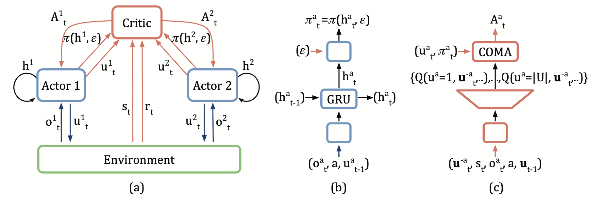
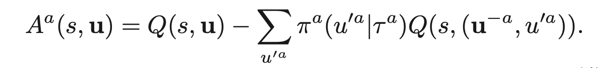
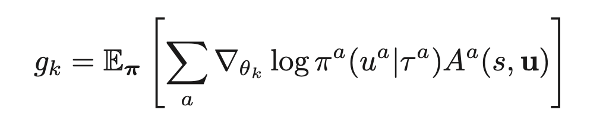

COMA
^^^^^^^

Overview
---------
COMA (Foerster et al. 2018), counterfactual multi-agent policy gradients, is a multi-agent actor critic based approach to learn a fully centralized state action function and use it to guide the optimization of decentralized policies. COMA uses a centralized critic to train decentralized actors for individual agents, estimating a counterfactual advantage function for each agent in order to address multi-agent credit assignment. A counterfactual baseline is used in COMA to marginalizes out a single agent’s action, while keeping the other agents’ actions fixed, and the centralized critic representation allows the counterfactual baseline to be computed efficiently.

Quick Facts
-------------
1. COMA uses the paradigm of **centralized training with decentralized execution**.

2. COMA is a **model-free** and **actor critic** method.

3. COMA focus on settings with **discrete actions**. COMA can be extended to continuous actions spaces by other estimation methods.

4. COMA uses **on-policy** policy gradient learning to train critics.

5. COMA has poor sample efficiency and is prone to getting stuck in sub-optimal local minima.

6. COMA considers a **partially observable** setting in which each agent only obtains individual observations. Agents must rely on lo- cal action-observation histories during execution.

7. COMA accepts **Independent Actor-Critic** as individual value network and speeds learning by sharing parameters among the agents.

8. Since learning is centralized, the centralized critic in COMA estimates Q-values for the **joint action** conditioned on the **central state**.

Key Equations or Key Graphs
---------------------------
The overall information flow between the decentralized actors, the environment and the centralized critic in COMA:

COMA computes an advantage function that compares the Q-value for the current action to a counterfactual baseline:

COMA policy gradient for all actor policies:

 
Extensions
-----------
- COMA takes the advantage of learning a centralized critic to train decentralized actors. Similarly, Gupta et al. (2017) present a centralized actor-critic algorithm learning per-agent critics to opt for better scalability at the cost of diluted benefits of centralization.

- MADDPG (Lowe et al. 2017) extends the DDPG framework in multi-agent settings and learns a centralized critic for each agent. These approaches use on-policy policy gradient learning.

Implementations
----------------
The default config is defined as follows:

    * TODO

The network interface COMA used is defined as follows:

    * TODO

The Benchmark result of COMA in SMAC (Samvelyan et al. 2019), for StarCraft micromanagement problems, implemented in nerveX is shown.

References
----------------
Jakob Foerster, Gregory Farquhar, Triantafyllos Afouras, Nantas Nardelli, Shimon Whiteson. Counterfactual Multi-Agent Policy Gradients. In Proceedings of the Thirty-Second AAAI Conference on Artificial Intelligence, 2018.

Jayesh K. Gupta, Maxim Egorov, Mykel Kochenderfer. Cooperative multi-agent control using deep reinforcement learning. International Conference on Autonomous Agents and Multiagent Systems, 2017.

Ryan Lowe, Yi Wu, Aviv Tamar, Jean Harb, Pieter Abbeel, Igor Mordatch. Multi-agent actor-critic for mixed cooperative-competitive environments. arXiv preprint arXiv:1706.02275, 2017.

Mikayel Samvelyan, Tabish Rashid, Christian Schroeder de Witt, Gregory Farquhar, Nantas Nardelli, Tim G. J. Rudner, Chia-Man Hung, Philip H. S. Torr, Jakob Foerster, Shimon Whiteson. The StarCraft Multi-Agent Challenge. arXiv preprint arXiv:1902.04043, 2019.

