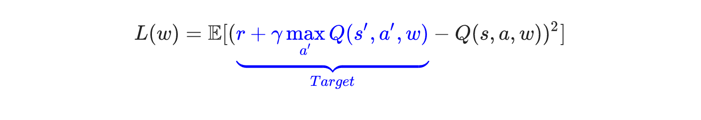

DQN
^^^^^^^

Overview
---------
DQN is first proposed in `Playing Atari with Deep Reinforcement Learning <https://arxiv.org/abs/1312.5602>`_, which combines Q-learning with deep neural network. Different from the previous methods, DQN uses a deep neural network to evaluate the q-values, which is updated via TD-loss along with gradient decent.

Quick Facts
-------------
1. DQN is a **model-free** and **value-based** RL algorithm.

2. DQN only supports **discrete** action spaces.

3. DQN is an **off-policy** algorithm.

4. Usually, DQN uses **eps-greedy** or **multinomial sample** for exploration

5. DQN + RNN = DRQN

6. The nerveX implementation of DQN supports **multi-discrete** action space

Key Equations or Key Graphs
---------------------------
The TD-loss used in DQN is:

Pseudo-code
---------------
.. image:: images/DQN.png

.. note::
   Compared with the vanilla version, DQN has been dramatically improved in both algorithm and implementation. In the algorithm part, **n-step TD-loss, PER, target network and dueling head** are widely used. For the implementation details, the value of epsilon anneals from a high value to zero during the training rather than keeps constant, according to env step(the number of policy interaction with env).

Extensions
-----------
- DQN can be combined with:

    * PER(Prioritized Experience Replay)

        `PRIORITIZED EXPERIENCE REPLAY <https://arxiv.org/abs/1511.05952>`_ replaces the uniform sampling in replay buffer with a kind of special defined ``priority``, which is defined by various metrics, such as absolute TD error, the novelty of observation and so on. By this priority sampling, the convergence speed and performance of DQN can be improved a lot.

        One of implementation of PER is described:

        .. image:: images/PERDQN.png

    * multi-step TD-loss

        .. note::
           有关Q-Learning中的off-policy correction（即Importance Sampling），在one-step和n-step上是有所区别的。一言以蔽之，one-step不需要IS，而n-step需要IS。

           Importance Sampling的直观理解是：首先我们想计算f(x)的期望，其中x服从分布p；
           但我们却因为某些原因只能从分布q进行采样，因此要在f(x)上乘上一个系数p/q，来做一个修正，使得二者在期望上相等。公式表示为：
           
           :math:`\mathbb{E}_{x\sim p} = \int f(x)p(x)dx = \int f(x)\frac{p(x)}{q(x)}q(x)dx = \mathbb{E}_{x\sim q}[f(x)\frac{p(x)}{q(x)}]`

           在one-step的Q-learning中， :math:`Q(s,a)`
           需要去拟合 :math:`r(s,a)+\gamma \mathop{max}\limits_{a^*}Q(s',a^*)`

           对于当前的 :math:`s,a` ， :math:`r(s,a)` 是由环境反馈得来的， :math:`s'` 是环境step后得到的，都与是否为off-policy无关。
           接下来在寻找使得Q函数最大的 :math:`a^*` 时，是通过原始策略 :math:`\pi` （对应当前的Q函数）计算得到的，同样与采样的策略 :math:`\mu` 无关。
           这意味着，尽管我们使用了不同的策略采样，但是它在训练的时候没有发挥任何作用，因此不需要重要性采样来修正。

           换个方式理解，在环境状态 :math:`s` 下，采样动作 :math:`a1` ，得到的结果存储在 :math:`Q(s,a1)` 中；
           采样动作 :math:`a2` ，结果存储在 :math:`Q(s,a2)` 中。
           即使采样a1和a2的概率 :math:`p(a1|x), p(a2|x)` 改变了，也不会影响到 :math:`Q(s,a1), Q(s,a2)` ，因此不需要修正。

           而在n-step的Q-learning中， :math:`Q(s,a)`
           需要去拟合 :math:`\sum_{t=0}^{n-1}\gamma^t r(s_t,a_t) + \gamma^n \mathop{max}\limits_{a^*}Q(s_n,a^*)`

           同one-step情况，:math:`r(s_0,a_0)` 和 :math:`s_1` 都与是否为off-policy无关。
           但之后在确定接下来的动作 :math:`a_1` 时，是根据当前采样的策略 :math:`\mu` 得到的，而不是原始的策略 :math:`\pi` 。
           同样，对于后面的 :math:`a_2, a_3, ...` ，都存在概率分布不同的情况，因此我们就需要使用重要性采样的方法对不同的分布进行修正，
           这样我们对当前状态-动作价值函数，即Q函数的估计才是无偏估计。

    * double(target) Network

      * Double DQN, proposed in `Deep Reinforcement Learning with Double Q-learning <https://arxiv.org/abs/1509.06461>`_, is a kind of common variant of DQN. This method maintaines another Q-network, named target network, which is updated by the current netowrk by a fixed frequency(update times). 

        Double DQN doesn't select the maximum q_value in the total discrete action space from the current network, but **first finds the action whose q_value is highest in the current network, then gets the q_value from the target network according to this selected action**. This variant can surpass the over estimation problem of target q_value, and reduce upward bias.

        .. tip::
            The over estimation can be caused by the error of function approximation(neural network for q table), environment noise, numerical instability and other reasons.

    * dueling head

      * In `Dueling Network Architectures for Deep Reinforcement Learning <https://arxiv.org/abs/1511.06581>`_, dueling head architecture is utilized to implement the decomposition of state-value and advantage for taking each action, and use these two parts to construct the final q_value, which is better for evaluating the value of some states not related to action selection. 

        The specific architecture is shown in the following graph:

        .. image:: images/Dueling_DQN.png
            :scale: 70 %

    * RNN

Implementations
----------------
The default config is defined as follows:

.. autoclass:: nervex.policy.dqn.DQNPolicy

The network interface DQN used is defined as follows:

    * TODO

The Benchmark result of DQN implemented in nerveX is shown in `Benchmark <../feature/algorithm_overview.html>`_
