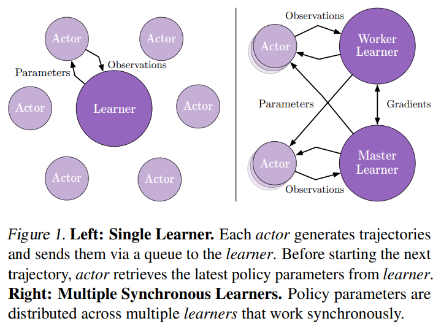

Impala
^^^^^^^

Overview
---------
IMPALA, or the Importance Weighted Actor Learner Architecture, is an off-policy actor-critic framework that
decouples acting from learning and learns from experience trajectories using V-trace. This method is first
introduced in `IMPALA: Scalable Distributed Deep-RL with Importance Weighted Actor-Learner Architectures <https://arxiv.org/abs/1802.01561>`_.

Quick Facts
-------------
1. Impala  is a **model-free** and **off-policy** RL algorithm.

2. Impala can support both **discrete** action spaces and **continuous** action spaces.

3. Impala is a actor-critic RL algorithm, which optimizes actor network and critic network, respectively.

4. Impala decouples acting from learning. Collectors in impala will not compute value or advantage.

Key Equations
---------------------------
Loss used in Imapala is similar to that in PPO, A2C and other actor-critic model. All of them comes from policy_loss,\
value_loss and entropy_loss, with respect to some carefully chosen weights.

.. math::
    :label: math-single

    Loss_total = Loss_policy + w_value * Loss_value + w_entropy * Loss_entropy \label{XX}

where  w_value, w_entropy are loss weights for value and entropy.

- NOTATION AND CONVENTIONS:

:math:`\pi_{\phi}`: current training policy parameterized by :math:`\phi`.

:math:`V_\theta`: value function parameterized by :math:`\theta`.

:math:`\mu`: older policy which generates trajectories in replay buffer.

At the training time :math:`t`, given transition :math:`(x_t, a_t, x_{t+1}, r_t)`, the value function :math:`V_\theta`
is learned through an :math:`L_2` loss between the current value and a V-trace target value. The n-step V-trace target
at time s is defined as follows:

.. math::
    :label: math-single

    v_s  \stackrel{def}{=} V(x_s) + \sum_{t=s}^{s+n-1} \gamma^{t-s} \big(\prod_{i=s}^{t-1} c_i\big)\delta_t V

where :math:`\delta_t V \stackrel{def}{=}  \rho_t (r_t + \gamma V(x_{t+1}) - V(x_t))` is a temporal difference for :math:`V`.

:math:`\rho_t \stackrel{def}{=} \min\big(\bar{\rho}, \frac{\pi(a_t \vert x_t)}{\mu(a_t \vert x_t)}\big)` and :math:`c_i \stackrel{def}{=}
\min\big(\bar{c}, \frac{\pi(a_i \vert s_i)}{\mu(a_i \vert s_i)}\big)` are truncated importance sampling (IS) weights,
where :math:`\bar{\rho}` and :math:`\bar{c}` are two truncation constants with :math:`\bar{\rho} \geq \bar{c}`.

The product of :math:`c_s, \dots, c_{t-1}` measures how much a temporal difference :math:`\delta_t V` observed at time
:math:`t` impacts the update of the value function at a previous time :math:`s` . In the on-policy case, we have :math:`\rho_t=1`
and :math:`c_i=1` (assuming :math:`\bar{c} \geq 1)` and therefore the V-trace target becomes on-policy n-step Bellman
target.

:math:`\bar{\rho}` impacts the fixed-point of the value function we converge to,and :math:`\bar{c}` impacts the speed
of convergence. When :math:`\bar{\rho} =\infty` (untruncated), v-trace value function will converge to the value
function of the target policy :math:`V_\pi`; when :math:`\bar{\rho}` is close to 0, we evaluate the value function
of the behavior policy :math:`V_\mu`; when in-between, we evaluate a policy between :math:`\pi` and :math:`\mu`.

Therefore, loss functions are

.. math::
    :label: math-mult

    Loss_value &= (v_s - V_\theta(x_s))^2 \\
    Loss_policy &= -\rho_s \log \pi_\phi(a_s \vert x_s)  \big(r_s + \gamma v_{s+1} - V_\theta(x_s)\big) \\
    Loss_entropy &= -H(\pi_\phi) = \sum_a \pi_\phi(a\vert x_s)\log \pi_\phi(a\vert x_s)

where :math:`H(\pi_{\phi})`, entropy of policy :math:`\phi`, is an bonus to encourage exploration.

Value function parameter is updated in the direction of:

.. math::
    :label: math-single

    \Delta\theta = w_value (v_s - V_\theta(x_s))\nabla_\theta V_\theta(x_s)

Policy parameter :math:`\phi` is updated through policy gradient,

.. math::
    :label: math-mult

    \Delta \phi &= \rho_s \nabla_\phi \log \pi_\phi(a_s \vert x_s) \big(r_s + \gamma v_{s+1}- V_\theta(x_s)\big)\\
                &- w_entropy \nabla_\phi \sum_a \pi_\phi(a\vert x_s)\log \pi_\phi(a\vert x_s)

where :math:`r_s + \gamma v_{s+1}` is the v-trace advantage, which is estimated Q value subtracted by a state-dependent baseline :math:`V_\theta(x_s)`.

Key Graphs
---------------
The following graph describes the procee of IMPALA.

The left is about single learner, which we implemented using
``serial-pipeline``; the right is about multiple learners, which we implemented using ``parallel-pipeline``.

Implementations
----------------
The default config is defined as follows:

.. autoclass:: nervex.policy.impala.IMPALAPolicy

Usually, we hope to compute everything as a batch to improve efficiency. Especially, when computing vtrace, we
need all traing sample (sequences of training data) have the same length. This is done in ``policy._get_train_sample``.
Once we execute this function in collector, the length of samples will equal to unroll-len in config. For details, please
refer to doc of ``adder``.

.. code:: python
    def _get_train_sample(self, data: List[Dict[str, Any]]) -> List[Dict[str, Any]]:
        return self._adder.get_train_sample(data)

Now, we introduce the computation of vtrace-value.
First, we use the following functions to compute importance_weights.

.. code:: python
    def compute_importance_weights(target_output, behaviour_output, action, requires_grad=False):
        grad_context = torch.enable_grad() if requires_grad else torch.no_grad()
        assert isinstance(action, torch.Tensor)
        device = action.device

        with grad_context:
            dist_target = torch.distributions.Categorical(logits=target_output)
            dist_behaviour = torch.distributions.Categorical(logits=behaviour_output)
            rhos = dist_target.log_prob(action) - dist_behaviour.log_prob(action)
            rhos = torch.exp(rhos)
            return rhos

After that, we clip importance weights based on constant :math:`\rho` and :math:`c` to get clipped_rhos, clipped_cs.
Then we can compute vtrace value according to the following function. Notice, here bootstrap_values are just
value function :math:`V(x_s)` in vtrace definition.

.. code:: python
    def vtrace_nstep_return(clipped_rhos, clipped_cs, reward, bootstrap_values, gamma=0.99, lambda_=0.95):
        deltas = clipped_rhos * (reward + gamma * bootstrap_values[1:] - bootstrap_values[:-1])
        factor = gamma * lambda_
        result = bootstrap_values[:-1].clone()
        vtrace_item = 0.
        for t in reversed(range(reward.size()[0])):
            vtrace_item = deltas[t] + factor * clipped_cs[t] * vtrace_item
            result[t] += vtrace_item
        return result

.. note::
    Here we introduce a parameter ``lambda_``, following the implementation in AlphaStar. The parameter, between 0
    and 1,can give a subtle control on vtrace off-policy correction. Usually, we will choose this parameter close to 1.

Once we get vtrace value, or ``vtrace_nstep_return``, the computation of loss functions are straightforward. The whole
process is as follows.

.. code:: python
    def vtrace_error(
            data: namedtuple,
            gamma: float = 0.99,
            lambda_: float = 0.95,
            rho_clip_ratio: float = 1.0,
            c_clip_ratio: float = 1.0,
            rho_pg_clip_ratio: float = 1.0):

        target_output, behaviour_output, action, value, reward, weight = data
        with torch.no_grad():
            IS = compute_importance_weights(target_output, behaviour_output, action)
            rhos = torch.clamp(IS, max=rho_clip_ratio)
            cs = torch.clamp(IS, max=c_clip_ratio)
            return_ = vtrace_nstep_return(rhos, cs, reward, value, gamma, lambda_)
            pg_rhos = torch.clamp(IS, max=rho_pg_clip_ratio)
            return_t_plus_1 = torch.cat([return_[1:], value[-1:]], 0)
            adv = vtrace_advantage(pg_rhos, reward, return_t_plus_1, value[:-1], gamma)

        if weight is None:
            weight = torch.ones_like(reward)
        dist_target = torch.distributions.Categorical(logits=target_output)
        pg_loss = -(dist_target.log_prob(action) * adv * weight).mean()
        value_loss = (F.mse_loss(value[:-1], return_, reduction='none') * weight).mean()
        entropy_loss = (dist_target.entropy() * weight).mean()
        return vtrace_loss(pg_loss, value_loss, entropy_loss)

.. note::
    Here we introduce a parameter ``rho_pg_clip_ratio``, following the implementation in AlphaStar. This parameter,
    can give a subtle control on vtrace advantage. Usually, we will choose this parameter just same as rho_clip_ratio.

The network interface IMPALA used is defined as follows:

    * TODO(similar to that in A2C,PPO)

The Benchmark result of IMPALA implemented in nerveX is shown in `Benchmark <../feature/algorithm_overview.html>`_

