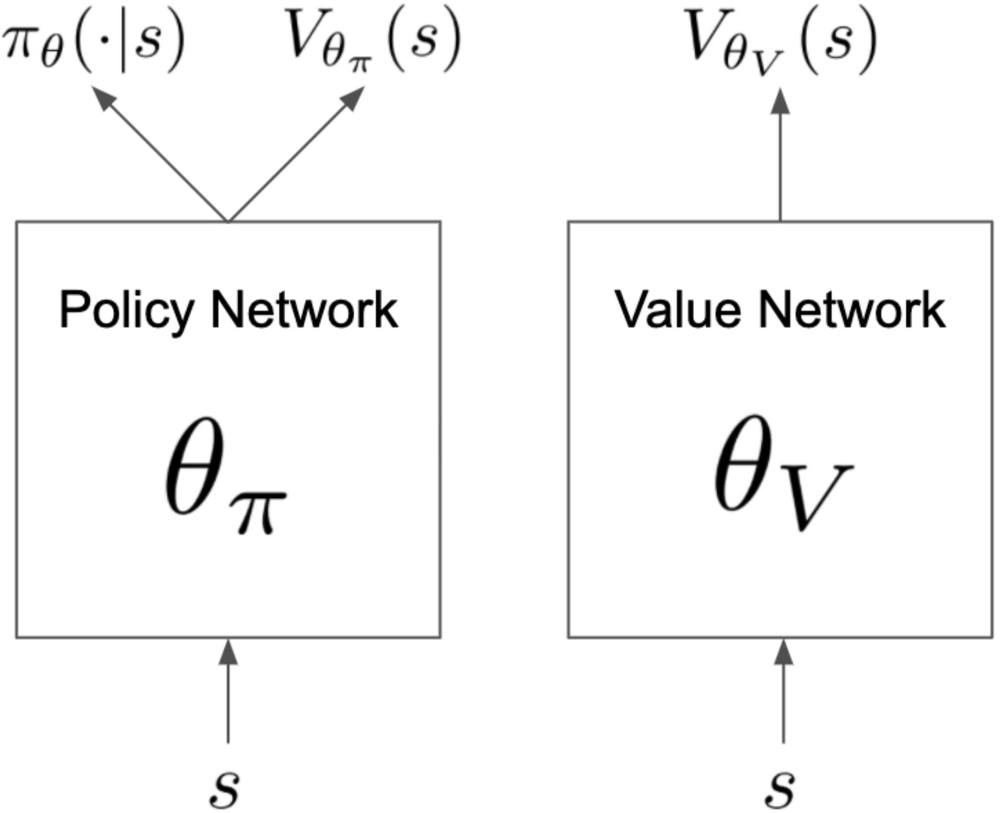
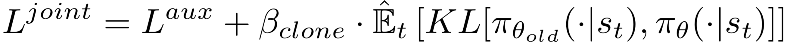
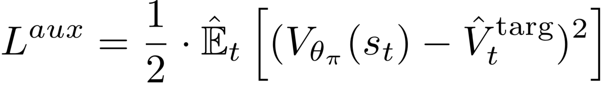

PPG
^^^^^^^

Overview
---------
PPG was proposed in `Phasic Policy Gradient <https://arxiv.org/abs/2009.04416>`_. In prior methods, one must choose between using a shared network or separate networks to represent the policy and value function. Using separate networks avoids interference between objectives, while using a shared net- work allows useful features to be shared. PPG is able to achieve the best of both worlds by splitting optimization into two phases, one that advances training and one that distills features.

Quick Facts
-----------
1. PPG is a **model-free** and **policy-based** RL algorithm.

2. PPG supports both **discrete** and **continuous action spaces**.

3. PPG supports **off-policy** mode and **on-policy** mode.

4. PPG can be equipped with RNN.

5. The nerveX implementation of PPG supports **multi-discrete** action space.

Key Graphs
----------
PPG uses disjoint policy and value networks to reduce interference between objectives. The policy network includes an auxiliary value head which is used to distill the knowledge of value into the policy network.

Key Equations
-------------
During the policy phase, the policy network and the value network are updated similarr to PPO. During the auxiliary phase, the value knowledge is distilled into the policy network with the joint loss:

The joint loss optimizes the auxiliary objective while preserves the original policy with the KL-divergence restriction. The auxiliary loss is defined as:

Pseudo-code
-----------
.. image:: images/PPG.png

.. note::
   During the auxiliary phase, PPG also takes the opportunity to perform additional training on the value network.

Extensions
-----------
- PPG can be combined with:
    * multi-step learning
    * RNN
    * GAE

Implementation
------------
  The default config is defined as follows:

  .. autoclass:: nervex.policy.ppg.PPGPolicy

  The network interface DQN used is defined as follows:

      * TODO

  The Benchmark result of PPG implemented in nerveX is shown in `Benchmark <../feature/algorithm_overview.html>`_
