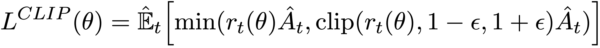
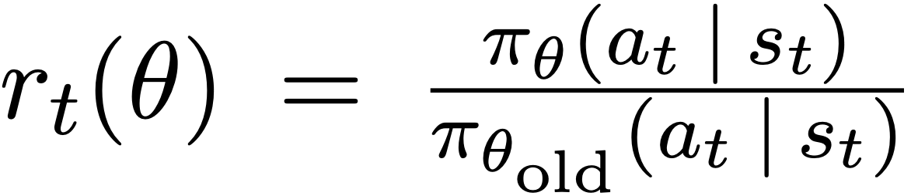
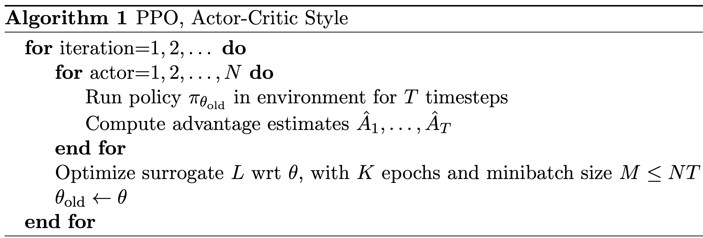

PPO
^^^^^^^

Overview
---------
PPO(Proximal Policy Optimization) was proposed in `Proximal Policy Optimization Algorithms <https://arxiv.org/pdf/1707.06347.pdf>`_. PPO follows the idea of TRPO, which restricts the step of policy update by KL-divergence, and uses clipped probability ratios of the new and old policies to replace the direct KL-divergence restriction. This adaptation is simpler to implement and avoid the calculation of the Hessian matrix in TRPO.

Quick Facts
-----------
1. PPO is a **model-free** and **policy-based** RL algorithm.

2. PPO supports both **discrete** and **continuous action spaces**.

3. PPO supports **off-policy** mode and **on-policy** mode.

4. PPO can be equipped with RNN.

5. The nerveX implementation of PPO supports **multi-discrete** action space.

Key Equations or Key Graphs
-------------
PPO use clipped probability ratios in the policy gradient:

with the probability ratio r defined as:

Pseudo-code
-----------

.. note::
   This is the on-policy version of PPO.

Extensions
-----------
PPO can be combined with:
    - multi-step learning
    - RNN
    - GAE

Implementation
------------
The default config is defined as follows:

    .. autoclass:: nervex.policy.ppo.PPOPolicy

The network of PPO used is defined as follows:

    * TODO

The Benchmark result of PPO implemented in nerveX is shown in `Benchmark <../feature/algorithm_overview.html>`_
