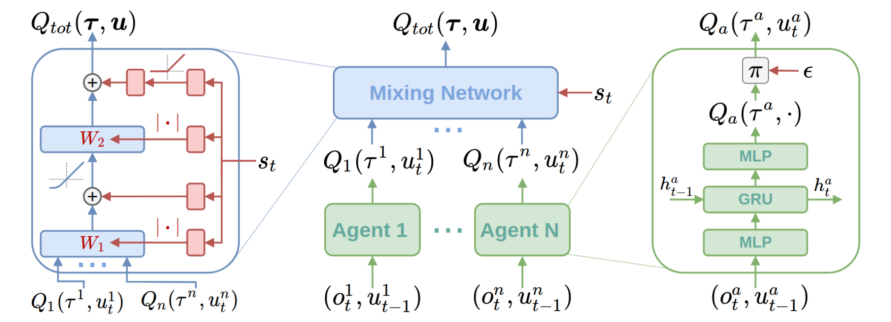
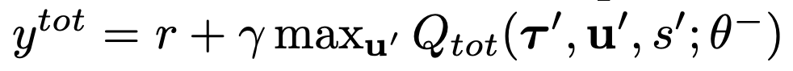
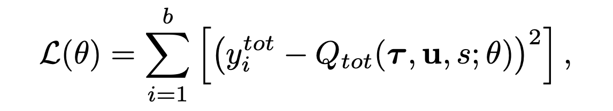

QMIX
^^^^^^^

Overview
---------
QMIX is proposed by Rashid et al.(2018) for learning joint action values conditioned on extra state information in multi-agent centralized learning, which trains decentralized policies in a centralized end-to-end framework. QMIX employs a centralized neural network to estimate joint action values as a complex non-linear combination of per-agent action values based on local observations. QMIX provides a novel presentation of centralized action-value functions and guarantees consistency between the centralized and decentralized policies.

QMIX is a non-linear extension of VDN (Sunehag et al. 2017). Compared to VDN, QMIX can represent more extra state information during training and a much richer class of action-value functions.

Quick Facts
-------------
1. QMIX uses the paradigm of **centralized training with decentralized execution**.

2. QMIX is a **model-free** and **value-based** method.

3. QMIX only support **discrete** action spaces.

4. QMIX is an **off-policy multi-agent** RL algorithm.

5. QMIX considers a **partially observable** scenario in which each agent only obtains individual observations.

6. QMIX accepts **DRQN** as individual value network.

7. QMIX represents the joint value function using an architecture consisting of agent networks, a **mixing network**. The mixing network is a feed-forward neural network that takes the agent network outputs as input and mixes them monotonically, producing joint action values.

Key Equations or Key Graphs
---------------------------
The overall QMIX architecture including individual agent networks and the mixing network structure:

QMIX trains the mixing network via minimizing the following loss:

- Each weight of the mixing network is produced by a independent hyper-network, which takes the global state as input and outputs the weight of one layer of the mixing network. More implemented details can be found in the origin paper.

Extensions
-----------
- Use the idea of factorization of the joint action-value function into individual ones for decentralized execution, VDN and QMIX rely on structural constraints in factorization.

    * For consistency, QMIX is based on monotonicity, a constraint on the relationship between joint action values and individual action values.

        .. image:: images/marl/qmix_mono.png
            :align: center
            :scale: 50%

- QTRAN (Son et al. 2019), as an extension of QMIX, proposes a factorization method, which is free from such structural constraints via transforming the original joint action-value function into an easily factorizable one. QTRAN guarantees more general factorization than VDN or QMIX.

Implementations
----------------
The default config is defined as follows:

    * TODO

The network interface QMIX used is defined as follows:

    * TODO

The Benchmark result of QMIX in SMAC (Samvelyan et al. 2019), for StarCraft micromanagement problems, implemented in nerveX is shown.

References
----------------
Tabish Rashid, Mikayel Samvelyan, Christian Schroeder de Witt, Gregory Farquhar, Jakob Foerster, Shimon Whiteson. Qmix: Monotonic value function factorisation for deep multi-agent reinforcement learning. International Conference on Machine Learning. PMLR, 2018.

Peter Sunehag, Guy Lever, Audrunas Gruslys, Wojciech Marian Czarnecki, Vinicius Zambaldi, Max Jaderberg, Marc Lanctot, Nicolas Sonnerat, Joel Z. Leibo, Karl Tuyls, Thore Graepel. Value-decomposition networks for cooperative multi-agent learning. arXiv preprint arXiv:1706.05296, 2017.

Kyunghwan Son, Daewoo Kim, Wan Ju Kang, David Earl Hostallero, Yung Yi. QTRAN: Learning to Factorize with Transformation for Cooperative Multi-Agent Reinforcement Learning. International Conference on Machine Learning. PMLR, 2019. 

Mikayel Samvelyan, Tabish Rashid, Christian Schroeder de Witt, Gregory Farquhar, Nantas Nardelli, Tim G. J. Rudner, Chia-Man Hung, Philip H. S. Torr, Jakob Foerster, Shimon Whiteson. The StarCraft Multi-Agent Challenge. arXiv preprint arXiv:1902.04043, 2019.

