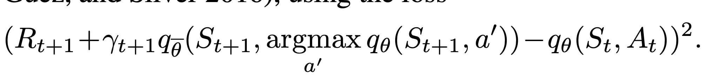
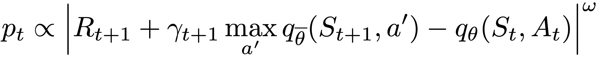
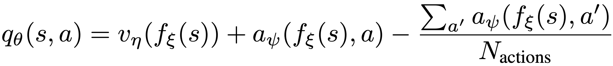
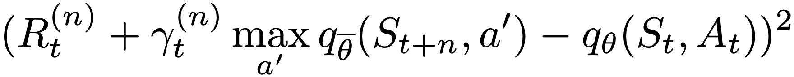
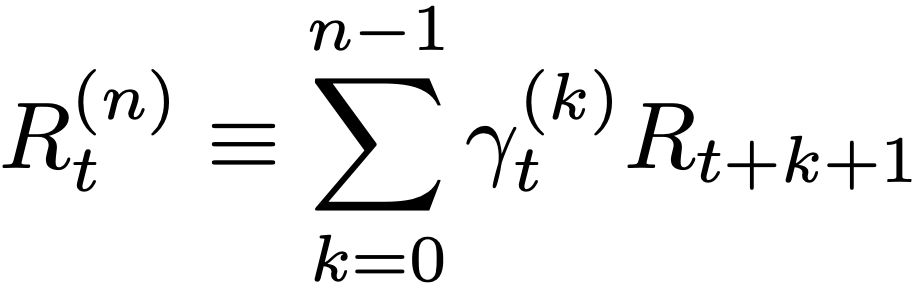
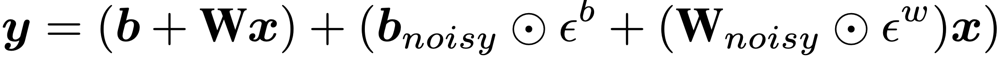

Rainbow
^^^^^^^

Overview
---------
Rainbow was proposed in `Rainbow: Combining Improvements in Deep Reinforcement Learning <https://arxiv.org/abs/1710.02298>`_. It combines many independent improvements to DQN, including: target network(double DQN), priority, dueling head, multi-step TD-loss, C51 and noisy net.

Quick Facts
-----------
1. Rainbow is a **model-free** and **value-based** RL algorithm.

2. Rainbow only support **discrete action spaces**.

3. Rainbow is an **off-policy** algorithm.

4. Usually, Rainbow use **eps-greedy**, **multinomial sample** or **noisy net** for exploration.

5. Rainbow can be equipped with RNN.

6. The nerveX implementation of Rainbow supports **multi-discrete** action space.

Double Q-learning
----------------
Double Q-learning maintains a target q network, which is periodically updated with the current q network. Double Q-learning decouples the over-estimation of q-value by selects action with the current q network but estimate the q-value with the target network, formally:

Prioritized Replay
-----------------
DQN samples uniformly from the replay buffer. Ideally, we want to sample more frequently those transitions from which there is much to learn. As a proxy for learning potential, prioritized experience replay samples transitions with probability relative to the last encountered absolute TD error, formally:

Dueling Network
---------------
The dueling network is a neural network architecture designed for value based RL. It features two streams of computation, the value and advantage
streams, sharing a convolutional encoder, and merged by a special aggregator. This corresponds to the following factorization of action values:

Multi-step Learning
-------------------
A multi-step variant of DQN is then defined by minimizing the alternative loss:

where the truncated n-step return is defined as:

Noisy Net
---------
Noisy Nets use a noisy linear layer that combines a deterministic and noisy stream:

Over time, the network can learn to ignore the noisy stream, but at different rates in different parts of the state space, allowing state-conditional exploration with a form of self-annealing.

Extensions
-----------
Rainbow can be combined with:
  - RNN

Implementation
------------
The default config is defined as follows:

.. autoclass:: nervex.policy.rainbow.RainbowDQNPolicy

The network of Rainbow used is defined as follows:

    * TODO

The Benchmark result of Rainbow implemented in nerveX is shown in `Benchmark <../feature/algorithm_overview.html>`_
