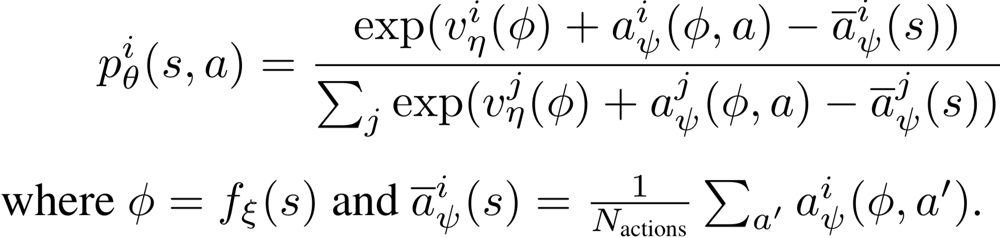

Rainbow
^^^^^^^

Overview
---------
Rainbow was proposed in `Rainbow: Combining Improvements in Deep Reinforcement Learning <https://arxiv.org/abs/1710.02298>`_. It combines many independent improvements to DQN, including: target network(double DQN), priority, dueling head, multi-step TD-loss, C51 and noisy net.

Quick Facts
-----------
1. Rainbow is a **model-free** and **value-based** RL algorithm.

2. Rainbow only support **discrete action spaces**.

3. Rainbow is an **off-policy** algorithm.

4. Usually, Rainbow use **eps-greedy**, **multinomial sample** or **noisy net** for exploration.

5. Rainbow can be equipped with RNN.

6. The nerveX implementation of Rainbow supports **multi-discrete** action space.

Double Q-learning
----------------
Double Q-learning maintains a target q network, which is periodically updated with the current q network. Double Q-learning decouples the over-estimation of q-value by selects action with the current q network but estimate the q-value with the target network, formally:

.. image:: images/double.png
   :align: center
   :height: 40

Prioritized Experience Replay(PER)
-----------------
DQN samples uniformly from the replay buffer. Ideally, we want to sample more frequently those transitions from which there is much to learn. As a proxy for learning potential, prioritized experience replay samples transitions with probability relative to the last encountered absolute TD error, formally:

.. image:: images/priority.png
   :align: center
   :height: 50

The original paper of PER, the authors show that PER achieve improvements on most of the 57 Atari games, especially on Gopher, Atlantis, James Bond 007, Space Invaders, etc.

Dueling Network
---------------
The dueling network is a neural network architecture designed for value based RL. It features two streams of computation, the value and advantage
streams, sharing a convolutional encoder, and merged by a special aggregator. This corresponds to the following factorization of action values:

.. image:: images/dueling.png
   :align: center
   :height: 80
The network architecture of Rainbow is a dueling network architecture adapted for use with return distributions. The network has a shared representation, which is then fed into a value stream :math:`v_\eta` with :math:`N_{atoms}` outputs, and into an advantage stream :math:`a_{\psi}` with :math:`N_{atoms} \times N_{actions}` outputs, where :math:`a_{\psi}^i(a)` will denote the output corresponding to atom i and action a. For each atom :math:`z_i`, the value and advantage streams are aggregated, as in dueling DQN, and then passed through a softmax layer to obtain the normalized parametric distributions used to estimate the returns’ distributions:

Multi-step Learning
-------------------
A multi-step variant of DQN is then defined by minimizing the alternative loss:

.. image:: images/nstep_td.png
   :align: center
   :height: 40
where the truncated n-step return is defined as:

.. image:: images/nstep_reward.png
   :align: center
   :height: 80

In the paper `Revisiting Fundamentals of Experience Replay <https://acsweb.ucsd.edu/~wfedus/pdf/replay.pdf>`_, the authors analyze that a greater capacity of replay buffer substantially increase the performance when multi-step learning is used, and they think the reason is that multi-step learning brings larger variance, which is compensated by a larger replay buffer.

Noisy Net
---------
Noisy Nets use a noisy linear layer that combines a deterministic and noisy stream:

.. image:: images/noisy_net.png
   :align: center
   :height: 40

Over time, the network can learn to ignore the noisy stream, but at different rates in different parts of the state space, allowing state-conditional exploration with a form of self-annealing.
In our implementation, the noises are resampled before each forward both during data collection and training. When double Q-learning is used, the target network also resamples the noises before each forward. During the noise sampling, the nosies are first sampled form N(0,1), then their magnitudes are modulated via a sqrt function with their signs preserved, i.e. x -> x.sign() * x.sqrt().

Extensions
-----------
Rainbow can be combined with:
  - RNN

Implementation
------------
The default config is defined as follows:

.. autoclass:: nervex.policy.rainbow.RainbowDQNPolicy

The network interface of Rainbow used is defined as follows:

    * TODO

The Benchmark result of Rainbow implemented in nerveX is shown in `Benchmark <../feature/algorithm_overview.html>`_
