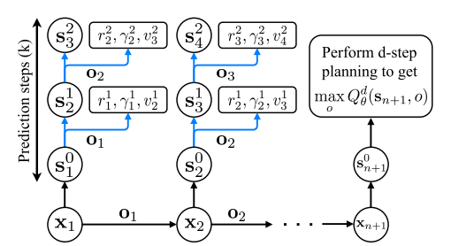
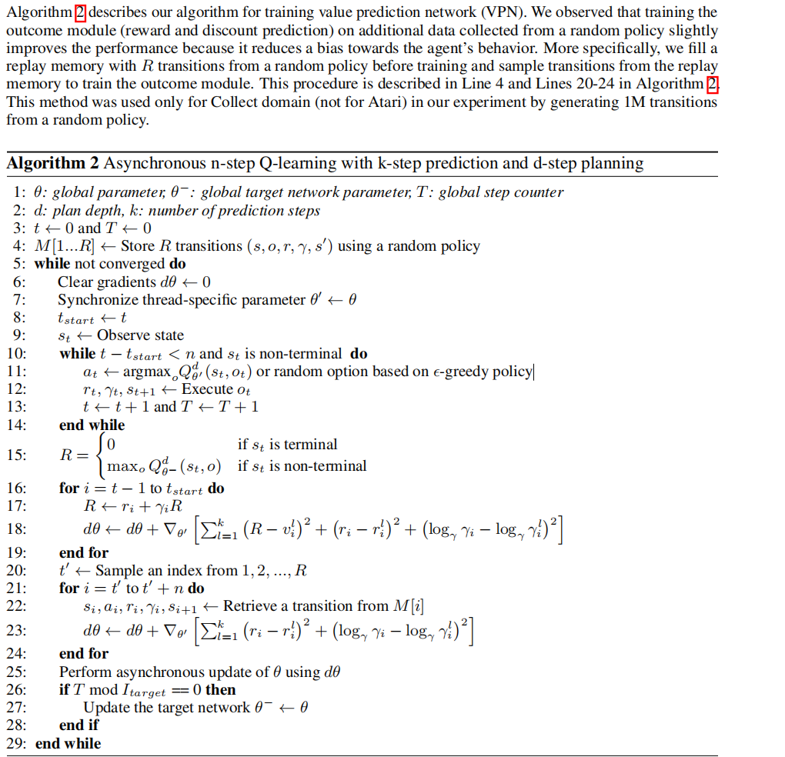

VPN
^^^^^^^

Overview
---------
Value Prediction Network(VPN) was first proposed in `Value Prediction Network <https://arxiv.org/abs/1707.03497>`_ from NeurIPS 2017. 
Value prediction network is an improvement upon the traditional model-based reinforcement learning algorithm 
and a predecessor of the Muzero algorithm.

The main motivation of the VPN algorithm is that the planning phase of RL only needs to predict future rewards and value 
without predicting future observations. 

VPN learn to predict values via Q-learning and rewards via supervised learning and at the same time, 
VPN performs lookahead planning to choose actions and compute bootstrapped target Q-values.

(i.e., learning the dynamics of an abstract state space
sufficient for computing future rewards and values)

Quick Facts
-------------
1. VPN can be view as combination of model-based RL and model-free RL. 

2. The model-based part of VPN is to learn the dynamics of an abstract state space sufficient for computing future rewards and values, and the model-free part of VPN is to map the learned abstract states to rewards and values.

3. VPN combines temporal-difference search and n-step Q-laerning to train.

4. The major performance improvement VPN has compared to other model-based algorithms is that VPN is more robust to stochasticity in the environment than an observation-prediction model approach.

5. In order to solve some of the existing problems of model-based algorithms, the VPN proposes a method between traditional model-based algorithms and model-free algorithms, using dynamics model to model the environment. 

6. From a model-based perspective, the dynamics model models the state transition process, reward and discount function of the environment by extracting the form of abstract state.

7. From a model-free perspective, the extraction of abstract state by dynamics model can be regarded as an auxiliary task of training critic to predict reward and value, in order to better extract the relevant representation of the state. 

8. VPN uses simple rollout and beam search, VPN + Monte Carlo Tree Search(MCTS) :math:`\approxeq` Muzero.

.. note::
	The model-based algorithm has better sample efficiency, but is more complicated; 
	The model-free algorithm has lower sample efficiency, but is relatively simple and easier to implement. 
	The model-based algorithm is not as popular as the model-free algorithm, due to its complexity, 
	and is mostly used in environments that are costly to acquire data, such as robot-arm control.
	This is because the model-base algorithm involves environment modeling, resulting in a complicated modeling process, 
	and because environment modeling also requires training, 
	the overall training is much more difficult than the model-free method.
	Most of the environmental models modeled by model-based algorithms use observation and action to predict the next observation and reward. 
	This kind of model is called an observation-prediction model. 
	In a relatively complex environment, observation usually has a higher dimension and is highly stochastic, 
	which makes it difficult for model-based algorithms to learn the observation-prediction model corresponding to the environment.
     

Key Equations or Key Graphs
---------------------------

Value Prediction Network mainly consists of 4 parts:

	.. image:: images/VPN-architechture.png

The Q value can be estimated through the above four parts, 
that is, input observation and the corresponding option (action), and output the corresponding value estimation. 

The corresponding Q-value prediction formula is:
	
	.. image:: images/vpn-dstep.png

The d-step planning process is shown below:

	.. image:: images/vpn-planning.png

When training, VPN use k-step prediction to train:

	.. image:: images/vpn-kstep.png

The entire update flow chart is as follows:

Pseudo-code
---------------

Extensions
-----------
- VPN can be combined with:

    * Monte Carlo Tree Search(MCTS)

    	In the VPN paper, the author mentioned that the VPN algorithm is compatible with other tree search algorithms such as MCTS, but in the specific experiment, the paper uses a simple Rollout for simplification.
	`Mastering Atari, Go, Chess and Shogi by Planning with a Learned Model <https://arxiv.org/abs/1911.08265v2>`_ 
	replaces the simple rollout with MCTS, and achieves superhuman performance in a range of challenging and visually complex domains, without any knowledge of their underlying dynamics.

Implementations
----------------
The default config is defined as follows:

    * TODO

The network interface VPN used is defined as follows:

    * TODO

The Benchmark result of VPN implemented in nerveX is still in progress.
