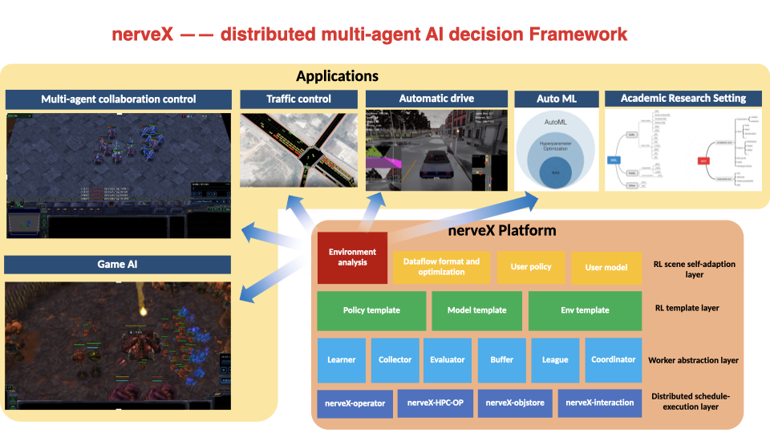

Welcome to nerveX's documentation!
=====================================

Overview
------------
nerveX is an AI decision training framework, especially in deep reinforcement learning. It supports most traditional RL algorithms,
such as DQN, PPO, SAC, and domain-specific algorithms like QMIX in multi-agent RL, GAIL in inverse RL, and RND in exploration problems.
The whole supported algorithms introduction can be found in `Algorithm <./feature/algorithm_overview.html>`_.

For scalability, nerveX supports three different training pipeline:

  - ``serial``

    - pipeline: single-machine multi-gpu learner-collector serial execution
    - usage: academic research and algorithm validation
  - ``parallel``

    - pipeline: single-machine multi-gpu learner-collector parallel execution
    - usage: speed up serial pipeline and introduction to the whole distributed training
  - ``dist``

    - pipeline: multi-machine multi-gpu learner-collector distributed execution
    - usage: large scale AI decision application, such as AlphaStar league training

Main Features
--------------

  * DRL algorithm zoo and benchmark
  * Large scale DRL training demonstration and application
  * Customized DRL demand implementation, such as Inverse RL/RL hybrid training; Multi-buffer training; League self-play training
  * User-friendly interface(Policy/Env/Config)
  * Various efficiency optimization module: HPC_RL, ObjStore, EnvManager, DataLoader
  * k8s support, nerveX-operator k8s lustre scheduler for dynamic collectors and other services
  * 95%+ code coverage and simple algorithm performance test, PEP8 code style, and typing lint

To get started, take a look over the `quick start <./quick_start/index.html>`_ and `API documentation <./api_doc/index.html>`_.
For RL beginners, nerveX advises you to refer to `hands-on RL <hands_on/index.html>`_ for more discussion.
If you want to deeply customize your algorithm and application with nerveX, also checkout `key concept <./key_concept/index.html>`_ and `Feature <./feature/index.html>`_. 

.. toctree::
   :maxdepth: 2
   :caption: User Guide

   installation/index
   quick_start/index
   key_concept/index
   intro_rl/index
   hands_on/index
   best_practice/index
   api_doc/index

   faq/index
   feature/index
   supplementary_rl/index

.. toctree::
   :maxdepth: 2
   :caption: Developer Guide

   guide/index
   tutorial_dev/index
