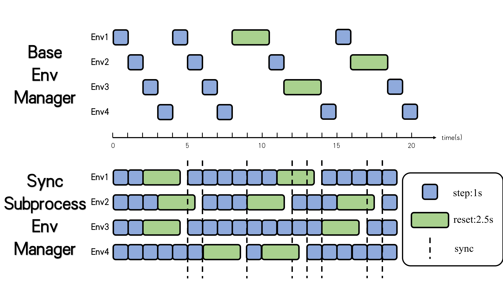
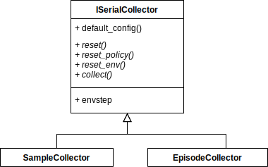
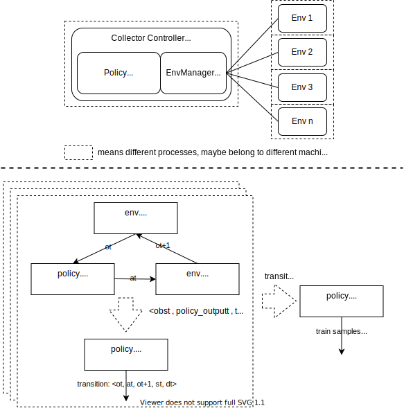

Key Concept
===============================

.. toctree::
   :maxdepth: 3

Here we show some key concepts about reinforcement learning training and evaluation pipeline designed by nerveX. One of basic control flow(serial pipeline) can be described as:

.. image::
   images/serial_pipeline.png
   :align: center

In the following sections, nerveX first introduces the key concepts/components separately, then combines them like building a special "Evolution Graph" to offer different computation patterns(serial, parallel, dist).

Concept
----------
``Environment`` and ``policy`` are the most two important concepts in the total design scheme, which can also be called description modules, in most cases, the users of nerveX only need to pay
attention to these two components.

``Worker`` modules, such as ``learner``, ``collector``, and ``buffer``, are execution modules implementing the corresponding tasks derived from the description modules. These worker
modules are general in many RL algorithms, but the users can also override their components easily, the only restriction is to obey the basic interface definition.

Last but not least, ``config`` is the recommended tool to control and record the whole pipeline.

.. tip::
  Environment and policy are partially extended from the original definition in other RL papers and frameworks.

Environment
~~~~~~~~~~~~~
nerveX environment is a superset of ``gym.Env``, it is compatible with gym env interfaces and offers some optional interfaces, e.g.: dynamic seed, collect/evaluate setting, `Env Link <../feature/env_overview.html>`_

``EnvManager``, usually called Vectorized Environments in other frameworks, aims to implement parallel environment simulation to speed up data collection. Instead of interacting with 1 environment per collect step, it allows the collector to interact with N homogeneous environments per step, which means that ``action`` passed to ``env.step`` is a vector with a length of N, and the return value of ``env.step`` (obs, reward, done) is the same as it.

For the convenience of **asynchronous reset** and **unifying asynchronous/synchronous step**, nerveX modifies the interface of env manager like this:

.. code:: python

   # nerveX EnvManager                                                            # pseudo code in the other RL papers
   env.launch()                                                                   # obs = env.reset()
   while True:                                                                    # while True:
       obs = env.ready_obs                                                              
       action = random_policy.forward(obs)                                        #     action = random_policy.forward(obs)
       timestep = env.step(action)                                                #     obs_, reward, done, info = env.step(action)
       # maybe some env_id matching when enable asynchronous
       transition = [obs, action, timestep.obs, timestep.reward, timestep.done]    #     transition = [obs, action, obs_, reward, done]
                                                                                  #     if done:
                                                                                  #         obs[i] = env.reset(i)
       if env.done:                                                               #     if env.done  # collect enough env frames
           break                                                                  #         break

There are three types EnvManager in nerveX now:

  - BaseEnvManager——**local test and validation**
  - SyncSubprocessEnvManager——parallel simulation for **low fluctuation environment**
  - AsyncSubprocessEnvManager——parallel simulation for **high fluctuation environment**

The following demo graphs shows the detailed runtime logics between ``BaseEnvManager`` and ``SyncSubprocessEnvManager``:

For the subprocess-type env manager, nerveX uses shared memory among different worker subprocesses to save the cost of IPC, and `pyarrow <https://github.com/apache/arrow>`_ will be a reliable alternative in the following version.

.. note::
   If the environment is some kind of client, like SC2 and CARLA, maybe a new env manager based on python thread can be faster.

.. note::
   If there are some pre-defined neural networks in the environment using GPU, like the feature extractor VAE trained by self-supervised training before RL training, nerveX recommends to utilize parallel executions in each subprocess rather than stack all the data in the main process and then forward this network. Moreover, it is not an elegant method, nerveX will try to find some new flexible and general solution.

Besides, for robustness in practical usage, like IPC error(broken pipe, EOF) and environment runtime error, nerveX also provides a series of **Error Tolerance** tools, e.g.: watchdog and auto-retry.

For all the mentioned features, the users can refer to `EnvManager Overview <../feature/env_manager_overview.html>`_ for more details.

Policy
~~~~~~~
To unify the design pattern and modularization of RL and other machine learning algorithms, nerveX abstracts and defines the general policy interfaces with multi-mode design.
With these abstractions, plenty of the AI decision algorithms can be summarized in only one python file, i.e.: corresponding policy class. And the user's customized algorithms only need to inherit and extend :class:`Policy <nervex.policy.Policy>` or just have the same interface definition with it. 

The Multi-Mode of Policy
^^^^^^^^^^^^^^^^^^^^^^^^^^
In most cases, RL policy needs to execute different algorithm procedures for different usages, e.g.: for DQN, the model forward and calculating TD error in training,
the model forward without gradient computation and use epsilon-greedy to select actions for exploration in collecting. Therefore, nerveX policy unifies all the algorithm content in only one python file,
prepares some simple interface methods, and combines them into 3 common modes——**learn_mode, collect_mode, eval_mode**, as is shown in the next graph:

.. image::
   images/policy_mode.png

Learn_mode aims to policy updating, collect_mode does proper exploration and exploitation to collect training data, eval_mode evaluates policy performance clearly and fairly. And the users can customize their
own algorithm ideas by overriding these modes or design their customized modes, such as hyperparameters annealing according to training result, select battle players in self-play training, and so on. For more details,
the users can refer to `Policy Overview <../feature/policy_overview.html>`_.

.. note::
   ``policy.learn_mode`` is not the instance of :class:`Policy <nervex.policy.Policy>` but a pure interface collection(implemented by namedtuple), which means the users can implement their policy class just ensuring the same method names and input/output arguments as the corresponding modes.

Shared Model + Model Wrapper
^^^^^^^^^^^^^^^^^^^^^^^^^^^^^
Neural network, often called model, is the one of most important components in the whole algorithm. For serial pipeline, the model is usually created in the public common constructor method(``__init__``) or out of policy and passed to the policy as arguments. Therefore, the model is shared among different modes for convenience. And nerveX extends the model with more runtime function by ``Model Wrapper`` , which makes the shared model can exhibit different behaviors in different modes, such as sampling action by multinomial distribution in collect mode while :math:`argmax` in evaluating mode. Here are some concrete code examples:

.. code:: python

    from nervex.model import model_wrap, DiscreteNet

    model = DiscreteNet(obs_shape=(4, 84, 84), action_shape=6, encoder_type='conv2d')
    # only wrapper, no model copy
    learn_model = model_wrap(model_wrap, wrapper_name='base')
    collector_model = model_wrap(model, wrapper_name='multinomial_sample')
    eval_model = model_wrap(model, wrapper_name='argmax_sample')

If you want to know about the detailed information of the pre-defined model wrapper or customize your model wrapper, `Wrapper Overview <../feature/wrapper_hook_overview.html>`_ can help you a lot.

Processing Function
^^^^^^^^^^^^^^^^^^^^^^
In practical algorithm implementations, the users often need to many data processing operations, like stacking several samples into a batch, data transformation between torch.Tensor and np.ndarray. As for RL
algorithms themselves, there are a great number of different styles of data pre-processing and aggregation, such as calculating N-step return and GAE(Generalized Advantage Estimation), split trajectories or unroll segments, and so on. Since then, nerveX has provided some common processing functions, which can be called as a pure function. And the users can utilize these functions both in collect mode and in learning mode. 

For example, where should we calculate advantages for some on-policy algorithms, such as A2C/PPO, learn mode or collect mode? The former can distribute computation to different collector nodes in distributed
training for saving time, and the latter can usually gain better performance due to more accurate approximation, just a trade-off. For a framework, it is more wiser to offer some powerful and efficient tools rather
than restricting some fixed pipelines. The following table shows some existing processing functions and related information:

====================== ========================================== ==============================
Function Name          Description                                Path
====================== ========================================== ==============================
default_collate        Stack samples(dict/list/tensor) into batch nervex.data.collate_fn
default_decollate      Split batch into samples                   nervex.data.collate_fn
get_nstep_return_data  Get nstep data(reward, next_obs, done)     nervex.rl_utils.adder
get_gae                Get GAE advantage                          nervex.rl_utils.adder
to_tensor              Transform data to torch.Tensor             nervex.torch_utils.data_helper
to_device              Transform device(cpu or cuda)              nervex.torch_utils.data_helper
====================== ========================================== ==============================

Scale Up to Parallel Training
^^^^^^^^^^^^^^^^^^^^^^^^^^^^^^^
TBD

Config
~~~~~~~~~

key concept
^^^^^^^^^^^^

The Config module is one of the most commonly used modules by users. It
is a configuration system that contains all the common parameters that
need to be configured. Its function is very powerful, as small as
configuring a common hyperparameter, as large as configuring the
required algorithm type, it can do it all. To reduce the cost
for users to write config, we designed a Config module based on the
idea of bubble fish. The overall design diagram is as follows

.. image:: images/config.png
   :alt: 

Config is mainly composed of two types of config, namely *Policy* and
*Env* config. We compare the construction process of config to the
process of building a tree.

From bottom to top we are building the entire tree, which is the
*compile* process. In the *compile* process, we will first get the
default config of each module such as Learner, Collector, etc. After
having the default config of each sub-module, we will build the policy
config and env config, and then merge with the user configs, Get the
final config. From top to bottom, we are instantiating the entire tree,
instantiating the various modules we use, that is, the *initialization*
process, starting with policy and env, and then to each submodule. When
the tree is constructed, we have completed our preparations and can
start the entire RL process.

To reduce the trouble for users to write config and reuse the
previous parameter settings as much as possible, we divide config into
two parts, one part is *default config*, which is the default config
recommended by Nervex, which sets default values for common keys; The
other part is *user config*, which is a user-defined config. So users
only need to pay attention to the part of config they want to modify,
and other configs can reuse previous experience values.

NerveX recommends using a config ``dict`` defined in a python file as
input.

.. code:: python

   cartpole_dqn_default_config = dict(
       env=dict(
           manager=dict(...),
           ...
       ),
       policy=dict(
           model=dict(...),
           collect=dict(...),
           learn=dict(...),
           eval=dict(...),
           other=dict(
               replay_buffer=dict(),
               ...
           ),
           ...
       ),
   )

config overview
^^^^^^^^^^^^^^^^

The specific meanings and default values of some common keys are shown
in the table below. For policy-related keys, please refer to the
document `Hans On
RL <http://open-xlab.pages.gitlab.bj.sensetime.com/cell/nerveX/hands_on/index.html>`__
section.

+-------------------------------+-------------------------------------+
| Key                           | Meaning                             |
+===============================+=====================================+
| policy.batch_size             | (int) the number of data for a      |
|                               | train iteration                     |
+-------------------------------+-------------------------------------+
| policy.update_per_collect     | (int) collect n_sample data,        |
|                               | train model update_per_collect      |
|                               | times                               |
+-------------------------------+-------------------------------------+
| policy.n_sample               | (int) collect n_sample data,        |
|                               | train model update_per_collect times|
+-------------------------------+-------------------------------------+
| policy.nstep                  | (int) how many steps are used when  |
|                               | calculating TD-error.               |
+-------------------------------+-------------------------------------+
| policy.cuda                   | (bool) whether to use cuda when     |
|                               | training                            |
+-------------------------------+-------------------------------------+
| policy.priority               | (bool) whether to use priority      |
|                               | replay buffer                       |
+-------------------------------+-------------------------------------+
| policy.on_policy              | (bool) whether to use on policy     |
|                               | training                            |
+-------------------------------+-------------------------------------+
| env.stop_value                | (int) when reward exceeds           |
|                               | env.stop_value, the training will   |
|                               | exits                               |
+-------------------------------+-------------------------------------+
| env.collector_env_num         | (int) number of env to collect data |
|                               | when training                       |
+-------------------------------+-------------------------------------+
| env.evaluator_env_num         | (int) number of env to collect data |
|                               | when evaluating                     |
+-------------------------------+-------------------------------------+

Rules when merging user-specific config and predefined config:

-  User-specific config is the highest priority, which means user's
   specific fiction will cover the default config when conflict occurs.

-  Some important keys must be specified, ``env.stop_value``,
   ``policy.on_policy``, and ``policy.unroll_len``, for example.

-  The merged config will be saved to ``formatted_total_config.py`` be
   default.

.. _header-n125:

How to customize?
^^^^^^^^^^^^^^^^^^

Imagine the following scenario: We want to set ``nstep`` mentioned above
to 3, how do we do it? This problem can be solved with the *user config*
mentioned above.

User config is written in ``.py`` file by default, and a whole config
is a dictionary, that is, ``dict`` in python. So to set
``nstep``, suppose the file name of user config is
``dqn_user_config.py``, add the following code inside.

.. code:: python

   policy=dict(learn=dict(nstep=3))

After writing the user config, we can run our DQN experiment according
to `Quick
Start <http://open-xlab.pages.gitlab.bj.sensetime.com/cell/nerveX/quick_start/index.html>`__.

Worker-Collector
~~~~~~~~~~~~~~~~~~
Collector is one of the most important components among all the workers, which is often called ``actor`` in other frameworks and nerveX renames it to distinguish with actor-critic. It aims to offer sufficient 
quantity and quality data for policy training (learner). And collector is only responsible for data collection but decoupled with data management, that is to say, it returns collected trajectories directly and 
these data can be used for training directly or pushed into replay buffer.

There are 3 core parts for a collector——env manager, policy(collect_mode), collector controller, and these parts can be implemented in a 
single process or located in several machines. Usually, nerveX use a multi-process env_manager and another main loop controller process with policy to construct a collector, which may be extended in the future.

Due to different send/receive data logic, the collector now is divided into two patterns——serial and parallel, we will introduce them separately.

Serial Collector
^^^^^^^^^^^^^^^^^^^
From the viewpoint of the basic unit of collecting data, sample(step) and episode are two mainly used types. Therefore, nerveX defines the abstract interfaces ``ISerialCollector`` for a serial collector and 
implements ``SampleCollector`` and ``EpisodeCollector``, which covers almost RL usages but the users can also easily customize when encountering some special demands.

The core usage of collector is quite simple, the users just need to create a corresponding type collector and indicate ``n_sample`` or ``n_episode`` as the argument of ``collect`` method. Here is a naive example:

.. code:: python

    import gym
    from easydict import EasyDict
    from nervex.policy import DQNPolicy
    from nervex.env import BaseEnvManager
    from nervex.worker import SampleCollector, EpisodeCollector

    # prepare components
    cfg: EasyDict  # config after `compile_config`
    normal_env = BaseEnvManager(...)  # normal vectorized env
    
    dqn_policy = DQNPolicy(cfg.policy)
    sample_collector = SampleCollector(cfg.policy.collect.collector, normal_env, dqn_policy.collect_mode)
    episode_collector = EpisodeCollector(cfg.policy.collect.collector, normal_env, dqn_policy.collect_mode)

    # collect 100 train sample
    data = sample_collector.collect(n_sample=100)
    assert isinstance(data, list) and len(data) == 100
    assert all([isinstance(item, dict) for item in data])

    # collect 10 env episode
    episodes = episode_collector.collect(n_episode=10)
    assert isinstance(episodes, list) and len(episodes) == 10

    # push into replay buffer/send to learner/data preprocessing

.. note::
    For all cases, the number of collect data, n_sample/n_episode, is fixed in the total training procedure, so our example codes set this field in configs, such as ``config.policy.collect.n_sample``.

The structure and main loop of collector can be summarized as the next graph, the interaction of policy and env consists of ``policy.forward``, ``env.step`` and the related support codes. Then ``policy.process_transition`` and
``policy.get_train_sample`` contributes to process data into training samples and pack them to a list. For ``EpisodeCollector``, which is usually used in some cases that need to do special post-processing, 
``policy.get_train_sample`` is disabled and the users can do anything after receiving the collected data.

Sometimes, we use different policies even different envs to collect data, such as using random policy at the beginning of training to prepare warmup data, and calculate distillation loss with the probability of 
expert policy. And all the demands can be implemented by ``reset_policy``, ``reset_env``, ``reset`` method like this:

.. code:: python
   
    # prepare components
    dqn_policy = DQNPolicy(...)
    random_policy = RandomPolicy(...)
    expert_policy = ExpertPolicy(...)

    collector = SampleCollector(...)
    replay_buffer = NaiveBuffer(...)

    # train begining(random_policy)
    collector.reset_policy(random_policy.collect_mode)
    random_data = collector.collect(n_sample=10000)
    replay_buffer.push(random_data)
    # main loop
    while True:
        ...
        collector.reset_policy(dqn_policy.collect_mode)
        data = collector.collect(n_sample=100)
        collector.reset_policy(expert_policy.collect_mode)
        expert_data = collector.collect(n_sample=100)
        # train dqn_policy with collected data
        ...

Besides, serial collector shows less difference between on-policy and off-policy algorithms, the only thing is to reset some statistics and temporal buffers, which can be automatically executed by collector, the 
users just need to ensure the correct value of ``config.policy.on_policy``.

Last, there are some other features such as collecting data with asynchronous env_manager, dealing with abnormal env steps, please refer to `Collector Overview <../feature/collector_overview.html>`_.

Parallel Collector
^^^^^^^^^^^^^^^^^^^
TBD

Worker-Buffer
~~~~~~~~~~~~~~~

Replay buffer is a component to store data collected by collector or generated by a fixed policy(usually expert policy), then provide data for the learner to optimize policy. In nerveX, there are **three types of replay buffers**:

   - NaiveReplayBuffer
   - AdvancedReplayBuffer
   - EpisodeReplayBuffer

These three are all subclasses derived from abstract Interface ``IBuffer``.

.. image::
   images/buffer_class_uml.png
   :align: center
   :scale: 50%

The key methods of a buffer are ``push`` and ``sample``. ``NaiveReplayBuffer`` is a simple FIFO queue implementation. It only provides basic functions of the two methods.

   1. ``push``: Push some collected data in the buffer. If exceeding the max size of the buffer, queue head data will be removed out of buffer.
   2. ``sample``: Uniformly sample a list with length `batch_size` by random.

Based on ``NaiveReplayBuffer``, ``AdvancedReplayBuffer`` and ``EpisodeReplayBuffer`` respectively implements more functions and features.

``AdvancedReplayBuffer`` implements the following features: (Also shown in the figure)

   - **Prioritized Sampling**. Completely implement paper `Prioritized Experience Replay <https://arxiv.org/abs/1511.05952>`_
   - **Monitor data quality(use_count and staleness)**. If a piece of data is used too many times or is too stale to optimize policy, it will be removed out of the buffer.

   .. note::
      **use_count**: Count how many times a piece of data is sampled. 

      **staleness**: Model iteration gap between the time when it is collected and the time when it is sampled
   
   - **Throughput monitor and control**. In a fixed period, count how many pieces of data are pushed into, sampled out of, removed out of the buffer. Control the ratio "Pushed in" / "Sampled out" in a range, in case the dataflow speed does not match.
   - **Logger**. Sampled data attributes and throughput are shown in text logger and tensorboard logger.

.. image::
   images/advanced_buffer.png
   :align: center
   :scale: 65%
   

.. tip::
   By default, most policies in nerveX adopt ``AdvancedReplayBuffer``, because we think monitor and logger are rather important in debugging and policy tuning. However, if you are sure that you do not need all the features above, you can feel free to switch to simpler and faster ``NaiveReplayBuffer``.

``EpisodeReplayBuffer`` is designed for some special cases where they need a whole episode rather than separated samples. For example: In chess, go or card games, players get reward only when the game is over; In some algorithms like `Hindsight Experience Replay <https://arxiv.org/abs/1707.01495>`_, must sample out a whole episode and operate on it. Therefore, in ``EpisodeReplayBuffer``, each element is no longer a training sample, but an episode.

In nerveX, we define **full data** and **meta data**. **Full data** is often a dict, with keys ``['obs', 'action', 'next_obs', 'reward', 'info']`` and some optional keys like ``['priority', 'use_count', 'collect_iter', ...]``. However, in some complex environments(Usually we run them in parallel mode), ``['obs', 'action', 'next_obs', 'reward', 'info']`` can be too big to store in memory. Therefore, we store them in file system, and only store **meta data** including ``'file_path'`` and optional keys in memory. Therefore, in parallel mode, when removing the data out of buffer, we must not only remove meta data in memory but also remove that in the file system as well.

If you want to know more details about the three types of replay buffers, or the remove mechanism in parallel mode, please refer to `Replay Buffer Overview <../feature/replay_buffer_overview.html>`_

Worker-Evaluator
~~~~~~~~~~~~~~~~

Evaluator is also the basic execution component of nerveX. It is used to determine whether a policy meets the convergence standard. And we explicitly construct this module to make the evaluation more clear, 
instead of some implicit functions in other frameworks. After every fixed training iterations, we use the evaluator to interact with the environment to judge whether the reward reaches the convergence standard.

Like collector, there are 3 core parts for an evaluator——env manager, policy(eval_mode), evaluator controller, and these parts can be implemented in a single process or located in several machines. Usually, nerveX
uses a multi-process env_manager and another main loop controller process with policy to construct an evaluator, which may be extended in the future.

Serial Evaluator
^^^^^^^^^^^^^^^^^^^

Serial evaluator uses ``n_episode`` argument to interact with environment. It means that we need to collect n episodes results to judge whether the model reaches the convergence condition.

The core usage of evaluator is quite simple. 
And in practice, the users just need to create a evaluator and indicate n_episode as the argument of eval method. Here is a naive example:

.. code:: python

    import gym
    from easydict import EasyDict
    from nervex.policy import DQNPolicy
    from nervex.env import BaseEnvManager
    from nervex.worker import BaseSerialEvaluator

    # prepare components
    cfg: EasyDict  # config after `compile_config`
    normal_env = BaseEnvManager(...)  # normal vectorized env
    
    dqn_policy = DQNPolicy(cfg.policy)
    evaluator = BaseSerialEvaluator(cfg.policy.eval.evaluator, normal_env, dqn_policy.eval_mode)

    # evalulate 10 env episode
    stop, reward = evaluator.eval(learner.save_checkpoint, learner.train_iter, collector.envstep, n_episode=10)
    assert isinstance(reward, list) and len(reward) == 10

    # judge whether the return value reaches the convergence standard
    if stop:
       break

.. note::
   For evaluation criterion, ``stop_value`` and ``n_evaluator_episode`` are two essential arguments, such as ``stop_value=195`` and ``n_evaluator_episode=100`` in cartpole environment. And the users should
   indicate these two arguments in the ``env`` field of config(i.e. ``env.stop_value``, ``env.n_evaluator_episode``). And they will be passed to evaluator so that we don't need to set them in eval method except
   some special cases.

Combined with the evaluation condition(i.e. ``should_eval`` method), We can add the evalulator into the training pipeline as follows:

.. code:: python

    for _ in range(max_iterations):
        
        # Evaluate policy performance
        if evaluator.should_eval(learner.train_iter):
            #load model
            stop, reward = evaluator.eval(learner.save_checkpoint, learner.train_iter, collector.envstep)
            # if stop flag, exit the process
            if stop:
                break
            # if not stop flag, continue to collect data and train the model
            new_data = collector.collect(train_iter=learner.train_iter, policy_kwargs=collect_kwargs)

.. tip::
   **How to judge whether the model converges or not?**

   We judge whether the model converges or not by the average value of several episode rewards. There are three types of average reward: winning probability, total cumulative reward and average unit step reward.
   Winning probability: In some games, we don't pay attention to the rewards in the game process, but we focus on whether the final result is successful. In these environments, we use winning probability as the
   convergence condition. Such as ``SMAC`` environment, we can use the winning probability (like 1.0 in 3s5z) as the convergence condition.
   Total cumulative reward: In some games, we need to make the total score as large as possible. In these environments, we use total cumulative reward as the convergence condition. Such as ``cartpole``， ``lunarlander`` environment, we can use the total cumulative reward (like 200) as the convergence condition.
   Average unit step reward: In some games, we need to make the total reward as large as possible and reduce the number of unnecessary exploration steps. In these environments, we use average unit step reward as the convergence condition.
   Besides, a reliable RL experiment should be repeated 3~5 times with different random seeds, and some statistics such as the median value and the mean/std value can be more convincing.

.. tip::

   **How to solve the problem that the environment in each evaluator has the different length?**
   
   In nerveX, You may have registered n evaluator episodes but you only have m environments (n is more than m). In these case, the environment in each evaluator has the different length.
   We use ``VectorEvalMonitor`` to solve these problems. For example, we have five environments and we need eight evaluator episdodes. In this case, we register two episodes for each of the first three environments and register one episode for each of the last two environments.
   We use ``get_episode_reward`` to get the sum of the rewards of k episodes in each environment. And we use ``get_current_episode`` to get the episode num k in each environment. 

Worker-Learner
~~~~~~~~~~~~~~~~~~

Entry(optional)
~~~~~~~~~~~~~~~~~

.. tip::
  If you want to know more details about algorithm implementation, framework design, and efficiency optimization, we also provide the documentation of `Feature <../feature/index.html>`_, 

Computation Pattern
----------------------

Serial Pipeline
~~~~~~~~~~~~~~~~~

Parallel/Dist Pipeline
~~~~~~~~~~~~~~~~~~~~~~~~
TBD
