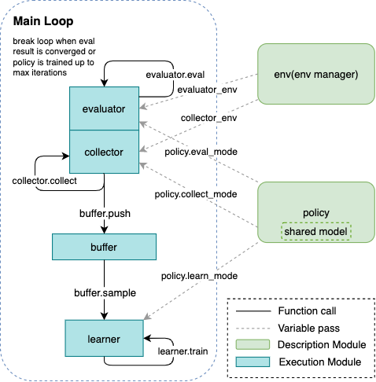
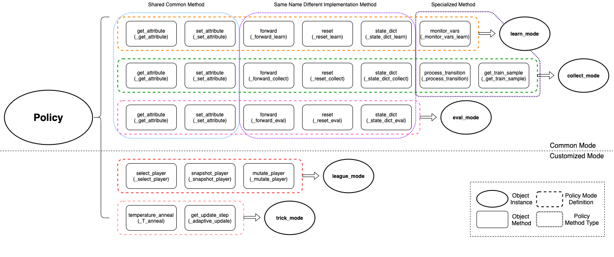
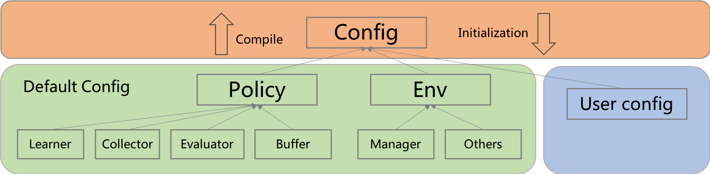
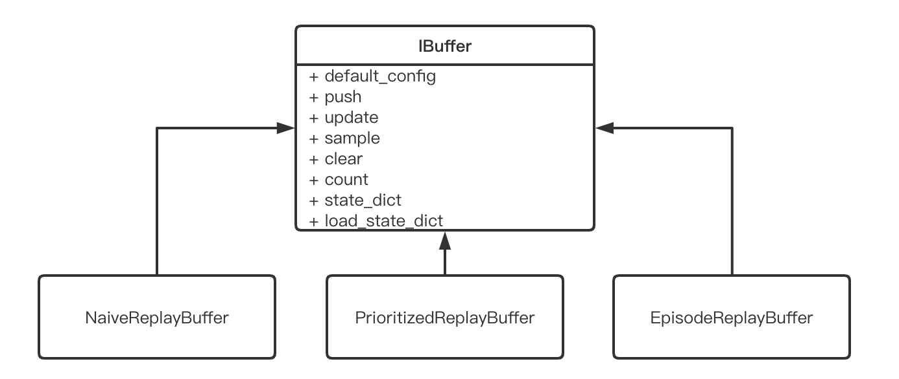
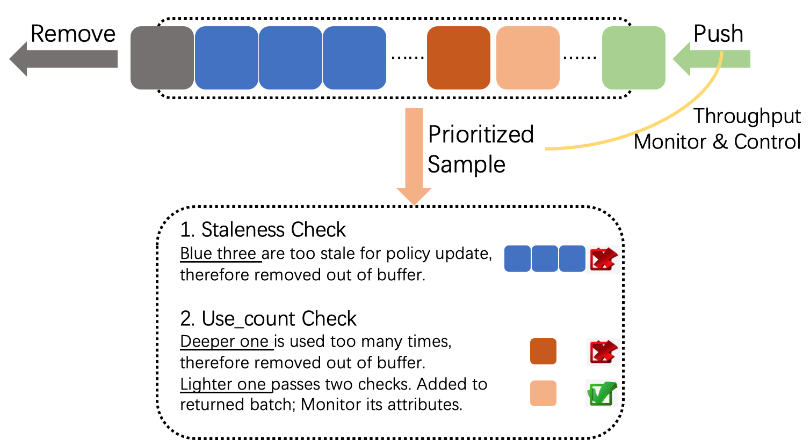

Key Concept
===============================

.. toctree::
   :maxdepth: 3

Here we show some key concepts about reinforcement learning training and evaluation pipeline designed by nerveX. One of basic control flow(serial pipeline) can be described as:

In the following sections, nerveX first introduces the key concepts/components seperately, then combines them like building a special "Evolution Graph" to offer diffenent computation patterns(serial, parallel, dist).

Concept
----------
``Environment`` and ``policy`` is the most two important concepts in the total design scheme, which can also be called description modules, in most cases, the users of nerveX only need to pay
attention to these two components.

``Worker`` module, such as ``learner``, ``collector``, and ``buffer``, are execution modules implementing the corresponding tasks derived from the description modules. These worker
module are general in many RL algorithms, but the users can also override their own components easily, the only restirction is to obey the basic interface definition.

Last but not least, ``config`` is the recommended tool to control and record the whole pipeline.

.. tip::
  Environment and policy are partially extended from the original definition in other RL papers and frameworks.

Environment
~~~~~~~~~~~~~
nerveX environment is a superset of ``gym.Env``, it is compatibled with almost gym env interfaces and offers some optional interfaces, e.g.: dynamic seed, collect/evaluate setting, `Env Link <../feature/env_overview.html>`_

``EnvManager``, usually called Vectorized Environments in other frameworks, aims to implement parallel environment simulation to speed up data collection. Instead of interacting with 1 environment per collect step, it allows collector to interact with N homogeneous environments per step, which means that ``action`` passed to ``env.step`` is a vector with length of N, and the return value of ``env.step`` (obs, reward, done) is the same as it.

For the convenience of **asynchronous reset** and **unifying asynchronous/synchronous step**, nerveX modifies the inferface of env manager like this:

.. code:: python

   # nerveX EnvManager                                                            # pseudo code in the other RL papers
   env.launch()                                                                   # obs = env.reset()
   while True:                                                                    # while True:
       obs = env.ready_obs                                                              
       action = random_policy.forward(obs)                                        #     action = random_policy.forward(obs)
       timestep = env.step(action)                                                #     obs_, reward, done, info = env.step(action)
       # maybe some env_id matching when enable asynchronous
       transition = [obs, action, timestep.obs, timstep.reward, timestep.done]    #     transition = [obs, action, obs_, reward, done]
                                                                                  #     if done:
                                                                                  #         obs[i] = env.reset(i)
       if env.done:                                                               #     if env.done  # collect enough env frames
           break                                                                  #         break

There are three types EnvManager in nerveX now:

  - BaseEnvManager——**local test and validation**
  - SyncSubprocessEnvManager——parallel simulation for **low fluctuation environment**
  - AsyncSubprocessEnvManager——parallel simulation for **high fluctuation environment**

For the subprocess-type env manager, nerveX use shared memory among different worker subprocesses to the save the cost of IPC, and `pyarrow <https://github.com/apache/arrow>`_ will be a reliable alternative in the following version.

.. note::
   If the environment is some kind of client, like SC2 and CARLA, maybe a new env manager based on python thread can be faster.

.. note::
   If there are some pre-defined neural network in environment using GPU, like the feature extractor VAE trained by self-supervised training before RL training, nerveX recommends to utilze parallel executions in each subprocess rather than stack all the data in main process and then forward this netowrk. Moreover, it is not a elegant method, nerveX will try to find some new flexible and general solution.

Besides, for robustness in pratical usage, like IPC error(broken pipe, EOF) and environment runtime error, nerveX also provide a series of **Error Tolerance** tools, e.g.: watchdog and auto-retry.

All the mentioned features, the users can refer to `EnvManager Overview <../feature/env_manager_overview.html>`_ for more details.

Policy
~~~~~~~
In order to unify the design pattern and modularization of RL and other machine learning algorithms, nerveX abstracts and defines the general policy interfaces with multi-mode design.
With these abstractitons, plenty of the AI decision algorithms can be summarized in only one python file, i.e.: corresponding policy class. And the user's customized algorithms only need to inherit and extend :class:`Policy <nervex.policy.Policy>` or just have the same interface definition with it. 

The Multi-Mode of Policy
^^^^^^^^^^^^^^^^^^^^^^^^^^
In most cases, RL policy needs to execute different algorithm proceduces for different usages, e.g.: for DQN, model forward and calculating TD error in training,
model forward without gradient computation and use epsilon-greedy to select action for exploration in collecting. Therefore, nerveX policy unifies all the algorithm content in only one python file,
prepares some simple interface methods, and combines them into 3 common modes——**learn_mode, collect_mode, eval_mode**, as is shown in the next graph:

Learn_mode aims to policy updating, collect_mode does proper exploration and exploitation to collect training data, eval_mode evaluates policy performance clearly and fairly. And the users can customize their
own algorithm ideas by overriding these modes or design their own customized modes, such as hyperparameters annealing according to training result, select battle players in self-play training and so on. For more details,
the users can refer to `Policy Overview <../feature/policy_overview.html>`_.

.. note::
   ``policy.learn_mode`` is not the instance of :class:`Policy <nervex.policy.Policy>` but a pure interface collection(implemented by namedtuple), which means the users can implement their own policy class just ensuring the same method names and input/output arguments as the corresponding modes.

Shared Model + Model Wrapper
^^^^^^^^^^^^^^^^^^^^^^^^^^^^^
Neural network, often called model, is the one of most important components in the whole algorithm. For serial pipeline, the model is usually created in the public common constructor method(``__init__``) or out of policy and passed to policy as arguments. Therefore, the model is shared among different modes for convenience. And nerveX extends the model with more runtime function by ``Model Wrapper`` , which makes the shared model can exhibit different behaviours in different modes, such as sampling action by multinomial distribution in collect mode while argmax in evaluate mode. Here are some concrete code examples:

.. code:: python

    from nervex.model import model_wrap, DiscreteNet

    model = DiscreteNet(obs_shape=(4, 84, 84), action_shape=6, encoder_type='conv2d')
    # only wrapper, no model copy
    learn_model = model_wrap(model_wrap, wrapper_name='base')
    collector_model = model_wrap(model, wrapper_name='multinomial_sample')
    eval_model = model_wrap(model, wrapper_name='argmax_sample')

If you want to know about the detailed information of the pre-defined model wrapper, or customize you own model wrapper, `Wrapper Overview <../feature/wrapper_hook_overview.html>`_ can help you a lot.

Processing Function
^^^^^^^^^^^^^^^^^^^^^^

Scale Up to Parallel Training
^^^^^^^^^^^^^^^^^^^^^^^^^^^^^^^

Config
~~~~~~~~~
Config模块是用户最常用到的模块之一，它是一套配置系统，包含了常见需要配置所有参数。它的功能非常强大，小到配置一个常见的超参数，大到配置需要的算法类型，它都可以做到。为了减少用户写config的成本，我们设计了一套基于boble
fish思想的Config模块，总的设计图如下

Config主要由两大类config组成，即\ *Policy*\ 和\ *Env*\ 的config.
我们将config的构建过程类比于构建一颗树的过程。

从下往上我们是在构建整颗树，即\ *compile*\ 过程。在\ *compile*\ 过程中，我们会先拿到各个模块的default
config比如Learner、Collector等，有了各个子模块的default
config之后，我们会构建policy的config和env的config，再和user
config进行合并，得到最后的config。从上往下我们是在实例化整颗树，实例化我们用到的各个模块，即\ *initialization*\ 过程，从policy和env开始，然后到各个子模块。当这颗树构建完成之后，我们就完成了我们的准备工作，就可以开始启动整个RL过程了。

为了减少用户写config的麻烦，尽量复用之前的参数设置，我们将config分为两个部分，一个部分是\ *default
config*\ ，这是Nervex推荐的默认config，给常见的key设置了默认值；另外一部分是\ *user
config*\ ，这是用户自定义的config。所以用户只需要关注自己想要修改的那部分config就行了，其他config都可以复用之前的经验值。

关于一些常见key的具体含义和默认值如下表，与policy相关的key可以查看文档中\ `Hands On RL <../hands_on/index.html>`__\ 部分

=== ======= =============
Key Meaning Default Value
=== ======= =============
A           
b           
c           
d           
e           
=== ======= =============

How to customize?
^^^^^^^^^^^^^^^^^^

想象如下一个场景：我们想要在SAC中取消用\ ``auto_alpha``\ ，那我们如何做到呢？这个问题可以用上面提到的\ *user
config*\ 来解决。

User
config我们默认采用\ ``.py``\ 文件来编写，整个config是一个dictionary，即python中的\ ``dict``\ 。所以为了实现\ ``auto_alpha``\ ，假设user
config的文件名为\ ``sac_user_config.py``\ ，在里面加上如下代码即可

.. code:: python

   policy=dict(learn=dict(is_auto_alpha=False))

编写完user config之后，我们可以执行

.. code:: shell

   nervex -m serial -c sac_user_config.py -s 0

来运行基于SAC的实验.

Worker-Collector
~~~~~~~~~~~~~~~~~~

Worker-Buffer
~~~~~~~~~~~~~~~

Replay buffer is a component to store data collected by collector or generated by a fixed policy(usually expert policy), then provide data for learner to optimize policy. In nerveX, there are **three types of replay buffers**:

   - NaiveReplayBuffer
   - AdvancedReplayBuffer
   - EpisodeReplayBuffer

These three are all subclasses derived from abstract Interface ``IBuffer``.

The key methods of a buffer are ``push`` and ``sample``. ``NaiveReplayBuffer`` is a simple FIFO queue implementation. It only provides basic functions of the two methods.

   1. ``push``: Push some collected data in the buffer. If exceeding the max size of the buffer, queue head data will be removed out of buffer.
   2. ``sample``: Uniformly sample a list with length `batch_size` by random.

On the basis of ``NaiveReplayBuffer``, ``AdvancedReplayBuffer`` and ``EpisodeReplayBuffer`` respctively implements more functions and features.

``AdvancedReplayBuffer`` implements following features: (Also shown in figure)

   - **Prioritized Sampling**. Completely implement paper `Prioritized Experience Replay <https://arxiv.org/abs/1511.05952>`_
   - **Monitor data quality(use_count and staleness)**. If a piece of data is used too many times, or is too stale to optimize policy, it will be removed out of buffer.

   .. note::
      **use_count**: Count how many times a piece of data is sampled. 

      **staleness**: Model iteration gap between the time when it is collected and the time when it is sampled
   
   - **Throughput monitor and control**. In a fixed period of time, count how mnay pieces of data are pushed into, sampled out of, removed out of the buffer. Control the ratio "Pushed in" / "Sampled out" in a range, in case the dataflow speed does not match.
   - **Logger**. Sampled data attributes and throughtput is shown in text logger and tensorboard logger.

   

.. tip::
   By default, most polices in nerveX adopt ``AdvancedReplayBuffer``, because we think monitor and logger is rather important in debugging and policy tuning. However, if you are sure that you do not need all the  features above, you can feel free to switch to simpler and faster ``NaiveReplayBuffer``.

``EpisodeReplayBuffer`` is designed for some special cases where they need a whole episode rather than seperated samples. For example: In chess, go or card games, players get reward only when the game is over; In some algorithms like `Hindsight Experience Replay <https://arxiv.org/abs/1707.01495>`_, must sample out a whole episode and operate on it. Therefore, in ``EpisodeReplayBuffer``, each element is no longer a train sample, but an episode.

In nerveX, we define **full data** and **meta data**. **Full data** is often a dict, with keys ``['obs', 'action', 'next_obs', 'reward', 'info']`` and some optional keys like ``['priority', 'use_count', 'collect_iter', ...]``. However, in some complex environments(Usually we run them in parallel mode), ``['obs', 'action', 'next_obs', 'reward', 'info']`` can be too big to store in memory. Therefore, we store them in file system, and only store **meta data** including ``'file_path'`` and optional keys in memory. Therefore, in parallel mode, when removing a data out of buffer, we must not only remove meta data in memory, but also remove that in file system as well.

If you want to know more details about the three types of replay buffers, or the remove mechanism in parallel mode, please refer to `Replay Buffer Overview <../feature/replay_buffer_overview.html>`_

Worker-Evaluator
~~~~~~~~~~~~~~~~

Worker-Learner
~~~~~~~~~~~~~~~~~~

Entry(optional)
~~~~~~~~~~~~~~~~~

.. tip::
  If you want to know more details about algorithm implementation, framework design and efficiency optimization, we also provide the documation of `Feature <../feature/index.html>`_, 

Computation Pattern
----------------------

Serial Pipeline
~~~~~~~~~~~~~~~~~

Parallel/Dist Pipeline
~~~~~~~~~~~~~~~~~~~~~~~~
TBD
