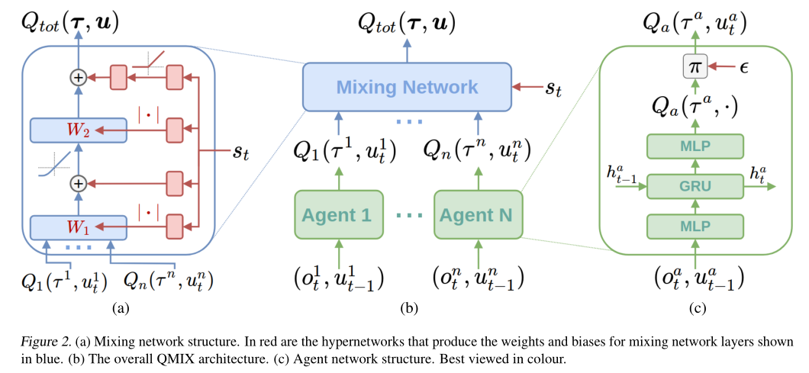

Multi Agent Reinforcement Learning
~~~~~~~~~~~~~~~~~~~~~~~~~~~~~~~~~~~~~~~

QMIX
^^^^^^^^^^^^^

QMIX 是一个多智能体强化学习算法。它是一个value-based的算法：可以中心式学习，并引入全局状态信息来提高算法效果；
然后再分解得到分布式策略，该分布式策略只需要单个智能体自己的局部观测。
QMIX的一大特点是：联合动作值函数与每个局部值函数的单调性相同，因此对局部值函数取最大便是对联合动作值函数取最大。
`QMIX <https://arxiv.org/pdf/1803.11485.pdf>`_

在MARL问题中，一种常见的学习范式是：中心式训练，分布式执行（Centralised training with Decentralised Execution），在这种模式下，
如何去表达和使用学习到的联合动作值函数（joint action-value function） 是一个十分关键的问题。
一方面，如果想准确得知智能体的动作产生的影响，就需要一个中心式函数 :math:`Q_{tot}` ，它基于全局的状态和联合的动作学习得到。
另一方面，在有多个智能体的时候的动作价值函数是难以学习的，因为该函数的参数会随着智能体数量的增多而成指数增长；
即使能学习，也很难从联合函数中抽取出针对单个智能体的分布式策略（即该策略仅依据智能体自身的observation）。

现有办法
'''''''''

针对这个问题，现有的一些解决方法如下：

**IQL（Independent Q-Learning）** `IQL <http://citeseer.ist.psu.edu/viewdoc/summary?doi=10.1.1.55.8066>`_

直接让每个智能体都执行一个Q-Learning算法。因为环境是共享的，故会因为每个智能体的行动而发生状态改变，
对每个智能体来说，环境是动态不稳定的，因此这个算法并不能保证收敛性。

**COMA（Counterfactual Multi-Agent）** `COMA <https://arxiv.org/pdf/1705.08926.pdf>`_

训练一个完全中心化的action-value函数，然后以此为指导在actor-critic框架下得到分布式策略。
其缺点是：1）必须是on-policy算法, 采样效率低；2）智能体个数增加时，训练完全中心化的critic将变得十分困难。

**VDN（Value Decomposition Networks）** `VDN <https://arxiv.org/pdf/1706.05296.pdf>`_

处于 IQL 和 COMA 之间的方法，通过将每一个智能体用自己的观测数据学习到的局部动作值函数 :math:`Q_a` 进行加和，
就得到了全局联合动作值函数 :math:`Q_{tot}` 。
由于其：1）没有在学习时利用状态信息；2）没有采用非线性方式对单智能体局部值函数进行整合，因此VDN算法还有很大的提升空间。

QMIX及其网络结构
''''''''''''''''

QMIX 便是在 VDN 上进行的一次提升。QMIX 认为，VDN这种将 :math:`Q_{tot}` 完全分解为 :math:`Q_a` 加和并非必须。
为了达到分布策略与中心策略一致的效果，我们需要保证在 :math:`Q_{tot}` 的全局argmax和所有 :math:`Q_a` 同时局部argmax结果相同，即：

.. image:: images/QMIX-argmax.png
   :scale: 50 %

这使得每个智能体只需要在自己的 :math:`Q_a` 上贪心地选择Q值最大的动作即可。

QMIX在这个的基础上又将其做了一些调整，转化为对单调性的约束：
 
:math:`\frac{\partial Q_{tot}}{\partial Q_i} \geq 0, \forall i \in {1,2,...,n}`

QMIX的架构是：每个智能体均有一个自己的agent network，用于合并局部值函数的mixing network和一系列hypernetwork。架构图如下：

**智能体网络 agent network**

如上图c所示。每一个智能体都实现一个DRQN网络，输入是当前时刻的的观测值 :math:`o^a_t` 和上一个时刻动作 :math:`v^a_{t-1}`，
计算得到自己的Q值并输出。

.. note::
    DRQN是一个用来处理POMDP（部分可观马尔可夫决策过程）的一个算法。
    它采用LSTM替换DQN卷积层后的一个全连接层，用于记忆历史状态，因此可以在部分可观的情况下提高算法性能。
..

**混合网络mixing network 与 超网络hypernetwork**

如上图a所示。其输入为每个DRQN网络的输出。为了满足上述的单调性约束，要求网络中所有权值都是非负数（对偏移量则不做限制）。
它对单智能体局部值函数进行合并，并在训练学习过程中加入全局状态信息辅助，以提高算法性能。

为了能够更多的利用到系统的状态信息 :math:`s_t` ，还采用一种超网络（hypernetwork），如红色方格所示。
其输入状态 :math:`s_t` ，输出混合网络的权值及偏移量。
为了保证权值的非负性，超网络采用一个线性网络以及绝对值激活函数保证输出不为负数。
混合网络最后一层的偏移量通过两层超网络以及ReLU激活函数得到非线性映射网络。

为什么要使用超网络而不是直接将状态作为输入传递给混合网络，文中的解释是：
将 :math:`s_t` 传递给超参数网络允许 :math:`Q_{tot}` 通过非单调的方法依赖这些额外的状态信息。
如果直接输入，则限制了每个智能体的Q值都通过一个单调的网络进行传递，这是过于约束（overly constraining）的，
让Q值网络的权重都为正时，会丢失较多信息。
而使用超参数网络来生成参数的话，超参数网络的参数就可以不被约束为正，只要保证输出为正就可以了，这样的话就充分利用了 :math:`s_t` 的特征信息。

由于满足上文的单调性约束，对 :math:`Q_{tot}` 进行 :math:`\arg\max` 操作的计算量就不再随智能体数量指数增长了，而是线性增长，这极大提高了算法效率。

**损失函数**

QMIX最终的损失函数为：

:math:`L(\theta) = \sum_{i=1}^{b}[(y_i^{tot}-Q_{tot}(\tau,a,s;\theta))^2]`

其中，:math:`y_i^{tot} = r+\gamma \max_{a'}\bar{Q}(\tau',a',s';\bar{\theta})` 。
在这里，:math:`\bar{\theta}` 表示target network的参数。

Paper List
^^^^^^^^^^

Q&A
^^^

    .. |img| image:: https://bkimg.cdn.bcebos.com/formula/6b72394d178730e1676d40f3824c2f46.svg

