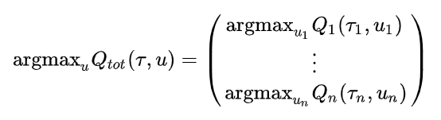

Multi Agent Reinforcement Learning
~~~~~~~~~~~~~~~~~~~~~~~~~~~~~~~~~~~~~~~

MARL Concepts
^^^^^^^^^^^^
Based conceptL: A set of autonomous agents that share a common environment and interact with each other

Difficulty in Multi-Agent Learning (MAL)
^^^^^^^^^^^^
1. Agents not only interact with the environment but also with each other

2. If use single-agent Q learning by considering other agents as a part of the environment
– Such a setting breaks the theoretical convergence guarantees and makes the learning unstable.

Perspective from Sequential Decision Making
^^^^^^^^^^^^
• Markov decision processes
– one decision maker
– multiple states

• Repeated games
– multiple decision makers
– one state (e.g., one normal form game)

• Stochastic games (Markov games)
– multiple decision makers
– multiple states (e.g., multiple normal form games)

**Stochastic Game**
– Each state corresponds to a normal-form game
– After a round, the game randomly transitions to another state
– Transition probabilities depend on state and joint actions taken by all agents

Classification of Stochastic Games
'''''''''''''''''''''''''''''''''''''''''
• **Zero-sum stochastic game**: all of the states must define a zero-sum matrix game

• **Team stochastic game**: all of the states must define team matrix games 
- their reward is the same for every joint action

• The one that do not fall in any of these categories are generally called **general-sum stochastic games**.

Problems in MARL:
^^^^^^^^^^^^
1. Cooperation: 如何在复杂环境下同时训练多个智能体相互协作，并且如何让这种合作更快地适应环境和其他智能体的变化。

2. Decentralized and Centralized: 如何做到更有效的集中式训练与分布式执行，即如何通过中心化的训练，执行时即使控制信息的获取也能取得好的合作效果。

3. Credit assignment: 在joint-reward设定下，如何分配合作团队中各个智能体的reward。

4. Efficient Communication: 智能体之间信息流的交互，如何尽可能的减少交流成本的情况下进行更有价值的信息交流。

5. Agents modeling agents: 智能体之间的对抗与合作模式下，对环境中其他的智能体进行建模。

Current Solutions for above Problems:
^^^^^^^^^^^^
1. 智能体之间的合作问题：(CTDE框架) MADDPG, VDN, QMIX, COMA, QTRAN

2. 智能体之间的交流问题：CommNet, RIAL, DIAL, BiCNet, ATOC

3. 智能体之间的建模问题：MADDPG, M3DDPG, LOLA

在下面的内容中，更加详细地介绍了以上列举的一部分算法。

DIAL & RIAL
^^^^^^^^^^^^^^^^^^
DIAL和RIAL两方法由2016年NIPS论文 `Learning to communicate with deep multi-agent reinforcement learning <https://proceedings.neurips.cc/paper/2016/file/c7635bfd99248a2cdef8249ef7bfbef4-Paper.pdf>`_
提出。

从论文的名字就可以看出，论文的重点在于如何利用深度学习，使得多智能体中的各个agent学会如何与其他agent进行交流。
论文整体的motivation也是希望通过使用交流的方式，使得agent能解决partial local observation的问题。

论文使用了CTDE的设定，即Centralised Training and Decentralized Execution。

论文将用于沟通信道设定为了一定带宽的 **"离散的"** 信息流。
这个设定一是由于受限于Decentralized Execution的形式，导致在执行的时候各个agent之间的带宽受限，
另一部分上是由于论文将所传输的信号当作了action space, 而论文的模型又是基于Deep-Q-learning的，
因此对action space的大小有一定的要求，若action space过大也会出现探索问题。

论文的setting是希望得到多个agent使得他们的共有的utility最大化，因此所有agent有相同的reward，同时也不支持competive的设定。

论文提出了两个算法，RIAL和DIAL。
简单来说，RIAL就是shared parameter的DRQN的基础上增加了离散的通信，而DIAL则是在训练过程中直接将当前agent的信息输出给其他agent，并且在训练过程中允许各个agent之间的message携带梯度。

论文对应的算法特点：

    - 所有agent有相同的reward，不支持competive的设定
    
    - 所有agent的模型一样，共享参数

RIAL
''''''''''''''''''''''
RIAL算法相对比较简单易懂：
    
    其各个agent是一个DRQN网络，且其Q网络对应分为两个部分 :math:`Q_u` 和 :math:`Q_m` ，分别对应与环境交互的动作u和与其他agent沟通的信息m。
    
    每个agent将他们输出的Q值传入action selector, action selector会根据:math:`Q_u` 和 :math:`Q_m` 分别选择与环境交互的动作u和与其他agent沟通的信息m，并且将u返回给其他环境，在下一时间段将m传给其他agent。
    
    action selector在训练过程中是epsilon greedy，在执行过程中是argmax。

RIAL算法的模型如下图，其中黑色表示动作的选择/信息的交流，红色表示梯度的传导：
    
    .. image:: images/RIAL-model.jpg
        :align: center 

显然的，RIAL既可以进行centralised training也可以进行decentralised training。 不过在进行centralised training时，RIAL可以利用centralised training，通过所有agent共享网络参数的方式加快模型的训练速度。

DIAL
'''''''''''''''''''''''
尽管RIAL可以通过shared parameter的方式获得centralised training对应的优势，但很明显RIAL并没有完全利用centralised training对应的优势，
比如communication对应的feedback。
因此，基于RIAL，提出了DIAL算法，使得其中的communication channel也可以传送梯度。
在DIAL算法中：

    其各个agent的网络C-Net由两个部分组成，一个部分对应与环境交互的动作u的Q值，一个部分计算与其他agent沟通的信息m，此处的m是一个实数即一个连续值。
    
    每个agent将他们输出的Q值传入action selector，信息值m则是绕过了action selector，通过DRU（discretise/regularise unit）然后将信息传给其他agent。
    
    DRU的作用是在训练过程中，对信息m进行regulization并且附加一个方差为 :math:`simga` 的噪声；在执行过程中，则是将连续的信息m转化为离散的信息。

DIAL算法的模型如下图，其中黑色表示动作的选择/信息的交流，红色表示梯度的传导：
    
    .. image:: images/DIAL-model.jpg
        :align: center 

DIAL算法的具体伪代码如下：

    .. image:: images/DIAL-code.jpg
        :align: center

实验及实验环境
''''''''''''''''''''''''''
文章使用的实验环境也十分有趣，包括switch riddle和MNIST game，都不是传统意义上的RL环境。

switch riddle不同于传统RL论文使用的游戏，其本质上是一个数学问题：

- 说有 100 个囚犯分别关在 100 间牢房里。牢房外有一个空荡荡的房间，房间里有一个由开关控制的灯泡。初始时，灯是关着的。看守每次随便选择一名囚犯进入房间，但保证每个囚犯都会被选中无穷多次。如果在某一时刻，有囚犯成功断定出所有人都进过这个房间了，所有囚犯都能释放。游戏开始前，所有囚犯可以聚在一起商量对策，但在此之后它们唯一可用来交流的工具就只有那个灯泡。他们应该设计一个怎样的协议呢？

    .. image:: images/switch_riddle.jpg
        :align: center

在此限于篇幅原因不展开了，有兴趣可以查阅 `One Hundred Prisoners and a Lightbulb <https://www.researchgate.net/publication/225742302_One_Hundred_Prisoners_and_a_Lightbulb>`_ 。

其实验结果如下：

    .. image:: images/switch_riddle_result.jpg
        :align: center

分别为3个囚犯时实验效果、4个囚犯时实验效果、和3个囚犯时的协议
    
MNIST game则是分为两个小游戏：

    Colour-Digit MNIST 游戏由两个agent执行猜测颜色和数字，而信道只有一个带块，因此agent需要约定好是沟通颜色或者是数字的奇偶性
    
    Multi-Step MNIST 游戏则是将之前的游戏进行多步。

MNIST game 过程：

    .. image:: images/MNIST_game.jpg
        :align: center

MNIST game 实验结果：

    .. image:: images/MNIST_game_result.jpg
        :align: center

MADDPG
^^^^^^^^^^^^
MADDPG由OpenAI和UC Berkeley在2017年的NIPS会议上的论文 
`Multi-Agent Actor-Critic for Mixed Cooperative-Competitive Environments  <https://papers.nips.cc/paper/2017/file/68a9750337a418a86fe06c1991a1d64c-Paper.pdf>`_ 中提出。

论文首先阐述了当时在MultiAgent的setting下，已有的传统independent RL方式问题。

随后提出了一种基于actor-critic的改进：通过分布式的actor和中心化的critic，使得各个分布的actor能够考虑到其他actor的策略，
并且通过实验，在一系列的需要多智能体合作的环境上获得了进展，证明了该方法可以在该setting下学习到相对复杂的多智能体协作过程。

论文也提出了一系列的基于多智能体设定下的可能改进，包括让各个agent去维持对其他agent策略的一个估计，
不断进行对应的调整，使得各个agent在选取自己的action前能够通过所维持估计去猜测其他agent所做的行动，
一定程度上达到协作的目的，即 **Inferring Policies** 。
同时，由于agent在其他agent策略改变的前提下，因为对之前的其他agent的策略已经产生overfitting，
就很容易导致无法适应其他agent策略的情况，因此文章提出通过让每个agent维持并随机使用多个策略，达到降低overfitting情况的效果，
即 **Policu Ensembles** 。

该论文所使用的环境也由OpenAI开源，并且被很多MARL的论文所使用。nerveX也会迁移配置这些环境进行，方便进行实验。

传统RL存在的问题
''''''''''''''''''''''''''''
传统的深度学习主要可以分为value based算法和policy based算法两大类。而这两种方法在MultiAgent的设定下都有其缺点：

1.Value based的算法，如Q-learning等，由于其他agent的策略相对不可见，且训练过程中在不断变化，因此任意一个agent个体，
其所看到的环境（其他agent的策略行为也可看作是本agent的环境）是在不断变化的，即 **环境不稳定** ，而这会导致算法的稳定性出现问题。
稳定性问题会导致算法的收敛问题，更会导致 **experience replay的不可用** ，因为之前agent在当时环境下的action和对应reward对已经产生变化后的agent不再有指导意义。
同时，由于其他agent的策略不可见，因此问题不再满足Markov假设，问题设定从MDP过程退化为了POMDP（Partially Observed Markov Decision Process），
Q-learning不再有收敛保证，问题变得不可解。

2.Policy based的算法，以Policy Gradient即策略梯度下降为例，常常收到 **过高方差** 的困扰。
而在多智能体的设定下，这种问题会进一步变得严重： 各个agent所获得的reward会因其他agent的action产生变化，而在优化过程中agent无法考虑到其他agent的策略，因此会导致更高的方差。
同时Policy base的算法常常用baseline的方式去缓解训练中的高方差，但是在MultiAgent的设定下则会由于先前提到的 **不稳定** 问题而变得难以使用。

Multi Agent Actor-Critic (MADDPG)算法
'''''''''''''''''''''''''''''''''''''''''
MADDPG的使用设定中，学习到的policy在运行时只能使用自己的observation，并且没有假设任何在agent之间的特殊通信结构。在这种设定下，MADDPG算法给出了一个可广泛应用的算法。

MADDPG采用了集中训练，分布执行的方式。在训练过程中，可以允许policy使用额外的信息去降低训练的难度，只要在进行执行的时候没有使用额外的信息即可。
在这种情况下，MADDPG在actor-critic policy gradient的基础上做了一个简单的拓展，即将在训练时使用额外的关于其他agent的信息去增强critic的训练。

MADDPG的模型示意图如下：

    .. image:: images/MADDPG-model.jpg
        :align: center

我们从示意图就可以看出，MADDPG对于每个agent单独训练了一个critic :math:`Q_i` ，这也是MADDPG与COMA算法的一大不同。

各个Agent的梯度 :math:`\nabla J_i` 可以写为下式：
    
    .. image:: images/MADDPG-gradient.jpg
        :align: center

其中 :math:`Q_{i}^{\pi}(\boldsymbol{x},a_1, ...,a_N)` 是中心化的action-value函数，使用所有agent的action和一些状态信息 :math:`\boldsymbol{x}` 作为输入。
对于 :math:`\boldsymbol{x}` 来说，一种简单是实现即为 :math:`\boldsymbol{x} = (o_1, ...,o_N)` 。

鉴于 :math:`Q_i^{\pi}` 是分开训练的，因此不同的agent可以有不同的reward架构，因此MADDPG也可以在competive的设定下使用。

而在DDPG的设定下，也可写为下式：

    .. image:: images/MADDPG-gradient-ddpg.jpg
        :align: center

其中D代表replay buffer，存放 :math:`(\boldsymbol{x}, \boldsymbol{x'}, a_1, ...,a_N, r_1, ..., r_N)` 。

这时，中心化的 :math:`Q_i^{\pi}` 可以有下式更新

    .. image:: images/MADDPG-update.jpg
        :align: center

对其他agent进行策略估计（Inferring Policies）
''''''''''''''''''''''''''''''''''''''''''''''''''''''''''''''''''''''''''
为了移去中心化critic中知道其他agent policy的假设，我们让每个agent i去额外维持对其他每个agent j的policy的近似估计。
近似估计的policy可以使用最大化agent j action log概率的方式，再加上一个entropy regularizer。
我们可以用 :math:`\hat{\mu_i^j}` 表示agent i 对agent j的策略的近似估计，则agent i 中critic的估计价值可以改写成：

    .. image:: images/MADDPG-esti.jpg
        :align: center

同时，对agent j的策略估计可以完全online进行。

维持多个策略（Policy Ensembles）
''''''''''''''''''''''''''''''''''''
为了一定程度上缓解agent对其他agent的policy产生over-fitting的问题，增加agent策略的鲁棒性，可以让每个agent维持K个子策略，在每个episode随机选择一个子策略进行执行。

由于每个子策略在不同的episode去执行，各个子策略的训练也很简单，只需要为每个子策略维持一个buffer即可。

实验及实验环境
''''''''''''''''''''''''''''''''''''
本篇的实验是在2D的小球物理仿真模型环境中进行的，实验环境开源且很具有代表性。

各个算法的实验结果可以见 `视频 <https://sites.google.com/site/multiagentac/>`_ 。

OpenAI也将其实验环境 `Multi-Agent_Particle_Environment <https://github.com/openai/multiagent-particle-envs>`_ 开源放出，我们也会将其整合到我们的nerveX框架中。

COMA
^^^^^^^^^^^^^^
COMA由牛津大学的实验室在2017年提出，后来论文 `Counterfactual Multi-Agent Policy Gradients <https://www.aaai.org/ocs/index.php/AAAI/AAAI18/paper/view/17193/16614>`_ 被收录在2018年的AAAI会议上。

COMA与DDPG同样是基于actor-critic的多智能体强化学习算法，但是与MADDPG在实现方面有许多不同。

COMA不同于MADDPG，COMA的critic是将所有agent的状态和动作输入，同时计算所有agent对应的value，而MADDPG是对每个不同的agent单独训练不同的critic网络。
COMA使用的算法适用于离散型的action space，而MADDPG则是适用于连续性的action space。

COMA在一定程度上尝试解决了critic assign问题。COMA收到 `difference_rewards <https://www.researchgate.net/publication/2831330_Optimal_Payoff_Functions_for_Members_of_Collectives>`_ 的启发，
通过构造和使用 **counterfactual baseline** ，可以对比当前agent所选动作相较于其他可选动作，是否作出该动作对整体reward产生了利益。

COMA的实验在StarCraft微操环境中进行，该环境也被很多MARL选用为测试环境，有一定代表性。

传统RL存在的问题
'''''''''''''''''''
如果使用传统的RL算法，可能存在以下问题：

1. 输入的action space将会是所有agent的联合动作空间（joint action space），action space大小会随着agent数量增加而指数上升。

2. 在多智能体的设定下，agent只能依照自己当前的local observation做决策，无法与其他agent进行信息共享，导致agent无法完成协作。

3. 每个agent所获得的reward是所有agent action获得的共同的reward，而这样每个agent就很难知道自己这次动作应该得到多少回报。
别的agent如果做出正确/错误的动作会导致当前agent对自己所做动作的价值判断不准确，训练过程产生 **高方差** 。

COMA算法
''''''''''''''''''''''''''''''
COMA算法的设计思路是使用centralized的critic去对decentralised actors的policy去进行评判和估计，其结构示意图如下：

    .. image:: images/COMA-model.jpg
        :align: center

而COMA的actor和critic的网络结构如下：

    .. image:: images/COMA-network.jpg
        :align: center

记 :math:`Q(s, \boldsymbol{u})` 以central state :math:`s` 和joint action :math:`\boldsymbol{u}` 为输入的Q值估计，则其计算每个agent所选动作对应的advantage为：

    .. image:: images/COMA-advantage.jpg
        :align: center

COMA的advantage选取巧妙的地方就在于，尽管其policy function和utility function相互递归迭代会产生自包含问题，
但是由于advantage的作用是对梯度做选取，而advantage的期望梯度贡献值是0，因此不会由于自身的递归迭代而产生自包含问题。
这个advantage就被称为 **counterfactual baseline** ，是COMA解决credit assign问题的solution。

同时值得注意的是，COMA算法critic部分的输出的大小为 :math:`|U|` 而不是 :math:`|U|^n` ，即critic在输出的时候是分别输出每个actor的动作所对应的value值，
因此总共的输出是 :math: `n*|U|` 而非 :math:`|U|^n` 。 COMA通过这种方式规避了joint action space随着agent数量上升指数增加的问题。

COMA的具体算法如下：

    .. image:: images/COMA-algo.jpg
        :align: center

.. note::
    
    我们可以看到COMA算法在实现过程中使用了buffer，那么这是否意味着COMA是Offline算法呢？

    答案是否定的，COMA算法虽然将数据collect到了buffer里面，但是只使用了当前策略的数据去更新当前策略。
    算法在calculate COMA和accumulate actor gradients之后其策略改变，也随之对buffer进行了清空，所以COMA算法是Online算法。

实验和实验环境
'''''''''''''''
COMA在StarCraft环境下分别与 使用Q值的Independent Actor-Critic、使用V值的Independent Actor-Critic，COMA中心化的QV值估计，COMA中心化的V值估计 进行了对比实验，结果如下图：

    .. image:: images/COMA-experiment.jpg
        :scale: 70%
        :align: center

StarCraft的2d3z环境图：

    .. image:: images/COMA-2d3z.jpg
        :align: center

StarCraft的实验环境是通过TorchCraft实现，该环境发布在 Torchcraft: a library for machine learning research on real- time strategy games 一文中。
在github上也开源了 `Torchcraft代码 <https://github.com/TorchCraft/TorchCraft>`_ 

CommNet
^^^^^^^^^^^^^^^^^^

QMIX
^^^^^^^^^^^^^

QMIX 是一个多智能体强化学习算法。它是一个value-based的算法：可以中心式学习，并引入全局状态信息来提高算法效果；
然后再分解得到分布式策略，该分布式策略只需要单个智能体自己的局部观测。
QMIX的一大特点是：联合动作值函数与每个局部值函数的单调性相同，因此对局部值函数取最大便是对联合动作值函数取最大。
`QMIX <https://arxiv.org/pdf/1803.11485.pdf>`_

在MARL问题中，一种常见的学习范式是：中心式训练，分布式执行（Centralised training with Decentralised Execution），在这种模式下，
如何去表达和使用学习到的联合动作值函数（joint action-value function） 是一个十分关键的问题。
一方面，如果想准确得知智能体的动作产生的影响，就需要一个中心式函数 :math:`Q_{tot}` ，它基于全局的状态和联合的动作学习得到。
另一方面，在有多个智能体的时候的动作价值函数是难以学习的，因为该函数的参数会随着智能体数量的增多而成指数增长；
即使能学习，也很难从联合函数中抽取出针对单个智能体的分布式策略（即该策略仅依据智能体自身的observation）。

现有办法
'''''''''

针对这个问题，现有的一些解决方法如下：

**IQL（Independent Q-Learning）** `IQL <http://citeseer.ist.psu.edu/viewdoc/summary?doi=10.1.1.55.8066>`_

直接让每个智能体都执行一个Q-Learning算法。因为环境是共享的，故会因为每个智能体的行动而发生状态改变，
对每个智能体来说，环境是动态不稳定的，因此这个算法并不能保证收敛性。

**COMA（Counterfactual Multi-Agent）** `COMA <https://arxiv.org/pdf/1705.08926.pdf>`_

训练一个完全中心化的action-value函数，然后以此为指导在actor-critic框架下得到分布式策略。
其缺点是：1）必须是on-policy算法, 采样效率低；2）智能体个数增加时，训练完全中心化的critic将变得十分困难。

**VDN（Value Decomposition Networks）** `VDN <https://arxiv.org/pdf/1706.05296.pdf>`_

处于 IQL 和 COMA 之间的方法，通过将每一个智能体用自己的观测数据学习到的局部动作值函数 :math:`Q_a` 进行加和，
就得到了全局联合动作值函数 :math:`Q_{tot}` 。
由于其：1）没有在学习时利用状态信息；2）没有采用非线性方式对单智能体局部值函数进行整合，因此VDN算法还有很大的提升空间。

QMIX及其网络结构
''''''''''''''''

QMIX 便是在 VDN 上进行的一次提升。QMIX 认为，VDN这种将 :math:`Q_{tot}` 完全分解为 :math:`Q_a` 加和并非必须。
为了达到分布策略与中心策略一致的效果，我们需要保证在 :math:`Q_{tot}` 的全局argmax和所有 :math:`Q_a` 同时局部argmax结果相同，即：

这使得每个智能体只需要在自己的 :math:`Q_a` 上贪心地选择Q值最大的动作即可。

QMIX在这个的基础上又将其做了一些调整，转化为对单调性的约束：
 
:math:`\frac{\partial Q_{tot}}{\partial Q_i} \geq 0, \forall i \in {1,2,...,n}`

QMIX的架构是：每个智能体均有一个自己的agent network，用于合并局部值函数的mixing network和一系列hypernetwork。架构图如下：

.. image:: images/QMIX-architecture.png

**智能体网络 agent network**

如上图c所示。每一个智能体都实现一个DRQN网络，输入是当前时刻的的观测值 :math:`o^a_t` 和上一个时刻动作 :math:`v^a_{t-1}`，
计算得到自己的Q值并输出。

.. note::
    DRQN是一个用来处理POMDP（部分可观马尔可夫决策过程）的一个算法。
    它采用LSTM替换DQN卷积层后的一个全连接层，用于记忆历史状态，因此可以在部分可观的情况下提高算法性能。
..

**混合网络mixing network 与 超网络hypernetwork**

如上图a所示。其输入为每个DRQN网络的输出。为了满足上述的单调性约束，要求网络中所有权值都是非负数（对偏移量则不做限制）。
它对单智能体局部值函数进行合并，并在训练学习过程中加入全局状态信息辅助，以提高算法性能。

为了能够更多的利用到系统的状态信息 :math:`s_t` ，还采用一种超网络（hypernetwork），如红色方格所示。
其输入状态 :math:`s_t` ，输出混合网络的权值及偏移量。
为了保证权值的非负性，超网络采用一个线性网络以及绝对值激活函数保证输出不为负数。
混合网络最后一层的偏移量通过两层超网络以及ReLU激活函数得到非线性映射网络。

为什么要使用超网络而不是直接将状态作为输入传递给混合网络，文中的解释是：
将 :math:`s_t` 传递给超参数网络允许 :math:`Q_{tot}` 通过非单调的方法依赖这些额外的状态信息。
如果直接输入，则限制了每个智能体的Q值都通过一个单调的网络进行传递，这是过于约束（overly constraining）的，
让Q值网络的权重都为正时，会丢失较多信息。
而使用超参数网络来生成参数的话，超参数网络的参数就可以不被约束为正，只要保证输出为正就可以了，这样的话就充分利用了 :math:`s_t` 的特征信息。

由于满足上文的单调性约束，对 :math:`Q_{tot}` 进行 :math:`\arg\max` 操作的计算量就不再随智能体数量指数增长了，而是线性增长，这极大提高了算法效率。

**损失函数**

QMIX最终的损失函数为：

:math:`L(\theta) = \sum_{i=1}^{b}[(y_i^{tot}-Q_{tot}(\tau,a,s;\theta))^2]`

其中，:math:`y_i^{tot} = r+\gamma \max_{a'}\bar{Q}(\tau',a',s';\bar{\theta})` 。
在这里，:math:`\bar{\theta}` 表示target network的参数。

Paper List
^^^^^^^^^^

Q&A
^^^

    .. |img| image:: https://bkimg.cdn.bcebos.com/formula/6b72394d178730e1676d40f3824c2f46.svg

