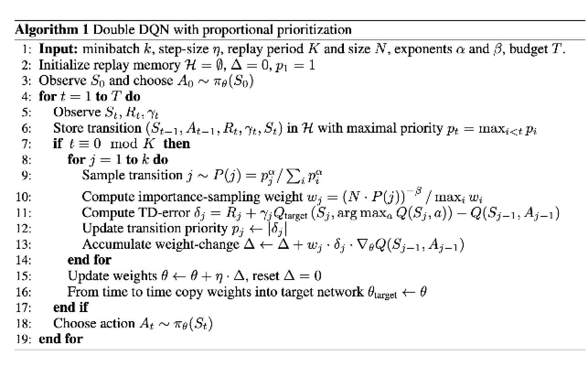
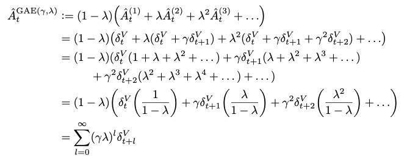
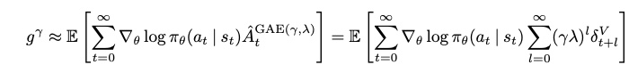
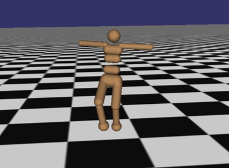
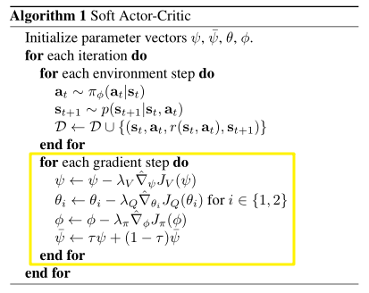
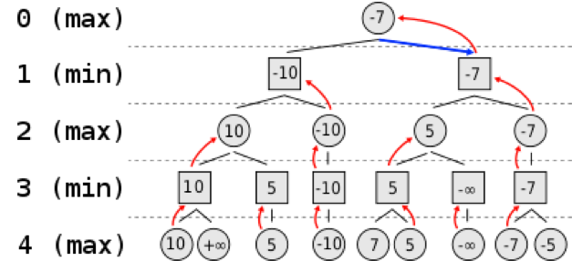
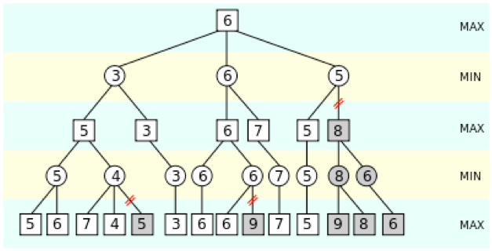
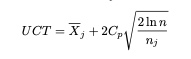

RL Algorithm
~~~~~~~~~~~~

DQN
^^^^^^^
DQN在 `Playing Atari with Deep Reinforcement Learning <https://arxiv.org/abs/1312.5602>`_ 一文中被提出，将Q-learning的思路与神经网络结合。一年后做出了微小改进后又发表在 `Human-level control through deep reinforcement learning <https://web.stanford.edu/class/psych209/Readings/MnihEtAlHassibis15NatureControlDeepRL.pdf>`_ 一文;

DQN使用神经网络接受state输入进行价值估计，然后使用argmax选择预计value最大的action作为策略，通过计算td-loss进行神经网络的梯度下降。

算法可见：

.. image:: images/DQN.png

.. note::
   有关Q-Learning中的off-policy correction（即Importance Sampling），在one-step和n-step上是有所区别的。一言以蔽之，one-step不需要IS，而n-step需要IS。

   Importance Sampling的直观理解是：首先我们想计算f(x)的期望，其中x服从分布p；
   但我们却因为某些原因只能从分布q进行采样，因此要在f(x)上乘上一个系数p/q，来做一个修正，使得二者在期望上相等。公式表示为：
   
   :math:`\mathbb{E}_{x\sim p} = \int f(x)p(x)dx = \int f(x)\frac{p(x)}{q(x)}q(x)dx = \mathbb{E}_{x\sim q}[f(x)\frac{p(x)}{q(x)}]`

   在one-step的Q-learning中， :math:`Q(s,a)`
   需要去拟合 :math:`r(s,a)+\gamma \mathop{max}\limits_{a^*}Q(s',a^*)`

   对于当前的 :math:`s,a` ， :math:`r(s,a)` 是由环境反馈得来的， :math:`s'` 是环境step后得到的，都与是否为off-policy无关。
   接下来在寻找使得Q函数最大的 :math:`a^*` 时，是通过原始策略 :math:`\pi` （对应当前的Q函数）计算得到的，同样与采样的策略 :math:`\mu` 无关。
   这意味着，尽管我们使用了不同的策略采样，但是它在训练的时候没有发挥任何作用，因此不需要重要性采样来修正。

   换个方式理解，在环境状态 :math:`s` 下，采样动作 :math:`a1` ，得到的结果存储在 :math:`Q(s,a1)` 中；
   采样动作 :math:`a2` ，结果存储在 :math:`Q(s,a2)` 中。
   即使采样a1和a2的概率 :math:`p(a1|x), p(a2|x)` 改变了，也不会影响到 :math:`Q(s,a1), Q(s,a2)` ，因此不需要修正。

   而在n-step的Q-learning中， :math:`Q(s,a)`
   需要去拟合 :math:`\sum_{t=0}^{n-1}\gamma^t r(s_t,a_t) + \gamma^n \mathop{max}\limits_{a^*}Q(s_n,a^*)`

   同one-step情况，:math:`r(s_0,a_0)` 和 :math:`s_1` 都与是否为off-policy无关。
   但之后在确定接下来的动作 :math:`a_1` 时，是根据当前采样的策略 :math:`\mu` 得到的，而不是原始的策略 :math:`\pi` 。
   同样，对于后面的 :math:`a_2, a_3, ...` ，都存在概率分布不同的情况，因此我们就需要使用重要性采样的方法对不同的分布进行修正，
   这样我们对当前状态-动作价值函数，即Q函数的估计才是无偏估计。

Double DQN
^^^^^^^^^^^^^
Double DQN是利用双学习，仿照Double Q-learning思路对DQN做的改进，发表在 `Deep Reinforcement Learning with Double Q-learning <https://arxiv.org/abs/1509.06461>`_ 。

Double DQN不再是直接在目标Q网络里面找各个动作中最大Q值，而是先在当前Q网络中先找出最大Q值对应的动作，然后利用这个选择出来的动作在目标网络里面去计算目标Q值。其余与普通的DQN相同。

Double DQN的目的是更加精确的估计目标Q值的计算，解决over estimation的问题，并且减少过大的bias。

Dueling DQN
^^^^^^^^^^^^^^^^
Dueling DQN在 `Dueling Network Architectures for Deep Reinforcement Learning <https://arxiv.org/abs/1511.06581>`_ 一文中提出。通过使用Dueling结构，成果优化了网络结构，使得Q值的估计分为了两部分，分为state-value 和 advantages for each action，使得神经网络能更好的对单独价值进行评估。

结构变化如下：

.. image:: images/Dueling_DQN.png
   :scale: 70 %

Prioritized Replay Buffer in DQN
^^^^^^^^^^^^^^^^^^^^^^^^^^^^^^^^^^^^
Prioritized Replay Buffer的提出是在 `PRIORITIZED EXPERIENCE REPLAY <https://arxiv.org/abs/1511.05952>`_ 一文，使用buffer sample时通过加权提高训练数据质量，加快训练速度并提高效率。

nerveX系统中buffer的实现结构可见下图：

.. image:: images/buffer.jpg

具体的Prioritized DDQN算法可见：

.. note::
   DQN算法的基础实现教程可以参考pytorch官方上的 `pytorch的DQN教程 <https://pytorch.org/tutorials/intermediate/reinforcement_q_learning.html>`_ ，该教程只是最基本的demo，适合作为入门参考。
   
   有关于Double、Dueling DQN和prioritized replay DQN的算法实现可以参考Github上的 `RL-Adventure <https://github.com/higgsfield/RL-Adventure>`_， 该repo上的各种DQN实现较全，尽管torch版本较低，但不失作为参考。

   DQN算法在nervex框架中的入口可以参考 `nervx框架下的DQN实现 <http://gitlab.bj.sensetime.com/open-XLab/cell/nerveX/blob/master/nervex/app_zoo/cartpole/entry/cartpole_dqn_main.py>`_。

Policy Gradient
^^^^^^^^^^^^^^^^^^^
之前所提的大部分方法都是基于“动作价值函数”，通过学习动作价值函数，然后根据估计的动作价值函数选择动作 `Policy Gradient <https://homes.cs.washington.edu/~todorov/courses/amath579/reading/PolicyGradient.pdf>`_。

而策略梯度方法则是可以直接学习参数化的策略，动作选择不再直接依赖于价值函数，而是将价值函数作为学习策略的参数，不再是动作选择必须的了。

Policy Gradient公式及其推导过程:

我们Policy Gradient的目的是通过gradient ascend去最大化在一个策略下的reward之和。
我们记某个策略对应的参数为 :math:`{\theta}^{\pi}` 简写为 :math:`\theta`， 
记从开始到结束的整个过程为 :math:`\tau`，在策略 :math:`\theta` 下整个过程为 :math:`\tau` 的概率为 :math:`p_{\theta}(\tau)`。

整个过程中的reward之和记为 :math:`R(\tau) = \sum_{t=1}^{T} r_t`，某个策略下reward之和的期望记为 :math:`\bar{R_{\theta}} = \sum_{\tau} R(\tau) p_{\theta}(\tau)`。

我们要最大化整个过程中的reward之和的期望，即对 :math:`\bar{R_{\theta}}` 进行梯度上升。

:math:`\bar{R_{\theta}(\tau)}` 的梯度为 :math:`\nabla \bar{R_{\theta}(\tau)}`， 而 :math:`\bar{R_{\theta}} = \sum_{\tau}R(\tau) p_{\theta}(\tau)`。

其中 :math:`p_{\theta}(\tau) = p(s_1) \prod_{t=1}^{T}p_{\theta}(a_t|s_t)p_{\theta}(s_{t+1}|s_t, a_t)`， 
而 :math:`p_{\theta}(s_{t+1} | s_t, a_t)` 不随策略 :math:`\theta` 的变化而改变，因此梯度为零。

我们可以做一个变化，即利用公式 :math:`\nabla p_{\theta}(\tau) = p_{\theta}(\tau) \frac{\nabla p_{\theta}(\tau)}{p_{\theta}(\tau)} = p_{\theta}(\tau) \nabla \log{P_{\theta}(\tau)}` ，转化概率分布。

再通过使用 :math:`N` 次重复取平均的方式消去 :math:`\sum_{\tau} p_{\theta}(\tau)` ；

由此可以推导出：
:math:`\nabla \bar{R_{\theta}} = \frac{1}{N} \sum_{n=1}^{N} \sum_{t = 1}^{T} R(\tau) \nabla \log{P_{\theta}(a_t^n|s_t^n)}` 。

这就是Policy Gradient的最基本的公式。Policy Gradient是一个On-policy的算法。

不过这个基本的公式还有很多不足之处：
比如由于是整体的概率分布，要求所有概率和为1，因此在进行梯度下降时，如果某一个不常见的动作一直没有被sample到，那么随着其他动作被sample后概率上升，这个动作的对应概率就会下降。

动作的常见与否与某个阶段是否应该采取一个动作无关，因此我们需要通过引入baseline的方式，让公式更合理：

**Add baseline**

公式从 :math:`\nabla \bar{R_{\theta}} = \frac{1}{N} \sum_{n=1}^{N} \sum_{t = 1}^{T} R(\tau) \nabla \log{P_{\theta}(a_t^n|s_t^n)}`

变化为：:math:`\nabla \bar{R_{\theta}}` :math:`= \frac{1}{N} \sum_{n=1}^{N} \sum_{t = 1}^{T} (R(\tau) - b) \nabla \log{P_{\theta}(a_t^n|s_t^n)}`，
其中可取 :math:`b \approx E[R(\tau)]`。

再加入baseline后，该公式依旧存在一定的问题，即使用policy gradient由于一次sample的reward会等量的影响到整个过程中的动作选择，虽然从均值上讲依旧无偏，但是过程中的方差会极大。
这时，我们通过修改公式，让每个动作在一次过程中不考虑该动作发生前的reward，只关联动作发生后所产生的reward，即减小了动作取值的方差，加快收敛。

我们通过\ **Assign credit**\ 的方式，将公式从 :math:`\nabla \bar{R_{\theta}} = \frac{1}{N} \sum_{n=1}^{N} \sum_{t = 1}^{T} (R(\tau) - b)\nabla \log{P_{\theta}(a_t^n|s_t^n)}`

变为 :math:`\nabla \bar{R_{\theta}} = \frac{1}{N} \sum_{n=1}^{N} \sum_{t = 1}^{T}` 
:math:`(\sum_{t' = t}^{T_n} r_{t'}^{n} - b)\nabla \log{P_{\theta}(a_t^n|s_t^n)}`  

我们还可以加入discount factor，使得：

:math:`R(\tau) - b \rightarrow \sum_{t' =t}^{T_n} (r_{t'}^{n} - b) \rightarrow \sum_{t' = t}^{T_n} (\gamma^{t' - t}r_{t'}^{n} - b)` ， 
这一项可以称为advantage。

.. note::

    优点：对于连续的策略参数化，动作选择的概率会平滑的变化；而基于动作价值函数的方法会随Q值变化而导致动作选择的概率有很大变化。因此，基于policy gradient的方法能比基于动作价值函数的方法有更好的收敛性保证。

    缺点：在没有自举的时候，方差相对较高，学习相对较慢。因此引入了advantage。

Actor Critic
^^^^^^^^^^^^
Actor Critic 模型早在2000年的paper `Actor Critic Algorithm <http://papers.nips.cc/paper/1786-actor-critic-algorithms.pdf>`_ 中被提出。 

在Policy Gradient的基础上，如果用状态动作价值函数 Q 代替reward，并用状态价值函数 V 代替baseline，我们就得到了Actor Critic方法，此时
:math:`\nabla \bar{R_{\theta}} = \frac{1}{N} \sum_{n=1}^{N} \sum_{t = 1}^{T} (Q^{\pi_\theta}(s_t^n,a_t^n) - V^{\pi_\theta}(s_t^n)) \nabla \log{P_{\theta}(a_t^n|s_t^n)}`

Actor Critic作为最基本的一种强化学习算法，后面衍生除了很多种改进，包括DDPG、A2C、A3C等等。

A2C
^^^^^^^^^^^^^^
在Actor Critic中，我们需要分别拟合Q函数和V函数，而Q与V之间存在如下关系
:math:`Q^{\pi_\theta}(s_t^n,a_t^n) = \mathrm{E} [r_t^n + V^{\pi_\theta}(s_{t+1}^n)]`。

如果我们令
:math:`Q^{\pi_\theta}(s_t^n,a_t^n) = r_t^n + V^{\pi_\theta}(s_{t+1}^n)`，
即有：

:math:`Q^{\pi_\theta}(s_t^n,a_t^n) - V^{\pi_\theta}(s_t^n) = r_t^n + V^{\pi_\theta}(s_{t+1}^n) - V^{\pi_\theta}(s_t^n) = advantage`，

:math:`\nabla \bar{R_{\theta}} = \frac{1}{N} \sum_{n=1}^{N} \sum_{t = 1}^{T} (r_t^n + V^{\pi_\theta}(s_{t+1}^n) - V^{\pi_\theta}(s_t^n)) \nabla \log{P_{\theta}(a_t^n|s_t^n)}`，

这样我们就得到了Advantage Actor-Critic（A2C）方法。此时Critic网络的损失函数为实际的状态价值和估计的状态价值之差的平方：
:math:`loss = \frac{1}{N} \sum_{n=1}^{N} \sum_{t = 1}^{T} (r_t^n + V^{\pi_\theta}(s_{t+1}^n) - V^{\pi_\theta}(s_t^n))^2`

DDPG
^^^^^^^^^^^^^^^
DDPG即Deep Deterministic Policy Gradient，在2015年的paper `Continuous control with deep reinforcement learning <https://arxiv.org/abs/1509.02971>`_ 中提出。
DDPG是基于actor-critic的model-free算法，是基于policy gradient和actor critic的改进，其改进思路借鉴了DDQN的改进方式，并且整体思想偏向于Q-learning。

从Policy Gradient到Deterministic Policy Gradient：

在使用随机策略时，假如像DQN一样研究策略中所有的可能动作的概率，并计算各个可能的动作的价值的话( :math:`Q(s_t, a_t)`)，就需要大量的样本进行训练。如果在同一个状态处的动作，只取策略中最大概率的动作，就能去掉策略的概率分布，完成一定的化简。

从Deterministic Policy Gradient到Deep Deterministic Policy Gradient：

在DDPG中，我们还引入了双网络的概念。Actor Critic中本身就有两个网络，在引入双网络后，DDPG总共持有四个网络，分别是：

 - Actor Current Network :math:`\mu`：计算当前状态对应的动作，与环境交互。

 - Actor Target Network :math:`\mu'`：在计算Target Q时，用buffer中取出的状态选择对应用动作；定期从Current Network中复制信息。

 - Critic Current Network :math:`Q`：计算当前状态和动作对应的Q值。

 - Critic Target Network :math:`Q'`：计算Target Q时，用buffer中取出的状态和Actor Target Network选出的该状态对应的动作，去计算对应Q值。

DDPG相比于DDQN算法，其区别就在于引入了Actor Network。DDPG实质上是使用了神经网络Actor Network去选取动作，而DQN则是使用了贪心策略（argmax），根据Q值表中的动作中选择对应Q值估计最大的动作。

因为DDPG使用神经网络去选择动作，将Actor Network的输出直接当作action，因此action space是连续的，可以用于解决连续动作空间的问题。

具体算法实现如图：

.. image:: images/DDPG.jpg

PPO
^^^^^
PPO即Proximal Policy Optimization，在2017年的 `Proximal Policy Optimization Algorithms <https://arxiv.org/abs/1707.06347>`_ 中被提出。是基于Policy Gradient方法的改进。
PPO 是OpenAI的default reinforcement learning algorithm， 足见这个算法的强大。

相比于朴素的Policy Gradient，PPO将PG从On-policy引入了Off-policy的思想，使得梯度上升的过程中可以使用之前策略所产生的数据，不再是一条sample只能使用一次，大大的提高了收敛速度和算法效率。

PPO通过使用Importance Sampling，使得算法可以使用之前策略得到的轨迹进行训练。PPO通过设定一定的constrain，使得之前策略轨迹的训练不会导致大的偏差，而相比于TRPO，constrain的实现也更加简单有效。

PPO利用一个期望上的等同，使得可以使用旧策略下的概率分布 :math:`q`，去等同计算当前策略下的概率分布 :math:`p`， 概率的等同如下式：

:math:`E_{x~p}[f(x)] = E_{x~q}[f(x) \frac{p(x)}{q(x)}]`。 

这样梯度下降的公式就可以转换为：

:math:`J^{\theta'}(\theta) = E_{(s_t, a_t)~\pi_{\theta'}} [\frac{p_{\theta}(a_t | s_t)}{p_{\theta'}(a_t | s_t)} A^{\theta'}(s_t, a_t)]`
 
其中 :math:`A^{\theta'}(s_t, a_t)` 即为 :math:`\theta'` 策略下的advantage

该公式虽然在大样本量的情况下没有偏差，但是在sample样本过小的时候，若两个策略的概率分布 :math:`\theta ~ p(x)` 与 :math:`\theta' ~ q(x)` 相差过大，则会产生很大的方差，导致训练结果不稳定难以收敛。

因此，我们在训练过程中，加入一定的constrain，使得两个策略的概率分布不会过大。在此我们通过 `相对熵 <https://baike.baidu.com/item/%E7%9B%B8%E5%AF%B9%E7%86%B5/4233536>`_ 
（ `Kullback-Leibler Divergence <https://wiki2.org/en/Kullback%E2%80%93Leibler_divergence>`_ ）即 :math:`KL(\theta, \theta')` 来判断两个策略概率分布的差距。

在TRPO中，通过引入 `trust region method <https://optimization.mccormick.northwestern.edu/index.php/Trust-region_methods>`_ 来推导限定在两个策略的概率分布差别不大时，训练的结果是可靠的。

TRPO在梯度推导时大致就是：

:math:`J_{TRPO}^{\theta'}(\theta) = J^{\theta'}(\theta) | KL(\theta, \theta') < \delta` 
 
其中 :math:`J^{\theta'}(\theta) = E_{(s_t, a_t)~\pi_{\theta'}} [\frac{p_{\theta}(a_t | s_t)}{p_{\theta'}(a_t | s_t)} A^{\theta'}(s_t, a_t)]` 

而目前的PPO则是有两个种实现方式，PPO1和PPO2。

PPO1直接将两个策略的 :math:`KL(\theta, \theta')` 引入到梯度计算当中，通过直接计算
:math:`J_{PPO1}^{\theta'}(\theta) = J^{\theta'}(\theta) - \beta KL(\theta, \theta')` ，
其中 :math:`\beta` 可以直接定为参数，也可以通过自适应调整。
在求梯度的过程中自然的减少了两个策略的概率分布差距。

而PPO2则是使用了Clipping的方式： 

:math:`J^{\theta'}(\theta) = \sum_{(s_t, a_t)} min(\frac{p_{\theta}(a_t | s_t)}{p_{\theta'}(a_t | s_t)} A^{\theta'}(s_t, a_t) , clip(\frac{p_{\theta}(a_t | s_t)}{p_{\theta'}(a_t | s_t)}, 1-\epsilon, 1+\epsilon) A^{\theta'}(s_t, a_t) )` 

在PPO的实际实现中，PPO2的实现最为简单高效，而PPO1和TRPO由于要计算KL Divergence花销相对较大。在实际实现的效果上，PPO2是要好于PPO1和TRPO的。在nerveX系统中我们也是以PPO2的形式实现算法模块。

在此处只是介绍了PPO的一个基本思路，PPO的具体理解可以参考下面的lecture和slides，如果对数学概念和收敛性证明感兴趣，建议阅读原文 `Proximal Policy Optimization Algorithms <https://arxiv.org/abs/1707.06347>`_。

.. note::
   lecture可见李宏毅强化学习课程P4和P5，在 `youtube <https://www.youtube.com/watch?v=OAKAZhFmYoI&list=PLJV_el3uVTsODxQFgzMzPLa16h6B8kWM_&index=2>`_ 和 `b站 <https://www.bilibili.com/video/BV1UE411G78S?p=5>`_ 上均有课程视频。

   课程对应的ppt可见 `slides <http://speech.ee.ntu.edu.tw/~tlkagk/courses/MLDS_2018/Lecture/PPO%20(v3).pdf>`_。

   李宏毅老师的强化学习课程虽然没有包括所有算法，但是对于基本概念的解释很清楚，对于RL算法的理解很深刻，推荐有时间看一下。

.. note::
   Question：
      PPO和TRPO是On-policy算法还是Off-policy算法？
   Answer：
      回答这个问题，我们要理解On-policy和Off-policy的定义。

      若简单的把On-policy和Off-policy理解为是否使用当前的策略去更新策略，那么由于PPO和TRPO都采用了Importance Sampling技术，是在用之前策略产生的数据去训练被更新的策略，那么则应该算为Off-policy算法。
      
      但是实际上，所谓On-policy和Off-policy的区分在于采样的策略和改进的策略是不是同一个策略。
      虽然PPO和TRPO在更新策略时中使用到了之前策略的trajectory，但只是\ **借助了之前策略的轨迹去拟合当前被更新策略的期望值**\，
      相当于采样的策略和改进策略还是同一个策略，只是利用了Importance Sampling技术方便我们能利用过去策略去求得我们所采样策略的期望。
      
      因此PPO和TRPO是属于On-policy算法。

GAE
^^^^^^^^^^^^^^^

基本思路
''''''''''''''''

GAE不是一种算法，而是一种梯度策略方法中可以采用的技术改进。GAE全称为generalized advantage estimation, 在2016年ICLR上发布，论文为 `High-dimensional continuous control using generalized advantage estimation <https://arxiv.org/pdf/1506.02438.pdf>`_ 。
GAE是一种能够广泛适用的advantage估计方式。GAE方法的目的是为了能够有效的 \ **降低**\ 梯度策略方法中的 \ **方差**\ ，从而一定程度上解决了梯度策略方法常遇到的两个难题：
 
  1.在梯度训练方法中，收敛需要极大的样本量。

  2.在训练过程中，由于得到的样本输入不稳定，会导致训练过程中很难保证获得稳定提升。

GAE方法通过减小方差解决第一个问题，使得训练能更快收敛，并且提议使用基于trust region的优化方式来解决第二个问题。现在通常用于带有trust region机制的trpo和ppo来保证训练效果能稳定提升。

具体方法回顾
''''''''''''''''''
为了讲述GAE的实现方式，我们需要先回顾下Policy Gradient是如何实现的。
在Policy Gradient一节中，我们将优化目标简单直接的定义为整个过程中的reward之和的期望，即对 :math:`\bar{R_{\theta}} = \sum_{\tau} R(\tau) p_{\theta}(\tau)` 即推导出的
:math:`\nabla \bar{R_{\theta}} = \frac{1}{N} \sum_{n=1}^{N} \sum_{t = 1}^{T} R(\tau) \nabla \log{P_{\theta}(a_t^n|s_t^n)}` 进行优化。

实际上，根据不同的情况，Policy Gradient可以定义为多种不同的优化目标，而不一定是整体的reward。优化目标可以定义为：
:math:`g=E[\sum_{t=0}^{\infty}{\Psi_{t}\nabla_{\theta}log\pi_{\theta}(a_t|s_t)}]`

.. note:: 
   其中 :math:`\Psi_t` 可以定义为：
      1. :math:`\sum_{t=0}^{\infty}r_t` : 即整个策略过程的reward和， 与我们之前在Policy Gradient一节中介绍相同。

      2. :math:`\sum_{t'=0}^{\infty}r_{t'}` : 即t时刻动作 :math:`a_t` 之后跟随的reward之和。

      3. :math:`\sum_{t'=0}^{\infty}r_{t'} - b(s_t)` : 即上式引入baseline。

      4. :math:`Q^{\pi}(s_t, a_t)` : 即Q值，状态动作价值函数。

      5. :math:`A^{\pi}(s_t, a_t)` : 即Advantage估计，某时刻选取某个动作的状态动作价值函数相比于当前状态估值的提升，即 :math:`Q^{\pi}(s_t, a_t) - V^{\pi}(s_t)` 。

      6. :math:`r_t + V^{\pi}(s_{t+1}) - V^{\pi}(s_t)` : 即td值，时序差分的值。 

选用不同的优化目标，Policy Gradient的效果和收敛性也会随之不同。如引入baseline后的3式在一般情况下会比2式有小的方差且更加容易收敛。
本小节讲的是GAE即generalized advantage estimation, 从名字上我们就可以看出，算法选用了Advantage函数作为优化目标。

选用Advantage函数作为优化目标的主要原因就是因为方差小。从定义上，Advantage函数表示了某个时刻，一个action是否要好于policy的默认行为。
此外，我们的估计函数基于 :math:`\Psi_t = A^{\pi}(s_t, a_t)` ，因为这样在计算梯度时，当且仅当 :math:`A^{\pi}(s_t, a_t) > 0` 时 :math:`\pi_{theta}(a_t|s_t)` 会向上升方向优化。

GAE具体公式
''''''''''''''

除了单纯的使用Advantage函数作为优化目标，GAE还引入了两个参数，分别为 :math:`\lambda,\gamma` 。

其中 :math:`\gamma` 我们已经较为熟悉，即对之后的各个step使用的discount factor。 在引入 :math:`\gamma` 后的value、Q和Advantage可定义如下：
 :math:`V^{\pi, \gamma}(s_t) = E_{s_{t+1} ~ \infty, a_{t} ~ \infty}[\sum_{l=0}^{\infty}\gamma^{l}r_{t+l}]`

 :math:`Q^{\pi, \gamma}(s_t, a_t) = E_{s_{t+1} ~ \infty, a_{t+1} ~ \infty}[\sum_{l=0}^{\infty}\gamma^{l}r_{t+l}]`
 
 :math:`A^{\pi, \gamma}(s_t, a_t) = Q^{\pi, \gamma}(s_t, a_t) - V^{\pi, \gamma}(s_t)`

我们声明如下定义：
 一个估计 :math:`A` 是 :math:`\gamma -just` 的，当且仅当：
   
   .. image:: images/rjust.jpg

 因此，如果一个估计是 :math:`\gamma -just` 的，那么优化其带有discount factor即 :math:`\gamma` 的估计等同于优化其原始估计。

而对于以上几个引入 :math:`\gamma` 后的估计，都有 :math:`\gamma -just` 的性质。

.. note::
   在此处我们不做有关 :math:`\gamma -just` 性质的证明，如果有兴趣请参考 `原文 <https://arxiv.org/pdf/1506.02438.pdf>`_ 附录。

在明确了 :math:`\gamma` 的意义之后，我们开始介绍GAE。
我们引入 :math:`\delta` 如下公式：

.. image:: images/gae-delta.jpg

再引入基于 :math:`\delta` 的 :math:`\hat{A_{t}^{(k)}}` 如下公式：

.. image:: images/gae-estimation.jpg

注意到，偏差值在 :math:`k \rightarrow \infty` 时，是趋向于0的。因此我们可以将 :math:`\hat{A_{t}^{(k)}}` 近似为无偏估计。

之后，我们再引入参数 :math:`\lambda` 。

参数 :math:`\lambda` 是在 :math:`\gamma` 之后的另外一个估计参数，引入即可得到GAE的公式：

为了方便理解参数 :math:`\lambda` 的取值，我们可以将 :math:`\lambda` 的取值设置为0和1，此时可以看到：

.. image:: images/gae-lambda.jpg

可以看出，在 :math:`\lambda` 的取值为0时，若取 :math:`V = V^{\pi, \gamma}` 则该式 :math:`\gamma -just` 的，其他取值都可能有一定程度的偏差，不过其方差相对较小。
而当 :math:`\lambda` 的取值为1时，GAE为无偏估计，但是会有相对较高的方差值。 

因此，最后使用GAE方法的Policy Gradient的优化目标是： 

当 :math:`\lambda` 的取值为1时约等号可以化为等号。

Q&A
 GAE的公式推导过程相对复杂，并且引入了 :math:`\lambda,\gamma` 两个参数， 我们该如何理解 :math:`\gamma, \lambda` 这两个参数呢？

实验
''''''''''''''''''
原论文在3D机器人模拟控制环境上测试了算法的有效性。

由于3D控制环境中需要对多个节点的连续动作进行控制，因此action space很大；并且由于控制环境之后最后的一个是否成功的reward，因此reward是相对稀疏的；
这导致3D机器人模拟控制环境是一个很有挑战性的环境，需要算法能很好的探索动作空间的同时保持很好的收敛性。

3D机器人模拟控制环境:

GAE在这个环境下取得了比较喜人的结果。具体训练过程可见 `视频 <https://sites.google.com/site/gaepapersupp/>`_ 。 整个训练过程换算为真实世界时间后总共为两周左右，足以证明使用GAE的梯度下降算法能很好的在探索动作空间的同时保持收敛性。

SAC
^^^^^^^^
SAC算法即Soft Actor-Critic，该算法在2018年发表在论文 `Soft Actor-Critic: Off-Policy Maximum Entropy Deep Reinforcement Learning with a Stochastic Actor <https://arxiv.org/pdf/1801.01290.pdf>`_ 中。
该算法集 **Actor-Critic、Off-Policy、Maximum Entropy Model** 三者于一体，着力解决Model-Free RL的两大问题：

  - 采样效率低：TRPO/PPO/A3C等On-Policy方法的每一次策略更新都需要在当前策略下进行采样，而不能使用之前在旧的策略下的采样数据。

  - 对超参数敏感：DDPG等Off-Policy方法虽然使用Replay Buffer解决了样本利用效率问题，但是确定性actor网络与Q函数相互耦合，性能不稳定，容易受超参的影响。

SAC将异步AC与一个随机actor结合训练，并以最大熵来改进目标函数。
在真实世界的连续的状态与动作空间的控制任务上，表现优于以前的On-Policy和Off-Policy算法，并在不同随机种子下保持了较高的稳定性。

最大熵模型
'''''''''''

首先，熵被定义为信息量的期望，是一种描述随机变量的不确定性的度量，计算公式是： :math:`H(x) = - \sum_{x_i \in X}P(x_i)\log P(x_i)` 。

熵描述了事件的不确定性：如果熵很大，说明事件发生的不确定性很大，很难预测；
如果熵很小，可以比较容易的预测某个状态的发生与否。
可以证明，当事件的各状态为均匀分布的时，事件的熵最大。

因此，最大熵模型的直观理解就是：令对未知的推断为随机不确定，即各随机变量是等概率的。
在RL算法中，我们希望策略能够尽可能的去探索环境，获得最优策略，但是如果策略输出为低熵的概率分布，则可能会贪婪采样某些值而难以广泛探索。
最大熵模型就是用于解决这个困境的。

在标准RL目标函数，即仅包含reward期望的加和的基础上，再加上一个熵的期望，就是最大熵RL模型的目标函数：

 :math:`J(\pi) = \sum_{t=0}^T \mathbb{E}_{(s_t,a_t)\sim \rho_\pi}[r(s_t,a_t)+\alpha \mathcal{H}(\pi(\cdot|s_t))]`

其中，:math:`\alpha` 是温度参数，定义了熵和reward之间的重要性，控制着最优策略的随机性。

SAC通过最大熵鼓励策略探索，为Q值相近的动作分配相近的概率，不会给动作范围内任何一个动作分配非常高的概率，避免反复选择同一个动作而陷入次优。
同时通过最大化奖赏，放弃明显低奖赏的策略。

这个目标函数有以下几个优势：

  - 熵项鼓励策略去更多地探索，reward项保证可以及时放弃一些回报较小的尝试

  - 最优策略可以捕捉到多个近似最优的行为，提高鲁棒性

  - 和SOTA方法相比，由于探索得更加均匀，所以可以极大地加快学习速度

相比于DDPG、TD3等也都使用了Actor-Critic和Off-policy的算法，SAC算法在连续控制任务上表现更加出色的原因，可能就是引入了最大熵模型。

表格型(Tabular Setting)SAC推导
''''''''''''''''''''''''''''''''

首先，在表格型（离散）的设定下论证最大熵RL模型下的soft policy iteration (policy evaluation + poloci improvement)，
然后在下一部分再论证连续设定下的SAC。

Policy Evaluation
""""""""""""""""""

对于一个固定的策略 :math:`\pi` ，其soft Q-value可以通过Bellman backup算子迭代计算得到：

 :math:`\mathcal{T}^\pi Q(s_t,a_t) = r(s_t,a_t)+\gamma \mathbb{E}_{s_{t+1}\sim \pi}[V(s_{t+1})]`

其中， :math:`V(s_t)=\mathbb{E}_{a_t\sim \pi}[Q(s_t.a_t)-\log \pi(a_t|s_t)]`

由论文中的引理1可知：soft policy evaluation可以通过 :math:`Q^{k+1}=\mathcal{T}^\pi Q^k` 进行迭代，
若无限迭代下去，则最终Q会收敛到固定策略π下的soft Q-value。

Policy Improvement
"""""""""""""""""""

与往常off-policy方法最大化Q值不同的是，在SAC中策略会向着正比于Q的指数分布的方向更新。
即传统方法将策略分布更新为当前Q函数的的高斯分布（单峰，如下图左图所示），而SAC会更新为softmax分布（多峰，如下图右图所示)。

.. image:: images/SAC-policy_improvement.png
   :scale: 100 %

但在实际操作中，为了方便处理，我们还是将策略输出为高斯分布，但通过最小化KL散度去最小化两个分布的差距：

 :math:`\pi_{new}=\arg \min \rm D_{KL}(\pi'(\cdot|s_t)||\frac{\exp(Q^{\pi_{old}}(s_t, \cdot))}{Z^{\pi_{old}}(s_t)}`

其中 :math:`Z^{\pi_{old}}` 为对Q值进行归一化分布。

我们的策略被约束在参数空间中： :math:`\pi \in \Pi` 。由论文中的引理2可知：
对于所有的 :math:`(s_t,a_t) \in S \times A` ，满足 :math:`Q^{\pi_{new}}(s_t, a_t) \ge Q^{\pi_{old}}(s_t, a_t)` ,
即保证每次更新的新策略不差于旧策略。

Soft Policy Iteration
""""""""""""""""""""""""

在Soft Policy Iteration中，Soft Policy Evaluation和Soft Policy Improvement两个过程交替迭代求解，
通过论文中的定理1可知：最终策略 :math:`\pi` 会收敛到最优策略 :math:`\pi` ，
使得对于所有的 :math:`\pi \in \Pi` ，以及 :math:`(s_t,a_t) \in S \times A` ，
均满足 :math:`Q^{\pi_{new}}(s_t, a_t) \ge Q^{\pi_{old}}(s_t, a_t)` 。

连续任务下的SAC
'''''''''''''''

表格型SAC保证状态动作空间是有限离散的情况下，可以获得最优策略。
但是对于具有连续状态动作空间的控制任务来说，通常必须利用神经网络近似来找到SAC的最优策略。
本节就重点介绍各个神经网络参数的目标函数。

目标函数及更新方式
""""""""""""""""""""""
SAC用神经网络定义了状态价值函数 :math:`V_\psi(s_t)` 、soft Q-value函数 :math:`Q_\theta(s_t,a_t)` 以及策略函数 :math:`\pi_\phi(a_t|s_t)`

**状态价值函数：MSE最小化残差**

由公式 :math:`V(s_t)=\mathbb{E}_{a_t\sim \pi}[Q(s_t.a_t)-\log \pi(a_t|s_t)]` ，其实可以发现，V函数可以由soft Q-value函数写出。
但作者提出，为了稳定训练，还是为V值函数涉及了目标函数：

 :math:`J_V(\psi) = \mathbb{E}_{s_t\sim\mathcal{D}}[\frac{1}{2}(V_\psi(s_t)-\mathbb{E}_{a_t\sim \pi_\phi}[Q_\theta (s_t,a_t)]-\log \pi_\phi(a_t|s_t))^2]`

其中D为replay buffer。

**soft Q-value函数：MSE最小化软贝尔曼残差(soft Bellman residual)**

 :math:`J_Q(\theta) = \mathbb{E}_{(s_t,a_t)\sim \mathcal{D}}[\frac12(Q_\theta(s_t,a_t)-\hat{Q}(s_t,a_t))^2]`

其中，借鉴了DQN算法的target network，SAC中也定义了一个soft Q-value函数的target网络 :math:`\hat{Q}(s_t,a_t)` ：

 :math:`\hat{Q}(s_t,a_t) = r(s_t,a_t)+\gamma\mathbb{E}_{s_{t+1}\sim p}[V_{\bar{\psi}}(s_{t+1})]`

**策略函数：最小化两分布之间的KL散度**

 :math:`J_\pi(\phi) =\mathbb{E}_{s_t\sim\mathcal{D}}[ \rm D_{KL}(\pi_\phi(\cdot|s_t)||\frac{\exp(Q_\theta(s_t, \cdot))}{Z_\theta(s_t)}]`

三者对目标函数求梯度并进行更新，具体数学公式可见论文。

算法流程
""""""""""

整个算法的流程如下所示：

在更新（上图黄色框）的部分，先后按照V, soft Q, policy, target V的顺序对参数进行更新。

TD3 
^^^^^^^^^^^^^^^^^
TD3算法即Twin Delayed Deep Deterministic policy gradient，
算法在2018年发表在论文 `Addressing Function Approximation Error in Actor-Critic Methods <https://arxiv.org/pdf/1802.09477.pdf>`_ 中。并且附有对应 `实现实验的代码 <https://github.com/sfujim/TD3>`_ 。
该算法是对DDPG算法的改进，通过一系列的减少bias和方差的方式，在实际应用中取得了明显优于DDPG算法的结果。

TD3算法的思路具体来说就是解决DDPG算法和其他actor-critic算法中出现的累积错误，包括overestimation bias和high variance build-up。

在之前的DQN与Double-DQN环节中，我们已经探讨了overestimation的问题。
在function approximation即函数近似的setting下，噪声的存在会使得函数的估计产生一定程度的偏差。
而由于策略总是倾向于选择更优的估计值，每次对策略or价值的较高估计会被累积起来，导致出现overestimation的偏差。
overestimation偏差的问题可能导致任意差的估计结果，从而导致得到次优策和偏离最优策略的行为。

为了解决over estimation的问题，比较常用的方式就是仿照Double-DQN，设置target Network并且进行延迟的更新，从而减缓或者避免短期的误差积累。
不过Double-DQN的解决方案对于actor-critic模式下的算法可能相对无效，
因为在actor-critic中，Network的更新速度比value-based的算法更缓慢，使用延迟更新target Network的方式依然不能很好的消除累积误差。

为此，TD3算法仿照了Double Q-learning的做法，直接将Target Network单独进行训练，这样使得两个网络的相似程度更小，进一步减少了产生的累积误差。

TD3 减小overestimation bias 的方式包括：

 - Twin：即actor和critic都有两个独立训练的网络。

 - Delay：即对policy进行延迟更新。

不过尽管此时能做到无偏估计，但是训练两个网络可能导致算法的方差较大，因此TD3结合了一些方式并且使用了一些小技巧去降低方差。

 - TD3使用了clipped Double Q-learning的思想，将存在overestimation bias的估计结果作为真实估计结果的上界，实现clipping。

 - TD3使用了SARSA风格的动作价值更新，即在Target policy进行了smoothing，进一步降低了variance。

TD3的具体算法如下图：

.. image:: images/TD3.jpg
   :scale: 60 %

MCTS
^^^^^^^^^^^^^^^^^^^^^

Monte Carlo Tree Search即蒙特卡洛树搜索，在2006～2007年发明。Monte Carlo Tree Search 的核心思想是使用蒙特卡洛算法进行决策树搜索。

决策树搜索模型
''''''''''''''''''''''
决策树搜索模型很早就被用于进行棋类游戏的决策搜索。
基本的决策树算法包括min-max tree和alpha-beta tree。

其中min-max tree是通过博弈论中的 `minmax <https://en.wikipedia.org/wiki/Minimax#Minimax_algorithm_with_alternate_moves>`_ 算法直接求解树搜索过程。

为了在决策树上使用min-max算法，需要获得 \ **整个** \ 决策树。

而事实上，我们在求解决策树的过程中，我们可以忽略掉一些“低质量”的分支。
就好比我们在下棋的过程中，我们没有必要去刻意思考对面如果走了一步烂棋后我们该怎么办，因为那些“低质量”的分支很可能不会出现，而即使出现了也能够轻松应对。
基于这种思路，我们就可以使用 `alpha-beta pruning <https://en.wikipedia.org/wiki/Alpha%E2%80%93beta_pruning>`_ 去对决策树进行剪枝。

在1997年打败国际象棋世界冠军的IBM深蓝 `DeepBlue <https://en.wikipedia.org/wiki/Deep_Blue_(chess_computer)>`_ 就是基于简单的决策树算法alpha-beta pruning（再加上一些硬编码求解残局定式的剪枝）。

为什么要使用MCTS
''''''''''''''''''''''''''''''''''
即使基于alpha-beta剪枝的决策树算法在国际象棋和其他棋类比赛中取得了很好的成果，但是无法对某些博弈游戏，比如围棋（Go），进行有效的求解。

其原因在于基于alpha-beta剪枝的决策树算法在本质上还是一种需要遍历决策树的暴力算法，而围棋虽然规则简单，但是其动作空间大（19x19）， 博弈步数长（一盘大约300步），
导致其决策树以指数级的速度扩充(围棋的决策树节点数超过 :math:`10^{300}` 个)，传统的决策树算法就遇到了瓶颈。

MCTS在发明就是来自解决围棋（Go）的尝试。

由于围棋的决策树节点数过多，任何算法在运行的过程中注定只能访问很小的一部分节点。因此，需要解决的问题就是如何有效的选取访问的决策树节点。
任何算法想要有效的求解类似问题时，都必须要尽可能的选择更加重要的节点进行访问，即尽可能访问那些更可能在之后博弈过程中被访问到的节点，相当于Exploitation；
与此同时，也要一定程度上要尽量考虑到不同可能的走法，即Exploration。

而这就和之前我们所说的Bandit问题很相似，对于Bandit问题，使用UCB（Upper Confidence Bandit）算法就能有效且有保障的平衡Exploration和Exploitation。

而MCTS通过使用能够平衡Exploration和Exploitation的算法（通常使用UCT即Upper Confidence Trees，UCB的变种）去合理的选择决策树节点，
并且使用了蒙特卡洛算法去判断决策树节点的质量，从而很好的解决了传统决策树算法的问题。

选择决策树节点的策略被称为 \ **Tree Policy** \ ， 蒙特卡洛算法Simulation过程中使用的策略被称 \ **Default Policy** \ 。

MCTS算法流程
'''''''''''''''''''''''''''''''''''
MCTS算法大致分为四步：

   1. Selection： 探索决策树，选择更加“重要”的节点进行拓展。 此处的选择方式被称为 \ **Tree Policy** \ 。比如UCB的变种UCT就是MCTS最常用的 \ **Tree Policy** \ 。

      .. image:: images/MCTS-selection.jpg

   2. Expansion： 根据所选择的节点去拓展现有的决策树，得到更多的子节点。

      .. image:: images/MCTS-expansion.jpg

   3. Simulation： 从子节点使用 \ **Default Policy** \ 开始模拟，根据模拟运行的结果去估计该节点的对应价值（即蒙特卡洛算法的思想 
   从一个决策树节点模拟至游戏结束返回reward的过程在MCTS算法中也被称为一次\ **Rollout** \ 。比如UCB的变种UCT就是常用的

      .. image:: images/MCTS-simulation.jpg

   4. Backpropagation： 根据子节点模拟得到的价值估计，更新其各个父节点的价值估计，将Simulation的结果从子节点反向传播到父节点。

      .. image:: images/MCTS-backpropagation.jpg

其大致流程图表示如下：
   
   .. image:: images/MCTS-flow.jpg

MCTS的分析
'''''''''''''''''''''''''''''''''''''''
MCTS有一些很好的性质，包括但不限于：

   1. 性能保证：当MCTS运行的步数足够多，趋近于无穷时，在保证defalut-policy可以拟合最优策略函数的前提下，MCTS所得到的策略趋近于min-max tree的策略，即最优的博弈策略。

   2. 非启发性算法：实现MCTS只需要知道最基本的规则，而不需要任何先验的domain knowledge。比如AlphaGoZero的整个训练过程就是没有使用任何human prior knowledge。

   3. 即时性：MCTS算法可以在运行过程中的任意一步随时终止，不需要任何的延迟，且能输出当前计算出的最好的选择。这是一个非常优秀的性质。当然，每一步给出的计算时间越长，效果也会变好。

MCTS的应用
'''''''''''''''''''''''''''''''''''''''
MCTS是在2006年为了围棋而发明的。目前，基于MCTS算法的最瞩目的结果也当属2016年和2017年打败世界顶尖选手的AlphaGo和AlphaZero。
但是经过多年的发展，MCTS算法也在不同的领域得到了对应的应用，包括多智能体博弈、决策选择、网络结构搜索（NAS）等等。
MCTS作为一种需有许多良好性质和性能保障的决策算法，可以应用到各种各样的问题中去。

.. note:: 
   如果对MCTS的一些相关理论感兴趣的话，可以参阅 `A survey of MCTS <https://www.researchgate.net/publication/235985858_A_Survey_of_Monte_Carlo_Tree_Search_Methods>`_ .

Paper List
^^^^^^^^^^

Q&A
^^^