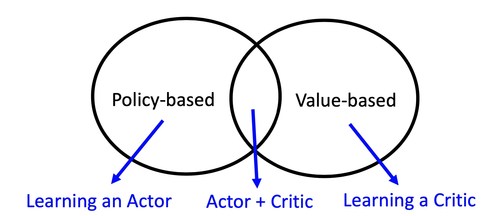

基本概念/Basics
-----------------

试错与开发- 多臂赌博机（Multi-Arm Bandit）
~~~~~~~~~~~~~~~~~~~~~~~~~~~~~~~~~~~~~~~~~~

.. figure:: https://pic2.zhimg.com/80/v2-de3eeb3c1136b278f72df468078f97dc_720w.jpg?source=1940ef5c
   :alt: img

什么叫bandit? 赌场的赌博机有个外号叫单臂强盗（single-armed BANDIT），因为即使老虎机只有一个摇臂，也会抢走你口袋里的钱。

multi-arm bandit
^^^^^^^^^^^^^^^^

一家赌场有 :math:`K` 台老虎机，假设每台老虎机都有一定概率(:math:`p_i`)吐出一块钱，有一定概率(\ :math:`1-p_i`)不吐钱。现在你无法提前知道老虎机的概率分布，只能通过使用老虎机的结果去推测概率。但是你一共只能摇
:math:`T` 次老虎机，在这种情况下，使用什么样的策略才能使得你摇出更多的钱呢？

-  去试一试每个赌博机，并且要有策略的去试

   -  想要获得各个老虎机的吐钱概率：试验各个老虎机，Exploration
   -  想要获得最大的收益：多摇那个吐钱概率高的老虎机，Exploitation

-  bandit算法就是为了平衡\ **Exploration and Exploitation**
-  bandit算法应用广泛，比如最直接的应用就是推荐系统，还可应用于MDP模型的游戏、等等。

经典的bandit算法
^^^^^^^^^^^^^^^^

朴素bandit
''''''''''''

-  先随机试若干次，然后一直选最大的那个

Epsilon-Greedy
''''''''''''''

-  :math:`\epsilon`\ 概率随机选择做exploration，\ :math:`1-\epsilon`\ 概率选择当前平均收益最大的臂做exploitation
-  比较常见的改进是通过控制\ :math:`\epsilon`\ 值来平衡exploration和exploitation
-  Epsilon-Greedy曲线

Thompson sampling
'''''''''''''''''

-  假设每个臂是否产生收益，其背后有一个概率分布，产生收益的概率为 :math:`p`，同时该概率 :math:`p`的概率分布符合 :math:`Beta(wins,lose)`
   分布，每个臂都维护一个 :math:`Beta` 分布。每次试验后，选中一个臂摇一下，有收益则该臂的 :math:`wins` 增加 1，否则该臂的 :math:`lose` 增加 1。
-  beta分布介绍：https://www.zhihu.com/question/30269898
-  选择方式：用每个臂现有的Beta分布产生随机数，选择随机数中最大的那个臂
-  Thompson
   bandit算法的本质是后验证采样，性能与最好的无分布方法(UCB)相似

UCB（Upper Confidence Bound）
'''''''''''''''''''''''''''''

-  对每一个臂都试一遍，之后在任意时刻 :math:`t` 
   按照如下公式计算每个臂的分数，然后选择分数最大的臂

   :math:`x_j(t) + \sqrt{\frac{2lnt}{T_{j,t}}}`

   其中 :math:`j` 为编号即表示第j臂， :math:`T_{j,t}` 为在t时刻第j个臂累计的被使用次数。

-  UCB算法虽然简单，但其在实际应用中往往能取得相对好的效果，可见下文中的bandit example。

-  UCB的效果是有理论保障的。UCB的累计regret为 :math:`O(Knlog(n))` ，即其在选用了n次arm之后产生的regret为 :math:`O(log(n))` 的。在2002年提出UCB的论文 `Using Confidence Bounds for Exploitation-Exploration Trade-offs <https://www.jmlr.org/papers/volume3/auer02a/auer02a.pdf>`_ 中已有了证明。

example
^^^^^^^^^
.. toctree::
     :maxdepth: 2

     bandit/bandit

马尔可夫决策过程(MDP)
~~~~~~~~~~~~~~~~~~~~~
马尔可夫决策过程(MDP)是强化学习在数学上的理想化形式，也是最常见的常见模型。
这个问题的数学化结构中有若干关键要素

- 回报(reward)
- 价值函数(value function)
- 贝尔曼方程(Bellman function)

通过MDP过程，就能大致理解深度学习智能体环境交互的定义。

.. note::
   MDP过程是强化学习的问题定义，也是最基本的模型，具体介绍可以直接去查wiki上的定义或者自行搜索一些博客/专栏比如 `知乎专栏：马尔科夫决策过程 <https://zhuanlan.zhihu.com/p/28084942>`_ 。

动态规划(DP)
~~~~~~~~~~~~~
动态规划DP是一类优化方法，在给定一个MDP完备环境的情况下，可以计算最优的策略。但是对于强化学习问题，传统DP的作用十分有限。

很多强化学习问题无法获得完备的环境模型，且DP在大维度时计算复杂度极高。不过DP仍不失为一个重要理论，很多其他方法都是对DP的一种近似，只不过降低了计算复杂的和对环境模型完备的假设。

自举
 - 更新时基于当前已存在的估计：用后继各个状态的价值估计值来更新当前某个状态的价值估计值
 - 渐进性收敛
 - 优点：降低了方差并加快了学习
 - 缺点：存在依赖于函数逼近质量的偏差

策略迭代与价值迭代
 - 策略迭代

   - 策略评估
   - 策略更新
 - 价值迭代

异步DP
 - 不使用系统遍历状态集的形式来组织算法

广义策略迭代GPI

DP的效率问题
 - 维度灾难最早就是指在DP过程中，state variable数量随维数指数增长导致的维度问题，后来在其他领域也得到了延伸

.. note::

 怎样理解 Curse of Dimensionality（维数灾难） `<https://www.zhihu.com/question/27836140>`_

蒙特卡洛方法(MC)
~~~~~~~~~~~~~~~~

- 首次访问MC
- 每次访问MC 

同轨策略与离轨策略

- 同轨策略(on policy): 用于生成采样数据序列的策略和用于实际决策的待评估和改进策略是相同的
- 离轨策略(off policy): 用于生成采样数据序列的策略和用于实际决策的待评估和改进策略是不同的，即生成的数据“离开”了待优化的策略锁决定的决策序列轨迹

蒙特卡洛方法对比DP的优势

- 不需要描述环境的模型
- 可以使用数据仿真和采样模型
- 可以只评估关注的状态
- 在马尔可夫性不成立时性能损失较小

用样本回报代替实际的期望回报

时序差分学习(TD)
~~~~~~~~~~~~~~~~~~~~

TD loss的基本形式: :math:`\delta_{t} = R_{t+1} + \gamma V(S_{t+1}) - V(S_t)`

.. note::

    TD与MC的对比: MC更新的目标是 :math:`G_t` 即时刻t的真实回报， 而TD(此时讨论单步TD即TD(0))更新的目标是 :math:`R_{t+1} + \gamma V(S_{t+1})`

Sarsa
^^^^^^^^^^^^^^^^
 :math:`Q(S_t, A_t) \leftarrow Q(S_t,A_t) + \alpha[R_{t+1} + \gamma Q(S_{t+1}, A_{t+1}) - Q(S_t, A_t)]`

Q-learning
^^^^^^^^^^^^^^^^
 :math:`Q(S_t, A_t) \leftarrow Q(S_t, A_t) + \alpha[R_{t+1} + \gamma {argmax}_a Q(S_{t+1}, a) - Q(S_t, A_t)]`

.. tip::

    为什么说Sarsa是on-policy算法？而为什么说Q-learning是off-policy算法？

深度Q网络(DQN)
^^^^^^^^^^^^^^^^^

随着深度学习的发展，研究者们将Q-learning和神经网络相结合提出了DQN，其算法核心是维护Q函数并使用它进行决策。

双学习(Double DQN)
^^^^^^^^^^^^^^^^^^^

对于Q-learning的双学习优化是2010年在 `Deep Reinforcement Learning with Double Q-learning <https://arxiv.org/abs/1509.06461>`_ 中提出的。

.. n步自举法
.. ~~~~~~~~~~~~~

Q&A
~~~~~~~~~~~~~
Q0: MC、TD、DP分别指什么？这些方法有哪些异同？
 - Answer：MC指蒙特卡洛方法，TD指时序差分学习，DP指动态规划。

Q1: 什么是model base和model free，两者区别是什么？MC、TD、DP三者中哪些是model free，哪些是model based？
 - Answer：
   model base算法指该算法会学习环境的转移过程并对环境进行建模，而model free算法则不需要对环境进行建模。
   蒙特卡洛和TD算法隶属于model-free，因为这两个算法不需要算法建模具体环境。
   而动态规划属于model-based，因为使用动态规划需要完备的环境模型。

Q2: 什么是value-based， policy-based和collector-critic？ 分别有哪些算法是value-based，policy-based和actor-critic的？他们分别有什么advantage？有哪些drawback？
 - Answer：
   所谓value-based就是在学习如何critic(评判一个输入状态的价值)，policy-based对应的是学习如何去做actor(判断在一个输入状态应该采取什么行动)，而actor-critic就是一边去学习如何判断critic，一边去训练做actor的网络。
   具体关系用下图就能很好解释：
      

Q3: 什么是on-policy和off-policy？
 - Answer：on-policy是使用当前的策略进行训练，用于生成采样数据序列的策略和用于实际决策的待评估和改进策略是相同的。 
   off-policy则是可以使用之前过程中的策略进行训练，用于生成采样数据序列的策略和用于实际决策的待评估和改进策略是不同的，即生成的数据“离开”了待优化的策略锁决定的决策序列轨迹。
   on-policy和off-policy只是训练方式的界限，在有时一个算法甚至可能有on-policy和off-policy的不同实现，理解概念即可。

Q4: 什么是online training和offline training？我们通常如何实现offline training？
 - Answer： Offline training即是training时不使用collector与环境进行交互，而是直接使用fixed dataset作为算法的输入， 比如behavior cloning就是经典的Offline training算法。 我们通常使用batch为单位将fixed dataset输入，因此offline RL又称Batch RL。

Q5: 什么是expolration and expolitation？我们通常使用哪些方法平衡expolration and expolitation？
 - Answer：Expolration即是RL中的agent需要不断的去探索环境的不同状态，而Expolitation则是agent需要去选择当前状态下尽可能的收益高的动作。
   平衡expolration and expolitation有很多种方式，在不同的算法中有不同的实现，比如可以采用一定概率选择随机动作，或者在动作选择时加入一定噪声等方式。

Q6: 什么是discrete space和continuous space？我们哪些算法适用于discrete space？哪些算法适用于continuous space？
 - Answer：discrete space就是环境的动作空间离散，比如玩石头剪刀布时我们的动作就是离散的三种动作。continuous space环境的动作空间连续，比如我们在开车的时候控制方向盘的角度，或者机械臂在抓取过程中各个关节的控制，就是连续的动作。

Q7: 为什么要使用replay buffer？experience replay作用在哪里？
 - Answer：通过使用replay buffer我们可以将experience存入buffer，而在之后的训练中取出buffer中的experience使用。经验回放技术（experience replay）就是将系统探索环境获得的样本保存起来，然后从中采样出样本以更新模型参数。

Q8: 算法中的value(state function), Q值(state-action function)和advantage分别是什么意思？
 - Answer：
   Value即是算法中的 :math:`V(S_t)`， 代表某时刻某个状态下的状态价值函数，即某个策略经过该状态之后预计能得到的reward数值。
   Q值即是算法中的 :math:`Q(S_t, A_t）`，代表某时刻某个状态下选择了某个动作后的状态动作价值函数，经过该状态说选择某个动作之后预计能得到的reward数值。
   Advantage则是与动作相关的 :math:`A(S_t, A_t) = Q(S_t, A_t) - V(S_t)`， 代表某时刻某个状态下选择了某个动作相比与选择其他动作的优势，预计比选择其他动作之后能多获得多少reward数值。
