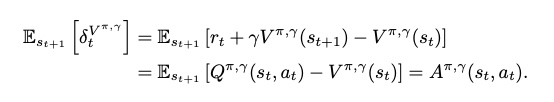
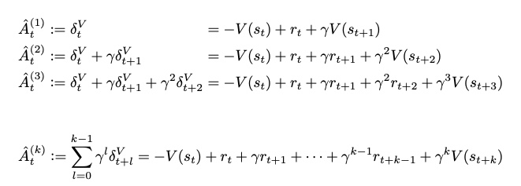
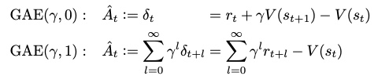
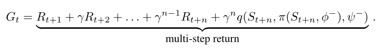
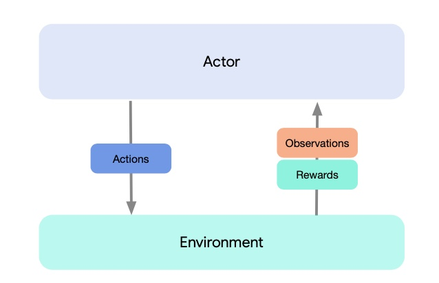

.. role:: math
   :format: html latex

RL Warmup
===========================

导论/Intro
-------------

深度学习与强化学习
 -  强化学习目前与深度学习有很大关联性，但是不同于深度学习
 -  强化学习有很多与神经网络无关的基础方法，如Q-learning等
 -  强化学习研究在交互中学习的\ **计算性**\ 方法。
 -  强化学习侧重于以交互目标为导向进行学习

强化学习特征
 - 智能体从与不确定环境的交互中得到反馈从而进行学习
 - 平衡\ **试错与开发** 

强化学习的关键要素 (Key Concepts in RL)
 - 环境（Environment）
 - 动作（Action by agent)
 - 状态 (State or Observation)
 - 奖励 (Reward)
 - 策略 (Policy)

强化学习的历史发展
 - 试错法
 - 最优控制
 - 时序差分方法

Q&A
~~~

Q1:什么是强化学习？
 -  强化学习是智能体（Agent）以“试错”的方式在与环境(Environment)的过程中进行学习
 -  “学习做什么（将情景映射为动作）才能使得数值化的收益信号（reward）最大化”

基本概念/Basics
-----------------

试错与开发- 多臂赌博机（Multi-Arm Bandit）
~~~~~~~~~~~~~~~~~~~~~~~~~~~~~~~~~~~~~~~~~~

.. figure:: https://pic2.zhimg.com/80/v2-de3eeb3c1136b278f72df468078f97dc_720w.jpg?source=1940ef5c
   :alt: img

什么叫bandit? 赌场的赌博机有个外号叫单臂强盗（single-armed BANDIT），因为即使老虎机只有一个摇臂，也会抢走你口袋里的钱。

multi-arm bandit
^^^^^^^^^^^^^^^^

一家赌场有 :math:`K` 台老虎机，假设每台老虎机都有一定概率(:math:`p_i`)吐出一块钱，有一定概率(\ :math:`1-p_i`)不吐钱。现在你无法提前知道老虎机的概率分布，只能通过使用老虎机的结果去推测概率。但是你一共只能摇
:math:`T` 次老虎机，在这种情况下，使用什么样的策略才能使得你摇出更多的钱呢？

-  去试一试每个赌博机，并且要有策略的去试

   -  想要获得各个老虎机的吐钱概率：试验各个老虎机，Exploration
   -  想要获得最大的收益：多摇那个吐钱概率高的老虎机，Exploitation

-  bandit算法就是为了平衡\ **Exploration and Exploitation**
-  bandit算法应用广泛，比如最直接的应用就是推荐系统，还可应用于MDP模型的游戏、等等。

经典的bandit算法
^^^^^^^^^^^^^^^^

朴素bandit
''''''''''''

-  先随机试若干次，然后一直选最大的那个

Epsilon-Greedy
''''''''''''''

-  :math:`\epsilon`\ 概率随机选择做exploration，\ :math:`1-\epsilon`\ 概率选择当前平均收益最大的臂做exploitation
-  比较常见的改进是通过控制\ :math:`\epsilon`\ 值来平衡exploration和exploitation
-  Epsilon-Greedy曲线

Thompson sampling
'''''''''''''''''

-  假设每个臂是否产生收益，其背后有一个概率分布，产生收益的概率为 :math:`p`，同时该概率 :math:`p`的概率分布符合 :math:`Beta(wins,lose)`
   分布，每个臂都维护一个 :math:`Beta` 分布。每次试验后，选中一个臂摇一下，有收益则该臂的 :math:`wins` 增加 1，否则该臂的 :math:`lose` 增加 1。
-  beta分布介绍：https://www.zhihu.com/question/30269898
-  选择方式：用每个臂现有的Beta分布产生随机数，选择随机数中最大的那个臂
-  Thompson
   bandit算法的本质是后验证采样，性能与最好的无分布方法(UCB)相似

UCB（Upper Confidence Bound）
'''''''''''''''''''''''''''''

-  对每一个臂都试一遍，之后在任意时刻 :math:`t` 
   按照如下公式计算每个臂的分数，然后选择分数最大的臂

   :math:`x_j(t) + \sqrt{\frac{2lnt}{T_{j,t}}}`

   其中 :math:`j` 为编号即表示第j臂， :math:`T_{j,t}` 为在t时刻第j个臂累计的被使用次数。
-  UCB在简单的bandit算法中，是相对效果最好的一个

example
^^^^^^^^^
.. toctree::
     :maxdepth: 2

     bandit/bandit

马尔可夫决策过程(MDP)
~~~~~~~~~~~~~~~~~~~~~
马尔可夫决策过程(MDP)是强化学习在数学上的理想化形式，也是最常见的常见模型。
这个问题的数学化结构中有若干关键要素

- 回报(reward)
- 价值函数(value function)
- 贝尔曼方程(Bellman function)

通过MDP过程，就能大致理解深度学习智能体环境交互的定义。

.. note::
   MDP过程是强化学习的问题定义，也是最基本的模型，具体介绍可以直接去查wiki上的定义或者自行搜索一些博客/专栏比如 `知乎专栏：马尔科夫决策过程 <https://zhuanlan.zhihu.com/p/28084942>`_ 。

动态规划(DP)
~~~~~~~~~~~~~
动态规划DP是一类优化方法，在给定一个MDP完备欢迎的情况下，可以计算最优的策略。但是对于强化学习问题，传统DP的作用十分有限。

很多强化学习问题无法获得完备的环境模型，且DP在大维度时计算复杂度极高。不过DP仍不失为一个重要理论，很多其他方法都是对DP的一种近似，只不过降低了计算复杂的和对环境模型完备的假设。

自举
 - 更新时基于当前已存在的估计：用后继各个状态的价值估计值来更新当前某个状态的价值估计值
 - 渐进性收敛
 - 优点：降低了方差并加快了学习
 - 缺点：存在依赖于函数逼近质量的偏差

策略迭代与价值迭代
 - 策略迭代

   - 策略评估
   - 策略更新
 - 价值迭代

异步DP
 - 不使用系统遍历状态集的形式来组织算法

广义策略迭代GPI

DP的效率问题
 - 维度灾难最早就是指在DP过程中，state variable数量随维数指数增长导致的维度问题，后来在其他领域也得到了延伸

.. note::

 怎样理解 Curse of Dimensionality（维数灾难） `<https://www.zhihu.com/question/27836140>`_

蒙特卡洛方法(MC)
~~~~~~~~~~~~~~~~

- 首次访问MC
- 每次访问MC 

同轨策略与离轨策略

- 同轨策略(on policy): 用于生成采样数据序列的策略和用于实际决策的待评估和改进策略是相同的
- 离轨策略(off policy): 用于生成采样数据序列的策略和用于实际决策的待评估和改进策略是不同的，即生成的数据“离开”了待优化的策略锁决定的决策序列轨迹

蒙特卡洛方法对比DP的优势

- 不需要描述环境的模型
- 可以使用数据仿真和采样模型
- 可以只评估关注的状态
- 在马尔可夫性不成立时性能损失较小

用样本回报代替实际的期望回报

时序差分学习(TD)
~~~~~~~~~~~~~~~~~~~~

TD loss的基本形式: :math:`\delta_{t} = R_{t+1} + \gamma V(S_{t+1}) - V(S_t)`

.. note::

    TD与MC的对比: MC更新的目标是 :math:`G_t` 即时刻t的真实回报， 而TD(此时讨论单步TD即TD(0))更新的目标是 :math:`R_{t+1} + \gamma V(S_{t+1})`

Sarsa
^^^^^^^^^^^^^^^^
 :math:`Q(S_t, A_t) \leftarrow Q(S_t,A_t) + \alpha[R_{t+1} + \gamma Q(S_{t+1}, A_{t+1}) - Q(S_t, A_t)]`

Q-learning
^^^^^^^^^^^^^^^^
 :math:`Q(S_t, A_t) \leftarrow Q(S_t, A_t) + \alpha[R_{t+1} + \gamma {argmax}_a Q(S_{t+1}, a) - Q(S_t, A_t)]`

.. tip::

    为什么说Sarsa是on-policy算法？而为什么说Q-learning是off-policy算法？

深度Q网络(DQN)
^^^^^^^^^^^^^^^^^

随着深度学习的发展，研究者们将Q-learning和神经网络相结合提出了DQN，其算法核心是维护Q函数并使用它进行决策。

双学习(Double DQN)
^^^^^^^^^^^^^^^^^^^

对于Q-learning的双学习优化是2010年在 `Deep Reinforcement Learning with Double Q-learning <https://arxiv.org/abs/1509.06461>`_ 中提出的。

.. n步自举法
.. ~~~~~~~~~~~~~

Q&A
~~~~~~~~~~~~~
Q0: MC、TD、DP分别指什么？这些方法有哪些异同？
 - Answer：MC指蒙特卡洛方法，TD指时序差分学习，DP指动态规划。

Q1: 什么是model base和model free，两者区别是什么？MC、TD、DP三者中哪些是model free，哪些是model based？
 - Answer：蒙特卡洛和TD算法隶属于model-free，而动态规划属于model-based。

Q2: 什么是value-based， policy-based和actor-critic？ 分别有哪些算法是value-based，policy-based和actor-critic的？他们分别有什么advantage？有哪些drawback？
 - Answer：
   所谓value-based就是在学习如何critic(评判一个输入状态的价值)，policy-based对应的是学习如何去做actor(判断在一个输入状态应该采取什么行动)，而actor-critic就是一边去学习如何判断critic，一边去训练做actor的网络。
   具体关系用下图就能很好解释：
      
.. image:: actor-critic.jpg
   :scale: 30 %

Q3: 什么是on-policy和off-policy？
 - Answer：on-policy是使用当前的策略进行训练，用于生成采样数据序列的策略和用于实际决策的待评估和改进策略是相同的。 
   off-policy则是可以使用之前过程中的策略进行训练，用于生成采样数据序列的策略和用于实际决策的待评估和改进策略是不同的，即生成的数据“离开”了待优化的策略锁决定的决策序列轨迹。
   on-policy和off-policy只是训练方式的界限，在有时一个算法甚至可能有on-policy和off-policy的不同实现，理解概念即可。

Q4: 什么是online training和offline training？我们通常如何实现offline training？
 - Answer： Offline training即是training时不使用actor与环境进行交互，而是直接使用fixed dataset作为算法的输入， 比如behavior cloning就是经典的Offline training算法。 我们通常使用batch为单位将fixed dataset输入，因此offline RL又称Batch RL。

Q5: 什么是expolration and expolitation？我们通常使用哪些方法平衡expolration and expolitation？
 - Answer：Expolration即是RL中的agent需要不断的去探索环境的不同状态，而Expolitation则是agent需要去选择当前状态下尽可能的收益高的动作。
   平衡expolration and expolitation有很多种方式，在不同的算法中有不同的实现，比如可以采用一定概率选择随机动作，或者在动作选择时加入一定噪声等方式。

Q6: 什么是discrete space和continuous space？我们哪些算法适用于discrete space？哪些算法适用于continuous space？
 - Answer：discrete space就是环境的动作空间离散，比如玩石头剪刀布时我们的动作就是离散的三种动作。continuous space环境的动作空间连续，比如我们在开车的时候控制方向盘的角度，或者机械臂在抓取过程中各个关节的控制，就是连续的动作。

Q7: 为什么要使用replay buffer？experience replay作用在哪里？
 - Answer：通过使用replay buffer我们可以将experience存入buffer，而在之后的训练中取出buffer中的experience使用。经验回放技术（experience replay）就是将系统探索环境获得的样本保存起来，然后从中采样出样本以更新模型参数。

Q8: 算法中的value(state function), Q值(state-action function)和advantage分别是什么意思？
 - Answer：
   Value即是算法中的 :math:`V(S_t)`， 代表某时刻某个状态下的状态价值函数，即某个策略经过该状态之后预计能得到的reward数值。
   Q值即是算法中的 :math:`Q(S_t, A_t）`，代表某时刻某个状态下选择了某个动作后的状态动作价值函数，经过该状态说选择某个动作之后预计能得到的reward数值。
   Advantage则是与动作相关的 :math:`A(S_t, A_t) = Q(S_t, A_t) - V(S_t)`， 代表某时刻某个状态下选择了某个动作相比与选择其他动作的优势，预计比选择其他动作之后能多获得多少reward数值。

算法与训练/Algorithm and Training
----------------------------------

RL Algorithm
~~~~~~~~~~~~

DQN
^^^^^^^
DQN在 `Playing Atari with Deep Reinforcement Learning <https://arxiv.org/abs/1312.5602>`_ 一文中被提出，将Q-learning的思路与神经网络结合。一年后做出了微小改进后又发表在 `Human-level control through deep reinforcement learning <https://web.stanford.edu/class/psych209/Readings/MnihEtAlHassibis15NatureControlDeepRL.pdf>`_ 一文;

DQN使用神经网络接受state输入进行价值估计，然后使用argmax选择预计value最大的action作为策略，通过计算td-loss进行神经网络的梯度下降。

算法可见：

.. note::
   有关Q-Learning中的off-policy correction（即Importance Sampling），在one-step和n-step上是有所区别的。一言以蔽之，one-step不需要IS，而n-step需要IS。

   Importance Sampling的直观理解是：首先我们想计算f(x)的期望，其中x服从分布p；
   但我们却因为某些原因只能从分布q进行采样，因此要在f(x)上乘上一个系数p/q，来做一个修正，使得二者在期望上相等。公式表示为：
   
   :math:`\mathbb{E}_{x\sim p} = \int f(x)p(x)dx = \int f(x)\frac{p(x)}{q(x)}q(x)dx = \mathbb{E}_{x\sim q}[f(x)\frac{p(x)}{q(x)}]`

   在one-step的Q-learning中， :math:`Q(s,a)`
   需要去拟合 :math:`r(s,a)+\gamma \mathop{max}\limits_{a^*}Q(s',a^*)`

   对于当前的 :math:`s,a` ， :math:`r(s,a)` 是由环境反馈得来的， :math:`s'` 是环境step后得到的，都与是否为off-policy无关。
   接下来在寻找使得Q函数最大的 :math:`a^*` 时，是通过原始策略 :math:`\pi` （对应当前的Q函数）计算得到的，同样与采样的策略 :math:`\mu` 无关。
   这意味着，尽管我们使用了不同的策略采样，但是它在训练的时候没有发挥任何作用，因此不需要重要性采样来修正。

   换个方式理解，在环境状态 :math:`s` 下，采样动作 :math:`a1` ，得到的结果存储在 :math:`Q(s,a1)` 中；
   采样动作 :math:`a2` ，结果存储在 :math:`Q(s,a2)` 中。
   即使采样a1和a2的概率 :math:`p(a1|x), p(a2|x)` 改变了，也不会影响到 :math:`Q(s,a1), Q(s,a2)` ，因此不需要修正。

   而在n-step的Q-learning中， :math:`Q(s,a)`
   需要去拟合 :math:`\sum_{t=0}^{n-1}\gamma^t r(s_t,a_t) + \gamma^n \mathop{max}\limits_{a^*}Q(s_n,a^*)`

   同one-step情况，:math:`r(s_0,a_0)` 和 :math:`s_1` 都与是否为off-policy无关。
   但之后在确定接下来的动作 :math:`a_1` 时，是根据当前采样的策略 :math:`\mu` 得到的，而不是原始的策略 :math:`\pi` 。
   同样，对于后面的 :math:`a_2, a_3, ...` ，都存在概率分布不同的情况，因此我们就需要使用重要性采样的方法对不同的分布进行修正，
   这样我们对当前状态-动作价值函数，即Q函数的估计才是无偏估计。

Double DQN
^^^^^^^^^^^^^
Double DQN是利用双学习，仿照Double Q-learning思路对DQN做的改进，发表在 `Deep Reinforcement Learning with Double Q-learning <https://arxiv.org/abs/1509.06461>`_ 。

Double DQN不再是直接在目标Q网络里面找各个动作中最大Q值，而是先在当前Q网络中先找出最大Q值对应的动作，然后利用这个选择出来的动作在目标网络里面去计算目标Q值。其余与普通的DQN相同。

Double DQN的目的是更加精确的估计目标Q值的计算，解决over estimation的问题，并且减少过大的bias。

Dueling DQN
^^^^^^^^^^^^^^^^
Dueling DQN在 `Dueling Network Architectures for Deep Reinforcement Learning <https://arxiv.org/abs/1511.06581>`_ 一文中提出。通过使用Dueling结构，成果优化了网络结构，使得Q值的估计分为了两部分，分为state-value 和 advantages for each action，使得神经网络能更好的对单独价值进行评估。

结构变化如下：

Prioritized Replay Buffer in DQN
^^^^^^^^^^^^^^^^^^^^^^^^^^^^^^^^^^^^
Prioritized Replay Buffer的提出是在 `PRIORITIZED EXPERIENCE REPLAY <https://arxiv.org/abs/1511.05952>`_ 一文，使用buffer sample时通过加权提高训练数据质量，加快训练速度并提高效率。

nerveX系统中buffer的实现结构可见下图：

.. image:: buffer.jpg

具体的Prioritized DDQN算法可见：

.. image:: PDDQN.png

.. note::
   DQN算法的基础实现教程可以参考pytorch官方上的 `pytorch的DQN教程 <https://pytorch.org/tutorials/intermediate/reinforcement_q_learning.html>`_ ，该教程只是最基本的demo，适合作为入门参考。
   
   有关于Double、Dueling DQN和prioritized replay DQN的算法实现可以参考Github上的 `RL-Adventure <https://github.com/higgsfield/RL-Adventure>`_， 该repo上的各种DQN实现较全，尽管torch版本较低，但不失作为参考。

   DQN算法在nervex框架中的入口可以参考 `nervx框架下的DQN实现 <http://gitlab.bj.sensetime.com/open-XLab/cell/nerveX/blob/master/nervex/app_zoo/cartpole/entry/cartpole_dqn_main.py>`_。

Policy Gradient
^^^^^^^^^^^^^^^^^^^
之前所提的大部分方法都是基于“动作价值函数”，通过学习动作价值函数，然后根据估计的动作价值函数选择动作 `Policy Gradient <https://homes.cs.washington.edu/~todorov/courses/amath579/reading/PolicyGradient.pdf>`_。

而策略梯度方法则是可以直接学习参数化的策略，动作选择不再直接依赖于价值函数，而是将价值函数作为学习策略的参数，不再是动作选择必须的了。

Policy Gradient公式及其推导过程:

我们Policy Gradient的目的是通过gradient ascend去最大化在一个策略下的reward之和。
我们记某个策略对应的参数为 :math:`{\theta}^{\pi}` 简写为 :math:`\theta`， 
记从开始到结束的整个过程为 :math:`\tau`，在策略 :math:`\theta` 下整个过程为 :math:`\tau` 的概率为 :math:`p_{\theta}(\tau)`。

整个过程中的reward之和记为 :math:`R(\tau) = \sum_{t=1}^{T} r_t`，某个策略下reward之和的期望记为 :math:`\bar{R_{\theta}} = \sum_{\tau} R(\tau) p_{\theta}(\tau)`。

我们要最大化整个过程中的reward之和的期望，即对 :math:`\bar{R_{\theta}}` 进行梯度上升。

:math:`\bar{R_{\theta}(\tau)}` 的梯度为 :math:`\nabla \bar{R_{\theta}(\tau)}`， 而 :math:`\bar{R_{\theta}} = \sum_{\tau}R(\tau) p_{\theta}(\tau)`。

其中 :math:`p_{\theta}(\tau) = p(s_1) \prod_{t=1}^{T}p_{\theta}(a_t|s_t)p_{\theta}(s_{t+1}|s_t, a_t)`， 
而 :math:`p_{\theta}(s_{t+1} | s_t, a_t)` 不随策略 :math:`\theta` 的变化而改变，因此梯度为零。

我们可以做一个变化，即利用公式 :math:`\nabla p_{\theta}(\tau) = p_{\theta}(\tau) \frac{\nabla p_{\theta}(\tau)}{p_{\theta}(\tau)} = p_{\theta}(\tau) \nabla \log{P_{\theta}(\tau)}` ，转化概率分布。

再通过使用 :math:`N` 次重复取平均的方式消去 :math:`\sum_{\tau} p_{\theta}(\tau)` ；

由此可以推导出：
:math:`\nabla \bar{R_{\theta}} = \frac{1}{N} \sum_{n=1}^{N} \sum_{t = 1}^{T} R(\tau) \nabla \log{P_{\theta}(a_t^n|s_t^n)}` 。

这就是Policy Gradient的最基本的公式。Policy Gradient是一个On-policy的算法。

不过这个基本的公式还有很多不足之处：
比如由于是整体的概率分布，要求所有概率和为1，因此在进行梯度下降时，如果某一个不常见的动作一直没有被sample到，那么随着其他动作被sample后概率上升，这个动作的对应概率就会下降。

动作的常见与否与某个阶段是否应该采取一个动作无关，因此我们需要通过引入baseline的方式，让公式更合理：

**Add baseline**

公式从 :math:`\nabla \bar{R_{\theta}} = \frac{1}{N} \sum_{n=1}^{N} \sum_{t = 1}^{T} R(\tau) \nabla \log{P_{\theta}(a_t^n|s_t^n)}`

变化为：:math:`\nabla \bar{R_{\theta}}` :math:`= \frac{1}{N} \sum_{n=1}^{N} \sum_{t = 1}^{T} (R(\tau) - b) \nabla \log{P_{\theta}(a_t^n|s_t^n)}`，
其中可取 :math:`b \approx E[R(\tau)]`。

再加入baseline后，该公式依旧存在一定的问题，即使用policy gradient由于一次sample的reward会等量的影响到整个过程中的动作选择，虽然从均值上讲依旧无偏，但是过程中的方差会极大。
这时，我们通过修改公式，让每个动作在一次过程中不考虑该动作发生前的reward，只关联动作发生后所产生的reward，即减小了动作取值的方差，加快收敛。

我们通过\ **Assign credit**\ 的方式，将公式从 :math:`\nabla \bar{R_{\theta}} = \frac{1}{N} \sum_{n=1}^{N} \sum_{t = 1}^{T} (R(\tau) - b)\nabla \log{P_{\theta}(a_t^n|s_t^n)}`

变为 :math:`\nabla \bar{R_{\theta}} = \frac{1}{N} \sum_{n=1}^{N} \sum_{t = 1}^{T}` 
:math:`(\sum_{t' = t}^{T_n} r_{t'}^{n} - b)\nabla \log{P_{\theta}(a_t^n|s_t^n)}`  

我们还可以加入discount factor，使得：

:math:`R(\tau) - b \rightarrow \sum_{t' =t}^{T_n} (r_{t'}^{n} - b) \rightarrow \sum_{t' = t}^{T_n} (\gamma^{t' - t}r_{t'}^{n} - b)` ， 
这一项可以称为advantage。

.. note::

    优点：对于连续的策略参数化，动作选择的概率会平滑的变化；而基于动作价值函数的方法会随Q值变化而导致动作选择的概率有很大变化。因此，基于policy gradient的方法能比基于动作价值函数的方法有更好的收敛性保证。

    缺点：在没有自举的时候，方差相对较高，学习相对较慢。因此引入了advantage。

Actor Critic
^^^^^^^^^^^^
Actor Critic 模型早在2000年的paper `Actor Critic Algorithm <http://papers.nips.cc/paper/1786-actor-critic-algorithms.pdf>`_ 中被提出。 

在Policy Gradient的基础上，如果用状态动作价值函数 Q 代替reward，并用状态价值函数 V 代替baseline，我们就得到了Actor Critic方法，此时
:math:`\nabla \bar{R_{\theta}} = \frac{1}{N} \sum_{n=1}^{N} \sum_{t = 1}^{T} (Q^{\pi_\theta}(s_t^n,a_t^n) - V^{\pi_\theta}(s_t^n)) \nabla \log{P_{\theta}(a_t^n|s_t^n)}`

Actor Critic作为最基本的一种强化学习算法，后面衍生除了很多种改进，包括DDPG、A2C、A3C等等。

A2C
^^^^^^^^^^^^^^
在Actor Critic中，我们需要分别拟合Q函数和V函数，而Q与V之间存在如下关系
:math:`Q^{\pi_\theta}(s_t^n,a_t^n) = \mathrm{E} [r_t^n + V^{\pi_\theta}(s_{t+1}^n)]`。

如果我们令
:math:`Q^{\pi_\theta}(s_t^n,a_t^n) = r_t^n + V^{\pi_\theta}(s_{t+1}^n)`，
即有：

:math:`Q^{\pi_\theta}(s_t^n,a_t^n) - V^{\pi_\theta}(s_t^n) = r_t^n + V^{\pi_\theta}(s_{t+1}^n) - V^{\pi_\theta}(s_t^n) = advantage`，

:math:`\nabla \bar{R_{\theta}} = \frac{1}{N} \sum_{n=1}^{N} \sum_{t = 1}^{T} (r_t^n + V^{\pi_\theta}(s_{t+1}^n) - V^{\pi_\theta}(s_t^n)) \nabla \log{P_{\theta}(a_t^n|s_t^n)}`，

这样我们就得到了Advantage Actor-Critic（A2C）方法。此时Critic网络的损失函数为实际的状态价值和估计的状态价值之差的平方：
:math:`loss = \frac{1}{N} \sum_{n=1}^{N} \sum_{t = 1}^{T} (r_t^n + V^{\pi_\theta}(s_{t+1}^n) - V^{\pi_\theta}(s_t^n))^2`

DDPG
^^^^^^^^^^^^^^^
DDPG即Deep Deterministic Policy Gradient，在2015年的paper `Continuous control with deep reinforcement learning <https://arxiv.org/abs/1509.02971>`_ 中提出。
DDPG是基于actor-critic的model-free算法，是基于policy gradient和actor critic的改进，其改进思路借鉴了DDQN的改进方式，并且整体思想偏向于Q-learning。

从Policy Gradient到Deterministic Policy Gradient：

在使用随机策略时，假如像DQN一样研究策略中所有的可能动作的概率，并计算各个可能的动作的价值的话( :math:`Q(s_t, a_t)`)，就需要大量的样本进行训练。如果在同一个状态处的动作，只取策略中最大概率的动作，就能去掉策略的概率分布，完成一定的化简。

从Deterministic Policy Gradient到Deep Deterministic Policy Gradient：

在DDPG中，我们还引入了双网络的概念。Actor Critic中本身就有两个网络，在引入双网络后，DDPG总共持有四个网络，分别是：

 - Actor Current Network :math:`\mu`：计算当前状态对应的动作，与环境交互。

 - Actor Target Network :math:`\mu'`：在计算Target Q时，用buffer中取出的状态选择对应用动作；定期从Current Network中复制信息。

 - Critic Current Network :math:`Q`：计算当前状态和动作对应的Q值。

 - Critic Target Network :math:`Q'`：计算Target Q时，用buffer中取出的状态和Actor Target Network选出的该状态对应的动作，去计算对应Q值。

DDPG相比于DDQN算法，其区别就在于引入了Actor Network。DDPG实质上是使用了神经网络Actor Network去选取动作，而DQN则是使用了贪心策略（argmax），根据Q值表中的动作中选择对应Q值估计最大的动作。

因为DDPG使用神经网络去选择动作，将Actor Network的输出直接当作action，因此action space是连续的，可以用于解决连续动作空间的问题。

具体算法实现如图：

PPO
^^^^^
PPO即Proximal Policy Optimization，在2017年的 `Proximal Policy Optimization Algorithms <https://arxiv.org/abs/1707.06347>`_ 中被提出。是基于Policy Gradient方法的改进。
PPO 是OpenAI的default reinforcement learning algorithm， 足见这个算法的强大。

相比于朴素的Policy Gradient，PPO将PG从On-policy引入了Off-policy的思想，使得梯度上升的过程中可以使用之前策略所产生的数据，不再是一条sample只能使用一次，大大的提高了收敛速度和算法效率。

PPO通过使用Importance Sampling，使得算法可以使用之前策略得到的轨迹进行训练。PPO通过设定一定的constrain，使得之前策略轨迹的训练不会导致大的偏差，而相比于TRPO，constrain的实现也更加简单有效。

PPO利用一个期望上的等同，使得可以使用旧策略下的概率分布 :math:`q`，去等同计算当前策略下的概率分布 :math:`p`， 概率的等同如下式：

:math:`E_{x~p}[f(x)] = E_{x~q}[f(x) \frac{p(x)}{q(x)}]`。 

这样梯度下降的公式就可以转换为：

:math:`J^{\theta'}(\theta) = E_{(s_t, a_t)~\pi_{\theta'}} [\frac{p_{\theta}(a_t | s_t)}{p_{\theta'}(a_t | s_t)} A^{\theta'}(s_t, a_t)]`
 
其中 :math:`A^{\theta'}(s_t, a_t)` 即为 :math:`\theta'` 策略下的advantage

该公式虽然在大样本量的情况下没有偏差，但是在sample样本过小的时候，若两个策略的概率分布 :math:`\theta ~ p(x)` 与 :math:`\theta' ~ q(x)` 相差过大，则会产生很大的方差，导致训练结果不稳定难以收敛。

因此，我们在训练过程中，加入一定的constrain，使得两个策略的概率分布不会过大。在此我们通过 `相对熵 <https://baike.baidu.com/item/%E7%9B%B8%E5%AF%B9%E7%86%B5/4233536>`_ 
（ `Kullback-Leibler Divergence <https://wiki2.org/en/Kullback%E2%80%93Leibler_divergence>`_ ）即 :math:`KL(\theta, \theta')` 来判断两个策略概率分布的差距。

在TRPO中，通过引入 `trust region method <https://optimization.mccormick.northwestern.edu/index.php/Trust-region_methods>`_ 来推导限定在两个策略的概率分布差别不大时，训练的结果是可靠的。

TRPO在梯度推导时大致就是：

:math:`J_{TRPO}^{\theta'}(\theta) = J^{\theta'}(\theta) | KL(\theta, \theta') < \delta` 
 
其中 :math:`J^{\theta'}(\theta) = E_{(s_t, a_t)~\pi_{\theta'}} [\frac{p_{\theta}(a_t | s_t)}{p_{\theta'}(a_t | s_t)} A^{\theta'}(s_t, a_t)]` 

而目前的PPO则是有两个种实现方式，PPO1和PPO2。

PPO1直接将两个策略的 :math:`KL(\theta, \theta')` 引入到梯度计算当中，通过直接计算
:math:`J_{PPO1}^{\theta'}(\theta) = J^{\theta'}(\theta) - \beta KL(\theta, \theta')` ，
其中 :math:`\beta` 可以直接定为参数，也可以通过自适应调整。
在求梯度的过程中自然的减少了两个策略的概率分布差距。

而PPO2则是使用了Clipping的方式： 

:math:`J^{\theta'}(\theta) = \sum_{(s_t, a_t)} min(\frac{p_{\theta}(a_t | s_t)}{p_{\theta'}(a_t | s_t)} A^{\theta'}(s_t, a_t) , clip(\frac{p_{\theta}(a_t | s_t)}{p_{\theta'}(a_t | s_t)}, 1-\epsilon, 1+\epsilon) A^{\theta'}(s_t, a_t) )` 

在PPO的实际实现中，PPO2的实现最为简单高效，而PPO1和TRPO由于要计算KL Divergence花销相对较大。在实际实现的效果上，PPO2是要好于PPO1和TRPO的。在nerveX系统中我们也是以PPO2的形式实现算法模块。

在此处只是介绍了PPO的一个基本思路，PPO的具体理解可以参考下面的lecture和slides，如果对数学概念和收敛性证明感兴趣，建议阅读原文 `Proximal Policy Optimization Algorithms <https://arxiv.org/abs/1707.06347>`_。

.. note::
   lecture可见李宏毅强化学习课程P4和P5，在 `youtube <https://www.youtube.com/watch?v=OAKAZhFmYoI&list=PLJV_el3uVTsODxQFgzMzPLa16h6B8kWM_&index=2>`_ 和 `b站 <https://www.bilibili.com/video/BV1UE411G78S?p=5>`_ 上均有课程视频。

   课程对应的ppt可见 `slides <http://speech.ee.ntu.edu.tw/~tlkagk/courses/MLDS_2018/Lecture/PPO%20(v3).pdf>`_。

   李宏毅老师的强化学习课程虽然没有包括所有算法，但是对于基本概念的解释很清楚，对于RL算法的理解很深刻，推荐有时间看一下。

GAE
^^^^^^^^^^^^^^^

基本思路
''''''''''''''''

GAE不是一种算法，而是一种梯度策略方法中可以采用的技术改进。GAE全称为generalized advantage estimation, 在2016年ICLR上发布，论文为 `High-dimensional continuous control using generalized advantage estimation <https://arxiv.org/pdf/1506.02438.pdf>`_ 。
GAE是一种能够广泛适用的advantage估计方式。GAE方法的目的是为了能够有效的 \ **降低**\ 梯度策略方法中的 \ **方差**\ ，从而一定程度上解决了梯度策略方法常遇到的两个难题：
 
  1.在梯度训练方法中，收敛需要极大的样本量。

  2.在训练过程中，由于得到的样本输入不稳定，会导致训练过程中很难保证获得稳定提升。

GAE方法通过减小方差解决第一个问题，使得训练能更快收敛，并且提议使用基于trust region的优化方式来解决第二个问题。现在通常用于带有trust region机制的trpo和ppo来保证训练效果能稳定提升。

具体方法回顾
''''''''''''''''''
为了讲述GAE的实现方式，我们需要先回顾下Policy Gradient是如何实现的。
在Policy Gradient一节中，我们将优化目标简单直接的定义为整个过程中的reward之和的期望，即对 :math:`\bar{R_{\theta}} = \sum_{\tau} R(\tau) p_{\theta}(\tau)` 即推导出的
:math:`\nabla \bar{R_{\theta}} = \frac{1}{N} \sum_{n=1}^{N} \sum_{t = 1}^{T} R(\tau) \nabla \log{P_{\theta}(a_t^n|s_t^n)}` 进行优化。

实际上，根据不同的情况，Policy Gradient可以定义为多种不同的优化目标，而不一定是整体的reward。优化目标可以定义为：
:math:`g=E[\sum_{t=0}^{\infty}{\Psi_{t}\nabla_{\theta}log\pi_{\theta}(a_t|s_t)}]`

.. note:: 
   其中 :math:`\Psi_t` 可以定义为：
      1. :math:`\sum_{t=0}^{\infty}r_t` : 即整个策略过程的reward和， 与我们之前在Policy Gradient一节中介绍相同。

      2. :math:`\sum_{t'=0}^{\infty}r_{t'}` : 即t时刻动作 :math:`a_t` 之后跟随的reward之和。

      3. :math:`\sum_{t'=0}^{\infty}r_{t'} - b(s_t)` : 即上式引入baseline。

      4. :math:`Q^{\pi}(s_t, a_t)` : 即Q值，状态动作价值函数。

      5. :math:`A^{\pi}(s_t, a_t)` : 即Advantage估计，某时刻选取某个动作的状态动作价值函数相比于当前状态估值的提升，即 :math:`Q^{\pi}(s_t, a_t) - V^{\pi}(s_t)` 。

      6. :math:`r_t + V^{\pi}(s_{t+1}) - V^{\pi}(s_t)` : 即td值，时序差分的值。 

选用不同的优化目标，Policy Gradient的效果和收敛性也会随之不同。如引入baseline后的3式在一般情况下会比2式有小的方差且更加容易收敛。
本小节讲的是GAE即generalized advantage estimation, 从名字上我们就可以看出，算法选用了Advantage函数作为优化目标。

选用Advantage函数作为优化目标的主要原因就是因为方差小。从定义上，Advantage函数表示了某个时刻，一个action是否要好于policy的默认行为。
此外，我们的估计函数基于 :math:`\Psi_t = A^{\pi}(s_t, a_t)` ，因为这样在计算梯度时，当且仅当 :math:`A^{\pi}(s_t, a_t) > 0` 时 :math:`\pi_{theta}(a_t|s_t)` 会向上升方向优化。

GAE具体公式
''''''''''''''

除了单纯的使用Advantage函数作为优化目标，GAE还引入了两个参数，分别为 :math:`\lambda,\gamma` 。

其中 :math:`\gamma` 我们已经较为熟悉，即对之后的各个step使用的discount factor。 在引入 :math:`\gamma` 后的value、Q和Advantage可定义如下：
 :math:`V^{\pi, \gamma}(s_t) = E_{s_{t+1} ~ \infty, a_{t} ~ \infty}[\sum_{l=0}^{\infty}\gamma^{l}r_{t+l}]`

 :math:`Q^{\pi, \gamma}(s_t, a_t) = E_{s_{t+1} ~ \infty, a_{t+1} ~ \infty}[\sum_{l=0}^{\infty}\gamma^{l}r_{t+l}]`
 
 :math:`A^{\pi, \gamma}(s_t, a_t) = Q^{\pi, \gamma}(s_t, a_t) - V^{\pi, \gamma}(s_t)`

我们声明如下定义：
 一个估计 :math:`A` 是 :math:`\gamma -just` 的，当且仅当：
   
   .. image:: rjust.jpg

 因此，如果一个估计是 :math:`\gamma -just` 的，那么优化其带有discount factor即 :math:`\gamma` 的估计等同于优化其原始估计。

而对于以上几个引入 :math:`\gamma` 后的估计，都有 :math:`\gamma -just` 的性质。

.. note::
   在此处我们不做有关 :math:`\gamma -just` 性质的证明，如果有兴趣请参考 `原文 <https://arxiv.org/pdf/1506.02438.pdf>`_ 附录。

在明确了 :math:`\gamma` 的意义之后，我们开始介绍GAE。
我们引入 :math:`\delta` 如下公式：

再引入基于 :math:`\delta` 的 :math:`\hat{A_{t}^{(k)}}` 如下公式：

注意到，偏差值在 :math:`k \rightarrow \infty` 时，是趋向于0的。因此我们可以将 :math:`\hat{A_{t}^{(k)}}` 近似为无偏估计。

之后，我们再引入参数 :math:`\lambda` 。

参数 :math:`\lambda` 是在 :math:`\gamma` 之后的另外一个估计参数，引入即可得到GAE的公式：

.. image:: gae-formula.jpg

为了方便理解参数 :math:`\lambda` 的取值，我们可以将 :math:`\lambda` 的取值设置为0和1，此时可以看到：

可以看出，在 :math:`\lambda` 的取值为0时，若取 :math:`V = V^{\pi, \gamma}` 则该式 :math:`\gamma -just` 的，其他取值都可能有一定程度的偏差，不过其方差相对较小。
而当 :math:`\lambda` 的取值为1时，GAE为无偏估计，但是会有相对较高的方差值。 

因此，最后使用GAE方法的Policy Gradient的优化目标是： 

.. image:: gae-pg.jpg

当 :math:`\lambda` 的取值为1时约等号可以化为等号。

Q&A
 GAE的公式推导过程相对复杂，并且引入了 :math:`\lambda,\gamma` 两个参数， 我们该如何理解 :math:`\gamma, \lambda` 这两个参数呢？

实验
''''''''''''''''''
原论文在3D机器人模拟控制环境上测试了算法的有效性。

由于3D控制环境中需要对多个节点的连续动作进行控制，因此action space很大；并且由于控制环境之后最后的一个是否成功的reward，因此reward是相对稀疏的；
这导致3D机器人模拟控制环境是一个很有挑战性的环境，需要算法能很好的探索动作空间的同时保持很好的收敛性。

.. image:: 3D_motion_env.jpg
   :alt: 3D机器人模拟控制环境 

GAE在这个环境下取得了比较喜人的结果。具体训练过程可见 `视频 <https://sites.google.com/site/gaepapersupp/>`_ 。 整个训练过程换算为真实世界时间后总共为两周左右，足以证明使用GAE的梯度下降算法能很好的在探索动作空间的同时保持收敛性。

SAC
^^^^^^^^
SAC算法即Soft Actor-Critic，该算法在2018年发表在论文 `Soft Actor-Critic: Off-Policy Maximum Entropy Deep Reinforcement Learning with a Stochastic Actor <https://arxiv.org/pdf/1801.01290.pdf>`_ 中。
该算法集 **Actor-Critic、Off-Policy、Maximum Entropy Model** 三者于一体，着力解决Model-Free RL的两大问题：

  - 采样效率低：TRPO/PPO/A3C等On-Policy方法的每一次策略更新都需要在当前策略下进行采样，而不能使用之前在旧的策略下的采样数据。

  - 对超参数敏感：DDPG等Off-Policy方法虽然使用Replay Buffer解决了样本利用效率问题，但是确定性actor网络与Q函数相互耦合，性能不稳定，容易受超参的影响。

SAC将异步AC与一个随机actor结合训练，并以最大熵来改进目标函数。
在真实世界的连续的状态与动作空间的控制任务上，表现优于以前的On-Policy和Off-Policy算法，并在不同随机种子下保持了较高的稳定性。

最大熵模型
'''''''''''

首先，熵被定义为信息量的期望，是一种描述随机变量的不确定性的度量，计算公式是： :math:`H(x) = - \sum_{x_i \in X}P(x_i)\log P(x_i)` 。

熵描述了事件的不确定性：如果熵很大，说明事件发生的不确定性很大，很难预测；
如果熵很小，可以比较容易的预测某个状态的发生与否。
可以证明，当事件的各状态为均匀分布的时，事件的熵最大。

因此，最大熵模型的直观理解就是：令对未知的推断为随机不确定，即各随机变量是等概率的。
在RL算法中，我们希望策略能够尽可能的去探索环境，获得最优策略，但是如果策略输出为低熵的概率分布，则可能会贪婪采样某些值而难以广泛探索。
最大熵模型就是用于解决这个困境的。

在标准RL目标函数，即仅包含reward期望的加和的基础上，再加上一个熵的期望，就是最大熵RL模型的目标函数：

 :math:`J(\pi) = \sum_{t=0}^T \mathbb{E}_{(s_t,a_t)\sim \rho_\pi}[r(s_t,a_t)+\alpha \mathcal{H}(\pi(\cdot|s_t))]`

其中，:math:`\alpha` 是温度参数，定义了熵和reward之间的重要性，控制着最优策略的随机性。

SAC通过最大熵鼓励策略探索，为Q值相近的动作分配相近的概率，不会给动作范围内任何一个动作分配非常高的概率，避免反复选择同一个动作而陷入次优。
同时通过最大化奖赏，放弃明显低奖赏的策略。

这个目标函数有以下几个优势：

  - 熵项鼓励策略去更多地探索，reward项保证可以及时放弃一些回报较小的尝试

  - 最优策略可以捕捉到多个近似最优的行为，提高鲁棒性

  - 和SOTA方法相比，由于探索得更加均匀，所以可以极大地加快学习速度

相比于DDPG、TD3等也都使用了Actor-Critic和Off-policy的算法，SAC算法在连续控制任务上表现更加出色的原因，可能就是引入了最大熵模型。

表格型(Tabular Setting)SAC推导
''''''''''''''''''''''''''''''''

首先，在表格型（离散）的设定下论证最大熵RL模型下的soft policy iteration (policy evaluation + poloci improvement)，
然后在下一部分再论证连续设定下的SAC。

Policy Evaluation
""""""""""""""""""

对于一个固定的策略 :math:`\pi` ，其soft Q-value可以通过Bellman backup算子迭代计算得到：

 :math:`\mathcal{T}^\pi Q(s_t,a_t) = r(s_t,a_t)+\gamma \mathbb{E}_{s_{t+1}\sim \pi}[V(s_{t+1})]`

其中， :math:`V(s_t)=\mathbb{E}_{a_t\sim \pi}[Q(s_t.a_t)-\log \pi(a_t|s_t)]`

由论文中的引理1可知：soft policy evaluation可以通过 :math:``Q^{k+1}=\mathcal{T}^\pi Q^k`` 进行迭代，
若无限迭代下去，则最终Q会收敛到固定策略π下的soft Q-value。

Policy Improvement
"""""""""""""""""""

与往常off-policy方法最大化Q值不同的是，在SAC中策略会向着正比于Q的指数分布的方向更新。
即传统方法将策略分布更新为当前Q函数的的高斯分布（单峰，如下图左图所示），而SAC会更新为softmax分布（多峰，如下图右图所示)。

.. image:: SAC-policy_improvement.png
   :scale: 100 %

但在实际操作中，为了方便处理，我们还是将策略输出为高斯分布，但通过最小化KL散度去最小化两个分布的差距：

 :math:`\pi_{new}=\arg \min \rm D_{KL}(\pi'(\cdot|s_t)||\frac{\exp(Q^{\pi_{old}}(s_t, \cdot))}{Z^{\pi_{old}}(s_t)}`

其中 :math:`Z^{\pi_{old}}` 为对Q值进行归一化分布。

我们的策略被约束在参数空间中： :math:`\pi \in \Pi` 。由论文中的引理2可知：
对于所有的 :math:`(s_t,a_t) \in S \times A` ，满足 :math:`Q^{\pi_{new}}(s_t, a_t) \ge Q^{\pi_{old}}(s_t, a_t)` ,
即保证每次更新的新策略不差于旧策略。

Soft Policy Iteration
""""""""""""""""""""""""

在Soft Policy Iteration中，Soft Policy Evaluation和Soft Policy Improvement两个过程交替迭代求解，
通过论文中的定理1可知：最终策略 :math:`\pi` 会收敛到最优策略 :math:`\pi` ，
使得对于所有的 :math:`\pi \in \Pi` ，以及 :math:`(s_t,a_t) \in S \times A` ，
均满足 :math:`Q^{\pi_{new}}(s_t, a_t) \ge Q^{\pi_{old}}(s_t, a_t)` 。

连续任务下的SAC
'''''''''''''''

表格型SAC保证状态动作空间是有限离散的情况下，可以获得最优策略。
但是对于具有连续状态动作空间的控制任务来说，通常必须利用神经网络近似来找到SAC的最优策略。
本节就重点介绍各个神经网络参数的目标函数。

目标函数及更新方式
""""""""""""""""""""""
SAC用神经网络定义了状态价值函数 :math:`V_\psi(s_t)` 、soft Q-value函数 :math:`Q_\theta(s_t,a_t)` 以及策略函数 :math:`\pi_\phi(a_t|s_t)`

**状态价值函数：MSE最小化残差**

由公式 :math:`V(s_t)=\mathbb{E}_{a_t\sim \pi}[Q(s_t.a_t)-\log \pi(a_t|s_t)]` ，其实可以发现，V函数可以由soft Q-value函数写出。
但作者提出，为了稳定训练，还是为V值函数涉及了目标函数：

 :math:`J_V(\psi) = \mathbb{E}_{s_t\sim\mathcal{D}}[\frac{1}{2}(V_\psi(s_t)-\mathbb{E}_{a_t\sim \pi_\phi}[Q_\theta (s_t,a_t)]-\log \pi_\phi(a_t|s_t))^2]`

其中D为replay buffer。

**soft Q-value函数：MSE最小化软贝尔曼残差(soft Bellman residual)**

 :math:`J_Q(\theta) = \mathbb{E}_{(s_t,a_t)\sim \mathcal{D}}[\frac12(Q_\theta(s_t,a_t)-\hat{Q}(s_t,a_t))^2]`

其中，借鉴了DQN算法的target network，SAC中也定义了一个soft Q-value函数的target网络 :math:`\hat{Q}(s_t,a_t)` ：

 :math:`\hat{Q}(s_t,a_t) = r(s_t,a_t)+\gamma\mathbb{E}_{s_{t+1}\sim p}[V_{\bar{\psi}}(s_{t+1})]`

**策略函数：最小化两分布之间的KL散度**

 :math:`J_\pi(\phi) =\mathbb{E}_{s_t\sim\mathcal{D}}[ \rm D_{KL}(\pi_\phi(\cdot|s_t)||\frac{\exp(Q_\theta(s_t, \cdot))}{Z_\theta(s_t)}]`

三者对目标函数求梯度并进行更新，具体数学公式可见论文。

算法流程
""""""""""

整个算法的流程如下所示：

.. image:: SAC-algorithm.png
   :scale: 100 %

在更新（上图黄色框）的部分，先后按照V, soft Q, policy, target V的顺序对参数进行更新。

TD3 
^^^^^^^^^^^^^^^^^
TD3算法即Twin Delayed Deep Deterministic policy gradient，
算法在2018年发表在论文 `Addressing Function Approximation Error in Actor-Critic Methods <https://arxiv.org/pdf/1802.09477.pdf>`_ 中。并且附有对应 `实现实验的代码 <https://github.com/sfujim/TD3>`_ 。
该算法是对DDPG算法的改进，通过一系列的减少bias和方差的方式，在实际应用中取得了明显优于DDPG算法的结果。

TD3算法的思路具体来说就是解决DDPG算法和其他actor-critic算法中出现的累积错误，包括overestimation bias和high variance build-up。

在之前的DQN与Double-DQN环节中，我们已经探讨了overestimation的问题。
在function approximation即函数近似的setting下，噪声的存在会使得函数的估计产生一定程度的偏差。
而由于策略总是倾向于选择更优的估计值，每次对策略or价值的较高估计会被累积起来，导致出现overestimation的偏差。
overestimation偏差的问题可能导致任意差的估计结果，从而导致得到次优策和偏离最优策略的行为。

为了解决over estimation的问题，比较常用的方式就是仿照Double-DQN，设置target Network并且进行延迟的更新，从而减缓或者避免短期的误差积累。
不过Double-DQN的解决方案对于actor-critic模式下的算法可能相对无效，
因为在actor-critic中，Network的更新速度比value-based的算法更缓慢，使用延迟更新target Network的方式依然不能很好的消除累积误差。

为此，TD3算法仿照了Double Q-learning的做法，直接将Target Network单独进行训练，这样使得两个网络的相似程度更小，进一步减少了产生的累积误差。

TD3 减小overestimation bias 的方式包括：

 - Twin：即actor和critic都有两个独立训练的网络。

 - Delay：即对policy进行延迟更新。

不过尽管此时能做到无偏估计，但是训练两个网络可能导致算法的方差较大，因此TD3结合了一些方式并且使用了一些小技巧去降低方差。

 - TD3使用了clipped Double Q-learning的思想，将存在overestimation bias的估计结果作为真实估计结果的上界，实现clipping。

 - TD3使用了SARSA风格的动作价值更新，即在Target policy进行了smoothing，进一步降低了variance。

TD3的具体算法如下图：

Large Scale RL Training
~~~~~~~~~~~~~~~~~~~~~~~~~

A3C
^^^^^^^^^^
研究人员发现，简单的在线强化学习和深度神经网络的结合并不稳定，主要是由于agent观测到的数据序列之间具有强烈的相关性，影响了强化学习算法的更新过程。

于是提出了经验回放池（Experience Replay）存储agent采样的数据，从中采样出相关性较低的一个batch的样本，送给learner进行学习，但这也限制了这个方法只能用于off-policy的强化学习算法。
经验回放池会消耗更高多内存和计算资源，还会使off-policy算法不得不从更古老的策略产生的数据中进行学习。

和经验回放池思路不同，A3C是对A2C算法异步版本改进，它可以构建多个环境和多个actor同时产生数据（不同的actor可以采用不同的探索参数，也可以选择探索一个环境的不同部分，增加数据的多样性），每个环境中积累一定数量的数据量之后再一并更新主网络参数。

这样在任意一个时间段，并行的agent都会经历不同的状态，这样actor之间的样本相关性就降低了，解决了前文提到的“不稳定”的问题，且这个方法可以用于on-policy的强化学习算法。
A3C可以在单机上使用CPU来执行，并取得了比以前的基于GPU的算法更好的效果。

A3C有一个主网络，开启n个线程，每个线程里有和主网络一样的网络（即A2C），每个线程会独立地和环境进行交互并更新主网络。单个线程的伪代码如下：

.. image:: A3C.png

1. 每个线程的网络都从主网络复制参数；

2. 每个线程的actor都与环境交互产生样本，利用环境反馈的reward和网络预测的 V 值计算子网络（actor网络 + critic网络）的梯度

3. 利用计算得到的梯度更新主网络，并返回步骤1进入下一个循环。

Ape-X
^^^^^^^^^^^

Ape-X出自谷歌在ICLR2018上发表的论文：`Distributed Prioritized Experience Replay <https://arxiv.org/pdf/1803.00933.pdf>`_ 。
原先的分布式方法主要致力于加速神经网络的训练，比如并行化计算梯度，更快地更新梯度等。但这篇文章更加关注分布式场景下经验数据的产生和选择。
主要针对传统DQN/DDPG等算法，使用分布式actor获取replay memory数据并进行优先经验回放，从而使强化学习网络训练得更有效率。

整体架构
''''''''''

Ape-X是对优先经验回放进行了分布式场景下的扩展，它的一些关键的调整使得分布式有限经验回放在深度强化学习中有很强的扩展性。

.. image:: APEX-architecture.png

Ape-X的整体架构如上图所示，它将整个学习过程分为actor和learner两部分，actor向一个中心化的共享的的replay memory中存储数据，
learner从replay memory中带优先级地采样更加“有用”的数据，即更“有用”的数据的采样频率会更高。
这里的优先级可以根据算法的不同而有不同的定义，概括来讲是根据tderror-惊奇度（估计值和实际值的区别）来决定数据的优先级大小：
惊奇度越大，优先级越高。后文会详细介绍其中的两种：Ape-X DQN 和 Ape-X DPG。

在Prioritized DQN中，样本被送入replay memory时会设置一个当前最高的优先级，以保证会快速被learner采样到，
其真实的优先级会在learner处计算得到，但这样做会使得learner一定会采样到最新的数据，这可能会浪费一些计算资源。
在Ape-X中，优先级会在actor处随着评估策略时顺便计算得到，这样可以在不增加计算开销的情况下直接得到更加准确的优先级。

共享梯度时，梯度可能会迅速过时；但共享经验时，由于算法对off-policy数据有较强的的鲁棒性，所以可以以增加一点延迟为代价，
极大地提升数据利用效率和吞吐率，甚至actor和learner都可以打破地理限制，运行在不同的数据中心，也不会限制训练效果。
同时，我们还可以让不同的actor使用不同的探索策略，这样再将所有actor的数据聚合，就可以极大地提升数据多样性。

Ape-X DQN
'''''''''''

DQN添加了Rainbow中的部分组件，使用target network和multi-step td error作为目标函数，
还采用了dueling network网络模型 :math:`q(\cdot, \cdot, \theta)` 。

通过 :math:`l_t(\theta)=\frac12(G_t-q(S_t,A_t,\theta))^2` 计算梯度，其中：

.. image:: APEX-DQN.png
   :scale: 60 %

在这里， :math:`\theta^-` 表示target network的参数。

Ape-X DPG
'''''''''''

为了检验框架的泛化性能，也在连续动作空间上基于DDPG算法进行了测试。

在Ape-X DPG中，actor产生的动作直接由policy network得到，而不是像Q-learning中一样对Q值求argmax得到动作。
policy network和Q-network两个网络的参数分别是 :math:`\phi, \psi`，也会分别进行优化。
在这里，我们更关注Q-network的loss： :math:`l_t(\psi)=\frac12(G_t-q(S_t,A_t,\psi))^2` ，其中：

作者运用这个框架在Atari上进行了测试，实验结果如下：

  - Ape-X DQN和Ape-X DPG表现效果和baseline(Rainbow, Gorila, DQN等)相比，有较大的提升。

  - 随着增加探索参数不同的actor数量，训练速度会稳定地加快，训练结果会稳定地更优。作者认为数量更多的多样化的探索会防止网络收敛到局部最优。

  - replay memory越大，最终效果更好，但影响并不大。作者认为更大的replay memory可以将高优先级的数据存储得更久。

IMPALA
^^^^^^^^^^^
IMPALA是DeepMind在2018年2月发布的分布式深度学习框架，全称是IMPortance weighted Actor-Learner Architecture， `IMPALA: Scalable Distributed Deep-RL with Importance Weighted Actor-Learner Architectures <https://deepmind.com/research/publications/impala-scalable-distributed-deep-rl-importance-weighted-actor-learner-architectures>`_ ， `代码 <github.com/deepmind/scalable agent>`_。
IMPALA主要解决了两个方面的问题：一是如何在多台机器上进行大规模训练时，依然较高的性能(high throughput)、较好的扩展性(scalability)和较高的数据效率(data efficiency)；二是如何在深度增强学习(DeepRL)技术已经在单任务中大获成功的情况下，在多任务中也能展现良好的性能。
由于多任务的强化学习天生就需要大量的数据、计算资源和时间进行学习，所以IMPALA需要在不损失训练能力和数据利用率的情况下扩展到上千台机器上进行分布式训练。
同为分布式强化学习框架，下图展示了  `A3C <https://arxiv.org/abs/1602.01783>`_ 和IMPALA的一些不同。

.. image:: IMPALA-vsA3C.png

A3C中会有一个parameter server和很多worker actor，server中包含global network，而每个worker中包含一个副本sub network。
worker们和server交换梯度，使得global network可以被所有worker更新，sub network也要尽量和最新的global network保持同步。

而IMPALA将actor和learner做了进一步解耦，让很多个actor产生，并将它们传递给一个或多个learner，然后learner整理为mini-batch的形式并进行学习
learner通过获取actor采样的轨迹来用SGD来更新网络参数，神经网络训练可并行，故learner使用的是GPU。
每个actor都初始化一个模拟环境，来使用自己能从learner获得的最新的策略去采样，
并把获取到的经验轨迹(trajectory of experience)传回供learner去更新各个神经网络参数。由于模拟环境的运行通常不方便做并行，actor一般使用CPU。
下图动态地展示了这一过程：

当训练规模较小时，可以设置多个actor和一个learner。当训练规模扩大的时候，可以考虑使用多个learner（多块GPU）并且每块GPU配套多个actor（CPU）。
每个learner只从自己的actor们中获取样本进行更新，learner之间定期交换gradient并且更新网络参数。

IMPALA中actor和learner相互异步，极大提高了时间利用率。文章与batched A2C做了对比，如下图所示。

.. image:: IMPALA-vsBatchedA2C.png

a图中，正向传播和反向传播都凑一批来做，因此每一步都需要同步，而模拟环境各步所需时间方差很大，就浪费了大量时间用于等待；
b图中，只把耗时较长的反向传播凑一批来做，正向传播就由各个actor异步完成；
c图所示即为IMPALA，完全把actor和learner分开异步进行，这样actor之间不用互相等待，可以以自己的步调尽可能多地做采样。

但相应地，此时便会产生一个问题：actor采样数据的policy可能会落后于当前learner已经更新好的policy，
采样得到的样本便是off-policy的，称之为“policy-lag”。于是IMPALA提出了V-trace技术来对这种不一致进行了修正(correction)。

**V-trace**

首先我们定义learner上的策略为 :math:`\mu` ，这是要更新的策略，也是当前最新的策略；并定义某个actor上的策略为 :math:`\pi` ，这是用于采样的策略，它可能落后于 :math:`\mu`。
算法中需要根据采样到的样本来学习一个状态价值函数 :math:`V(x)` ，V-trace的目的是根据采样得到的 :math:`\{x_t, a_t, r_t, \mu(a_t|x_t)\}`
和当前的 :math:`V(x)` 来为当前状态价值给出一个修正后的估计 :math:`v_s` ，它定义为：

:math:`v_s \overset{def}{=} V(x_s) + \sum_{t=s}^{s+n-1}\gamma^{t-s}(\prod_{i=s}^{t-1}c_i)\delta_tV` ，
 
:math:`\delta_tV \overset{def}{=} \rho_t(r_t+\gamma V(x_{t+1})-V(x_t))` ，
 
:math:`\rho_t \overset{def}{=} min(\bar{\rho}, \frac{\pi(a_i|x_i)}{\mu(a_i|x_i)})` ,
 
:math:`c_i \overset{def}{=} min(\bar{c}, \frac{\pi(a_i|x_i)}{\mu(a_i|x_i)}), \prod_{i=s}^{t-1}ci=1 \space for \space s=t` ，

并且我们假定 :math:`\bar{\rho}>\bar{c}` 。

在 `Safe and Efficient Off-Policy Reinforcement Learning <https://arxiv.org/abs/1606.02647>`_ 中提出的
Retrace方法是针对off-policy Q-learning进行修正，IMPALA将其扩展到了off-policy actor-critic算法中。Retrace中提出的return-based off-policy算法的通用表达式为： 

:math:`\mathcal{R}Q(x,a) \overset{def}{=} Q(x,a) + \mathbb{E}_\mu[\sum_{t\geq0}\gamma^t(\prod_{s=1}^tc_s)(r_t+\gamma \mathbb{E}_\pi Q(x_{t+1, \cdot})-Q(x_t,a_t))]` ，

可以看出来，二者十分相似。
当 :math:`\pi = \mu` 时，这个问题便回归到了on-policy，如果我们假定 :math:`\bar{c} \geq 1`，那么我们可以重写

:math:`v_s = V(x_s) + \sum_{t=s}^{s+n-1}\gamma^{t-s}(r_t+\gamma V(x_{t+1})-V(x_t)) = \sum_{t=s}^{s+n-1}\gamma^{t-s}r_t + \gamma^nV(x_{s+n})` ，

这就是on-policy n-step的Bellman target。这个特性是Retrace所不具备的。

我们的目标是让当前的状态价值函数 :math:`V(x)` 能尽可能地接近 :math:`v_s` ，最终它会收敛到介于 :math:`V^{\pi}` 和 :math:`V^{\mu}` 之间的某个价值函数，
我们记该价值函数为 :math:`V^{\pi_{\bar{\rho}}}` ，该价值函数对应的策略如下：

:math:`\pi_{\bar{\rho}}  \overset{def}{=} \frac{min(\bar{\rho}\mu(a|x), \pi(a|x))}{\sum_{b \in A}min(\bar{\rho}\mu(b|x), \pi(b|x)) }` ，

该结论可由计算V-trace算子的不动点证明得到。
当 :math:`\bar{\rho}` 是正无穷（即不对 :math:`\rho_t` 进行截断）时，我们可以得到 :math:`V^{\pi}` ；
当 :math:`\bar{\rho}` 是0（即 :math:`\rho_t` 恒为最大值0）时，我们可以得到 :math:`V^{\mu}` 。
即，:math:`\bar{\rho}` 可以控制我们最终会收敛到哪个value function。

而另一个重要性采样(Importance Sampling)权重 :math:`c_i` 可以类比Retrace中的 :math:`c_s` 。 :math:`\prod_{i=s}^{t-1}ci` 可以衡量
在 t 时刻观测到的td :math:`\delta_tV` 会多大程度上影响之前时刻 s 的状态函数。 :math:`\pi` 和 :math:`\mu` 之间相差越大，这个乘积的方差就会越大，
利用 :math:`\bar{c}` 截断限定最大值便是用于减小方差的一个trick。
和 :math:`\bar{\rho}` 会影响value function收敛到的不动点不同， :math:`c_i` 会影响value function收敛的速度。

**Actor-Critic算法**

IMPALA中需要维护两个网络，一个是策略神经网络（actor），一个是状态价值函数网络（critic）。

前面讲到的V-trace技术就是根据采样到的 :math:`\{x_t, a_t, r_t, \mu(a_t|x_t)\}`
和原始的 :math:`V_\theta (x)` 状态价值函数来对当前的状态给出一个更好的估计 :math:`v_s` 。
Critic的更新方式为最小化 :math:`V_\theta (x)` 相对于 :math:`v_s` 的均方误差，即为
 
:math:`(v_s-V_\theta (x))\nabla_\theta V_\theta (x)`

Actor的参数 :math:`\omega` 需要朝着off-policy policy gradient给出的梯度方向更新，即
:math:`\mathbb{E}[\frac{\pi(a_i|x_i)}{\mu(a_i|x_i)} \nabla log \pi Q^\pi(x_s,a_s)]` ，其中：

 - 用 :math:`\frac{\pi_\bar{\rho}(a_i|x_i)}{\mu(a_i|x_i)} \propto min(\bar{\rho}, \frac{\pi(a_i|x_i)}{\mu(a_i|x_i)}) = \rho_s` 代替容易发散的 :math:`\frac{\pi(a_i|x_i)}{\mu(a_i|x_i)}` 。
 - 用 :math:`Q^{\pi_{\bar{\rho}}} = r_s + \gamma v_{s+1}` 代替无法估计的 :math:`Q^\pi` ，并减去一个baseline :math:`V_\theta (x_s)` 来减小误差。

最终，actor的更新方向是：
 
:math:`\rho_s \nabla_\omega log\pi_\omega(a_s|x_s)(r_s+\gamma v_{s+1}-V_\theta(x_s))`

除了前两项之外，为了防止网络的过早收敛，需要再加上一项对于熵的激励：
 
:math:`-\nabla_\omega \sum_a \pi_\omega(a|x_s)log\pi_\omega(a|x_s)`

将这三项以合适的比例（超参数）加和，就得到了整体的更新方向。

SEED RL
^^^^^^^^^
SEED RL是Google Research 在2020年发布的分布式深度学习框架。此前在2018年中提出的IMPALA架构虽然在强化学习领域取得很多突破，但是依然存在一系列的缺点，如资源利用率相对低下、无法进行大规模扩展等等。
针对这些问题，Google Research 在ICML2020的 `SEED RL: Scalable and Efficient Deep-RL with Accelerated Central Inference <https://arxiv.org/pdf/1910.06591.pdf>`_ 中提出了SEED RL框架。

SEED RL支持扩展到数千台机器，该架构能以 **每秒百万帧的速度进行训练** ，且相比于其他方法可以 **降低训练的开销** ，使得计算效率大幅度提高。 Google Research 也已经在github放出了对应的 `seed rl code <https://github.com/google-research/seed_rl>`_ ，支持单机训练和基于google AI cloud Platform的多机训练。

框架结构改进
'''''''''''''''
SEED和IMPALA框架有很多相似处，但是在整体架构上SEED RL作出了一些关键的改进，使得SEED RL框架能兼顾单机训练和大规模框架训练的好处。

IMPALA与SEED RL训练框架的对比如下图：

.. image:: SEEDRL_Compare.jpg

IMPALA将model的Training过程放到Learner，将inference过程放在Actor中，即将模型分开存放。
而SEED RL则是将training和inference统一放在了Learner框架中，这就使得SEED RL获得了一些优势且规避了一些IMPALA框架中的问题：
 
 1. IMPALA和其类似框架中，将模型的inference过程放在了Actor中，而Actor由于是需要跟环境进行互动，因此大部分Actor的机器是CPU base的。这就导致IMPALA框架和其他类似的模型框架 **使用了CPU去运行了神经网络的inference过程** ，而CPU去跑神经网络是相对低效的。
 因此，SEED RL通过将inference过程放回到使用GPU的Learner中，Actor不需要进行任何神经网络模型的计算，使得总体上神经网络的使用速度效率提升。
 
 2. IMPALA和其类似框架中的Actor需要处理两个任务：环境过程和神经网络inference的过程。而这两个过程所调用的资源是不相关的, 这 **两个不相关过程的反复调用导致Actor的资源调度和效率下降** 。
 SEED RL将inference过程放到Learner中则很好的规避了这个问题，Learner能更好的利用TPU的加速而Actor也能分配更多的CPU资源给对应的环境，使得总体的训练开销下降。

 3. IMPALA和其类似框架中，需要Learner将其神经网络的参数发送给Actor。而在神经网络规模变大后，神经网络的参数数据量会远超于相应的环境reward、trajectory等。这说明由于神经网络分别分布在Actor和Learner中，对分布式系统各个模块之间的带宽产生了很大的要求，起到了瓶颈作用。
 SEED RK的框架则能很好的规避这一点。在SEED RL框架下，Actor与Learner的交互之需要传递action和observation，大大降低了带宽需求。

 4.SEED RL统一将training和inference统一放在了Learner框架中, 并且使用了 `gRPC <grpc.io>`_ 解决了Latentcy的问题，减少了batching之间的消耗。与IMPALA不同的是，SEED RL在Learner中的Optimization step会更多的影响到inference的过程.
   
   .. image:: latency.jpg

SEED RL将training和inference统一放在了Learner框架中，并且调整了Learner的架构使其高效，其Learner的具体框架如下图：

可以看出SEED RL将所有与模型相关的内容都放在了Learner中。

Q&A
''''''''''''''''''''
Q0：请问在什么情况下，模型的inference过程有必要放在actor处而不能放在learner处？

 - A：当要求每个Actor之间有较大区别时，模型的inference则不能放在learner处。

Q1：将模型的inference过程放在learner处后，用于inference的模型能更快的得到更新。如果我们加快inference模型的更新有什么好处和坏处呢？

 - A： 加快inference模型的更新会使得算法更加接近on-policy，越接近on policy优化时存在的偏差越小。但当用于inference的模型和用于训练的模型越接近的时候，就越容易产生overestimation bias。 seed RL 一个相对的缺点就是会使得多个actor的模型都十分相近，在需要充分探索的环境中可能表现不佳。

SEED RL已实现算法
''''''''''''''''''''

- IMPALA: Scalable Distributed Deep-RL with Importance Weighted Actor-Learner Architectures

- R2D2 (Recurrent Experience Replay in Distributed Reinforcement Learning)

- SAC: Soft Actor-Critic

实验以及结果
''''''''''''''''''''''
SEED RL在 DeepMind Lab 上相比与IMPALA的时间消耗有11x倍的耗时减少，在Google Research Football上获得了state of the art的分数，且在 Atari-57 上快了3.1x倍。

ACME
^^^^^^^^
ACME是DeepMind在2020年6月份发布的分布式深度学习框架:`Acme: A new framework for distributed reinforcement learning <https://deepmind.com/research/publications/Acme>`_ 。

随着深度学习和强化学习的相互结合，强化学习算法程序的复杂度和规模都在急剧增加，这使得大规模的强化学习算法程序变得难以复现、改进和拓展。
Deepmind构造ACME框架的目的，主要有三点：

1. 使得RL算法方法和结果变得可复现（To enable the reproducibility of our methods and results）
2. 使得新RL算法的设计方式变得更加简单（To simplify the way we design new algorithms）
3. 使得RL算法变得更有可读性（To enhance the readability of RL agents）

为了说明ACME框架是如何实现这些目的，我们将讲述ACME框架的设计结构和其背后的设计思路。

RL算法结构
'''''''''''''''

之前在RL的基本介绍中，我们提及了强化学习的定义：
 - 强化学习是智能体（Agent）以“试错”的方式在与环境(Environment)的过程中进行学习

与环境的互动过程如图，此处的“Actor”用更准确的称呼应是agent：

而在具体的算法实现过程中，可以发现“Actor”即Agent的实际作用可以分为两部分：
我们将其与环境直接互动的部分称为actor component，而其中与之相对的概念即是learner component。
actor根据agent所持有的policy去选择相应的动作并且收集数据，learner则是根据收集到的去对策略进行一个改进（对于使用神经网络的模型来说通常是使用梯度更新方式）。

在很多程序中的实现当中，actor和learner是直接聚合在一起的，在同一个循环中实现。
但是，如果我们把actor和learner的实现进行分离，我们就可以设计agent持有一个或者多个分布式的actor，把数据去传输到一个或多个learner过程中。

比如我们可以通过将actor和learner分离后，可以对actor进行一个复制，并且采用分布式的结构，这样就能组成一个现代的分布式强化学习框架。
而我们将actor的acting部分分离，而变为直接向learner传送固定的数据集，则是组成了一个offline-RL框架，即batch-RL。

ACME架构
'''''''''''''''''''
ACME是一个轻量级的深度学习框架及软件库，其核心是构造能够在不同的规模执行的agent程序。
ACME的一个核心feature即是agent既可以单进程运行，也可以通过调整模块结构在高分布的情况下运行。
为了明白ACME的架构是如何降低耦合的，我们将介绍先ACME的单进程运行模式，之后再拓展到分布式结构。

下图很好的体现了环境是如何与learning agent交互的：

Environments and Actor
"""""""""""""""""""""""""
actor是与环境做最紧密交互的模块，
在RL算法和ACME框架的定义中，actor根据当前持有的policy和之前环境返回的observation :math:`O_t` ，选择某个action :math:`a_t` ; 
而环境根据actor所选择的action，返回下一个阶段的observation :math:`O_{t+1}` 和对应的reward :math:`r_t`。

actor与环境的互动过程如图所示：

.. image:: ACME_actor.jpg
   :scale: 70 %

Learner and Agents
"""""""""""""""""""""""
Learner接收数据，通过消耗数据来获得更好的策略，对agent持有的policy进行更新。 

尽管我们可以将learner和环境完全分离（offline RL），RL中更多的是关心整个智能体与环境交互学习的过程，因此我们将既包含acting又包含learning部分的“actor”称为agent，以作为区分。

Dataset and Adders
"""""""""""""""""""""""
Dataset在actor和learner component之间。 Dataset可以有多种不同设置，包括on-policy和off-policy、experience replay是否带priority、数据进出的先后顺序等等。 
比如我们在DQN中使用的 `buffer <http://gitlab.bj.sensetime.com/open-XLab/cell/nerveX/blob/master/nervex/data/structure/buffer.py>`_ 就是起到了dataset的作用。

除了dataset接口之外，ACME框架还提供了在actor与dataset之间的 `adder <https://github.com/deepmind/acme/tree/master/acme/adders>`_ 接口：

.. image:: adder.jpg
   :scale: 50 %

通过实现adder，我们可以在将数据从actor取出加入dataset之前进行一些预处理和聚合。我们所使用的 `collate <http://gitlab.bj.sensetime.com/open-XLab/cell/nerveX/blob/master/nervex/data/collate_fn.py>`_ 从某种意义上就是在干adder的活。 ACME框架中Adder将数据聚合送入replay buffer中，并且对数据进行一定程度的reduction/transformation。

Adder根据agent需要什么样的数据进行相应操作，可能的数据要求包括：

 - sampling transitions
 - n-step transitions（有时agent需要n-步的转换数据）
 - sequences（有时agent需要序列形式的数据）
 - entire episodes（有时agent一次需要整个episodes的数据）

通过adder，我们可以方便的实现不同种类的数据预处理和聚合，比如在ACME中的actor可大致分为feed-forward和recurrent两种，对应的adder可能是简单的sampled或者是n-step transition。

Reverb and Rate limitation
""""""""""""""""""""""""""""
`Reverb <https://github.com/deepmind/reverb>`_ 是dataset的接口，通过reverb接口我们能简洁明了的实现灵活的数据插入、删除和采样过程。同时，reverb接口也使得dataset可以支持不同的数据格式，并且保证了数据操作的效率。

reverb的结构如下图，此处以DQN中为例：

.. image:: reverb.jpg

reverb中实现的功能大致分为：

 - Tables（存放items，每个item是一个或多个数据元素的reference），有以下实现：

  - Uniform Experience Replay
  - Prioritized Experience Replay
  - Queue
  - ...

 - Item selection strategies（sample时选择数据的方式），有以下实现：
  
  - Uniform 
  - Prioritized
  - FIFO/LIFO
  - MinHeap/MaxHeap

 - Checkpointing（自动存储当前reverb）
 - Rate Limiting

  - rate limitation在当actor和learner运行的比率超出了一定范围时，rate limitation会通过暂停/降速的方式控制actor或learner，以保证训练的效果。（比如当某种愿意导致actor与环境的交互变慢时，rate limit会限定learner的速度；而当learner因资源不足或某些原因导致策略更新速度变慢时，rate limit会降低actor产生数据的速度）
  - 通过rate limitation的限定，能够保证actor与learner运行的同步。

具体还请参考 `DeepMind/Reverb文档 <https://github.com/deepmind/reverb/blob/master/README.md>`_

Distributed agents
"""""""""""""""""""""""
RL中，很多算法都是持有一个actor和一个learner，但是也有很多算法是需要多个actor和环境共同产生数据的，比如A3C（Asynchronous Advantage Actor-critic）就是A2C的（Advantage Actor-critic）持有多个actor和environment的优化，多个actor和environment非同步（Asynchronous）的产生数据，再将各个actor计算的梯度进行聚合。

在ACME框架中，框架通过将acting、learning和data storage各个功能分为多个不同的进程/线程，来通过并行的方式加速训练过程、使得算法learning的速度和data产生的速度相匹配，从而实现更好的效果。

.. image:: ACME_distribute.jpg
   :scale: 70 %

在ACME的分布式框架中，框架使用 **launchpad** 来控制总的训练过程。 Launchpad创建了一个由节点和边构成的图结构，其中各个节点即表示了各个模块（比如actor/learner/dataset/environment等），而各个边则是表示了两个模块之间的通信（通过client/server channel实现）。整个图的结构由launchpad维护，由launchpad控制两个模块之间合适创建channel。

通过launchpad的抽象，ACME框架中的各个模块并不需要对模块之间的通信进行处理。在launchpad维护下，一个模块接收或调用其他模块的数据或功能就像是在程序中调用一个方法(method call)一样。

Deepmind ACME框架实现的算法baseline
""""""""""""""""""""""""""""""""""""
 - DQN
 - Recurrent DQN
 - Actor Critic
 - IMPALA ( `Importance Weighted Actor-Learner Architecture <https://arxiv.org/abs/1802.01561>`_)
 - DDPG
 - MPO( `Maximum a Posteriori Policy Optimisation <https://arxiv.org/abs/1806.06920>`_)
 - Distibutional critic, D4PG, DMPO
 - MCTS(MOnte Carlo Tree Search)

 - Behaviour Cloning

AlphaGo
^^^^^^^^^^^^^
暂略。

AlphaStar
^^^^^^^^^^^^^

`AlphaStar <https://alphastar.academy/>`_ 是Deepmind基于星际争霸II的一个尝试项目。

我们也有基于星际争霸II的项目 `SenseStar <http://gitlab.bj.sensetime.com/xialiqiao/SenseStar>`_ , 其中部分参考了AlphaStar的一些结构，还在不断调整中。

OpenAI Five
^^^^^^^^^^^^^
暂略。

Rllib
^^^^^^^^^^^^^
暂略。

.. note::
    一个部分论文的链接: `传送门 <https://zhuanlan.zhihu.com/p/23600620>`_
..

Paper List
^^^^^^^^^^

Q&A
^^^^^

MARL
~~~~~~~~

QMIX
^^^^^^^^^^^^^

QMIX 是一个多智能体强化学习算法。它是一个value-based的算法：可以中心式学习，并引入全局状态信息来提高算法效果；
然后再分解得到分布式策略，该分布式策略只需要单个智能体自己的局部观测。
QMIX的一大特点是：联合动作值函数与每个局部值函数的单调性相同，因此对局部值函数取最大便是对联合动作值函数取最大。
`QMIX <https://arxiv.org/pdf/1803.11485.pdf>`_

在MARL问题中，一种常见的学习范式是：中心式训练，分布式执行（Centralised training with Decentralised Execution），在这种模式下，
如何去表达和使用学习到的联合动作值函数（joint action-value function） 是一个十分关键的问题。
一方面，如果想准确得知智能体的动作产生的影响，就需要一个中心式函数 :math:`Q_{tot}` ，它基于全局的状态和联合的动作学习得到。
另一方面，在有多个智能体的时候的动作价值函数是难以学习的，因为该函数的参数会随着智能体数量的增多而成指数增长；
即使能学习，也很难从联合函数中抽取出针对单个智能体的分布式策略（即该策略仅依据智能体自身的observation）。

现有办法
'''''''''

针对这个问题，现有的一些解决方法如下：

**IQL（Independent Q-Learning）** `IQL <http://citeseer.ist.psu.edu/viewdoc/summary?doi=10.1.1.55.8066>`_

直接让每个智能体都执行一个Q-Learning算法。因为环境是共享的，故会因为每个智能体的行动而发生状态改变，
对每个智能体来说，环境是动态不稳定的，因此这个算法并不能保证收敛性。

**COMA（Counterfactual Multi-Agent）** `COMA <https://arxiv.org/pdf/1705.08926.pdf>`_

训练一个完全中心化的action-value函数，然后以此为指导在actor-critic框架下得到分布式策略。
其缺点是：1）必须是on-policy算法, 采样效率低；2）智能体个数增加时，训练完全中心化的critic将变得十分困难。

**VDN（Value Decomposition Networks）** `VDN <https://arxiv.org/pdf/1706.05296.pdf>`_

处于 IQL 和 COMA 之间的方法，通过将每一个智能体用自己的观测数据学习到的局部动作值函数 :math:`Q_a` 进行加和，
就得到了全局联合动作值函数 :math:`Q_{tot}` 。
由于其：1）没有在学习时利用状态信息；2）没有采用非线性方式对单智能体局部值函数进行整合，因此VDN算法还有很大的提升空间。

QMIX及其网络结构
''''''''''''''''

QMIX 便是在 VDN 上进行的一次提升。QMIX 认为，VDN这种将 :math:`Q_{tot}` 完全分解为 :math:`Q_a` 加和并非必须。
为了达到分布策略与中心策略一致的效果，我们需要保证在 :math:`Q_{tot}` 的全局argmax和所有 :math:`Q_a` 同时局部argmax结果相同，即：

.. image:: QMIX-argmax.png
   :scale: 50 %

这使得每个智能体只需要在自己的 :math:`Q_a` 上贪心地选择Q值最大的动作即可。

QMIX在这个的基础上又将其做了一些调整，转化为对单调性的约束：
 
:math:`\frac{\partial Q_{tot}}{\partial Q_i} \geq 0, \forall i \in {1,2,...,n}`

QMIX的架构是：每个智能体均有一个自己的agent network，用于合并局部值函数的mixing network和一系列hypernetwork。架构图如下：

**智能体网络 agent network**

如上图c所示。每一个智能体都实现一个DRQN网络，输入是当前时刻的的观测值 :math:`o^a_t` 和上一个时刻动作 :math:`v^a_{t-1}`，
计算得到自己的Q值并输出。

.. note::
    DRQN是一个用来处理POMDP（部分可观马尔可夫决策过程）的一个算法。
    它采用LSTM替换DQN卷积层后的一个全连接层，用于记忆历史状态，因此可以在部分可观的情况下提高算法性能。
..

**混合网络mixing network 与 超网络hypernetwork**

如上图a所示。其输入为每个DRQN网络的输出。为了满足上述的单调性约束，要求网络中所有权值都是非负数（对偏移量则不做限制）。
它对单智能体局部值函数进行合并，并在训练学习过程中加入全局状态信息辅助，以提高算法性能。

为了能够更多的利用到系统的状态信息 :math:`s_t` ，还采用一种超网络（hypernetwork），如红色方格所示。
其输入状态 :math:`s_t` ，输出混合网络的权值及偏移量。
为了保证权值的非负性，超网络采用一个线性网络以及绝对值激活函数保证输出不为负数。
混合网络最后一层的偏移量通过两层超网络以及ReLU激活函数得到非线性映射网络。

为什么要使用超网络而不是直接将状态作为输入传递给混合网络，文中的解释是：
将 :math:`s_t` 传递给超参数网络允许 :math:`Q_{tot}` 通过非单调的方法依赖这些额外的状态信息。
如果直接输入，则限制了每个智能体的Q值都通过一个单调的网络进行传递，这是过于约束（overly constraining）的，
让Q值网络的权重都为正时，会丢失较多信息。
而使用超参数网络来生成参数的话，超参数网络的参数就可以不被约束为正，只要保证输出为正就可以了，这样的话就充分利用了 :math:`s_t` 的特征信息。

由于满足上文的单调性约束，对 :math:`Q_{tot}` 进行 :math:`\arg\max` 操作的计算量就不再随智能体数量指数增长了，而是线性增长，这极大提高了算法效率。

**损失函数**

QMIX最终的损失函数为：

:math:`L(\theta) = \sum_{i=1}^{b}[(y_i^{tot}-Q_{tot}(\tau,a,s;\theta))^2]`

其中，:math:`y_i^{tot} = r+\gamma \max_{a'}\bar{Q}(\tau',a',s';\bar{\theta})` 。
在这里，:math:`\bar{\theta}` 表示target network的参数。

Paper List
^^^^^^^^^^

Q&A
^^^

    .. |img| image:: https://bkimg.cdn.bcebos.com/formula/6b72394d178730e1676d40f3824c2f46.svg

附录/Appendix
--------------------

Blog List:

1. `强化学习入门简述 <https://zhuanlan.zhihu.com/p/64197895?utm_source=wechat_session&utm_medium=social&utm_oi=778950235199127552&utm_content=sec>`_
2. `强化学习之遇到的一些面试问题 <https://zhuanlan.zhihu.com/p/52143798?utm_source=wechat_session&utm_medium=social&utm_oi=778950235199127552&utm_content=sec>`_
3. `炼丹感悟：On the Generalization of RL <https://zhuanlan.zhihu.com/p/105898705?utm_source=wechat_session&utm_medium=social&utm_oi=778950235199127552&utm_content=sec>`_
4. `Pytorch RL tutorial <https://pytorch.org/tutorials/intermediate/reinforcement_q_learning.html>`_
5. `最前沿：深度强化学习的强者之路 <https://zhuanlan.zhihu.com/p/161548181?utm_source=wechat_session&utm_medium=social&utm_oi=30146627108864&utm_content=first&from=singlemessage&isappinstalled=0&wechatShare=1&s_r=0>`_

.. note::
    以上包含内容精读食用最佳，不宜囫囵吞枣，最好结合相关具体代码实现
