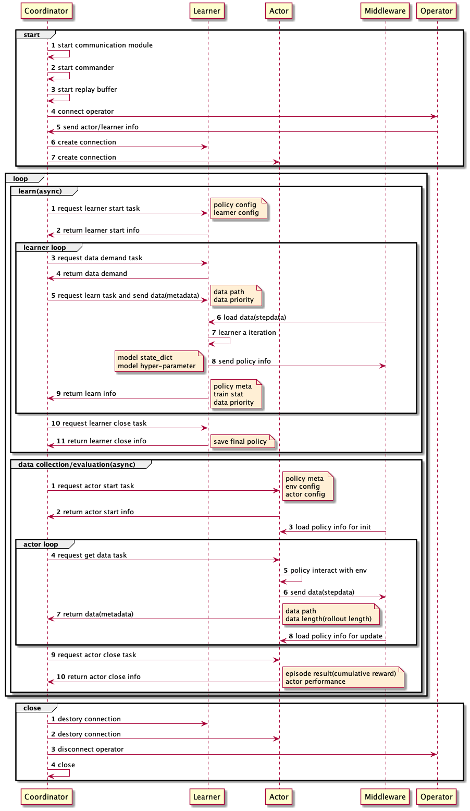

===============================
Tutorial
===============================

.. toctree::
   :maxdepth: 2

代码结构概述
===============

nervex(框架核心)
-----------------

 1. data: 数据加载

   - 对于离线数据：使用类似PyTorch的 `dataset` + `dataloader` + `sampler` + `collate_fn` 模式
   - 对于在线数据：提供强化版的Priortized Replay Buffer + AsyncDataLoader，支持更多的数据评估和采样机制

 2. envs: 强化学习环境接口

   - 通用环境类接口
   - 通用环境静态和动态元素接口
   - 通用环境处理特征工程函数
   - Atari环境在该接口定义下的封装示例(pong, pendulum, cartpole)
   - 基于SUMO的交通信号灯控制环境在该接口定义下的封装示例
   - alphastar SC2环境再改接口定义下的封装示例

 3. model: 强化学习神经网络接口

   - discrete_net: FCDQN, ConvDQN, FCDRQN, ConvDRQN
   - Actor-Critic: ValueAC
   - qac: QValueAC
   - qmix
   - coma
   - ATOC

 4. policy: 强化学习策略库
   
 - DQN(double+dueling+nstep)
   - RainbowDQN
   - PPO(GAE)
   - A2C(GAE)
   - DDPG
   - TD3
   - SAC
   - R2D2
   - IMPALA
   - QMIX
   - COMA
   - ATOC

 5. rl_utils: 强化学习工具库

   - td(q_nstep, v_nstep, dist_nstep, td-lambda, q_nstep_rescale)
   - ppo
   - a2c
   - gae
   - vtrace
   - qmix
   - coma
   - UPGO
   - exploration
   - adder
   - (TODO) MCTS

 6. torch_utils: PyTorch相关工具库

   - 神经网络库
   - 损失函数库
   - PyTorch Tensor数据转换库
   - 训练现场保存和加载(checkpoint)
   - 优化器和梯度操作库
   - 距离度量库

 7. utils: 通用模块库

   - 计时函数
   - 数据压缩 (lz4, zllib)
   - 多卡训练（封装linklink）
   - 文件系统（封装ceph）
   - 同步和互斥锁
   - 日志和可视化
   - 数据变换函数
   - 单元测试工具
   - 代码设计工具

 8. league: 全局训练决策调度模块

   - league manager(player manager)
   - player
   - payoff
   - self-play算法

     - uniform self-play
     - PFSP(prioritized fictitious self-play)

 9. agent 模型运行时容器

 10. worker: 系统运行模块

   - 训练学习器(learner)
   - 数据生成器(actor)
   - 向量化环境(env_manager)
   - command

 11. system: 系统控制模块

   - 运行信息管理(coordinator)
   - 跨集群通信(manager)

 12. entry: 启动入口模块

   - serial_entry

 13. docs: 文档

app_zoo(基于nerveX的DRL应用)
-----------------------------

 1. Atari

 2. classic_control(cartpole, pendulum)

 3. mujoco

 4. sumo(traffic light control)

 5. gfootball(multi-agent football)

 6. alphastar(SC2)

数据流图
============================

nerveX每一个训练实例可以主要分为三部分，即Coordinator(协作器)，Learner(学习器)，Actor(数据生成器)，再加上用于数据通信的Middleware(中介组件)，这四个模块的详细组成及之间的数据关系如下图所示:

.. image:: dataflow.png

而上述几个核心模块之间的数据流序列关系可以参考下图:

算法训练入口示例(单机同步版本)
=================================

    完成安装之后，可以仿照 ``nervex/entry/tests/test_serial_entry.py`` 文件，仿照单元测试的写法，创建一个训练脚本并命名为 ``cartpole_dqn.py``：

    .. code:: python

        path = os.path.join(
            os.path.dirname(__file__), '../../../app_zoo/classic_control/cartpole/entry/cartpole_dqn_default_config.yaml'
        )
        config = read_config(path)
        try:
            serial_pipeline(config, seed=0)
        except Exception:
            assert False, "pipeline fail"

    如以上代码，就是读取了 ``app_zoo`` 中的 ``cartpole_dqn_default_config.yaml`` 配置文件，并传入``serial_pipeline`` 开始训练。

    根据不同的需求，可以修改配置文件并自定义相关的启动脚本，配置文件中可能修改的地方主要有如下几处：

      - policy.use_cuda: 是否使用cuda，主要取决于使用者的机器上是否有GPU
      - env.env_type: 如要更改所使用的环境，首先修改env.env_type，并对应修改env.import_names，atari及mujuco还需修改env.env_id，不同环境的evaluator.stop_val可能不同也需要修改。需注意环境的observation是图像还是向量，并检查是否需要对应修改policy.model中的encoder。
      - policy: 若要更改所使用的算法/策略，首先修改policy.policy_type，并对应修改policy.import_names, policy.on_policy, policy.model等。

    想要进行一组实验时，应 **创建单独的实验文件夹，复制相应的执行脚本（如有必要，也需一同复制配置文件）到实验文件夹下** ，然后启动执行脚本即可。

    下面所示为一般本地测试时的启动脚本

    .. code:: bash

        python3 -u cartpole_dqn.py

    下面所示为在slurm集群上的启动脚本，其中 `$1` 是相应的集群分区名。

    .. code:: bash

        srun -p $1 --gres=gpu:1 python3 -u cartpole_dqn.py 

算法训练入口示例(多机异步版本)
=================================

    完成安装之后，进入 ``app_zoo/atari/entry/atari_dist_baseline`` 目录，找到 ``run.sh`` 文件,
    即为在Atari环境上运行的多机异步版本算法训练入口示例，加载不同的配置文件即可使用不同的RL算法进行训练，如使用 ``atari_a2c_dist_default_config.yaml`` 即运行A2C算法进行训练。
    
    根据不同的使用环境，可以修改配置文件并自定义相关的启动脚本，其中可能修改的地方主要有如下几处：

      - use_cuda: 是否使用cuda，主要取决于使用者的机器上是否有GPU，注意这时的启动脚本要指定cuda device相关
      - use_distributed: 是否使用多机多卡训练，主要取决于使用者是否安装了linklink，以及是否要开启多机多卡训练，注意这时的启动脚本中要指定 `mpi` 相关
      - path_agent等: 这些字段是多机版本训练进行数据通信的相关路径，默认使用当前目录，即通过文件系统进行通信，在集群上一般使用ceph，需要进行相关配置并对应更改这些字段
      - ip, port等: 这些字段是各个模块组件进行通信的ip地址和端口，需要手动设置并满足相应的对应关系

    下面所示为一般本地测试时的启动脚本

    .. code:: bash
        
        work_path=$(dirname $0)
        RES_PREFIX=("" "" "" "" "")
        CMD=("python3 -u -m nervex.system.coordinator_start" "python3 -u -m nervex.system.manager_start" \
             "python3 -u -m nervex.system.league_manager_start" "python3 -u -m nervex.system.learner_start" \
             "python3 -u -m nervex.system.actor_start")
        CONFIG=" --config $work_path/atari_a2c_dist_default_local_config.yaml"

        for ((i=0;i<${#CMD[@]};i++))
        do
            ${RES_PREFIX[$i]}${CMD[$i]}$CONFIG &
            sleep 2s
        done
        
    下面所示为在slurm集群上的启动脚本，其中 `$1` 是相应的集群分区名。
    
    .. code:: bash
        
        work_path=$(dirname $0)
        #RES_PREFIX=("" "" "srun -p $1 --job-name=league " "srun -p $1 --gres=gpu:1 --job-name=learner " "srun -p $1 --gres=gpu:8 --job-name=actor ")  # for slurm lustre single gpu
        RES_PREFIX=("" "" "srun -p $1 --job-name=league " "srun --mpi=pmi2 -p $1 -n 2 --gres=gpu:2 --job-name=learner " "srun -p $1 --gres=gpu:8 --job-name=actor ")  # for slurm lustre multi gpu
        CMD=("python3 -u -m nervex.system.coordinator_start" "python3 -u -m nervex.system.manager_start" \
             "python3 -u -m nervex.system.league_manager_start" "python3 -u -m nervex.system.learner_start" \
             "python3 -u -m nervex.system.actor_start")
        CONFIG=" --config $work_path/atari_a2c_dist_default_config.yaml"

        for ((i=0;i<${#CMD[@]};i++))
        do
            ${RES_PREFIX[$i]}${CMD[$i]}$CONFIG &
            sleep 2s
        done

DRL快速上手指南(单机同步版本)
==============================
深度强化学习(DRL)在很多问题场景中展现出了媲美甚至超越人类的性能，本指南将从DRL的启明星——DQN开始，逐步介绍如何使用nerveX框架在Cartpole游戏环境上训练一个DQN智能体，主要将分为如下几个部分：

 - 创建环境
 - 搭建神经网络
 - 搭建强化学习训练策略
 - 搭建数据队列
 - 其他功能拓展

.. note::

    注意一个深度强化学习算法可能包括神经网络，运行计算图(训练/数据生成)，优化目标(损失函数)，优化器等多个部分，nerveX在实现上将各个模块进行了解耦设计，所以相关代码可能较为分散，但一般的代码组织
    体系为：model（神经网络模型），agent（神经网络模型在训练/数据生成/测试时的不同动态行为，例如RNN隐状态的维护，Double DQN算法中target network的维护），rl_utils（具体的强化学习优化目标），以及
    将上述各个模块组织起来，输入处理好的训练数据得到损失函数进行训练的computation_graph（计算图）模块。

创建环境
-----------

RL不同于传统的监督学习，数据一般是离线准备完成，RL需要实时让智能体和问题环境进行交互，产生数据帧用于训练。nerveX为了处理实际问题场景中复杂的环境结构定义，抽象了环境及其基本元素相关模块（`Env Overview
<../feature/env_overview.html>`_），该抽象定义了环境和外界交互的相关接口，数据帧中每个元素的格式和取值范围等基本信息。对于CartPole环境，nerveX已经完成实现，可以通过如下的代码直接调用：

.. code:: python

    from app_zoo.classic_control.cartpole.envs import CartPoleEnv

    env = CartPoleEnv(cfg={})  # use default env config

为了加快生成数据的效率，nerveX提供了向量化环境运行的机制，即一次运行多个同类环境进行交互生成训练数据，并由 ``Env Manager`` （环境管理器） 模块负责维护相关功能，每次运行批量启动多个环境交互生成数据。环境管理器与环境本身内容完全解耦，无需了解任何环境具体的数据信息，环境本身可以使用任意数据类型，但经过环境管理器处理之后，进入nervex一律为PyTorch Tensor相关数据格式。系统提供了多种实现方式的环境管理器，最常用的子进程环境管理器的实例代码如下：

.. code:: python
    
    from nervex.worker.actor.env_manager import SubprocessEnvManager

    # create 4 CartPoleEnv env with default config(set `env_cfg=[{} for _ in range(4)]`)
    env_manager = SubprocessEnvManager(env_fn=CartPoleEnv, env_cfg=[{} for _ in range(4)], env_num=4, episode_num=2)

.. note::

    向量化环境目前支持用不同的配置创建同类环境（例如地图不同的多个SC2环境），不支持向量化环境中存在不同类模型，如果有此类需求请创建多个环境管理器

搭建神经网络
--------------

nerveX基于PyTorch深度学习框架搭建所有的神经网络相关模块，支持用户自定义各式各样的神经网络，不过，nerveX也根据RL等决策算法的需要，构建了一些抽象层次和API，主要分为 ``model`` （模型）和 ``agent`` （智能体）两部分。

模型部分是对一些经典算法的抽象，比如对于Actor-Critic系列算法和Dueling DQN算法，nerveX为其实现了相关的模型基类，其他部分均可由用户根据自己的需要自定义实现。对于在CartPole上最简单版本的DQN，示例代码如下：

.. code:: python

    import torch
    import torch.nn as nn
    

    # network definition
    class FCDQN(nn.Module):
        def __init__(self, input_dim, action_dim, hidden_dim_list=[128, 256, 256], device='cpu'):
            super(FCDQN, self).__init__()
            self.act = nn.ReLU()
            layers = []
            for dim in hidden_dim_list:
                layers.append(nn.Linear(input_dim, dim))
                layers.append(self.act)
                input_dim = dim
            self.main = nn.Sequential(*layers)
            self.action_dim = action_dim
            self.pred = nn.Linear(input_dim, action_dim)
            self.device = device

        def forward(self, x, info={}):
            x = x['obs']
            x = self.main(x)
            x = self.pred(x)
            return {'logit': x}

    # create network
    env_info = env.info()
    obs_shape = env_info.obs_shape.shape
    act_shape = env_info.act_shape.shape
    model = FCDQN(obs_shape, act_shape)

.. note::

    注意由于Atari是一个离散动作空间环境，神经网络的输出并不是具体的动作值，而是对于整个动作空间选取动作的logits，其将会在其他模块中完成采样操作转化成具体的动作

.. note::

    nerveX的model模块中实现更为复杂的DQN（支持不同Encoder和使用LSTM），使用者可使用内置版本或自定义所用的神经网络。

.. tip::

    为了便于和其他模块的对接，nerveX限制神经网络的输入输出为dict形式，即键为字符串值为Tensor或一组Tensor。但dict确实存在无法明晰输入输出数据具体内容的问题，故建议使用者为自己的神经网络准备
    相应的单元测试，并在forward方法中注明输入和输出的数据键及值的Tensor维度，格式可参考 `https://gitlab.bj.sensetime.com/open-XLab/cell/nerveX/blob/master/nervex/rl_utils/ppo.py#L32`。

智能体部分是对模型运行时行为的抽象（例如根据eps-greedy方法对logits进行采样，对于使用RNN的神经网络维护其隐状态等），具体的设计可以参考 `Agent Overview <../feature/agent_overview.html>`_ 。由于一个神经网络模型可能在多个系统组件内通过不同的方式使用（训练/数据生成/测试），nerveX使用 ``Agent Plugin`` （智能体插件）的定义不同的功能，并为各个组件内的模型添加相应的插件，完成定制化。对于CartPole DQN，使用系统预设的默认DQN智能体代码即可，示例如下， 其中Learner和Actor分别代码训练端和数据生成端：

.. code:: python

    # refer to https://gitlab.bj.sensetime.com/open-XLab/cell/nerveX/tree/master/nervex/worker/agent/agent_template.py for details
    from nervex.worker.agent import create_dqn_learner_agent, create_dqn_actor_agent, create_dqn_evaluator_agent
    
    learner_agent = create_dqn_learner_agent(model, is_double=cfg.learner.dqn.is_double)
    actor_agent = create_dqn_actor_agent(model)
    evaluator_agent = create_dqn_evaluator_agent(model)

.. note::

   如果使用者想要定义自己的agent，请参考 `Agent Overview <../feature/agent_overview.html>`_ 中相关内容。

搭建强化学习训练策略
-------------------------
在nerveX中，构建算法训练主要需要使用者完成个人定制化的 ``computation graph`` (计算图)和 ``learner`` (学习器) 两部分。

计算图是在给定数据和模型（智能体）之后，执行相应前向计算过程得到优化目标（loss）的模块，负责将预处理好后的数据合理地送入模型进行处理，之后使用模型输出结果计算该次迭代的优化目标，返回相关结果。

.. note::

    注意 **一个模型** 在训练时可能会选择 **多种不同的计算图** 进行优化（比如各种RL算法或是加上监督学习SL）。 **多个模型** 也可能执行 **同一个计算图** （比如多种网络结构的模型都执行TD-error（时序差分）RL算法进行更新）。故一般相关的状态变量都在模型的运行时抽象——智能体（Agent）中维护。下面是使用CartPole Double DQN方法的计算图：

.. code:: python

        from nervex.computation_graph import BaseCompGraph
        from nervex.rl_utils import q_1step_td_data, q_1step_td_error

        class CartPoleDqnGraph(BaseCompGraph):

            def __init__(self, cfg):
                self._gamma = cfg.dqn.discount_factor

            def forward(self, data, agent):
                obs = data.get('obs')
                nextobs = data.get('next_obs')
                reward = data.get('reward')
                action = data.get('action')
                terminate = data.get('done').float()
                weights = data.get('weights', None)

                q_value = agent.forward(obs)['logit']
                if agent.is_double:
                    target_q_value = agent.target_forward(nextobs)['logit']
                else:
                    target_q_value = agent.forward(nextobs)['logit']

                data = q_1step_td_data(q_value, target_q_value, action, reward, terminate)
                loss = q_1step_td_error(data, self._gamma, weights)
                if agent.is_double:
                    agent.target_update(agent.state_dict()['model'])
                return {'total_loss': loss}

学习器维护整个训练pipeline，根据当前设定的数据源，模型，计算图完成训练迭代，输出即时的训练日志信息和其他结果。同时，作为整个系统的一种功能模块，和其他模块进行通信交互，传递当前算法训练的相关信息。一般来说，使用者首先应该关注训练迭代过程，关于学习器和数据生成器等其他模块的交互，将在之后复杂多机分布式版本的指南中介绍。CartPole DQN的学习器示例如下：

.. code:: python

    from nervex.worker import BaseLearner

    class CartPoleDqnLearner(BaseLearner):
        _name = "CartPoleDqnLearner"

        def _setup_agent(self):
            env_info = CartPoleEnv(self._cfg.env).info()
            model = FCDQN(env_info.obs_space.shape, env_info.act_space.shape, dueling=self._cfg.learner.dqn.dueling)
            if self._cfg.learner.use_cuda:
                model.cuda()
            self._agent = create_dqn_learner_agent(model, is_double=self._cfg.learner.dqn.is_double)
            self._agent.mode(train=True)
            if self._agent.is_double:
                self._agent.target_mode(train=True)

        def _setup_computation_graph(self):
            self._computation_graph = CartPoleDqnGraph(self._cfg.learner)

搭建数据队列
-------------
学习器和数据生成器通过数据队列进行数据帧的交互，该模块除了简单的先入先出队列之外，还集成了一些数据质量分析和数据采样的相关操作，具体使用的样例如下：

.. code:: python

    from nervex.data import PrioritizedBuffer 

    buffer_ = PrioritizedBuffer(maxlen=10000)

    # add 10 data
    for _ in range(10):
        buffer_.append({'data': 'placeholder'})
    data = buffer_.sample(4)  # sample 4 data

.. note::

    将上述各个模块组装起来构成完整的训练代码，nerveX提供了简易的 ``SingleMachineRunner`` ，可以参见 ``nervex/entry/base_single_machine.py`` ，使用者
    需要重写该类中的部分方法来完成自己的训练入口，具体是:
      
      - _setup_env: 设置数据生成和测试用的环境
      - _setup_learner: 将用户定义的学习器传递给runner
      - _setup_agent: 设置数据生成和测试用的智能体
    
    此外，使用者还可以重写修改其他方法实现自定义功能。

以上指南简述了如何基于nerveX搭建一个最简单的DRL训练pipeline，完整可运行的示例代码可以参见 ``app_zoo/classic_control/cartpole/entry/cartpole_single_machine/cartpole_main.py`` ，训练配置文件各个字段
的具体含义则可以参见 `cartpole_dqn_cfg <../configuration/index.html#cartpole-dqn-config>`_。
